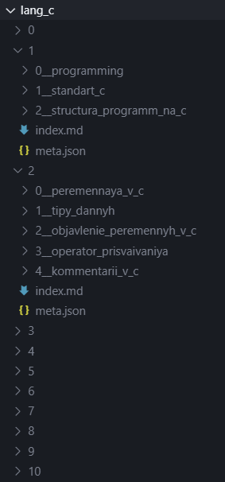

# Курс по основам программирования на языке Си

Всем привет! 


Это основной репозиторий с материалами сайта [https://youngcoder.ru](https://youngcoder.ru).

## Структура материалов



**Уроки** -- основные разделы Курса:
   - Хранятся в `/lang_c/[номер урока]/`
   - Номер урока соответствует имени каталога
   - Каждый урок содержит:
     - `index.md` - главная страница урока
     - `meta.json` - метаинформация урока
     - Статьи урока в подкаталогах 

Структура файла meta.json для Урока:
```js
{
	"title": "Заголовок заметки",
	"description": "Описание для meta-тега description",
	"keywords": "Ключевые слова для meta-тега keywords",
	"article_number": 1, // глобальный id заметки для ассоциации с комментариями
	"canonical_link": "https://youngcoder.ru/lessons/1/" // канонический адрес страницы с заметкой 
	"has_glory_hall": true/false // есть ли для урока Зал славы или нет?
}
```

**Статьи** -- шаги внутри урока:
   - Каталог именуется `[порядковый номер статьи внутри урока]__[url-имя]`
   - Пример: `/lang_c/1/0__programming/` --> `youngcoder.ru/lessons/1/programming`
   - Каталог со статьёй содержит:
     * `article.md` -- основной материал статьи;
     * `practice.md` -- содержимое раздела Практика
     * `reference.md` -- содержимое раздела Дополнительные материалы;
     * `meta.json` -- метаданные статьи;
	 * все картинки, необходимые для статьи.

Структура файла meta.json для Статьи:
```js
{	
	"title": "Заголовок статьи",
	"description": "Описание для meta-тега description",
	"keywords": "Ключевые слова для meta-тега keywords",
	"article_number": 1, // глобальный id статьи для ассоциации с комментариями 
	"canonical_link": "https://youngcoder.ru/lessons/1/programming" // канонический адрес страницы с заметкой 
}
```

Буду рад правкам, предложениям и комментариям. Отправляйте их через pull-request.

[Постнов Кирилл](https://vk.com/bazaar#kdt)d