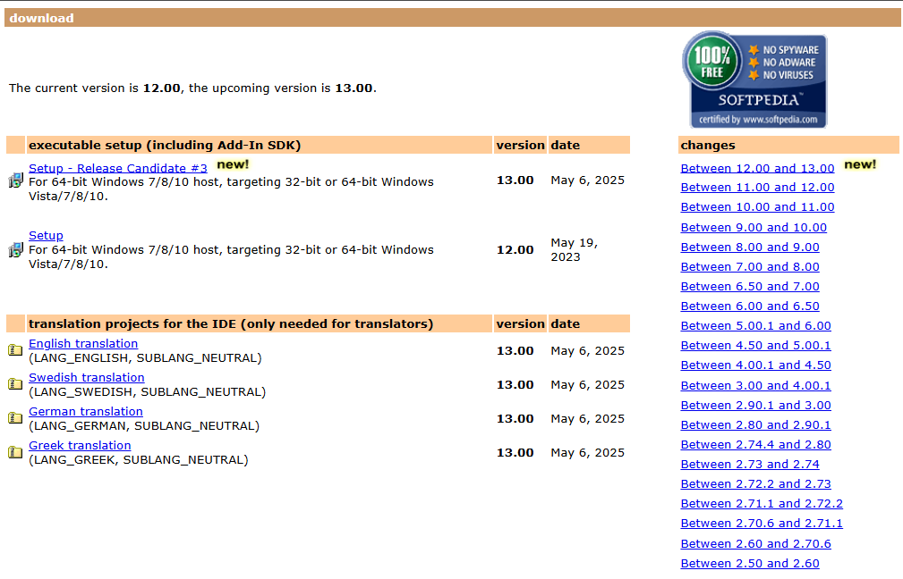
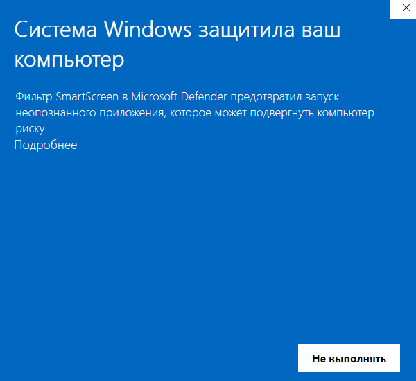
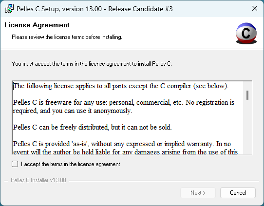
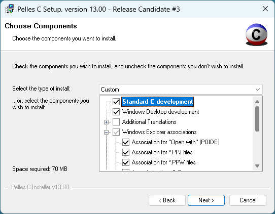
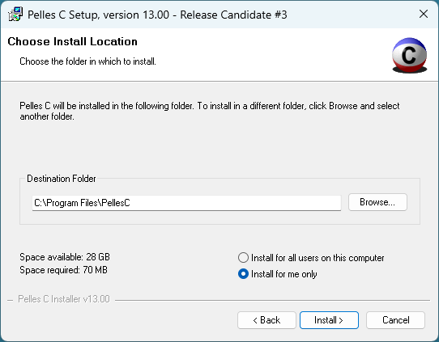
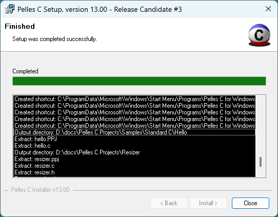
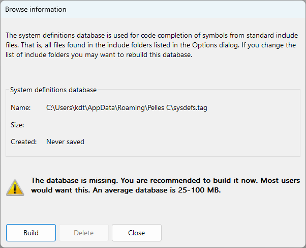
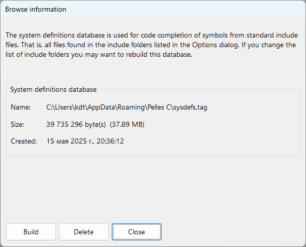
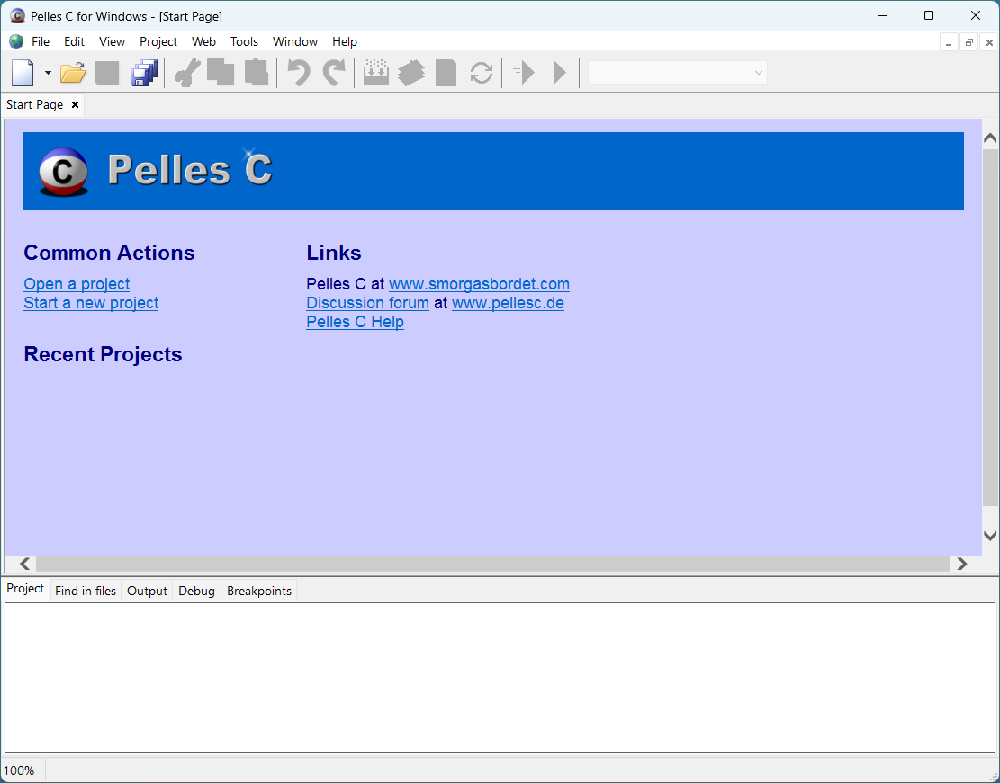

# Установка IDE Pelles C

## Видео-инструкция по установке IDE Pelles C.

На видео показан процесс установки IDE Pelles C Version 8.00. На данный момент актуальная версия 13.00. Процесс установки незначительно отличается.

1. Сайт https://pellesc.de теперь ведёт на форум программы. Скачивать установщик нужно по [ссылке](http://www.smorgasbordet.com/pellesc/download.htm).
2. Чуть-чуть изменился порядок окон установщика.

	<iframe src="https://www.youtube.com/embed/slvI-8XbLLU?rel=0"  allowfullscreen></iframe>

## Текстовая инструкция по установке IDE Pelles C.

Инструкция по установке Pelles C v.13.00.

**1 шаг**

Переходим на [официальную страницу](http://www.smorgasbordet.com/pellesc/download.htm) проекта IDE Pelles C.

Выберите подходящую версию установочного пакета и скачайте его. После завершения скачивания запустите установку.

**Шаг 1.5**
Возможно, у вас появится вот такое окно с предупреждением от ОС Windows:

Нажимаем на слово `Подробнее`, а потом на появившуюся кнопку `Выполнить в любом случае`.

**2 шаг**

Первым делом необходимо ознакомиться с условиями лицензионного соглашения.

Если вы со всем согласны, то поставьте галочку напротив пункта "I accept the terms in the license agreement" и нажмите кнопку `Next`.

**3 шаг**

В появившемся окне можно выбрать компоненты, которые будут установлены. Выбирайте тип установки `Normal`, а также в разделе `Windows Explorer associations` я рекомендую дополнительно отметить пункты `Association for *.C files` и `Association for *.H files`. Это позволить открывать файлы такого типа сразу в IDE Pelles C. Но самое главное, чтобы у вас был отмечен пункт `Standart C development`.

После выбора всех необходимых пунктов, нажмите кнопку `Next`.

**4 шаг**

В этом окне можно выбрать каталог установки для Pelles C. Кроме того, вы можете выбрать установку для всех пользователей компьютера, либо только для текущего пользователя. Это может быть полезно тем, у кого ПК используют несколько человек и каждый имеет отдельный аккаунт в системе. 

Выбрав каталог установки, нажмите кнопку `Install`. Начнётся процесс установки.

**5 шаг**

Дождитесь окончания процесса установки. Кликнув по ссылке `Show details` вы можеет посмотреть какие файлы и куда были добавлены установщиком. Нажмите кнопку `Close` для закрытия установщика.

Теперь в меню "Пуск" появится папка `Pelles C for Windows` а в ней ярлык программы. Рекомендую сразу перетащить его на Рабочий стол.

**6 шаг**

При первом запуске программы появится окно с предложение создать базу данных с определениями, которые будут использоваться для автозавершения кода. Советую нажать "Build".

Дождитесь окончания процесса создания базы и нажмите `Close`.

**7 шаг**

Поздравляю! Вы успешно установили IDE Pelles C на свой компьютер.

В следующей части урока разберем основные приёмы работы в Pelles C.
