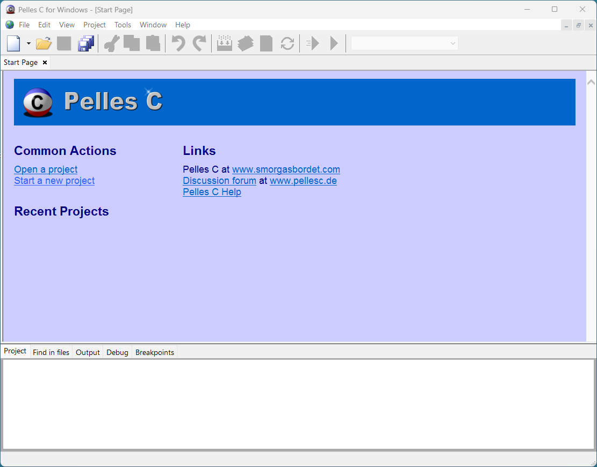
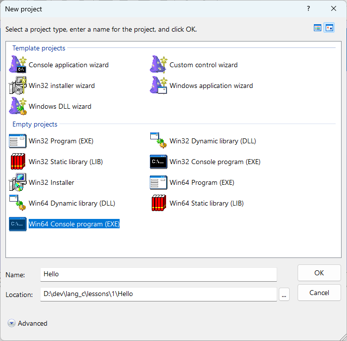
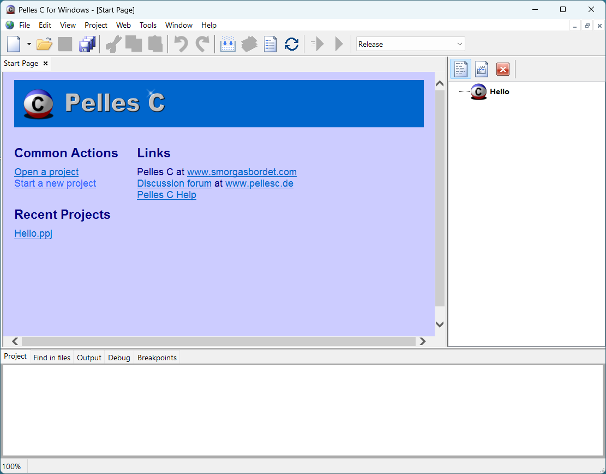
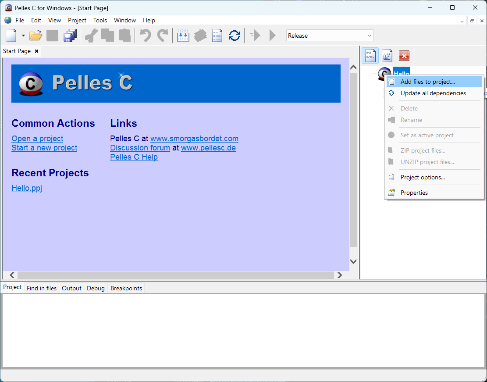
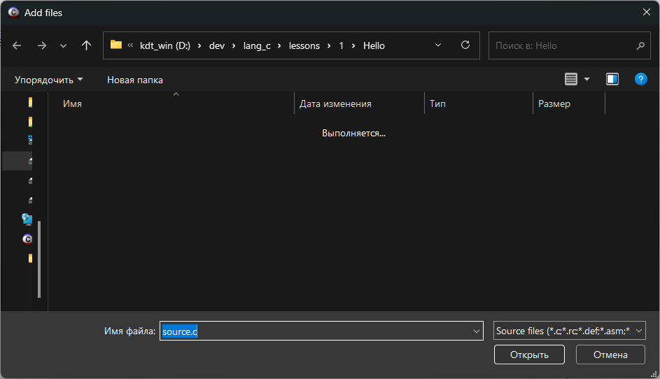
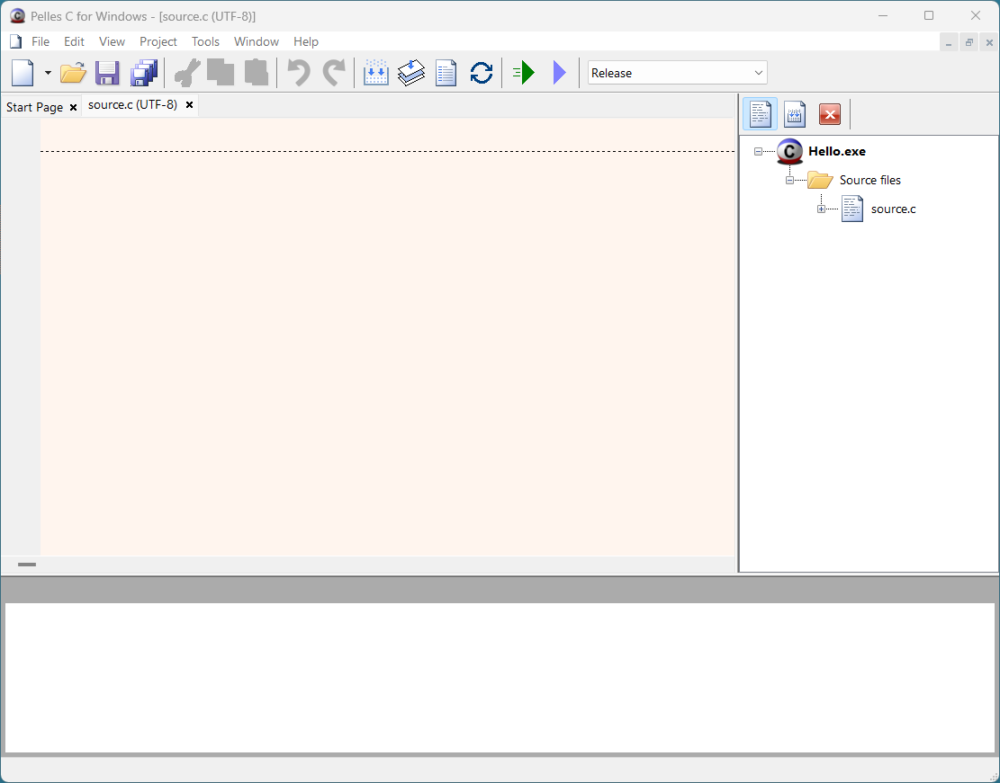

# Как создать консольный проект в IDE Pelles C

В этой части урока нам предстоит разобраться, как создать Проект в IDE Pelles C.

## Создание консольного проекта в IDE Pelles C. Видео-инструкция.

На видео показан процесс создания консольного проекта в Pelles С  Version 8.00. На данный момент актуальная версия 13.00. Процесс создания проекта особо не отличается от восьмой версии.

	<iframe src="https://www.youtube.com/embed/xQfba8vRMvA?rel=0"  allowfullscreen></iframe>

Зеркало <a href="https://rutube.ru/video/7ab4a5a763a3a677637beaaea5a2032c/?r=wd">на RuTube</a>, <a href="https://vkvideo.ru/video-31218664_456239028">на VK.Видео</a>

## Создание проекта в IDE Pelles C. Текстовая инструкция.

Инструкция по созданию консольного проекта в IDE Pelles C v.13.00.

**1 шаг**

Запускаем Pelles C.

Для того чтобы создать новый проект на стартовой странице нажмите на `Start a new project`.

**2 шаг**

В появившемся окне выбираем пункт `Win32 Console program (EXE)` или `Win64 Console program (EXE)`, так как мы собираемся создавать консольное приложение.

Кроме того, в поле `Name` необходимо ввести название для проекта. В поле `Location` указана основная папка проекта, в ней будут храниться все файлы проекта.

Используя кнопку `...` вы можете самостоятельно выбрать, где нужно сохранить проект.

Закончив с основными настройками проекта нажмите кнопку `Ok`.

**3 шаг**

Если всё сделано правильно, то в правой части окна появится отдельная панель с файлами вашего проекта. Т.к. пока файлов в проекте нет, то там будет просто указано название проекта.

Теперь добавим в проект файл с исходным кодом. Именно в нём мы и будем писать текст будущей программы.

**4 шаг**

Правой кнопкой мышки кликните по значку проекта.

В появившемся контекстном меню выберите пункт `Add files to project...`.

**5 шаг**

Появится дополнительное окно, в котором необходимо ввести имя для файла с кодом. Я назвал source.с, вы можете выбрать другое имя.

После того, как записали имя файла нажмите на кнопку `Открыть`.

% Используя это окно можно добавить любой ранее написанный файл с кодом в проект.

**6 шаг**

На панели с файлами проекта должен появится добавленный вами файл. Кликните по нему дважды левой кнопкой мыши, чтобы начать его редактирование.

Откроется новая вкладка редактора с исходным файлом. Именно в этом окошке вы и будете писать свои программы.

% **Важно!** 
Для каждой новой программы требуется создать новый проект, т.е. выполнить все шаги с первого по шестой, а не просто создать новый файл по инструкции из пятого шага.