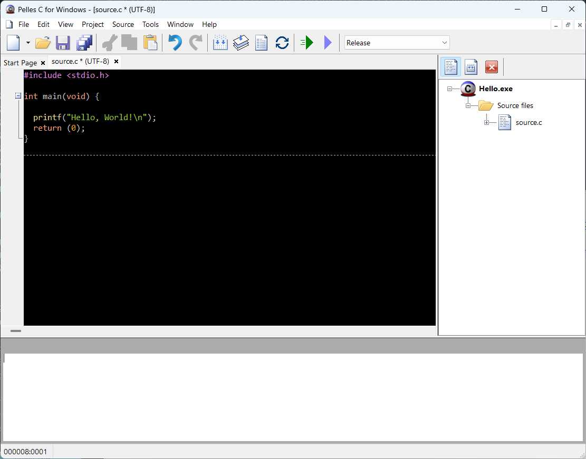
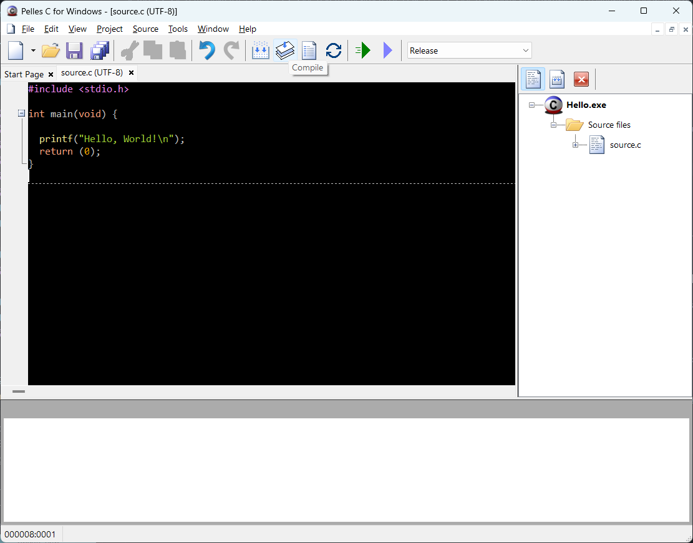
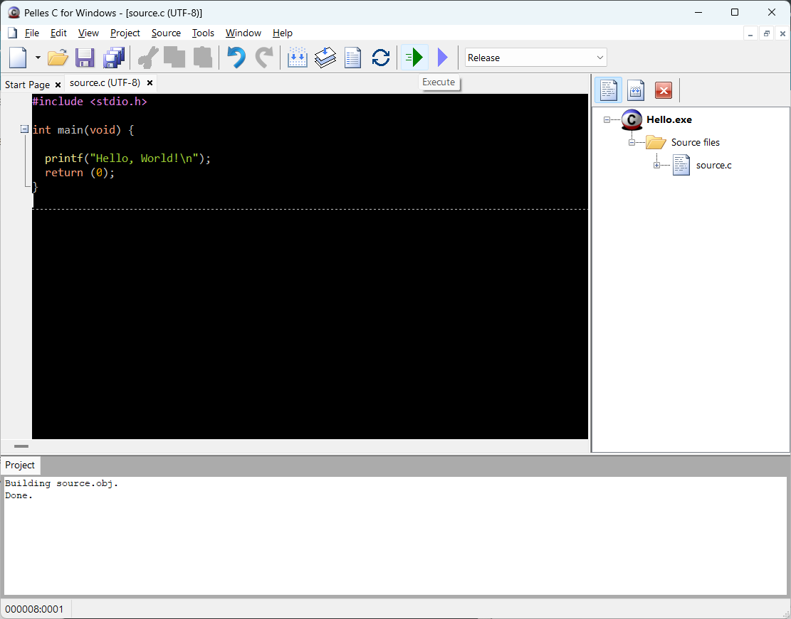
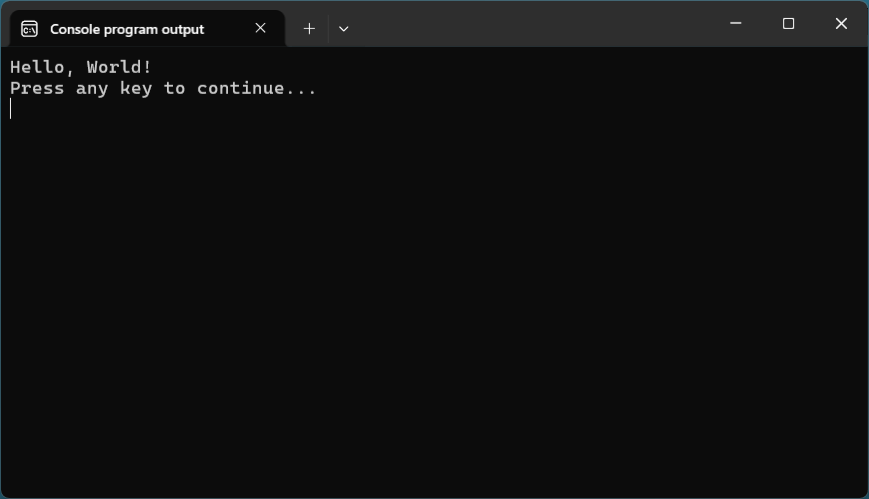
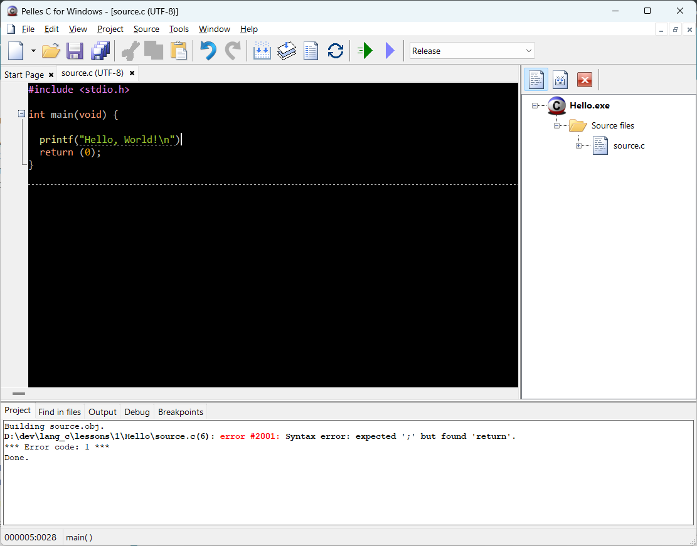

# Основы работы в IDE Pelles C.

В этой части урока мы напишем первую программу и попутно освоим основные команды IDE Pelles C, которые пригодятся нам в дальнешем.

## Текстовая инструкция по созданию первой программы в Pelles C.


**1 шаг**

Запускаем Pelles C и создаём новый проект. Добавляем в проект новый файл с исходным кодом так, как было показано в прошлом уроке.


**2 шаг**

Скопируйте в окно редактора следующий код:

Листинг 1. Программа «Hello, World!»
```c
#include <stdio.h>

int main(void) {

  printf("Hello, World!\n");
  return (0);
}
```

Это простая программа, которая выводит на экран сообщение: `Hello, World!`. Большинство пособий по программированию начинается как раз с написания этой программы. Можно сказать, что это стало уже доброй традицией в обучении программированию.



Не переживайте, что вам сейчас непонятно, что обозначает каждое конкретное слово. Сейчас ваша задача научиться обращаться с компилятором. С самой программой мы разберемся уже в следующем пункте. Обещаю, что вам будет всё ясно как божий день.


**3 шаг**

Сохраните файл нажав сочетание клавиш `Ctrl + S`.

Теперь надо скомпилировать исходный код, используя специальную кнопку меню `Compile`.




**4 шаг**

После компиляции на нижней панели появится результат компиляции программы (строка `Done`). В этом же панели будут отображаться ошибки и предупреждения, которые возникли в процессе компиляции. Чуть позже я еще расскажу, чем отличаются предупреждения от ошибок.


**5 шаг**

Так как ошибок при компиляции не обнаружено, то запускаем нашу программу, используя горячие клавиши `Ctrl + F5`, либо кнопку меню.




**6 шаг**

Если всё сделано верно, то перед вам откроется окно консоли, в котором будет выведена строка `Hello, world!`.




## Про сообщения компилятора, ошибки и предупреждения

Компилятор выдаёт два типа сообщений: =предупреждения (warning)= и =ошибки (error)=.

Предупреждения нам не очень страшны. К ним можно относиться как к хорошим советам, которыми, впрочем, можно и не пользоваться. Программу можно запускать даже при наличии предупреждений, но вот если компилятор выдаёт ошибку (error), то такую программу запустить не получится. Необходимо сначала исправить все ошибки в вашей программе. Вот в примере ниже допущена одна ошибка.




Как видите, компилятор помимо того, что указывает на факт наличия ошибки, так еще и уточняет, что это за ошибка и даже указываем место, где она находится. Это очень помогает при исправлении ошибок. Например, в этой ошибке записано, что в шестой строке файла `source.c(6)` допущена синтаксическая ошибка `(Syntax error)` -– пропущен `;` перед `return`.

Вот вы и научились основным приемам работы в среде Pelles C.

Теперь чтобы разобраться с тем, как работает эта программа, переходите к уроку [Структура программ на языке Си](../../1/structura_programm_na_c).
