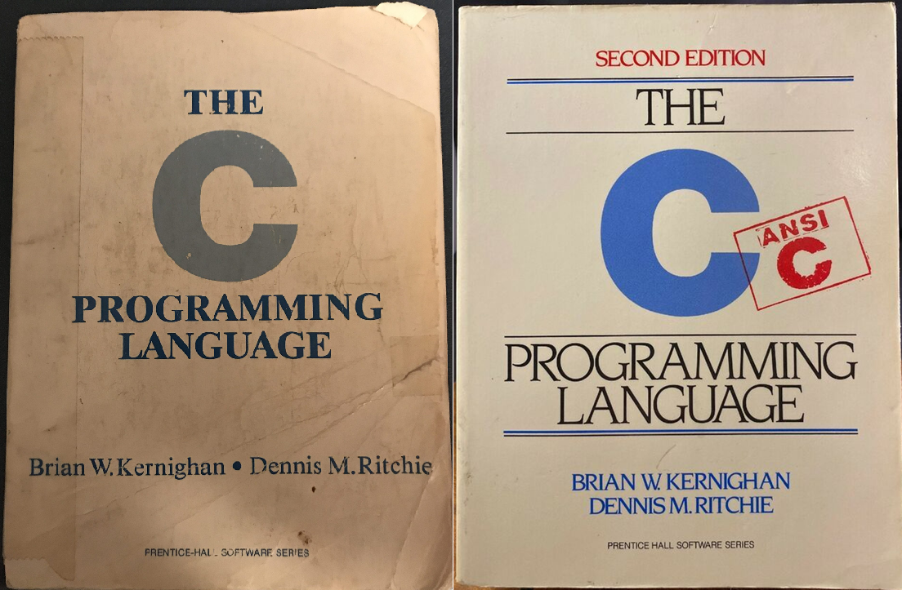

## Дополнительные материалы

Традиционно в большинстве книг по программированию, в качестве первой программы предлагается программа `Hello, world`. Этим никого не удивишь. Но вот что интересно 

Такая традиция появилась благодаря книге "Язык программирования Си" (The C programming language) Б. Керниган, Д. Ричи выпущенной в свет в 1978 году. Эту книгу еще называют "white book" из-за её обложки.

Второе издание (1988) этой книги было переведено на 27 языков. На картинках представлены обложки первого и второго издания книги. 

Ранее на сайте Bell Labs была даже [специальная страница](https://s3-us-west-2.amazonaws.com/belllabs-microsite-dritchie/cbook/index.html), посвященная данной книге. Сейчас оригинальная версия недоступна, но есть копия по ссылке выше. Там же можно посмотреть обложки на других языках.

Хотя с тех пор много воды утекло, многие до сих пор советуют второе издание этой книги, как классический учебник для изучения языка Си.