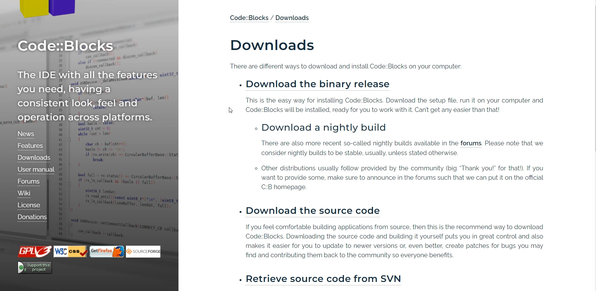
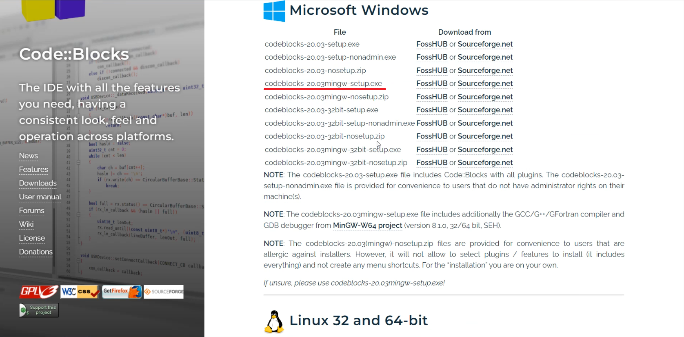
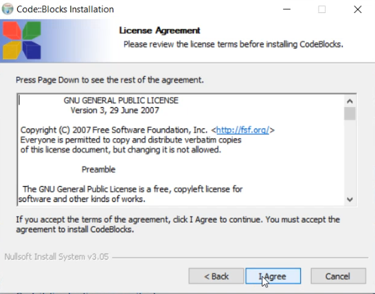
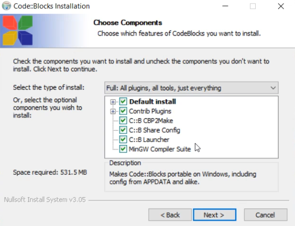
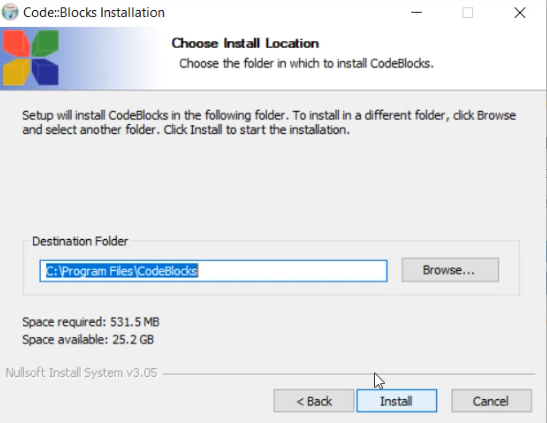
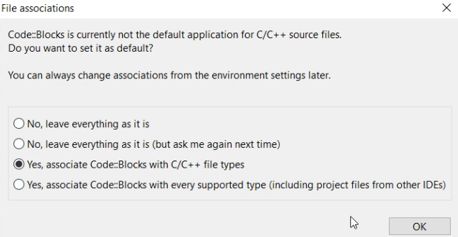
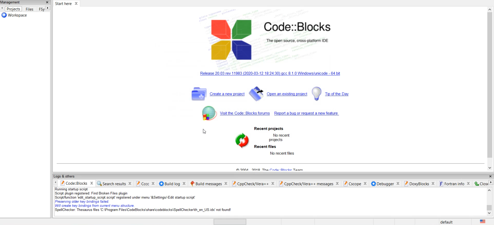

## Видео-инструкция по установке IDE Code::Blocks

На видео показан процесс установки среды разработки Code::Blocks.

	<iframe src="https://www.youtube.com/embed/7UWR3U3WuPw?rel=0" allowfullscreen></iframe>

Зеркало <a href="https://rutube.ru/video/67f58bb5aba0ff03df8be1006d5af1de/?r=wd">на RuTube</a>, <a href="https://vkvideo.ru/video-31218664_456239029">на VK.Видео</a>

## Текстовая инструкция по установке Code::Blocks

**1 шаг**

Перейдите на [официальную страницу](https://www.codeblocks.org/downloads/) Code::Blocks в раздел Downloads.

**2 шаг**

Нажмите `Download the binary release`, выберите подходящую операционную систему и тип загрузчика. Рекомендую выбирать загрузчик с припиской `mingw-setup`, т.к. в него уже встроен компилятор.

Выберите откуда скачивать файл и дождитесь завершения загрузки. Запустите скачанный файл.

**3 шаг**

Программа вас поприветствует. Нажмите `Next`. В следующем окне будет лицензионное соглашение. Ознакомьтесь с ним и нажмите `I Agree`.

**4 шаг**

В следующем окне можно выбрать отдельные компоненты программы, которые будут установлены.

На этом шаге можно оставить всё по умолчанию и нажать `Next`.

**5 шаг**

В следующем окошке можно выбрать каталог установки для программы.

Выбрав каталог установки, нажмите `Install`. Начнётся установка программы. В среднем установка занимает 5–10 минут.

**6 шаг**

После установки программа предложит её запустить. Нажмите `Да`, должно появиться следующее окно:

Программа найдёт все установленные в системе компиляторы. Выбирайте `GNU GCC Compiler` и нажмите `ОК`.

**7 шаг**

На этом шаге вы можете выбрать типы файлов, которые Windows в дальнейшем будет открывать с помощью Code::Blocks C.

Выберите `Yes, associate Code::Blocks with C/C++ file types` и нажмите `ОК`.

**8 шаг**

Поздравляю! Установка Code::Block завершена. Пора создавать проект и писать свой первый код.

Инструкция по созданию проекта в Code::Blocks в следующей части.