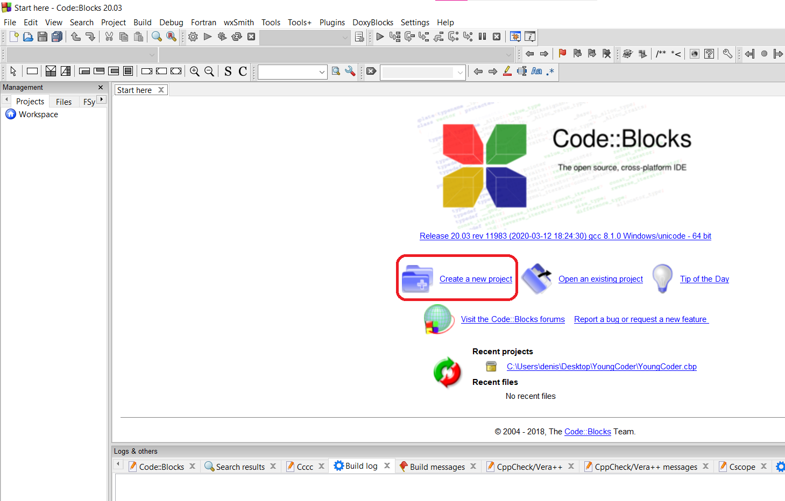
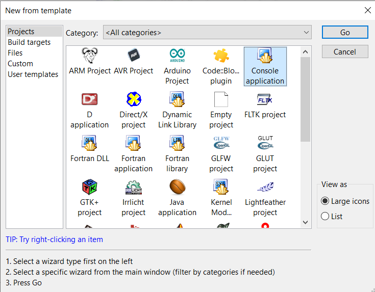
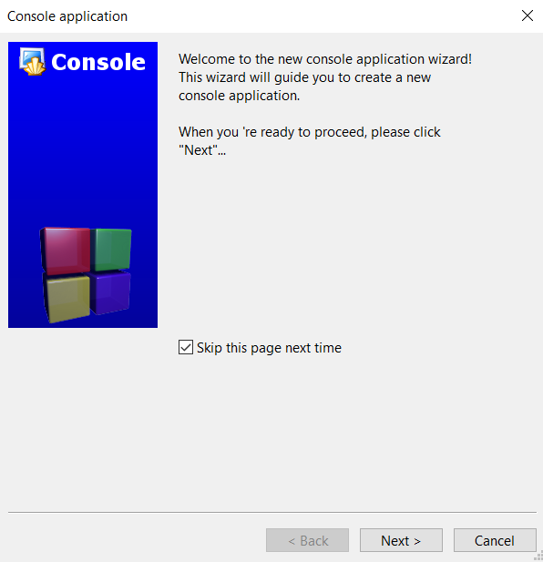
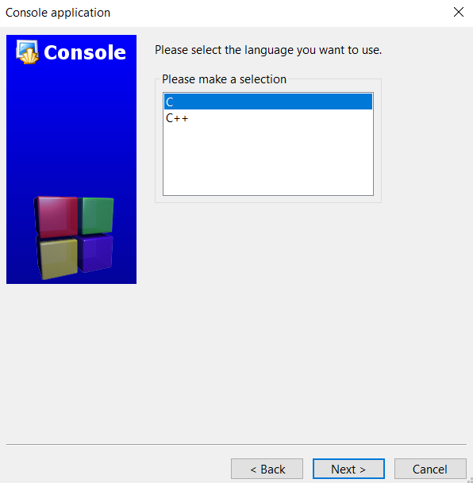
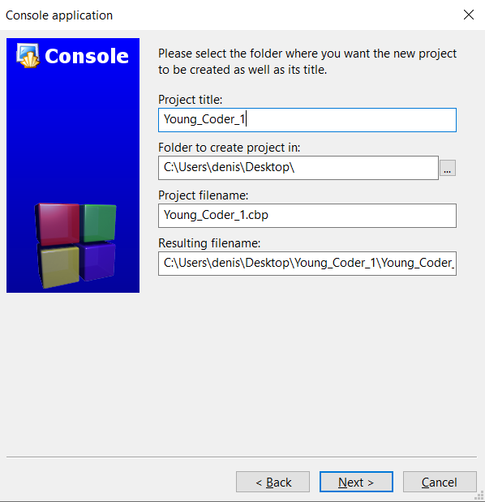
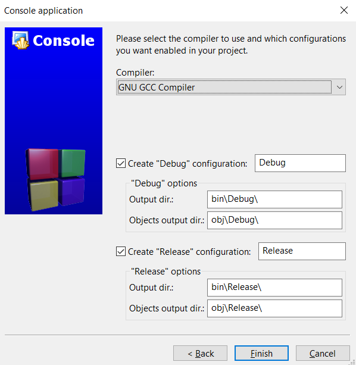
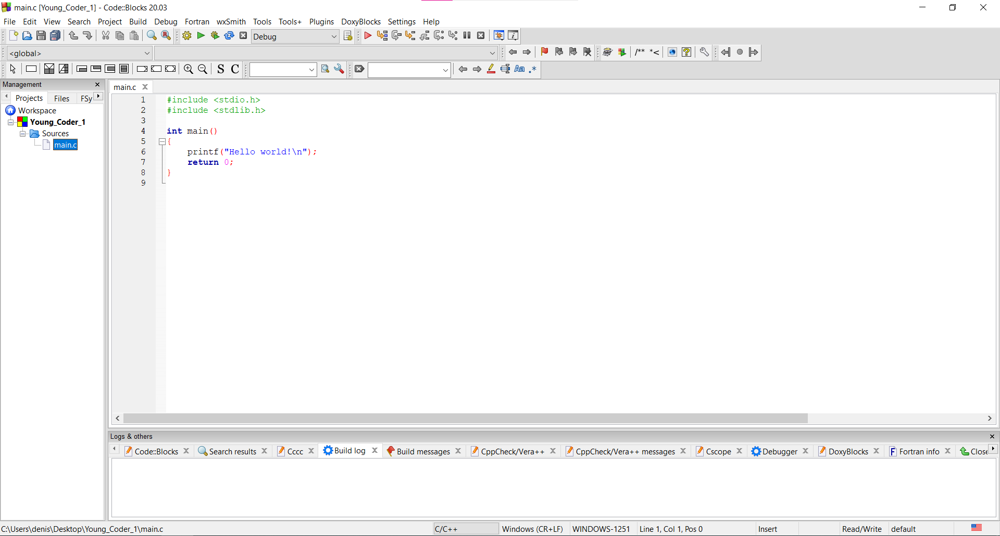

# Как создать консольный проект в Code::Blocks

Во всех занятиях мы будем писать консольные приложения под Windows. В этой части урока нам предстоит разобраться, как создать проект в IDE Code::Blocks.

## Создание консольного проекта в IDE Code::Blocks. Видео-инструкция.

На видео показан процесс создания консольного проекта в Сode::Blocks.

	<iframe src="https://www.youtube.com/embed/ji0UsiXbaOE?rel=0"  allowfullscreen></iframe>

## Создание консольного проекта на Си в IDE Code::Blocks. Текстовая инструкция.

**1 шаг**

Запускаем Code::Blocks.

Выберите `Create a new project` для создания нового проекта.

**2 шаг**

На протяжении всего курса мы будем работать в консоли, поэтому из выпавшего меню выберите `Console application` и нажмите `Go`.

**3 шаг**

Появится окно мастера создания консольных приложений. Нажмите `Next`.

**4 шаг**

В следующем окошке будет предоставлен выбор языка программирования.

Мы изучаем язык Си (без ++), поэтому выберите `С` и нажмите `Next`.

**5 шаг**

В этом окне придумайте название проекта, которое также будет и названием папки для хранения файлов проекта (первая строка). Укажите место, где будет храниться папка с проектом (вторая строка). Запишите имя главного файла проекта (третья строка). В чётвёртой строке вы можете проверить правильность итогового пути до главного файла проекта.

**6 шаг**

В данном окне необходимо выбрать компилятор. Выбирайте `GNU GCC Compiler` и жмите на кнопку `Finish`.

**7 шаг**

Создание проекта завершено. Слева в меню отобразится ваш проект с названием, которое вы придумали на пятом шаге. Раскройте папку        `Sources` и дважды кликните по `main.c`. Это файл с исходным кодом программы. Именно здесь вы будете писать код. Т.к. мы создавали шаблон консольного приложения, то в этом файле по умолчанию уже записан код программы, выводящей в консоль текст `Hello World!`

% **Важно!**
Для каждой новой программы требуется создать новый проект. 

В следующей части урока мы разберёмся с основными функциями Code::Blocks и напишем первую программу.