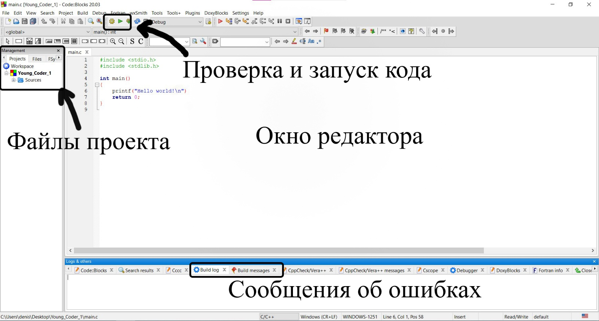
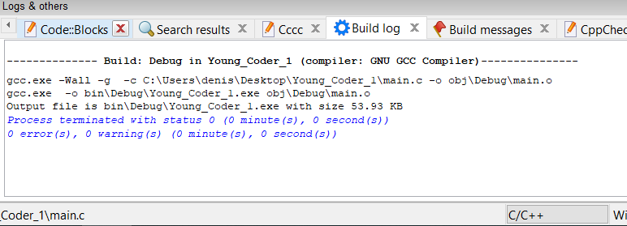
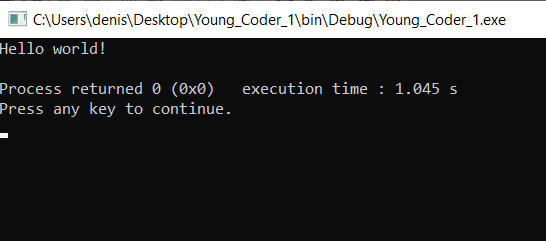
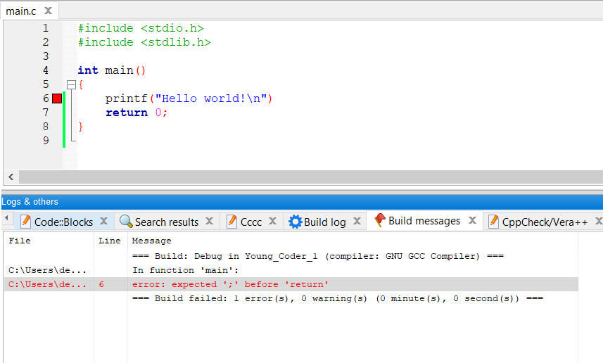

# Основы работы в IDE Code::Blocks

В предыдущей части урока мы создали проект в Code::Blocks. В нём уже есть готовый шаблон программы.

Это простая программа, которая выводит на экран сообщение: `Hello World!`. Большинство пособий по программированию начинается как раз с написания этой программы. Можно сказать, что это стало уже доброй традицией в обучении программированию.

Не переживайте, что вам сейчас непонятно, что обозначает каждое конкретное слово. Сейчас ваша задача научиться обращаться со средой разработки, а с самой программой мы разберемся чуть позже. Обещаю, что вы во всём разберётесь.

Для начала разберёмся с основными частями редактора, которые будут нужны нам для работы. Посмотрите на рисунок ниже.

По центру находится окно редактора нашего кода. Здесь мы будем писать код для наших будущих программ.

Слева в панели `Management` отображаются файлы нашего проекта.

В нижней панели `Logs & others` мы видим различные вкладки, но нас пока что будут интересовать две из них: `Build log` и `Build messages`. В них мы увидим описание ошибок или предупреждений, обнаруженных при компиляции программы.

Вверху на панели инструментов располагаются две основные кнопки, с помощью которых мы будем запускать наши программы.

Жёлтая шестерёнка  `Build` -– отвечает за компиляцию проекта. На самом деле там происходит не только комплияция, но сейчас это не очень важно. Важно другое. Во время этого этапа код программы проверяется на наличие ошибок, и если они есть, то информация о них будет выведена на вкладках `Build log` и `Build messages`.

Вторая важная кнопка -– зелёная стрелочка. Нетрудно догадаться, что нажатие этой кнопки запускает программу на выполнение. Запуск возможен только после компиляции программы с помощью шестерёнки. Если вы сразу нажмёте на стрелку, то Code::Blocks всё равно предложит сделать `Build` (сбилдить) программу перед запуском.

Что ж, давайте "сбилдим" наш код.

**1 шаг**

Смело нажимайте на шестерёнку, если не сделали это ранее.

Что мы видим? Программа создала exe файл, который занимает 53.93кБ. Ошибок и предупреждений не обнаружено. Это значит, что всё замечательно и мы можем выполнить нашу программу. Давайте так и сделаем.

**2 шаг**

Нажмите зелёную стрелочку. Сразу появится консоль (помните, мы ведь создавали консольное приложение?), в которой и будет выведен текст `Hello world!`

Вы можете вместо данного приветствия написать любой другой текст, попробуйте. Не забудьте после внесения изменений заново скомпилировать код (шестерёнка), прежде чем запускать программу.

Вы спросите: хорошо, этот код без ошибок, а если в коде ошибка, то как это узнать?

Всё просто. После того, как вы попытаетесь скомпилировать код, среда разработки сама скажет вам, сколько ошибок в вашем коде. Более того, она укажет на какой строке находится ошибка и, скорее всего, даст краткое пояснение, в чём именно заключается ошибка. Для примера давайте нарочно сделаем ошибку в предыдущей программе (уберём точку с запятой в конце 6 строки) и нажмём шестерёнку. Code::Blocks сам откроет вкладку `Build messages`.

Как видите, компилятор написал нам, что в функции main на 6 строке произошла ошибка -- ожидается `;` перед `return`. Чего и следовало ожидать, ведь мы как раз удалили точку с запятой из этой строки.

Вот вы и научились основным приемам работы в среде Code::Blocks. Этими приёмами возможности Code::Blocks не исчерпываются, но на данном этапе этого будет достаточно.

Теперь чтобы разобраться с тем, как работает эта программа, переходите к уроку [Структура программ на языке Си](../../1/structura_programm_na_c).