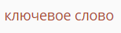
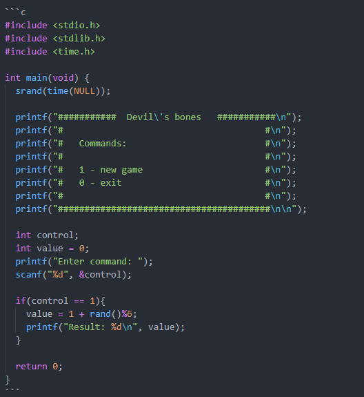
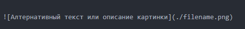

# Базовый синтаксис используемой разметки

## Заголовки

Для заголовков использует стандартный синтаксис md-разметки.

* Заголовок 1-го уровня используется толкьо для названия урока/заметки.
* Заголовок 2-го уровня используется для названий больших разделов. Внешне он не отличим от заголовка первого уровня.
* Заголовок 3-го уровня используется для подразделов.
* Заголовок 4-го уровня используется для подподразделов.
* Заголовки 5-го и 6го уровней не используются.


### Примеры:
```
# Заголовок 1-го уровня
```

```
## Заголовок 2-го уровня
```
## Заголовок 2го уровня (названия больших разделов)


```
### Заголовок 3-го уровня
```
### Заголовок 3го уровня (подразделы)

```
#### Заголовок 4-го уровня
```
#### Заголовок 4го уровня (подподразделы)


## Форматирование текста


### Примеры:
```
**жирный** __тоже жирный__
```
**жирный** __тоже жирный__

```
*курсив* _тоже курсив_
```
*курсив* _тоже курсив_


```
~~зачёркнутый~~
```
~~зачёркнутый~~


```
*** жирный курсив ***
```
*** жирный курсив ***


```
`однострочный код`
```


А также дополнительный маркер для выделения ключевых слов.

```
=ключевое слово=
```



## Цитирование

Можно использовать для описания условий примеров.

### Примеры:
```
> Этот текст процитирован
> это с новой строки
```


## NotaBene
Важные замечания или частые ошибки добавляется с помощью этого блока.


### Пример:
```
% Это текст будет в **важном** замечании
% Вторая __строка__
% ***Третья строка***
```

Так тоже сработает
```
% Это текст будет в **важном** замечании
Вторая __строка__
***Третья строка***
```


## Блок с кодом

* В начале блока с кодом пишем три одинарные кавычки ` а за ними английскую букву c.
* С новой строки пишем код.
* На последней строке добавляем три одинарные кавычки.


### Примеры:



```c
#include <stdio.h>
#include <stdlib.h>
#include <time.h>

int main(void) {
  srand(time(NULL));

  printf("###########  Devil\'s bones   ###########\n");
  printf("#                                      #\n");
  printf("#   Commands:                          #\n");
  printf("#                                      #\n");
  printf("#   1 - new game                       #\n");
  printf("#   0 - exit                           #\n");
  printf("#                                      #\n");
  printf("########################################\n\n");

  int control;
  int value = 0;
  printf("Enter command: ");
  scanf("%d", &control);

  if(control == 1){
    value = 1 + rand()%6;
    printf("Result: %d\n", value);
  }

  return 0;
}
```


## Картинки:

Код для вставки картинки:



Прикрепляемая картинка обязательно должна находиться в той же директории, что и сама заметка.
### Примеры:


## Видео

iframe с видео оборачиваем в div с классом lessonVideo.

Пример:
```html
<div class="lessonVideo">
  <iframe src="https://www.youtube.com/embed/Gx6KUtmRmHs"  allowfullscreen></iframe>
</div>
```

## Окошко Stepik

iframe с уроком оборачиваем в div с классом lessonStepikBlock

```html
<div class="lessonStepikBlock">
    <iframe src="https://stepik.org/lesson/13977/step/1"></iframe>
</div>
```
