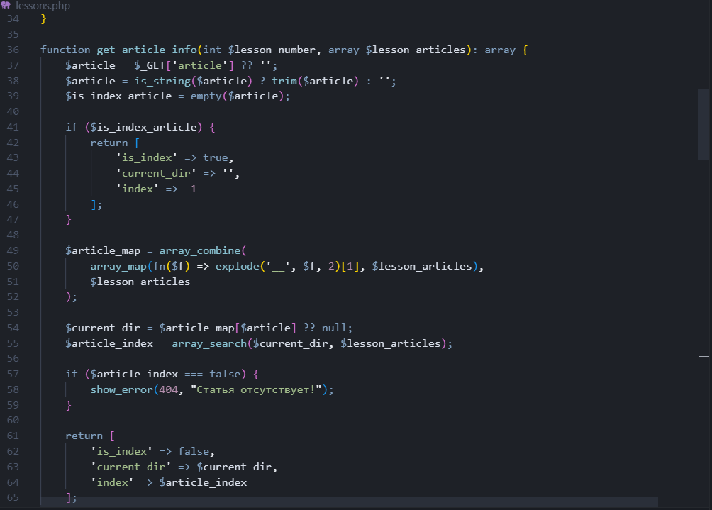

# Компьютерное программирование. Компиляторы и IDE

=Программирование= -- это процесс написания программ (для компьютера и не только).

Если вы читаете данный урок, то вы точно пользуетесь программами. Они не появились сами по себе, а были ранее созданы программистами. Примерно вот так они выглядят изначально:

Как видите программы -- это просто некоторый текст. Возможно, сейчас он кажется вам непонятной абракадаброй, но на самом деле в нем есть свои четкие правила, которые никто не может нарушить. Эти правила и составляют основу любого языка программирования.

В принципе, написать текст программы можно в любом текстовом редакторе, даже в стандартном блокноте ОС Windows, но есть одна существенная проблема. Компьютер не понимает ничего, кроме нулей и единиц. Уж тем более он не понимает никаких слов, поэтому написанный нами текст программы для него, примерно как и для вас сейчас, набор непонятных символов. 

Чтобы компьютер понял то, что мы от него хотим, нам нужна специальная программа, которая "переведет" программу, записанную на языке программирования, на язык, понятный компьютеру. Такая программа называется =компилятором=, а сам процесс перевода текста программы на понятный компьютеру язык -- =компиляцией=. 

Текст программы, записанный на каком либо языке программирования, называют =исходным кодом= программы или =исходником= (т.к. после компиляции будет уже преобразованный код). Но чаще говорят про =исходники=, ибо большинство программ состоят не из одного файла, а из большого числа файлов с кодом.

Итак, создание программ в первом приближении состоит из следующих шагов:

1. написать исходный код программы в текстовом редакторе;
2. скомпилировать исходный код.

Писать код в блокноте, потом компилировать его специальной программой, особенно если ваша программа состоит из большого количества файлов с исходным кодом не очень удобно. Поэтому программисты решили создать для себя такие программы, в которых можно будет сразу писать код, проверять его на ошибки, компилировать и запускать готовую программу. В общем, все сразу в одном флаконе. Такие программы называются =интегрированными средами разработки (IDE)=. 