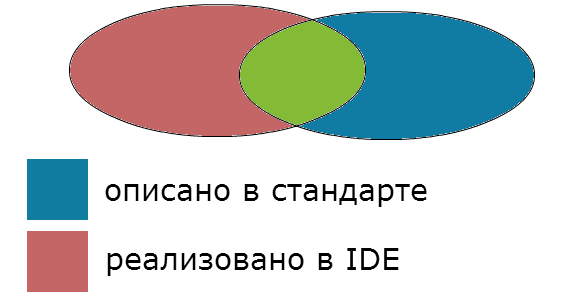

# Стандарт языка программирования		

У каждого языка программирования есть специальный документ, который называется `стандартом языка программирования`. В нем подробно описаны правила этого языка. Так как языки программирования постоянно развиваются, время от времени выходят новые стандарты.

По идее, компилятор или IDE(среда разработки, в которой есть компилятор) должны поддерживать все возможности языка, то есть, если что-то описано в стандарте, то это должно работать в любой IDE и в любом компиляторе данного языка. Но, как говорится, гладко было на бумаге, да забыли про овраги. Реальность можно примерно изобразить следующей схемой.

Каждая IDE в той или иной степени поддерживает стандарт, но помимо этого, у каждой есть свои фишки, которых может и не быть в стандарте. Поэтому те, кто профессионально занимаются программированием, изучают не только сам язык программирования, но ещё и среды разработки. Например, стандартный компилятор IDE Visual Studio совершенно не поддерживает новые стандарты языка Си (C99, C11). Но нет повода расстраиваться. Почти все, что мы будем изучать в данном курсе, относится к той части стандартов, которая не меняется уже очень давно и поддерживается всеми компиляторами и IDE.
