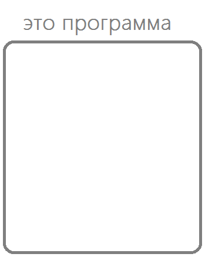
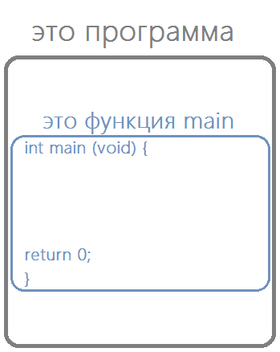
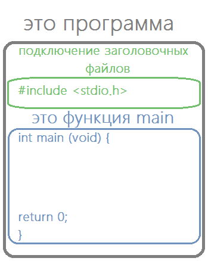
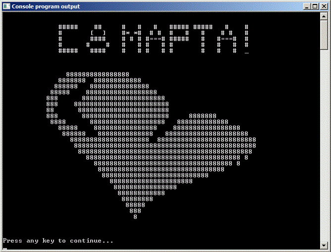

# Структура программ на языке Си
			
Я надеюсь, вы уже установили себе на компьютер какую-нибудь IDE и научились в ней компилировать программы. Если нет, то <a href="http://youngcoder.ru/lessons/1/ide/pelles_c/"> подробная инструкция, как установить IDE для языка Си.</a>


Все программы, написанные на языке Си, имеют общую структуру. О которой мы и поговорим в этом уроке. В этом нам поможет наша первая программа, написанная на <a href="https://youngcoder.ru/lessons/1/ide/pelles_c/osnovy_pellesc.php"> предыдущем шаге</a> (она же Листинг 1 в этом уроке).


Будем заполнять простую карту. На данный момент мы знаем, что существуют программы, но как они устроены внутри нам неизвестно. Поэтому наша карта будет иметь следующий вид.

			


			
На протяжении всего курса мы к этой карте будем возвращаться, уточнять её, дополнять новыми элементами и блоками.

			
Сейчас внимание. Не пугайтесь! Ниже написан исходный код трёх простеньких программ. Ваша задача внимательно на них посмотреть и попытаться найти в их коде какую-то закономерность (нечто общее, что есть в каждой программе).


Листинг 1. 
```c
// комментарий
#include <stdio.h>
int main(void) {
  printf("Hello, World!\n");
  return 0;
}
 ```

Листинг 2. 
```c
int main(void) {
  int a, b, c;
  
  a = 5;
  b = 10;
  c = a + b;
  
  return 0;
}
```


Листинг 3.
```c
#include <stdio.h>
int main(void) {
  FILE *fp;
	
  fp = fopen("input.txt", "w");
  fprintf(fp, "This is Sparta!");
  fclose(fp);
	
  return 0;
}
```


Не торопитесь смотреть продолжение урока и правильный ответ на эту задачу. Для начала попробуйте ответить самостоятельно. После этого двигайтесь дальше.


Итак, ответ: Во всех программах выше присутствует следующая конструкция:


Листинг 4. Главная функция любой программы на языке Си -- функция `main`.
```c
int main(void) {
  return 0;
}
```


Что же это за конструкция? Это объявление функции `main`. Такая функция обязательно есть в каждой программе, которая написана на языке Си. Большая программа или маленькая, компьютерная игра или программа «Hello, World», написана вами или Биллом Гейтсом -- если программа написана на языке Си -- в ней есть функция `main`. Это так сказать главная функция нашей программы. Когда мы запускаем программу, то можно думать, что запускаем функцию main этой программы.

			
Остановимся на секундочку. Мы, кажется, уже кое-что выяснили о структуре программ на языке Си. Любая программа на языке Си должна содержать функцию `main`. Отобразим этот факт на нашей карте знаний "Структура программ на языке Си."
			
			



Теперь карта не напрягает нас своей зияющей пустотой. Продолжим наши исследования.

			
Давайте я расскажу немного о функции `main` и о функциях вообще.

			
Перед именем функции написано `int`, это сокращение от слова integer, которое переводится с английского, как "целое". Подобная запись означает, что когда функция `main` завершит свою работу, она должна вернуть вызывающей программе (в нашем случае это операционная система) какое-нибудь целое число. Обычно, для функции `main` это число ноль, которое оповещает операционную систему: "Мол, всё хорошо. Происшествий не случилось."

			
Случалось ли вам видеть сообщения об ошибках на экране своего компьютера? Обычно там написано что-то вроде "Программа аварийно завершена ... бла-бла-бла... Код -314." Вот это примерно тоже самое. Разница в том, что когда случаются проблемы операционная система нас об этом оповещает, а когда всё хорошо она нас лишний раз не беспокоит.

			
После имени функции в скобках записано слово `void`. Вообще, в скобках обычно записывают аргументы функции. Но в нашем случае, когда в скобках написано `void`, это означает, что аргументов у функции нет. Другими словами, чтобы функция `main` начала работу, ей не нужны никакие дополнительные данные извне. Мы ещё поговорим обо всём этом подробно, а пока просто запомним, что слово `void` вместо аргументов функции обозначает, что для данной функции никаких аргументов не требуется.


Внутри фигурных скобок идёт описание функции `main`, т.е. непосредственно то, что эта функция должна делать.
			
			
Перед закрывающей фигурной скобкой мы видим команду `return`. Именно эта команда и отвечает за то, чтобы вернуть значение из функции. Т.е. смотрите, если программа дошла до этого места, то значит, всё было хорошо и никаких ошибок не возникло, а значит, можно вернуть значение нуль.


Вы можете спросить, а почему именно нуль? А чёрт его знает! Просто так обычно делают. Можно, в принципе, возвращать какое-нибудь другое целое число, например `100`, или `-236`. Лишь бы оно было целым числом. Помните про `int`? Поэтому и целое.
			

Вот мы и разобрались с функцией `main`. Ещё один момент. То, что записано в фигурных скобках обычно называют "телом функции" (или описанием функции). А первая часть, та, что перед фигурными скобками называется заголовок функции.
	
Вернёмся теперь к нашей первой программе «Hello, World» и посмотрим, что там к чему.
			
			
Листинг 5. Программа «Hello, World»
```c
#include <stdio.h>
int main(void) {
  printf("Hello, World!\n");
  return 0;
}
```			


Кое-что нам теперь уже понятно в этой программе. Не ясными остаются только две строки, пойдём по порядку.


Листинг 6. Директива include
```c
#include <stdio.h>
```	


Данная строчка -- это сообщение компилятору, которое буквально означает «подключи файл stdio.h». Такие сообщения, начинающиеся с символа `#`, называются директивами компилятора. Во время компиляции вместо этой строчки вставится содержимое файла `stdio.h`. Теперь немного поговорим об этом файле. `stdio.h` (от англ. STanDart Input Output) это заголовочный файл, в нем описаны различные стандартные функции, связанные с вводом и выводом.


Возникает резонный вопрос "А зачем нам писать эту строчку? Зачем нам вообще понадобилось вставлять сюда этот файл?". Это нужно для того, чтобы в своей программе мы могли использовать стандартную функцию вывода на экран `printf()`.

 
Дело вот в чем. Прежде чем использовать что-нибудь в своей программе, нам надо сначала это описать. Представьте ситуацию: вас попросили принести канделябр, а вы знать не знаете, что это такое. Непонятно, что делать.


Так же и компилятор. Когда он встречает какую-нибудь функцию, он ищет её описание (т.е. что она должна делать и что обозначает) в начале программы (с самого начала и до момента её использования в программе). Так вот, функция `printf()` описана в файле `stdio.h`. Поэтому мы и подключаем его. А вот когда мы его подключим, компилятор сможет найти функцию `printf()`, иначе он выдаст ошибку.

			
Кстати, настало время дополнить нашу карту знаний. Перед функцией `main` добавим ещё один блок -- блок подключения заголовочных файлов.



			

Продолжим разбираться с нашей программой.
			
			
Листинг 7. Функция `printf()`
```c
printf("Hello, World!\n");
```

В этой строке мы вызываем стандартную функцию вывода на экран `printf()`. В данном простейшем случае мы передаем ей один параметр -- записанную в кавычках строку, которую надо вывести на экран. В нашем случае это `Hello, World!\n`. Но постойте, а что это за `\n`? На экране во время запуска программы никаких `\n` не было. Зачем тогда мы тут это написали? Данная последовательность -- это специальный символ, который является командой перейти на следующую строку. Это как в MS Word нажать клавишу Enter. Таких специальных символов несколько, все они записываются с помощью символа `\` -- обратный слеш. Такие специальные символы называются управляющими символами. Потом я ещё покажу вам их. В остальном на экране появится именно то, что вы написали в двойных кавычках.


Кстати, обратите внимание, каждая команда  языка Си заканчивается символом `;` (точкой с запятой). Это похоже на точку в конце предложения в русском языке. В обычном языке мы разделяем точкой предложения, а в языке программирования Си точкой с запятой отделяем команды друг от друга. Поэтому ставить точку с запятой обязательно. Иначе компилятор будет ругаться и выдаст ошибку.
			


Чтобы вызвать какую-нибудь функцию, необходимо написать её имя и указать передаваемые ей параметры в круглых скобках. У функции может быть один или несколько параметров, а может не быть параметров вовсе. В таком случае в скобках пишут `void`. Но это необязательно - можно оставить скобки пустыми `()`. Например, выше мы вызвали функцию `printf()` и передали ей один параметр - строку, которую необходимо вывести на экран.
		


Кстати, полезный совет. Так как в каждой программе обязательно присутствует функция `main`, и буквально в каждой программе нам потребуется что-то выводить на экран, то рекомендую вам сразу создать файл со следующей заготовкой, чтобы каждый раз не писать одно и то же.


Листинг 8. Стандартная заготовка для программ на языке Си.</p>
```c
#include <stdio.h>
int main(void) {
  return 0;
}
```


Ну вот вроде бы и всё. Этом первый урок можно считать законченным. Хотя нет, ещё один момент есть.


Самое главное в этом уроке это, конечно, общая структура программы. Но кроме того, мы научились выводить на экран произвольный текст. Кажется, что совсем ничего вроде и не узнали, но даже этого хватит для того, чтобы, например, сделать небольшой подарок своей маме на 8 марта.





Исходный код программы-открытки есть в архиве с исходными кодами этого урока. Экспериментируйте! У вас всё получится.
