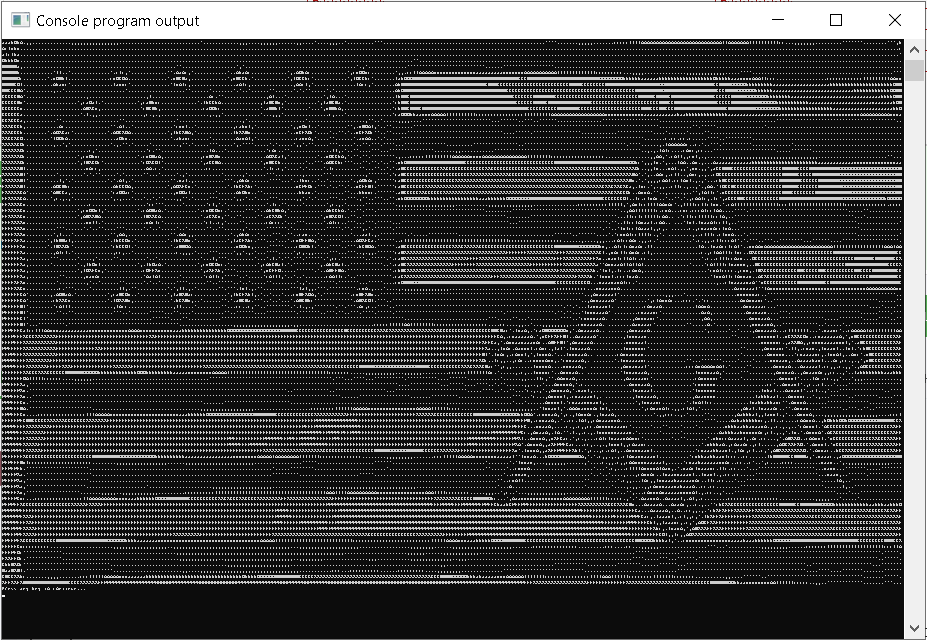

## Дополнительные материалы

1. Переживаете из-за того, получится ли у вас программировать или нет?  Тогда посмотрите следующее видео. 	

	<iframe src="https://www.youtube.com/embed/kfkVMu8k2As" allowfullscreen></iframe>

2. Творчество учеников [Anonymous 255391790 и Костя Левин](https://stepik.org/lesson/13977/step/8?discussion=3680622&unit=30906)

3. Посмотрите фильм компании СТВ -- }{отт@бь)ч.

	<iframe src="https://youtu.be/vwEwhTEe1so?si=L6r9iqPPYtp08iM1" allowfullscreen></iframe>

[С 1:10:32 до 1:11:58](https://youtu.be/vwEwhTEe1so?si=LZVqo2OxTuPfJ4Qj&t=4232) Гена рассказывает старику Хотаббычу о том, что такое роботы, программы-роботы и как они выглядят изнутри. 
