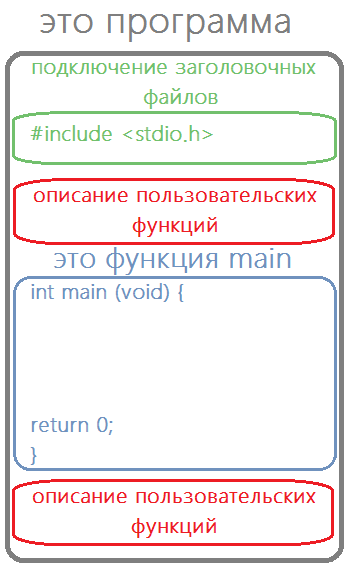

# Пользовательские функции в Си

Итак, зачем нужны пользовательские функции? Пользовательские функции нужны для того, чтобы программистам было проще писать программы.

Помните, мы говорили о парадигмах программирования, а точнее о структурном программировании. Основной идеей там было то, что любую программу можно написать используя только три основных конструкции: следование, условие и цикл. Теперь к этим конструкциям мы добавим ещё одну -- «подпрограммы» -- и получим новую парадигму `процедурное программирование`.

Отличие лишь в том, что отдельные кусочки нашей основной программы (в частности, повторяющиеся) мы будем записывать в виде отдельных функций (подпрограмм, процедур) и по мере необходимости их вызывать. По сути, программа теперь будет описывать взаимодействие различных функций.

В принципе, мы уже используем эту парадигму. Если вам пока ещё не совсем ясно, почему это проще, то просто представьте, что вместо того чтобы вызвать функцию `exp(x)` из заголовочного файла `math.h` вам каждый раз необходимо было бы описывать подробно, как `вычислить значение этой функции`.

Итак, в этом уроке мы подробно обсудим то, как функции устроены изнутри. А также научимся создавать свои собственные пользовательские функции.

## Как устроены функции

Вспомним информацию с первого урока. Все функции, в том числе и те, которые пишет пользователь, устроены сходным образом. У них имеется две основных составных части: заголовок функции и тело функции.

Листинг 1.

```c
int main(void){  // заголовок функции

// в фигурных скобках записано тело функции

}
```

С телом функции всё ясно: там описывается алгоритм работы функции. Давайте разберёмся с заголовком. Он состоит из трёх обязательных частей:

- тип возвращаемого значения;
- имя функции;
- аргументы функции.

Сначала записывается тип возвращаемого значения, например, `int`, как в функции `main`. Возвращаемое значение - это то, что функция "отдаст" после своей работы. Вот ещё пример: если мы используем функцию `pow(3,3)`, то её возвращаемое значение будет 27, а тип возвращаемого значения - `double`. Если функция не должна возвращать никакое значение в программу, то на этом месте пишется ключевое слово `void`. Казалось бы, что раз функция ничего не возвращает, то и не нужно ничего писать. Раньше, кстати, в языке Си так и было сделано, но потом для единообразия всё-таки добавили. Сейчас современные компиляторы будут выдавать предупреждения/ошибки, если вы не укажете тип возвращаемого значения.

В некоторых языках программирования функции, которые не возвращают никакого значения, называют процедурами (например, pascal). Более того, для создания функций и процедур предусмотрен различный синтаксис. В языке Си такой дискриминации нет.

После типа возвращаемого значения записывается имя функции. Ну а уж после имени указываются типы и количество аргументов, которые передаются в функцию. В примере выше для функции `pow` у нас 2 аргумента - 3 и 3

Давайте посмотрим на заголовки уже знакомых нам функций.

Листинг 2.

```c
// функция с именем srand, принимающая целое число, ничего не возвращает
void srand(int)

//функция с именем sqrt, принимающая вещественное число типа float, возвращает вещественное число типа float
float sqrt(float)

//функция с именем rand, которая не принимает аргументов, возвращает целое число
int rand(void)

//функция с именем pow, принимающая два аргумента типа double, возвращает вещественное число типа double
double pow(double, double)
```

## Как создать свою функцию

Для того чтобы создать свою функцию, необходимо её полностью описать. Тут действует общее правило: прежде чем использовать – объяви и опиши, как должно работать. Для этого вернёмся к схеме структуры программы на языке Си, которая у нас была в самом первом уроке. Отметим на ней те места, где можно описывать функции.



Как видите, имеется аж два места, где это можно сделать.

Давайте посмотрим на пример, который иллюстрируют создание пользовательской функции вычисления максимального из двух чисел.

Листинг 3.

```c
#include <stdio.h>

// объявляем пользовательскую функцию с именем max_num
// вход: два целочисленных параметра с именами a и b
// выход: максимальное из двух аргументов
int max_num(int a, int b){
  int max = b;
  if (a > b)
    max = a;

  return max;
}

//основная программа
int main(void) {
  int x = 0, y = 0;
  int  m = 0;

  scanf("%d %d", &x, &y);

  m = max_num(x,y);

  printf("max(%d,%d) = %d\n",x,y,m);

  return 0;
}
```

Давайте я подробно опишу, как будет работать эта программа. Выполняется тело функции `main`. Создются целые переменные `x`, `y` и `m`. В переменные `x` и `y` считываются данные с клавиатуры. Допустим мы ввели 3 5, тогда `x = 3`, `y = 5`. Это вам всё и так должно быть понятно. Теперь следующая строчка

`m = max_num(x,y);`

Переменной `m` надо присвоить то, что находится справа от знака `=`. Там у нас указано имя функции, которую мы создали сами. Компьютер ищет объявление и описание этой функции. Оно находится выше. Согласно этому объявлению данная функция должна принять два целочисленных значения. В нашем случае это значения, записанные в переменных `x` и `y`. Т.е. числа 3 и 5. Обратите внимание, что в функцию передаются не сами переменные `x` и `y`, а только значения (два числа), которые в них хранятся. То, что на самом деле передаётся в функцию при её вызове в программе, называется фактическими параметрами функции.

Теперь начинает выполняться функция `max_num`. Первым делом для каждого параметра, описанного в заголовке функции, создается отдельная временная переменная. В нашем случае создаются две целочисленных переменных с именами `a` и `b`. Этим переменным присваиваются значения фактических параметров. Сами же параметры, описанные в заголовке функции, называются формальными параметрами. Итак, формальным параметрам `a` и `b` присваиваются значения фактических параметров 3 и 5 соответственно. Теперь `a = 3`, `b = 5`. Дальше внутри функции мы можем работать с этими переменными так, как будто они обычные переменные.

Создаётся целочисленная переменная с именем `max`, ей присваивается значение `b`. Дальше проверяется условие `a > b`. Если оно истинно, то значение в переменной max следует заменить на `a`.

Далее следует оператор `return`, который возвращает в вызывающую программу (функцию `main`) значение, записанное в переменной `max`, т.е. 5. После чего переменные `a`, `b` и `max` удаляются из памяти. А мы возвращаемся к строке

`m = max_num(x,y);`

Функция `max_num` вернула значение 5, значит теперь справа от знака `=` записано 5. Это значение записывается в переменную `m`. Дальше на экран выводится строчка, и программа завершается.

Внимательно прочитайте последние 4 абазаца ещё раз, чтобы до конца уяснить, как работает программа.

А я пока расскажу, зачем нужен нижний блок описания функций. Представьте себе, что в вашей программе вы написали 20 небольших функций. И все они описаны перед функцией main. Не очень-то удобно добираться до основной программы так долго. Чтобы решить эту проблему, функции можно описывать в нижнем блоке.

Но просто так перенести туда полностью код функции не удастся, т.к. тогда нарушится правило: прежде чем что-то использовать, необходимо это объявить. Чтобы избежать подобной проблемы, необходимо использовать прототип функции.

Прототип функции полностью повторяет заголовок функции, после которого стоит `;`. Указав прототип в верхнем блоке, в нижнем мы уже можем полностью описать функцию. Для примера выше это могло бы выглядеть так:

Листинг 6.

```c
#include <stdio.h>

int max_num(int, int);

int main(void) {
  int x =0, y = 0;
  int  m = 0;

  scanf("%d %d", &x, &y);

  m = max_num(x,y);

  printf("max(%d,%d) = %d\n",x,y,m);

  return 0;
}

int max_num(int a, int b){
  int max = b;
  if (a > b)
    max = a;

  return max;
}
```

Всё очень просто. Обратите внимание, что у прототипа функции можно не указывать имена формальных параметров, достаточно просто указать их типы. В примере выше я именно так и сделал.
