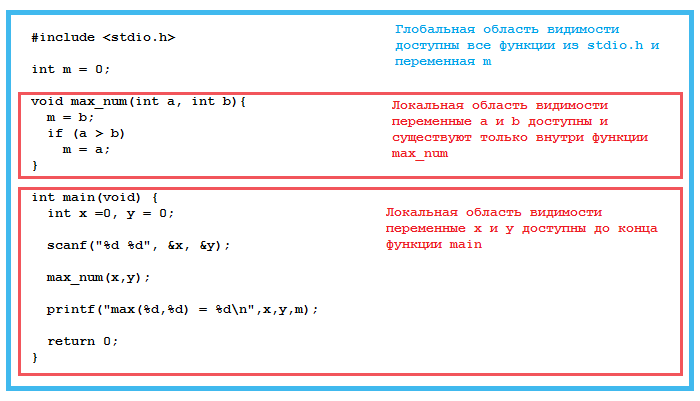
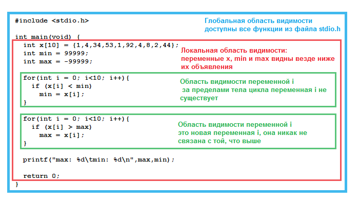

# Область видимости и время жизни переменных

Каждая переменная кроме имени, типа данных и значения имеет ещё одну характеристику -- `область видимости переменной`. Область видимости переменной -- это участок кода программы, в котором данная переменная доступна для использования.

Рассмотрим пример, написанный ранее.

Листинг 1.

```
#include <stdio.h>

int max_num(int a, int b){
  int max = b;
  if (a > b)
    max = a;

  return max;
}

int main(void) {
  int x =0, y = 0;
  int  m = 0;

  scanf("%d %d", &x, &y);

  m = max_num(x,y);

  printf("max(%d,%d) = %d\n",x,y,m);

  return 0;
}
```

В этом коде переменные `a`, `b` и `max` доступны для использования только внутри функции `max_num`. А переменные `x`, `y` и `m` -- внутри функции `main`. Область видимости этих переменных -- тело функции, в которой они объявлены. Это означает, к примеру, что мы не можем избавиться от переменной `max` внутри функции `max_num` и присваивать значение сразу переменной `m`. Т.е. вот такой код работать не будет:

Листинг 2.

```
#include <stdio.h>

void max_num(int a, int b){
  m = b;
  if (a > b)
    m = a;
}

int main(void) {
  int x =0, y = 0;
  int  m = 0;

  scanf("%d %d", &x, &y);

  max_num(x,y);

  printf("max(%d,%d) = %d\n",x,y,m);

  return 0;
}
```

Если вы попытаетесь его скомпилировать, то компилятор будет ругаться на несуществующую переменную `m` внутри функции `max_num`.

Решить эту проблему довольно просто. Достаточно объявить переменную `m` вне всех функций, сразу после директив препроцессора.

Листинг 3.

```
#include <stdio.h>

int m = 0;

void max_num(int a, int b){
  m = b;
  if (a > b)
    m = a;
}

int main(void) {
  int x =0, y = 0;

  scanf("%d %d", &x, &y);

  max_num(x,y);

  printf("max(%d,%d) = %d\n",x,y,m);

  return 0;
}
```

Переменные, объявленные таким образом, называются глобальными, т.к. доступ к ним возможен из любого места в этом файле (доступны глобально). Те переменные, которые мы использовали ранее, называются локальными, т.к. они доступны только в некоторых местах программы (доступны локально).



К локальным относятся также переменные, объявленные, например, внутри тела цикла. Возможно, вы замечали, что если в программе два цикла `for`, то в каждом из них счётчик может иметь имя `i` и объявляться в заголовке цикла.

Листинг 4.

```
#include <stdio.h>

int main(void) {
  int x[10] = {1,4,34,53,1,92,4,8,2,44};
  int min = 99999;
  int max = -99999;

  for(int i = 0; i<10; i++){
    if (x[i] < min)
      min = x[i];
  }

  for(int i = 0; i<10; i++){
    if (x[i] > max)
      max = x[i];
  }

  printf("max: %d\tmin: %d\n",max,min);

  return 0;
}
```

Дело как раз в области видимости и времени жизни локальных переменных. Каждый раз при создании цикла создаётся новая переменная с именем `i`. На протяжении всего тела цикла данная переменная доступна для использования, т.е. её область видимости -- это блок тело цикла. После того как цикл завершается, эта переменная удаляется из памяти. Её время жизни -- время работы цикла. Для переменных, объявленных внутри функции, время жизни переменных -- время выполнения данной функции.



Если нам не жалко ресурсов памяти, то мы могли бы сделать вот так:

Листинг 5.

```
#include <stdio.h>

int main(void) {
  int x[10] = {1,4,34,53,1,92,4,8,2,44};
  int min = 99999;
  int max = -99999;

  int i;

  for(i = 0; i<10; i++){
    if (x[i] < min)
      min = x[i];
  }

  for(i = 0; i<10; i++){
    if (x[i] > max)
      max = x[i];
  }

  printf("max: %d\tmin: %d\n",max,min);

  return 0;
}
```

В этом случае создаётся одна переменная `i`, которая в дальнейшем используется во всех циклах. Попробуйте добавить вывод на экран значения переменной `i` между циклами. В 4 листинге должна появиться ошибка, т.к. переменная `i` существует только внутри циклов, а в 5 листинге всё будет нормально и значение `i` будет равно 10.
