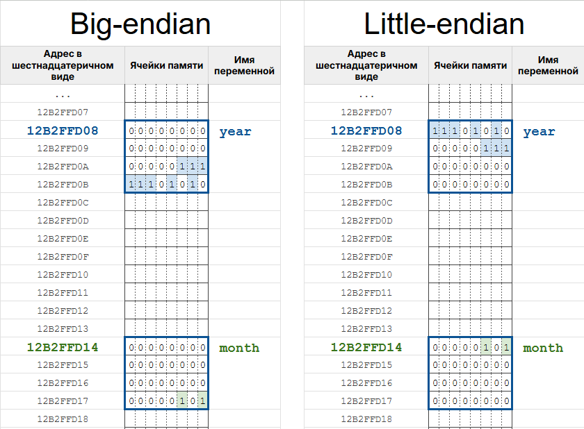

## Дополнительные материалы

**1.** При объявлении переменной-указателя будет работать любой из вариантов написания `*`:

```c
double pi = 3.1415926;

double *p_pi1 = &pi;
double * p_pi2 = &pi;
double* p_pi3 = &pi;
double*p_pi4 = &pi;
```

Чаще используют первый и второй варианты. 

**3.** Операторы `&` (взятие адреса) и `*` (обращение по адресу) -- взаимно обратные. Один берёт адрес переменной, другой по адресу возвращает саму переменную. Поэтому, применённые друг за другом, они "гасят" друг друга:

```c
int n = 5;

// &n     -- адрес переменной n
// *(&n)  -- то, что лежит по этому адресу, т.е. снова сама переменная n

*(&n) = 10; // то же самое, что n = 10;
printf("%d\n", *(&n)); // выведет 10, то же самое, что printf("%d\n", n);
```

Иными словами, `*(&n)` -- это всегда сам `n`. На практике так, конечно, не пишут (зачем брать адрес, чтобы тут же по нему обратиться?), но это удобный способ прочувствовать связь между двумя операторами.


**3.** Как было сказано в уроке, только переменные типа `char` занимают в памяти ровно одну ячейку (`1` байт), значения других типов, например, `int` занимают на большинстве систем уже `4` последовательных ячейки, т.е. четыре байта или `32` бита. И с этим связан один нюанс, о котором я хотел бы вам рассказать. 
Для примера рассмотрим двоичное представление чисел `5` и `2026`. Переведём их в двоичную систему счисления и дополним нулями, чтобы каждое из чисел состояло из 32 знаков. Для удобства я сделал разбивку по байтам-восьмёркам.
```
00000000 00000000 00000000 00000101 = 5
00000000 00000000 00000111 11101010 = 2026
``` 

Существует два подхода к тому, в каком порядке записывать байты, составляющие число, в память компьютера: =little-endian= и =big-endian=.

=Big-endian подход= предполагает, что сначала записывается самый старший байт (самая левая восьмёрка).
=Little-endian подход= подразумевает, что мы начинаем запись в ячейки с младшего байта (самая правая восьмёрка).

Т.е. сейчас у нас двоичные числа записаны в big-endian, это наиболее привычный для нас подход. В little-endian эти же числа выглядели бы следующим образом:
```
00000101 00000000 00000000 00000000 = 5
11101010 00000111 00000000 00000000 = 2026
```
Порядок байтов изменился на противоположный. 

Давайте изобразим оба подхода в той модели памяти, что мы использовали в уроке.

