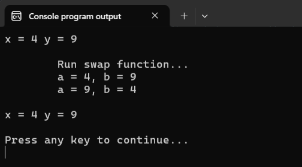
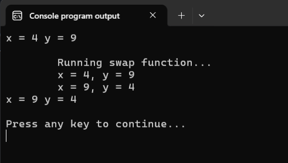

# Передача аргументов в функцию

В уроке про указатели мы разобрались с тем, что такое указатели и как они работают, какие возможности предоставляют программисту, но совершенно обошли стороной вопрос, а зачем вообще нужны указатели? 

Лишь в конце заметки я очень кратко упомянул, что через механизм указателей реализованы многие функции стандартной библиотеки языка Си. Но, конечно, область применения указателей этим не ограничивается. 

Вообще говоря, обсуждать зачем нужны указатели мы будем чуть ли не в каждом из оставшихся уроков. Но пока что я хочу зафиксировать следующий неполный вариант ответа. 

1. Язык Си и его стандартная библиотека буквально пронизаны работой с указателями. Поэтому если мы хотим пользоваться всеми возможностями, которые предоставляет нам язык и стандартная библиотека, а также действительно понимать, как это всё на самом деле работает, то нам нужно освоить концепцию указателей.

2. Язык Си устроен так, что без указателей невозможно написать даже некоторые довольно простые программы.

И чтобы не быть голословным, давайте попробуем решить следующую задачку.

> **Задача:** Напишите функцию `swap`, которая меняет местами значения двух передаваемых в неё целочисленных переменных.

Менять значения переменных местами мы научились ещё во втором уроке. Через дополнительную переменную это можно сделать, например, так:

Листинг 1. 
```c
int a = 10, b = 7;
int tmp;

tmp = a;
a = b;
b = tmp;

// теперь a = 7, b = 10
```

Осталось только обернуть этот код в функцию и дело в шляпе.

Листинг 2. 
```c
#include <stdio.h>

void swap(int a, int b)
{
        printf("\tRunning swap function...\n");
        printf("\ta = %d, b = %d\n", a, b);
        
        int temp;
        
        temp = a;
        a = b;
        b = temp;

        printf("\ta = %d, b = %d\n\n", a, b);
}

int main(void)
{
        int x = 4, y = 9;
        printf("x = %d y = %d\n\n", x, y);

        swap(x,y);
        printf("x = %d y = %d\n\n", x, y);

        return 0;
}
```

Для наглядности, я добавил в функцию дополнительные вызовы `printf`. 



Запустив эту программу, мы убедимся, что внутри функции `swap` значения переменных `a` и `b` меняются местами, т.е. функция работает правильно. Вот только это не оказывает никакого влияния на значения переменных `x` и `y`, которые мы передаём в функцию при её вызове.

Произошедшее ожидаемо, ведь как нам известно, в функцию передаются не сами переменные `x` и `y`, а лишь копии их значений. Эти копии помещаются в локальные переменные `a` и `b` и именно с ними работает функция. Напоминаю, что этот механизм называется =вызов функции с передачей значений= или =передача по значению=.

Возможны вы подумали, почему бы тогда не вернуть результат через инструкцию `return`? К сожалению, так сделать нельзя, т.к. инструкция `return` всегда возвращает только **одно** значение, а нам нужно изменить сразу **две** переменные `x` и `y`. Поэтому такой вариант не подходит.

К счастью, теперь мы умеем обращаться к переменным (а точнее к памяти, которая выделена под переменную) не только по их имени, но и по адресу.
Поэтому, если у нас получится (а у нас это точно получится) передать в функцию `swap` адреса переменных `x` и `y`, то уже внутри функции, обращаясь к памяти по этим адресам, мы сможем изменить значения, которые хранятся в этих переменных.

Что ж, давайте переписывать нашу функцию. Начнём с заголовка. Мы ожидаем получить адреса, а, следовательно, нам потребуются переменные-указатели. По условию задачи функция работает только с целочисленными переменными, значит нужны указатели на `int`, т.е. `int *`. Таким образом, прототип функции `swap` можно записать следующим образом:

Листинг 3. Прототип функции `swap`
```c
// void-функция swap принимает два указателя на `int`
void swap(int *p_x, int *p_y); 
```

Учитывая этот прототип, необходимо изменить и вызов функции. Раньше мы туда передавали переменные, а теперь нам нужно передать их адреса. Это мы делали уже сотни раз, используя оператор получения адреса `&`:

Листинг 4.
```c
// вызываем функцию swap с адресами переменных в аргументах
swap(&x, &y); 
```

Осталось только поменять значения переменных местами, используя указатели.

Листинг 5. Реализация функции `swap` на указателях
```c
void swap(int *p_x, int *p_y)
{
        printf("\tRunning swap function...\n");
        // p_x -- указатель на x, в нём хранится адрес x 
        // p_y -- указатель на y, в нём хранится адрес y

        // раз указатель p_x указывает на x,
        // то через *p_x мы можем обратиться к переменной x
        // чтобы получить её текущее значение 
        // или записать в неё новое значение
        // аналогично для p_y

        // используем *p_x и *p_y 
        // для вывода текущих значений переменных x и y на экран
        printf("\tx = %d, y = %d\n", *p_x, *p_y);
        
        int temp; // создаём временную переменную temp
        
        // сохраняем в temp текущее значение переменной x
        // текущее значение переменной x получаем через *p_x 
        temp = *p_x;

        // записываем в переменную x (обращаясь через *p_x) 
        // текущее значение переменной y
        // само текущее значение переменной y получаем через *p_y
        *p_x = *p_y;

        // записываем по адресу p_y значение из переменной temp
        *p_y = temp;
        
        // снова выводим текущие значения переменных x и y
        printf("\tx = %d, y = %d\n", *p_x, *p_y);
}
```

Если `p_x` -- это указатель на `x` (`p_x` указывает на `x` или в `p_x` хранится адрес `x`), то написать `*p_x` это по сути то же самое, что написать просто `x`. Как мы говорили ранее, что-то вроде временного "прозвища" переменной `x`. Можно обращаться по нему, если оно нам известно.

Соединим код из Листингов 3--5 в итоговую программу.

Листинг 6. Итоговая версия программы с функцией `swap`
```c
#include <stdio.h>

void swap(int *p_x, int *p_y)
{
        printf("\tRunning swap function...\n");
        printf("\tx = %d, y = %d\n", *p_x, *p_y);
        
        int temp; 
        
        temp = *p_x;
        *p_x = *p_y;
        *p_y = temp;
        
        printf("\tx = %d, y = %d\n", *p_x, *p_y);
}

int main(void) {

        int x = 4, y = 9;
        printf("x = %d y = %d\n\n", x, y);

        swap(&x, &y);
        printf("x = %d y = %d\n\n", x, y);

        return 0;
}
```



Давайте ещё раз проговорим, как работает эта программа.
В начале программы объявляются переменные `x` и `y`. Им присваиваются значения `4` и `9` соответственно. Затем происходит вызов функции `swap(&x, &y);`. В качестве аргументов ей подаются адреса переменных `x` и `y`. Копии этих адресов сохраняются в переменные-указатели `p_x` и `p_y`. 

% **Обратите внимание!** Механизм не изменился, мы всё ещё передаём функции копии аргументов. Никакой магии не произошло, **в функцию всегда передаются исключительно копии аргументов**. 
% 
% Но и исходный адрес и локальная копия этого адреса указывают на одно и то же место в памяти. А поэтому все дальнейшие манипуляции с этими адресами будут влиять на значение исходных переменных. 

Внутри функции `swap`, используя дополнительную переменную `temp`, значения, которые хранятся по этим адресам, меняются местами. После чего функция `swap` заканчивает свою работу.

% **Важно:** применять оператор `*` можно только к корректному адресу реально существующей переменной. Обращение по некорректному адресу является ситуацией неопределённого поведения.

Чтобы проиллюстрировать, как выглядит неопределённое поведение, давайте нарушим главное правило работы с указателями: будем обращаться по адресу, который не указывает на реальную переменную. Создадим указатели `ptr_x` и `ptr_y`, но один из них "забудем" направить на настоящую переменную. Типы аргументов при этом получатся верными, поэтому программа спокойно скомпилируется, но при запуске программы возникнет неопределённое поведение.

Листинг 7.
```c
#include <stdio.h>

void swap(int *p_x, int *p_y)
{
        printf("\tRunning swap function...\n");
        printf("\tx = %d, y = %d\n", *p_x, *p_y);
        
        int temp; 
        
        temp = *p_x;
        *p_x = *p_y;
        *p_y = temp;
        
        printf("\tx = %d, y = %d\n", *p_x, *p_y);
}

int main(void) {
        int x = 3, y = 7;

        int *ptr_x = NULL; 
        int *ptr_y = NULL;
        
        ptr_x = &x;
        // ptr_y = &y; // забыли сохранить адрес 

        // типы аргументов верные и программа компилируется без ошибок,
        // но в ptr_y -- "плохой" адрес (NULL)
        
        swap(ptr_x, ptr_y); // внутри swap при обращении *p_y 
                            // произойдёт неопределённое поведение

        return 0;
}
```

С этой же проблемой мы сталкивались, когда забывали добавить `&` при вызове `scanf`: писали `scanf("%d", x)` вместо `scanf("%d", &x)`. Функция примет значение `x` за адрес и попытается писать по нему.


Чтобы получше закрепить передачу адресов через аргументы функции и работу с указателями, давайте ещё немного отрефАкторим программу «Игральный кубик». В прошлый раз мы оставили её в следующем состоянии:

Листинг 8. Программа «Игральный кубик» v.3.5
```c
#include <stdio.h>
#include <stdlib.h>
#include <time.h>

void show_intro_screen(void);
void show_exit_screen(int runs, int sum);

int generate_dice_value(int dice_size);

int main(void)
{       
        const int DICE_SIZE = 6;   // количество граней у кубика      
        int total_runs = 0,     // количество бросков
            sum_results = 0,    // сумма очков за всю игру
            cmd,                // текущая команда 
            value;              // текущее значение на кубике

        srand(time(NULL));
        show_intro_screen();

        do {
                printf("Enter command: ");
                scanf("%d", &cmd);
                
                switch (cmd) {
                        case 0: 
                                show_exit_screen(total_runs, sum_results);
                                break;
                        
                        case 1:         
                                value = generate_dice_value(DICE_SIZE);
                                printf("Result: %d\n", value);

                                total_runs += 1;        
                                sum_results += value;
                                break;
                        
                        default:
                                printf("Error! Try again...\n");
                                break;
                }

        } while (cmd != 0); 

        return 0;
}


int generate_dice_value(int dice_size)
{
        return 1 + rand() % dice_size;
}


void show_intro_screen(void)
{
        printf("#########  Devil\'s bones   #########\n"
               "#                                   #\n"
               "#   Commands:                       #\n"
               "#                                   #\n"
               "#   1 - new game                    #\n"
               "#   0 - exit                        #\n"
               "#                                   #\n"
               "#####################################\n\n");
}


void show_exit_screen(int runs, int sum)
{
        printf("\nGood bye!\n");
    
        printf("Total number of die rolls: %d\n", runs);
        printf("Sum of all die rolls: %d\n", sum);
}
```

Сейчас ветка `case 1:` выглядит как-то нагруженно по сравнению с двумя другими ветками. Давайте её содержимое тоже вынесем в отдельную функцию. 

В этой ветке мы обрабатываем очередной бросок игрального кубика:
- генерируем значение, выпавшее на кубике;
- выводим его на экран;
- изменяем значения статистических переменных;

Вот и создадим функцию `process_dice_roll`, которая будет решать эту задачу. 

Что будет её аргументами? Во-первых, конечно, переменная `DICE_SIZE`. Ведь нам потребуется вызвать функцию `generate_dice_value`, чтобы сгенерировать значение, выпавшее на кубике, а ей для работы требуется эта переменная.
Во-вторых, нам будут нужны переменные `rolls_count` и `total_score`, т.к. в них мы храним статистику игры. Причём даже не сами переменные, а их адреса в памяти, т.к. внутри этой функции нам нужно будет их изменять, поэтому копии здесь не проканают. 

Будет ли функция `process_dice_roll` возвращать какое-либо значение? Да вроде бы нет. Значит тип возвращаемого значения будет `void`. Итак, получаем следующий прототип функции:

Листинг 9. Прототип функции `process_dice_roll` 
```c
void process_dice_roll(int dice_size, int *p_rolls_count, int *p_total_score);
```

Что ж, давайте напишем реализацию этой функции.

Листинг 10: Реализация функции `process_dice_roll`
```c
void process_dice_roll(int dice_size, int *p_rolls_count, int *p_total_score)
{
        int value = generate_dice_value(dice_size);
        printf("Result: %d\n", value);

        // p_rolls_count указывает на rolls_count
        // значит для обращения к самой rolls_count
        // используем "прозвище" *p_rolls_count 
        *p_rolls_count += 1; // увеличиваем текущее значение rolls_count на 1
                             // через обращение по адресу из указателя


        // p_total_score указывает на total_score
        // значит для обращения к самой total_score
        // используем "прозвище" *p_total_score
        *p_total_score += value; // увеличиваем текущее значение total_score 
                                 // на value, выпавшее на кубике
                                 // обращаемся не напрямую, а через адрес

}
```

Итоговый вариант программы представлен в следующем листинге.

Листинг 11: Программа «Игральный кубик» v.3.6
```c 
#include <stdio.h>
#include <stdlib.h>
#include <time.h>

void show_intro_screen(void);
void show_exit_screen(int rolls_count, int total_score);

int generate_dice_value(int dice_size);
void process_dice_roll(int dice_size, int *p_rolls_count, int *p_total_score);

int main(void)
{       
        const int DICE_SIZE = 6; // количество граней у кубика
        int rolls_count = 0,     // количество бросков
            total_score = 0,     // сумма очков за всю игру
            cmd;                 // текущая команда 

        srand(time(NULL));
        show_intro_screen();

        do {
                printf("Enter command: ");
                scanf("%d", &cmd);
                
                switch (cmd) {
                        case 0: 
                                show_exit_screen(rolls_count, total_score);
                                break;
                        
                        case 1:         
                                process_dice_roll(DICE_SIZE, &rolls_count, &total_score); 
                                break;
                        
                        default:
                                printf("Error! Try again...\n");
                                break;
                }

        } while (cmd != 0); 

        return 0;
}


void process_dice_roll(int dice_size, int *p_rolls_count, int *p_total_score)
{
        int value = generate_dice_value(dice_size);
        printf("Result: %d\n", value);

        *p_rolls_count += 1;
        *p_total_score += value;
}


int generate_dice_value(int dice_size)
{
        return 1 + rand() % dice_size;
}


void show_intro_screen(void)
{
        printf("#########  Devil\'s bones   #########\n"
               "#                                   #\n"
               "#   Commands:                       #\n"
               "#                                   #\n"
               "#   1 - new game                    #\n"
               "#   0 - exit                        #\n"
               "#                                   #\n"
               "#####################################\n\n");
}


void show_exit_screen(int runs, int sum)
{
        printf("\nGood bye!\n");
    
        printf("Total number of die rolls: %d\n", runs);
        printf("Sum of all die rolls: %d\n", sum);
}
```

Ну вот, теперь ветка `case 1:` не выглядит каким-то инородным вкраплением, а мы написали ещё одну собственную функцию. 

Обратите внимание, что попутно мы избавились ещё и от переменной `value` в функции `main`. Теперь она живёт исключительно внутри функции `process_dice_roll`, где ей самое подходящее место, ведь только там она действительно нужна и используется. 

