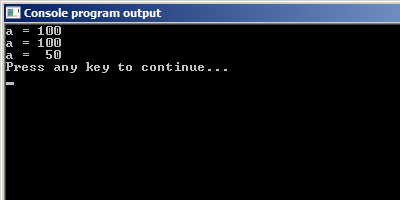
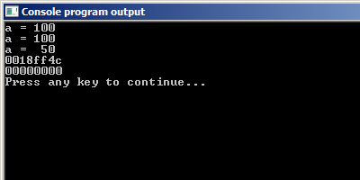

# Указатели в Си

`Указатель` -- переменная, в которой хранится адрес какого-либо объекта в памяти компьютера, например, другой переменной. Мы уже сталкивались раньше с адресами переменных, когда изучали функцию `scanf`.

Итак, пойдём по порядку. Объявление указателя.

Объявление указателя отличается от объявления переменной только добавлением символа `*` после названия типа.

Примеры:

Листинг 1.

```c
int * p_g;    // указатель на переменную типа int
double * p_f; // указатель на переменную типа double
```

Присвоить указателю какой-то адрес можно, используя оператор присваивания. Примеры:

Листинг 2.

```c
int n = 100;
double PI = 3.1415926;

int * p_k;     // указатель на переменную типа int
double * p_pi; // указатель на переменную типа double

p_k = &n;      // получаем адрес переменной n и присваиваем его указателю p_k
p_pi = &PI;    // получаем адрес переменной PI и присваиваем его указателю p_pi
```

Для вывода значения указателя на экран нужно в функции `printf` использовать спецификатор `%p`. Пример:

Листинг 3.

```c
printf ("Address of the variable PI %p\n", p_pi);
```

Используя адрес переменной, который хранится в указателе, можно изменять значение этой переменной. Для этого используется операция разыменования `*`. Вот посмотрите на пример:

Листинг 4.

```c
#include <stdio.h>

int main(void) {
  int a = 100;
  int * p_a = &a; // сохраняем в указатель адрес переменной a
  printf("a = %d\n", a); // стандартный способ получить значение переменной a
  printf("a = %d\n", *p_a); // получаем значение переменной a через указатель на неё

  // используя указатель p_a, записываем в переменную a другое значение
  *p_a = 50;

  printf("a =  %d\n", *p_a);
  return 0;
}
```




Итого, `*` применительно к указателям используется в двух случаях:

- при объявлении указателя, чтобы показать, что это указатель;
- если мы хотим обратиться к переменной, на которую указывает указатель.

Есть еще, так называемый,  `нулевой указатель NULL`. Нулевой указатель не ссылается никуда. Он используется, чтобы обнулять указатели. Посмотрите на пример.

Листинг 5.

```c
#include <stdio.h>

int main(void) {
  int a = 100;
  int * p_a = &a; // сохраняем в указатель адрес переменной a
  printf("a = %d\n", a); // стандартный способ получить значение переменной a
  printf("a = %d\n", *p_a); // получаем значение переменной a через указатель на неё

  // используя указатель p_a, записываем в переменную a другое значение
  *p_a = 50;

  printf("a =  %d\n", *p_a);

  printf("%p\n", p_a);
  p_a = NULL;
  printf("%p\n", p_a);

  return 0;
}
```


