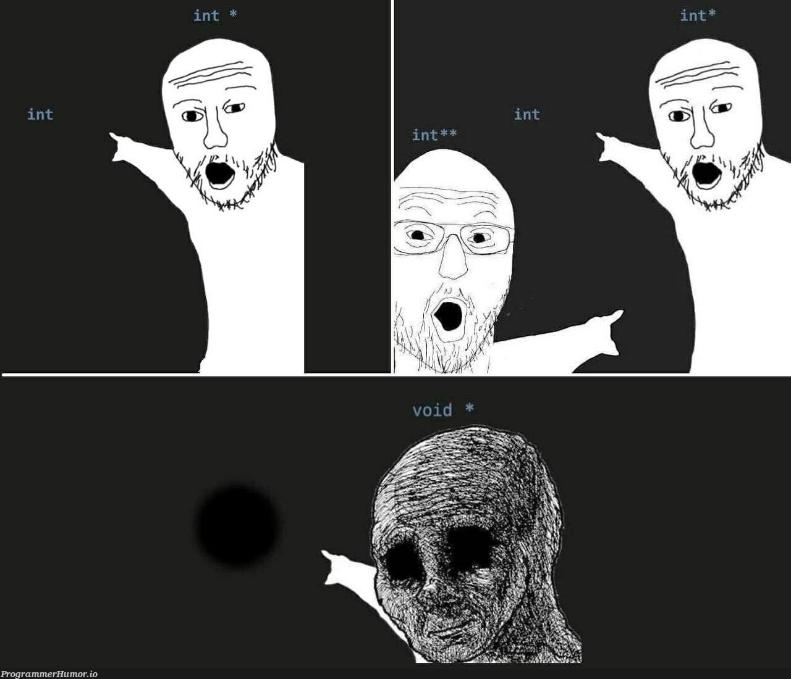

## Практика

- Решите [задачи с автоматической проверкой решения на Stepik](https://stepik.org/lesson/65151/step/1)

    <iframe src="https://stepik.org/lesson/65151/step/1"></iframe>

- Попробуйте скомпилировать программу из Листинга 5. Что об этом думает ваш компилятор? Напишите в комментариях к этому уроку с указанием названия и версии компилятора.

### Исследовательские задачи для хакеров

**1.** Раз указатель -- это в первую очередь переменная, то значит и у него есть собственный адрес в памяти. Дополните Листинг 3 таким образом, чтобы на экран выводился не только адрес переменной `age`, но и адрес указателя `p_age`. 

**2.** Попробуйте сохранить указатель, полученный в прошлом задании, в отдельную переменную-указатель. Какой тип данных будет у этой переменной? Как по такому указателю изменить данные в исходной переменной `age`?

**3.** Разберитесь самостоятельно, что такое =указатель на `void`= (`void *`).