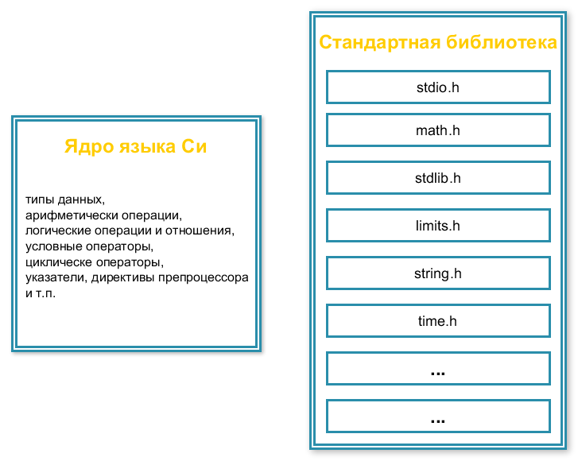

# Стандартная библиотека языка Си

В прошлых уроках мы изучили много различных стандартных функций. Большинство из них становились доступны, когда мы подключали в программу определенный заголовочные файлы, наприимер `stdio.h`, `math.h` или `string.h`. Они входят в состав стандартной библиотеки языка Си. Кроме них есть другие заголовочные файлы, которые включены в стандартную библиотеку языка Си, например, из используемых нами ранее `stdlib.h` и `time.h`.

`Стандартная библиотека языка Си` -- это набор отдельных файлов, которые расширяют возможности языка Си. Например, как мы уже отмечали ранее, добавление к нашей программе файла `math.h` позволяет использовать различные математические функции. Добавление `stdio.h` позволяет взаимодействовать программе с внешним миром (читать/выводить данные).

Схематично можно представить себе язык программирования Си как набор отдельных законченных модулей. Условно эта структура изображена на следующем рисунке.

По факту язык Си самостоятельно, без функций стандартной библиотеки, почти ничего не может. Даже вывести значение переменной на экран. Но благодаря дополнительным модулям (стандартным заголовочным файлам) возможности языка могут быть существенно расширены. А если какие-то возможности не нужны, то они не будут включены в итоговую версию программы.

Модульный подход получил широкое распространение в программировании. Основные плюсы:

- модули между собой независимы и каждый из них может разрабатываться/меняться отдельно от других модулей и всей программы в целом;
- возможность самостоятельно подключать необходимые модули;
- возможность расширения функционала за счёт добавления/написания нового модуля.

Модули могут быть реализованы, например, в виде отдельных заголовочных файлов или отдельных файлов с кодом. Каждый модуль должен решать какие-то свои задачи. Модуль можно представить себе как «чёрный ящик». У него есть две основных части: интерфейс взаимодействия с модулем (сколько и каких данных поступает в чёрный ящик и какие данные им возвращаются) и внутренняя реализация модуля (содержимое чёрного ящика).

Если рассматривать отедельную функцию языка Си как модуль, то интерфейсом является заголовок или прототип функции. Он полностью описывает, что необходимо функции для работы: какого типа данные нужны, в каком порядке их надо передавать, в каком количестве и т.д., а также какие данные функция возвращает. Тело функции при этом является реализацией модуля.

Кстати, что касается стандартной библиотеки языка Си. Если вы ещё не пробовали искать у себя на компьютере заголовочные файлы, то попробуйте. Внутри них только прототипы функций, а самой реализации нет. Т.е. по факту в заголовочных файлах содержится только интерфейс модуля или по-другому API(`Application Programming Interface`, чит. эй-пи-ай, иногда по-русски произносят апи), а сами реализации от программиста скрыты и находятся уже в отдельных, скомпилированных библиотечных файлах.

Использование `API` -- тоже широко распространённая практика. Многие сервисы предоставляют свой открытый `API`. Например, платформа Stepic, которую я использую для автоматической проверки задач, или сайт Вконтакте. Т.е. по сути данные сайты выкладывают в открытый доступ ([vk](https://dev.vk.com/reference), [Stepic](https://stepik.org/api/docs/)) описание различных функций, которые я могу использовать в своих программах. Именно на использовании `API` строится разработка различных сервисов и приложений для работы с различными платформами.