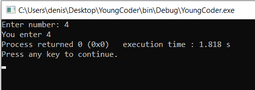
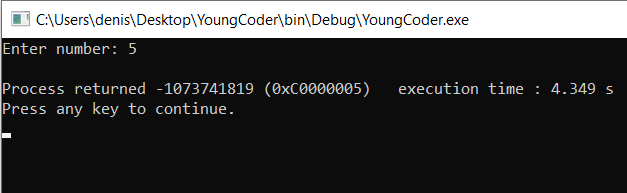
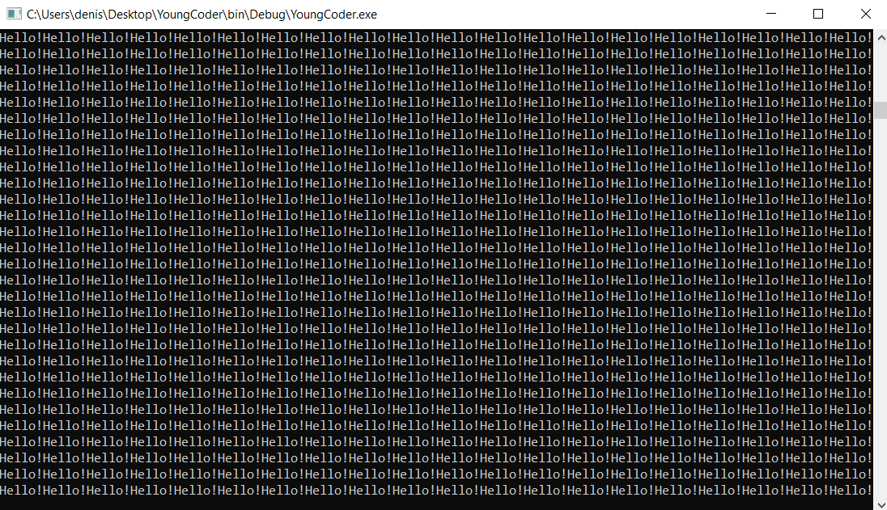
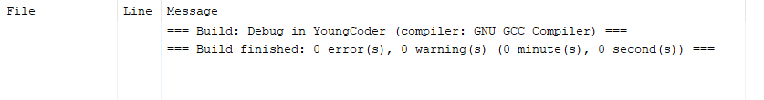
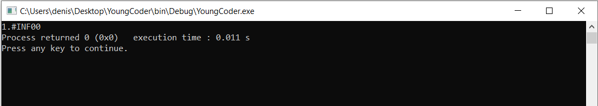
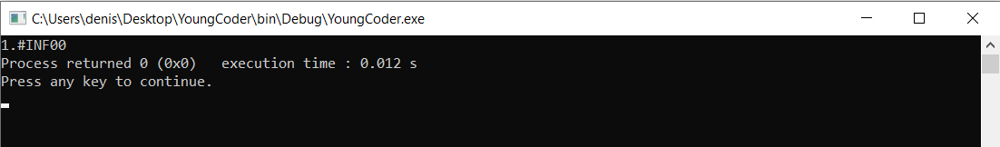
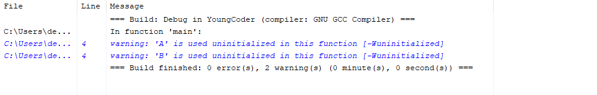

# Поговорим об ошибках
Признайтесь, наверняка у вас возникали ошибки в программе или она давала не тот результат, который ожидали? Если нет, то будет довольно часто, и это нормально. Главное, знать ответ на 2 вопроса:
- что это за ошибка;
- как её найти.

И в этом уроке я научу вас знать врага в лицо.

## Распространённые ошибки
Прежде чем начать искать ошибку, нужно для начала понять, что эта ошибка из себя представляет. Как правило, это уже половина пути к нахождению ошибки.
Рассмотрим самые распространённые ошибки.

### 1. Синтаксические ошибки
Довольно популярные ошибки. У языка программирования есть строгий синтаксис, которого нужно придерживаться. Как правила в русском языке. Разница между нами и компьютером лишь в одном: если мы допустим ошибку в слове, мы скорее всего сможем понять собеседника, а если допустить синтаксическую ошибку в программе - компьютер падёт в ступор. Например, мы уже знаем, что после каждой инструкции в конце должна стоять точка с запятой. Её отсутствие - ошибка. Тоже самое касается, если отсутствует парная скобка. Давайте посмотрим, что скажет компилятор, если мы забудем точку с запятой.

Листинг 1. Отсутствие точки с запятой
```c
#include <stdio.h>
#include <stdlib.h>

int main()
{
printf("Hello world!\n")
return 0;
}
```

И вот реакция компилятора


Он точно определил причину - ожидается точка с запятой. Более того, он даже сказал на какой строчке ошибка. Красота, не правда ли? А теперь давайте теперь удалим фигурную скобку

Листинг 2. Отсутствие фигурной скобки
```c
#include <stdio.h>
#include <stdlib.h>

int main()

printf("Hello world!\n");
return 0;
}
```

И вот что он выдал


Белеберда какая-то, да? Компилятор - это просто программа, которая переводит код в текст, понятный компьютеру. Она не знает наших намерений, не знает о чём мы пишем и может только предполагать. Такое исправить уже будет немного сложнее, но всё таки со своей задачей он справился: указал, что в коде что-то не так.

### 2. Segmentation fault

В переводе на русский - "ошибка сегментации". Тоже популярная ошибка. Когда наша программа запускается - ей необходимо место в памяти для работы. И компьютер выделяет ей определённый кусок. В частности, в этом куске хранятся наши переменные и значения в них. Если наша программа попытается что то изенить в другой области памяти - компьютер просто "вырубит" её. Например, давайте посмотрим, что будет, если забыть знак амперсанда в `scanf`? Сейчас не будем углубляться во взятие адреса, вы узнаете об этом ближе к концу курса. Просто нужно понимать, что, когда мы убираем знак амперсанда, мы отправляем не адрес переменной, а её значение, которое разумеется с адресом не совпадает. Кстати, такая ошибка ещё часто возникает если выйти за предела массива. Не знаете что такое массив? Скоро узнаете. Намучаетесь ещё :)

Сделаем простой код, который запрашивает цифру и затем выводит её. Такая программа приведена в листинге 3.

Листинг 3. Запрос и вывод цифры
```c
#include <stdio.h>

int main()
{
    int number = 0;
    printf("Enter number: ");
    scanf("%d", number);
    printf("You enter %d", &number);
    return 0;
}
```

А вот результат работы программы



Строка `Process returned 0` означает, что программа вернула 0. Ноль является признаком безаварийного завершения работы программы. Мы ведь не зря пишем `return 0`, не так ли? Вот она ноль и возвращает. А теперь уберём знак амперсанда

Листинг 4. Отсутствие знака амперсанда
```c
#include <stdio.h>

int main()
{
    int number = 0;
    printf("Enter number: ");
    scanf("%d", number);
    printf("You enter %d", &number);
    return 0;
}
```

А вот результат компиляции


Приглядитесь, компилятор свою работу сделал и ошибок не выдал. Какие то предупреждения. Ну, предупреждения - не ошибки. Давайте запустим программу.



И что мы видим? Мы ввели число, а программа взяла и завершилась. Причём заметьте - программа вернула не ноль, а какое то большое число, а значит завершилась аварийно. Помните, я говорил, что если обратиться не в свою область памяти и начать там хозяйничать, то компьютер просто вырубит нашу программу, чтобы мы не натворили делов? Так и произошло. 
Вы спросите: "Но как же так? Компилятор ошибок не вывел, просто предупреждения". Да, ошибок действительно не было. Но всё-таки всегда нужно помнить - компилятор это просто программа. Не все ошибки очевидны и она не может вам точно заявить ошибка это или нет. Она заметила что-то необычное и предупредила, а как действовать на это предупреждение - решать программисту. Но, как видите, лучше на все предупреждения реагировать.

### 3. Time limit exeed

Ошибка, означающая превышение лимита времени (если он установлен), либо по простому - зависание программы. Из за чего это происходит? Код программы построен так, что во время его выполнения программа не может двигаться дальше и дойти до конца кода. Обычно такое происходит в циклах (о них вы узнаете позже). В цикле есть условие выхода из него, и если его написать так, чтобы оно выполнялось всегда, то программа будет "замкнута". Посмотрим на самый простой код, закольцовывающий программу.

Листинг 5. Бесконечная программа
```c
#include <stdio.h>

int main()
{
    while(2>1){
        printf("Hello!");
    };
    return 0;
}
```

То, что внутри фигурчных скобок - вывод слова **Hello!** - будет выполняться, пока условие 2>1 истинно. Программа выведет **Hello**, а потом посмотрит на условие. Если оно опять истинно, то выполнит код в фигурных скобках ещё раз. Потом опять проверит условие и пошло поехало. Очевидно, что двойка всегда будет больше единицы, стало быть и код в фигурных скобках будет раз за разом выполняться.

Кстати, давайте посмотрим на итоги компиляции


Хм, не ошибок, не предупреждений? Компилятор не заметил ничего необычного - никаких синтаксических ошибок нет. На самом деле, бесконечный цикл это не всегда ошибка. Коды игр часто используют бесконечный цикл, только лишь с одним отличием: в нём всегда предусмотрено условие для выхода, например, если Вы нажмёте клавишу **Esc**. 
Ну а теперь давайте запустим код и посмотрим как себя будет вести компьютер



В общем то логично. Программа просто будет бесперестанно выводить слово **Hello!** 

### 4. Floating point exception

В переводе на русский язык - исключение с плавающей точкой. Звучит мудрёно, но на самом деле ничего сложного. Такая ошибка возникает при выполнении недопустимой арифметической операции с вещественными числами. Какое самое популярное арифметическое табу вы знаете? Правильно, деление на ноль конечно. Давайте состряпаем простенький код с делением на ноль

Листинг 6. Деление на ноль
```c
#include <stdio.h>

int main()
{
    float number = 24;
    printf("%f",number/0);
    return 0;
}
```

Вот результат работы компилятора


Да, он небезнадёжен и сразу догадался, что мы что то затеяли. Давайте немного переделаем код.

Листинг 7. Деление на ноль 2
```c
#include <stdio.h>

int main()
{
    float number = 24;
    float zero = 0;
    printf("%f",number/zero);
    return 0;
}
```

Что теперь говорит компилятор?



Ничего. Это очень показательный пример. Мы никак не поменяли принцип работы программы -- она всё так же делит число на ноль, однако в этом случае компилятор не смог отловить ошибку.
Ну и результат работы программы



Реакция деления на ноль отображается как **INF** -- от английского "infinum" - бесконечность. 
Ещё один способ вызвать подобную ошибку -- записать в переменную число, существенно превышающее "вместимость" типа числа. Листинг ниже демонстрирует это

Листинг 8. Превышение размерности типа
```c
#include <stdio.h>

int main()
{
    float num = 9999999999999999999999999999999999999999.;
    printf("%f",num);
    return 0;
}
```

Я написал точку в конце числа чтобы сделать число вещественным. И затем вещественное число присваиваю в переменную вещественного типа.
Компилятор ошибок не видит


Ну а вывод аналогичен делению на ноль



Кстати, иногда при неправильных арифметических действиях можно встретить вот такой текст: **-nan**. Он означает "Not A Number" -- "не число". В этом случае программа вообще не может представить что получается в результате.

### 5. Отсутствие инициализации

Объявление - создание переменной с определённым типом данных и именем. Иницициализация - присвоение какого-либо значения переменной при объявлении. Давайте сразу перейдём к листингу.

Листинг 9. Отсутствие инициализации
```c
#include <stdio.h>
int main() {
    int A, B;
    printf("%d", A+B);
}
```

Посмотрим, что говорит компилятор



Компилятор молчит. Что ж, тогда проверим работу программу. Как думаете, какой результат будет?


Неожиданно, правда? Почему именно 16? Откуда оно вообще взялось? Давайте разбираться.

Когда мы создаём переменную -- ей выделяется какое-то место в памяти. Давайте для определённости назовём её **NUM** и значение у неё будет 16. Чтобы компьютер смог найти эту переменную у неё есть свой адрес. Помните про амперсанд в `scanf`? Когда мы что-то считываем с потока ввода, мы как раз идём по адресу переменной и кладём в неё значение. Так вот, когда наша программа завершится -- все переменные удалятся, они ведь больше не нужны, зачем место занимать? Но теперь внимание: что значит "удалятся"? Это очень важный момент. На самом деле, компьютер просто "забывает" адрес для этой переменной. То есть, он просто считает, что по этому адресу пусто, там свободное место и если необходимо -- его можно будет выделить для другой переменной.

А теперь мы запускаем нашу программу из листинга выше. В программе объявление переменной. Компьютеру нужно где-то её "поселить", выделить ей адрес. И пусть он выделяет её тот же адрес, что был у переменной, о которой мы говорили. Там же пусто? По крайней мере, компьютер не помнит, чтобы этот адрес кому-то принадлежал. Но какое значение будет в нашей переменной **А**? Мы ведь ничего в неё при создании не присвоили, инициализации не было. Так вот. В ней будет значение, которое лежало по этому адресу до неё. По этому адресу раньше находилась переменная **NUM** со значением 16.

Компьютер адрес забыл, а значение осталось. Этот же адрес перешёл другой переменной **А**. Ну а раз мы ей значение не придали -- она просто взяла себе то, что уже здесь лежало по этому адресу.

Отсутствие инициализации является частным случаем так называемого неопределённого поведения программы. Неопределённое поведение -- это такая ситуация, при которой вы не можете предсказать поведение программы, как, например, не могли предсказать значение переменной А предыдущем листинге.

Что ж, хорошо. С наиболее популярными ошибками мы разобрались и теперь знаем из-за чего они могут быть. А как найти эту ошибку в коде? Научимся этому в следующем уроке.
