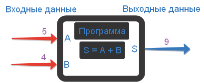

# Понятие переменной в языке программирования. Программа как "чёрный ящик"

Одно из самых важных понятий в программировании -- =переменная=. Давайте разбираться, что это такое и зачем это нужно.

В принципе, любая мало-мальски сложная программа работает по следующему принципу:
* получает какие-то данные;
* обрабатывает их;
* возвращает результат своей работы.

> Пример 1: Программа сложения двух чисел
>
> **Входные данные:** два произвольных числа
> **Выходные данные:** одно число -- сумма двух чисел, поступивших на вход

Давайте пока не будем особо задумываться о том, как программа будет устроена внутри. Сейчас нам важно только то, какие данные программа получает на входе и какие данные возвращает на выходе. Подобное представление о работе программы, когда мы отвлекаемся от внутреннего устройства программы (или любой другой системы), называется =модель чёрного ящика"= Понятно, что данный подход можно применять не только в программировании.

Раз все программы так или иначе работают с данными, значит, эти данные нужно где-то хранить. Программы мы пишем для компьютера, поэтому все данные хранятся в памяти компьютера. И вот мы плавно подходим к главному понятию этой заметки.

=Переменная= -- область в памяти компьютера, которую мы называем некоторым именем и используем для хранения данных.

Чтобы у вас сформировался зрительный образ, давайте проведём аналогию между памятью компьютера и стеллажом с одинаковыми коробками.

Вот он, перед вами:

Согласитесь, что в таком стеллаже будет сложно найти коробку с нужной вещью. Особенно, если вы положили её туда достаточно давно. Даже если бы коробки были пронумерованы. Всё равно номер нужной коробки через год несомненно выветрился бы из нашей памяти. Но решить эту проблему довольно легко, и не надо даже быть программистом или знать хоть что-нибудь о переменных. Решение очевидное -- надо подписать коробки.

Вот это совсем другое дело. Ничего не потеряется и не забудется. Вы всегда знаете, где и что у вас лежит, если, конечно, кто-то не совершил мини-диверсию на вашу систему хранения и не поменял наклейки или содержимое коробок местами. ;)

А теперь вернёмся к программам и компьютерам. Когда программист пишет программу ему приходится работать с десятками и даже сотнями таких коробочек. Первые программисты принимали муки и работали с коробочками, которые не были подписаны. Вместо имён у них были только номера. Представляете, какая это была морока?

Но довольно быстро и программисты сообразили, что если "коробочкам" давать осмысленные имена, то работать с ними будет гораздо проще. Так вот и появились переменные.

Конечно аналогия со стеллажами и коробками не совсем точна. Между переменной и обычной коробочкой имеется ряд важных отличий, о которых мы поговорим в следующих разделах этого урока. Но моя цель была в том, чтобы у вас сложилось первое представление о том, что такое переменная. Надеюсь, что так оно и есть.

Учитывая описанную интерпретацию, нетрудно сообразить, что программе из Примера 1 хорошо бы иметь три коробочки: две для хранения слагаемых и ещё одну для хранения их суммы. Давайте сразу дадим им имена, например: `A`, `B` и `S`, соответственно.

