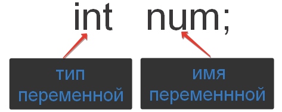
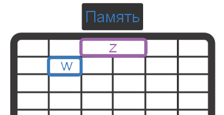

# Переменные в языке Си. Объявление переменной в Си

Чтобы хранить в своей программе какие-либо данные, вам понадобятся переменные. Прежде всего, нужно научиться эти переменные в программе создавать. Другими словами, вспоминая нашу аналогию с коробками, чтобы в коробку что-то положить, её, эту самую коробку, хорошо бы сначала где-нибудь раздобыть.

В книжках по программированию процесс создания переменной называют `объявлением переменной`. Это словосочетание хорошо бы знать, чтобы понимать профессиональную литературу и речь других программистов. Но ещё более важно понимать, что за этим словосочетанием скрывается.

## Как объявить переменную?
Для того чтобы объявить переменную, необходимо указать её тип и записать её имя. Ну и не забыть поставить `;`. Общая стуктура объявления переменной показана на следующем рисунке.



В примере на рисунке мы создаём переменную с именем `num`, в которой можно будет хранить целые числа. На то, что мы собираемся использовать переменную для хранения целых чисел, указывает тип данных `int`.

Ещё парочка примеров:

Листинг 1. Объявление переменных
```
int z;  // переменная z  целого типа
char w; // переменная w символьного типа
```

Для имён переменных есть одно правило, которое надо будет запомнить.

В качестве имени переменной может выступать любая последовательность символов латинского алфавита, цифр и знака нижнего подчеркивания `_`, которая начинается с буквы.

На самом деле, на имя переменной есть дополнительные ограничения, но мы пока в такие детали вдаваться не будем. Давайте лучше посмотрим на примеры допустимых и недопустимых имён.

Допустимые имена переменных
```
Peremennaya, flag, f3, var4, KolichestvoBukv, fd4s, FLaG, key_number
```

Недопустимые имена переменных
```
2num // начинается с цифры
number flat // содержит пробел в имени
nomer-telefona // содержит дефис
```

И ещё один важный момент. В языке программирования Си регистр букв очень важен. Например, переменные с именами `flag`, `FLAG`, `FlAg`, `fLAg` -- это всё различные переменные. Кроме того, есть ряд слов, которые нельзя использовать для названия переменных. Например, `int`, `void`, `return` и другие. Это специальные ключевые слова, которые зарезервированы для нужд самого языка и нигде в другом месте не могут быть использованы.

Кстати, за одно объявление можно создать сразу несколько переменных одного типа.

Листинг 2. Объявление нескольких переменных
```
int a, c; // объявляем переменные a и c целого типа
double x, y, z; // объявляем сразу три вещественные переменные
```

Всё просто и логично. Сначала указывает тип переменных, а потом их имена, разделённые запятой.

## Переменная в памяти компьютера.
Пару слов о том, как выглядит объявление переменной с точки зрения компьютера.

Можно считать, что при объявлении мы сообщаем компьютеру, чтобы он выделил под переменную место в памяти и связал это место определенным именем. Количество места, которое будет выделено в памяти для хранения переменной, зависит от типа этой переменной. Проиллюстрируем эту мысль следующим рисунком.

Листинг 3. Объявление двух переменных
```
int w; // объявляем целочисленной переменной w
double z; // объявляем вещественной переменной z
```



На рисунке условно изображена память компьютера как набор ячеек, в каждой из которых может что-то храниться. При этом вещественная переменная занимает две ячейки, а целочисленная всего одну. Это соотношение (два к одному) условное. На самом деле, в вашем компьютере переменная вещественного типа может занимать, например, в четыре раза больше места в памяти, чем целочисленная переменная.