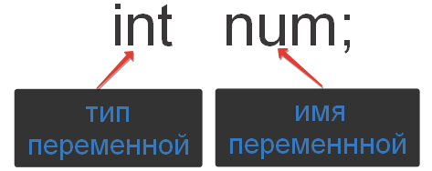
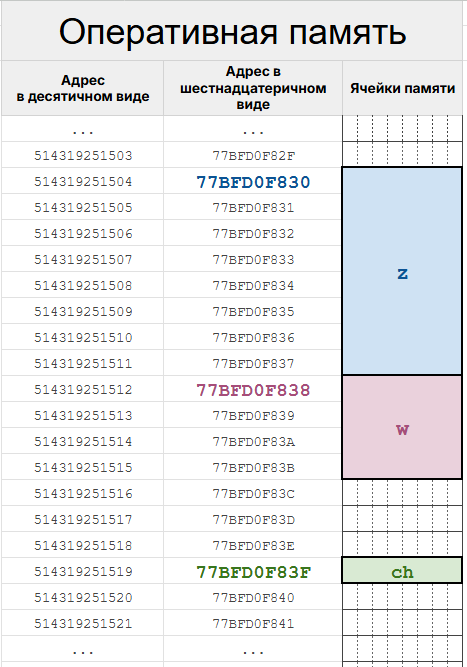

# Переменные в языке Си. Объявление переменной в Си

Теперь мы знаем, что для хранения в программе каких либо-данных, нам потребуются переменные. Тогда, прежде всего, нужно научиться эти переменные в программе создавать. Другими словами, вспоминая нашу аналогию с коробками, чтобы в коробку что-то положить, её, эту самую коробку, хорошо бы сначала где-нибудь раздобыть.

В книжках по программированию процесс создания переменной называют =объявлением переменной=. Это словосочетание хорошо бы знать, чтобы понимать профессиональную литературу и речь других программистов. Но ещё более важно понимать, что за этим словосочетанием скрывается.

## Как объявить переменную?
Для того чтобы объявить переменную (создать переменную в программе), необходимо, в самом простейшем случае, указать:
- тип данных, которые будут храниться в переменной;
- имя переменной. 

И, конечно, не забыть поставить `;` в конце объявления.  

Общая структура объявления переменной показана на следующем рисунке.



В примере на рисунке мы создаём переменную с именем `num`, в которой можно будет хранить целые числа. На то, что мы собираемся использовать переменную для хранения целых чисел, указывает тип данных `int`.

Вот ещё парочка примеров:

Листинг 1. Объявление переменных
```c
int z;  // переменная z для хранения целых чисел
char w; // переменная w для хранения символов
```

Для имён переменных есть одно правило, которое надо будет запомнить.

% **Важно:**
В качестве имени переменной может выступать любая последовательность символов латинского алфавита (`a-z` и `A-Z`), цифр (`0-9`) и знака нижнего подчеркивания `_`, которая начинается с буквы или подчёркивания, но не с цифры.

На самом деле, на имя переменной есть дополнительные ограничения, но мы пока в такие детали вдаваться не будем. Давайте лучше посмотрим на примеры допустимых и недопустимых имён.

Допустимые имена переменных
```c
a, Peremennaya, flag, _temp, f3, var4, 
KolichestvoBukv, fd4s, FLaG, key_number
```

Недопустимые имена переменных
```c
2num // начинается с цифры
number flat // содержит пробел в имени
nomer-telefona // содержит дефис
```

И ещё один важный момент. В языке программирования Си **регистр букв очень важен**. Например, переменные с именами `flag`, `FLAG`, `FlAg`, `fLAg` -- это всё различные переменные. 

Кроме того, есть ряд слов, которые нельзя использовать для названия переменных. Например, `int`, `char`, `float`, `void`, `return` и другие. Это специальные =ключевые слова=, которые зарезервированы для нужд самого языка и нигде в другом месте не могут быть использованы. При использовании ключевых слов регистр букв тоже очень важен, например, `float` -- это ключевое слово, а `fLoAt` -- нет.

Кстати, за одно объявление можно создать сразу несколько переменных одного типа.

Листинг 2. Объявление нескольких переменных
```c
int a, c; // объявляем переменные a и c целого типа
double x, y, z; // объявляем сразу три вещественные переменные
```

Всё просто и логично. Сначала указываем тип переменных, а потом их имена, разделённые запятой.

## Переменные в памяти компьютера.
Пару слов о том, как выглядит объявление переменной с точки зрения компьютера.

Давайте представлять себе оперативную память компьютера в виде длинной-длинной ленты пронумерованных одинаковых ячеек. Размер одной ячейки -- `1` байт. Номера ячеек памяти называют их =адресами=. Они нужны для того, чтобы процессор точно знал, где и что у него хранится.

Когда мы объявляем переменную, то мы сообщаем компьютеру, чтобы он выделил в оперативной памяти немного места для хранения переменной (создал коробку) и связал это место с определенным именем (наклеил на коробку этикетку). Количество ячеек, которое будет занимать переменная в памяти, зависит от типа этой переменной.

Проиллюстрируем эту мысль следующим рисунком.

Листинг 3. Объявление двух переменных
```c
char ch;  // объявляем символьную переменную ch
int w;     // объявляем целочисленную переменную w
double z;  // объявляем вещественную переменную z
```



На рисунке схематично изображен небольшой кусочек оперативной памяти компьютера. Для каждой переменной выделено своё особое место. У каждой объявленной переменной есть имя и адрес. Хотя переменная может занимать несколько последовательных ячеек, но её адресом считается ячейка с минимальным порядковым номером. Обратите внимание, что переменная типа `double` занимает `8` ячеек (байт), целочисленная переменная -- `4` байта, а переменная типа `char` -- всего один байт. Эти соотношения у вас в системе могут быть другими.