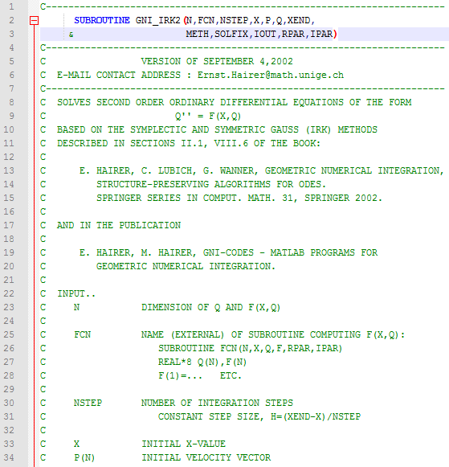

# Что такое комментарии и зачем они нужны?

Возможно вы заметили, что в листингах из примеров встречается не только код программ, но и мои пояснения написанные после `//`. Это комментарии. Они предназначены для того, чтобы пояснять какую-нибудь сложную и непонятную часть вашей программы. Кроме того, иногда их используют, чтобы на время отключить какую-то часть кода. Это возможно потому, что всё что записано в комментарии компилятор игнорирует. Если быть точнее то к тому времени, как компилятор начнёт обрабатывать код программы все комментарии будут уже удалены. Поэтому туда можно писать всё что угодно.


Пример использования комментария в программе. (Язык Fortran)

В языке Си есть два вида комментариев. Первый вид тот, который я использую в коде. Такой комментарий называет `однострочным`. Он действует с того момента как появился и до конца текущей строки. Есть ещё и `многострочный комментарий`. Начало такого комментария обозначается последовательностью `/*`, а конец -- `*/`. Всё, что будет записано между этими двумя последовательностями символов не будет восприниматься компилятором. Обычно многострочные комментарии используют для описания больших кусков кода, очень сложных для понимания функций, для указания авторства, для исключения большого куска кода из программы и т.д.

Вы спросите, а зачем нужно отключать куски кода программы? Иногда это нужно для того, чтобы найти ошибку в программе или проверить как работают отдельные её части. Если просто удалить код, то потом его придётся писать заново, а так, закомментировал на время, а потом обратно раскомментировал, когда потребовалось. Когда вы начнёте писать более менее большие программы, тогда вы воочию убедитесь в пользе.

Комментарии пишутся программистами для других программистов, которые в будущем будут читать/изменять этот код. Но даже если вы пишите код сугубо в личных целях, то не рекомендую вам брезговать оставлять комментарии. По прошествию нескольких месяцев бывает очень трудно вспомнить, что же ты тут такое делал и почему именно так делал, а не иначе.

Комментарии в коде могут быть как очень смешными:

Листинг 9.
```
// Магия. Не трогать.

//Этот код отстой, и мы оба это знаем.
//Так что двигайся дальше, а идиотом ты назовешь меня потом.

// Дорогой я_из_будущего! Пожалуйста, прости меня за этот код.

// Если я еще раз увижу такое, мне придется начать носить на работу оружие.

/* Если это условие когда-нибудь выполнится, пожалуйста,
 сообщите мне по тел. ххх-ххх-ххх за вознаграждение. */

// пьян, исправить позже

// Когда я начинал это писать, только Бог и я понимали, что я делаю
// Сейчас остался только Бог
```
Так и не очень:

Листинг 10.
```
//Пожалуйста, работай

// Я не несу ответственности за этот код.
// Они меня заставили написать его против моей воли.

/*
Если вы читаете эти строки, значит вам поручили мой предыдущий проект.
Я очень, очень сочувствую вам. Удачи.
*/
```