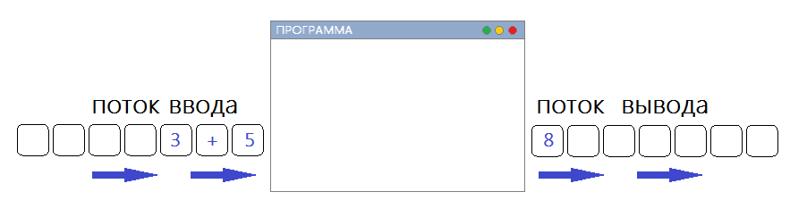
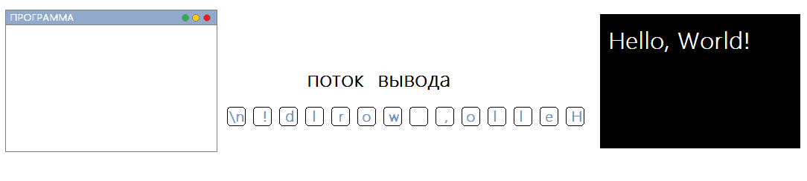

# Как устроен ввод и вывод в языке Си. Потоки ввода и вывода

Возвращаемся к основной теме урока -- вводу и выводу данных. Разберёмся как он устроен в Си. 

Помните в программе "Hello, World!" мы подключили заголовочный файл `stdio.h`, чтобы пользоваться стандартной функцией `printf()`? Так вот, кроме этой функции в файле есть множество других для ввода и вывода данных и других штук. Но нас сейчас интересуют не все эти функции, а стандартные потоки ввода и вывода, которые там тоже определены: ==стандартный поток ввода== -- `stdin` и =стандартный поток вывода= -- `stdout`.

Что ещё за потоки? Чтобы лучше это понять, думайте о них, как о последовательности символов. 
Следующая картинка иллюстрирует работу потоков:

Стандартный поток ввода называется `stdin` (от standard input) и обычно связан с клавиатурой, а стандартный поток вывода `stdout` (standard output) -- с экраном терминала(консоли). Я говорю обычно, потому что есть возможность перенаправить эти потоки, т.е. сделать так, чтобы данные выводились не на экран, а в какой-нибудь файл или получать данные не с клавиатуры, а из файла.

По сути наша программа работает именно с этими потоками и не особо обращает внимание с чем конкретно они связаны (файл, экран терминала, клавиатура). Для неё главное понимать, что данные приходят из потока ввода, а отправлять их надо в поток вывода. 

Т.е. когда мы в программе "Hello, World!" вызывали функцию `printf("Hello, World!\n")`, то более точно было бы сказать, что функция отправила эту строку не на экран консоли, а в стандартный поток вывода, который связан с экраном консоли и поэтому строка появлялась на экране.

