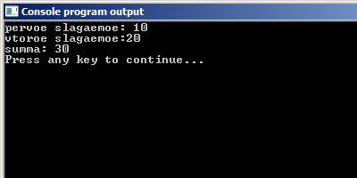
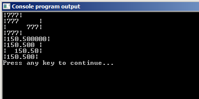

# Форматированный вывод. Функция printf
В первом уроке мы научились выводить на экран произвольную строчку. Но это самое простое, что может сделать функция `printf`. Давайте теперь подробнее разберемся, как она устроена и как работает.

Общий синтаксис функции printf следующий:


У функции `printf` есть один обязательный параметр -– строка, заключённая в двойные кавычки. Эту строку еще называют `формат-строкой`.

Напоминаю, что параметрами называется то, что мы записываем рядом с именем функции в круглых скобках.

Кроме обязательной строки форматирования есть и необязательные параметры. Они пишутся через запятую после формат-строки.

## Формат-строка
Любой символ в формат-строке относится к одной из следующих групп:

- символы, которые выводятся на экран без изменений
- escape-последовательности
- спецификаторы формата

### Еscape-последовательности
С этой группой символов мы уже встречались в первом уроке. Символ `\n`. Он, как вы ,наверное, помните, переносит выводимый текст на новую строку. Есть и другие эскейп-последовательности (иногда можно встретить название управляющие последовательности). Любая такая последовательность начинается с символа обратный слеш `\`.

Часто используемые escape-последовательности:

- `\n`     -- новая строка
- `\t`     -- горизонтальная табуляция. Сдвигает выводимые данные вправо на ближайшую позицию табуляции. Обычно используется для выравнивания текста внутри строки.
- `\'`     -- вывод символа `'`
- `\"`     -- вывод символа `"`
- `\\`     -- вывод символа `\`

Как видите, последние три последовательности нужны лишь для того, чтобы вывести на экран символы `"`, `'` и `\`. Дело в том, что если эти символы просто записать в формат-строку, то они не отобразятся на экране, а в некоторых случаях программа и вовсе не скомпилируется.

Интерес представляет символ `?`. Вообще говоря, для него также имеется escape-последовательность `\?`. При этом, вывести данный символ можно и без добавления обратного слеша.

Следующая программа иллюстрирует работу escape-последовательностей.

Листинг 1.

```
#include <stdio.h>
int main(void){
	printf("What is your name\?\n\tMy name\'s Bond! James Bond!\n");
	return 0;
}
```

Хотя escape-последовательности состоят из нескольких символов, но в потоке вывода они воспринимаются как цельный символ, который имеет своё собственное значение.

Итого, используя управляющие последовательности мы можем влиять на то, как данные будут выводиться на экране.

### Спецификаторы формата.
`Спецификаторы формата` всегда начинаются с символа `%`, и предназначены для вывода на экран значений переменных и выражений.

Для каждого типа данных есть свой спецификатор формата. Ниже записаны основные из них.

Основные спецификаторы формата:

- `%d`, `%i`  -- целые числа
- `%f`, `%g`  -- вещественные числа
- `%c`        -- символы

Есть и другие спецификаторы формата. Мы познакомимся с ними тогда, когда они нам понадобятся.

Сами спецификаторы формата на экран не выводятся. Вместо них выводятся данные, которые передаются в функцию `printf` после строки форматирования.

Функция `printf` работает следующим образом. Все символы, заключенные в двойные кавычки, кроме управляющих последовательностей и спецификаторов формата, выводятся на экран. Спецификаторы формата во время вывода заменяются на значения, указанные после формат-строки. Причём, если используется несколько спецификаторов формата, то первый спецификатор заменяется на первое значение, расположенное после формат строки, второй –- на второе, и т.д.

Посмотрим на примерах.

Листинг 2.

```
printf("%d\t%d\n%d",10,20,30);
```


Листинг 3.

```
printf("pervoe slagaemoe: %d\nvtoroe slagaemoe:%d\nsumma: %d\n",10,20,30);
```



Листинг 4.

```
printf("%d + %d = %d\n", 20, 10, 20+10);
```


Листинг 5.

```
printf("%d + %d %c %d\n", 10, 20, '=', 20+10);
```


На следующей картинке показан принцип работы функции `printf`.


По сути, формат-строка задаёт некоторый трафарет(шаблон), в который подставляются данные для вывода, в том порядке, в котором они указаны.

Два основных правила, которые нужно соблюдать при работе с функцией `printf`:

- количество спецификаторов формата должно совпадать с количеством данных для вывода
- спецификаторы формата должны точно соответствовать типам выводимых данных

Пара примеров неправильного использования функции `printf`.

Листинг 6.

```
#include <stdio.h>
int main(void){
	int z = 4;
	float b = 5.4;
	printf("%f\n",z); // нарушено  2 правило
	// переменная z целого типа, а команда форматирования %f  предназначена для
	// вывода переменных типа float
	printf("%d\n",z, b); //нарушено 1 правило
	// нет команды форматирования для переменной b.
	return 0;
}
```

Напишем небольшую программу, которая иллюстрирует использование спецификаторов формата.

Листинг 7.

```
#include <stdio.h>
int main(void){
  int a = 25;
  float b = 23.4;
  double c = 217.876;
  char d = 's';

  printf("Cheloe %d\n",a);
  printf("Odin simvol %c\n",d);
  printf("Vewestvennoe %f %g\n",b,c);

  return 0;
}
```

## Модификаторы формата.

Обратите внимание, что вещественные числа через спецификатор `%f` выведены с шестью знаками после запятой. У вас на компьютере может быть выведено как больше, так и меньше знаков. Обычно такая точность не нужна. К счастью, этим можно управлять. Для этого предназначены `модификаторы формата`.

Модификаторы формата записываются между символом `%` и буквой используемого типа. На рисунке ниже представлен спецификатор формата с использованием модификатора формата.


Первое число обозначает ширину поля, выделяемого для записи числа. Второе число обозначает точность, с которой мы хотим вывести данное вещественное число.

В примере на картинке под вещественное число мы выделяем 8 символов и хотим видеть 3 знака после запятой.

Если указанного в ширине количества позиций нам не хватает для вывода числа, то ширина поля увеличивается автоматически, до минимально-возможного количества позиций.

У первого числа может спереди еще стоять знак минус, например `%-8.3f`. Этот минус говорит о том, что необходимо выровнять число по левому краю используемой области.

Для иллюстрации описанных возможностей модификаторов формата, напишем небольшую программу.

Листинг 8.

```
#include <stdio.h>
int main(void){
  int a=777;
// никаких модификаторов нет,
//вывод использует минимальную ширину поля
  printf("|%d|\n", a);

// ширина 8 позиций, выравнивание по левому краю
  printf("|%-8d|\n", a);

// ширина 8 позиций, выравнивание по правому краю
  printf("|%8d|\n", a);

// число позиций 2, но в числе 777 больше двух цифр
// поэтому область расширяется до минимально-возможной ширины
  printf("|%2d|\n", a);

  float b=150.5;
// никаких модификаторов нет, выведет используя минимальную ширину поля
// и стандартную точность 6 знаков
  printf("|%f|\n", b);

// ширина 8 позиций, выравнивание по левому краю, 3 знака после запятой
  printf("|%-8.3f|\n", b);

// ширина 8 позиций, 2 знака после запятой, выравнивание по правому краю
  printf("|%8.2f|\n", b);

// число позиций 4,точность 3 знака после запятой, но этого мало
// поэтому ширина поля увеличивается до минимально-возможного значения
  printf("|%4.3f|\n", b);
return 0;
}
```

Результат работы данной программы представлен на рисунке ниже.



Я специально поставил вокруг каждого числа прямые чёрточки, чтобы можно было увидеть, что означает ширина поля для вывода и как работает выравнивание по левому краю.

В этом шаге вы познакомились только с самыми основными возможностями функции `printf`. Но даже этих возможностей вполне хватит, чтобы данные, которые выводит ваша программа, выглядели презентабельно.

Да, чуть не забыл. Мы решили одну из задач, которая стояла перед нами в начале урока.

Листинг 9.

```
#include <stdio.h>
int main(void) {
  int a, b, res;

  a = 10;
  b = 7;

  res = a + b;
  printf("%d + %d = %d\n", a, b, res);
  return 0;
}
```
