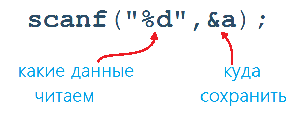
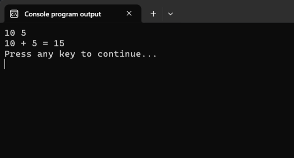
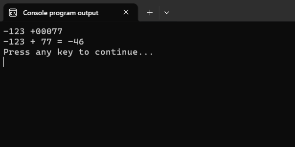
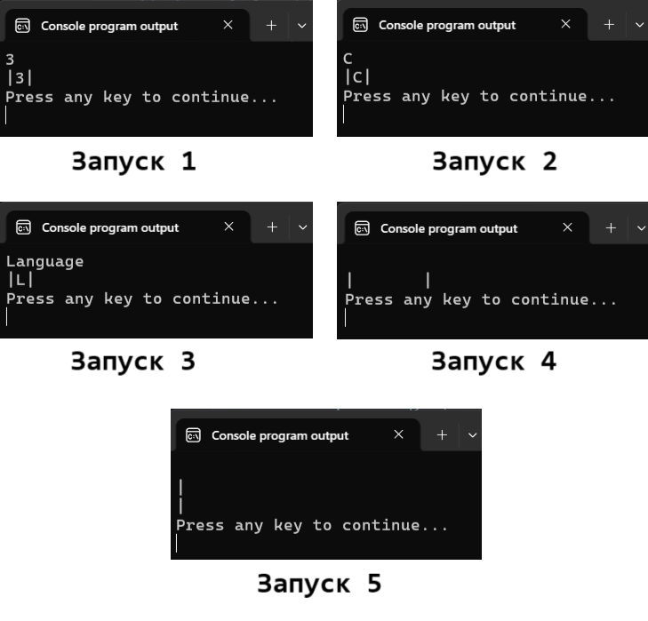
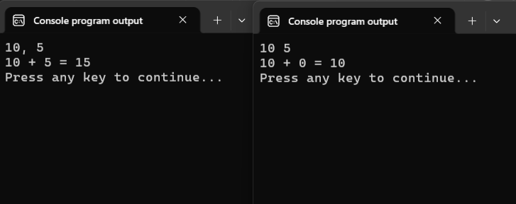
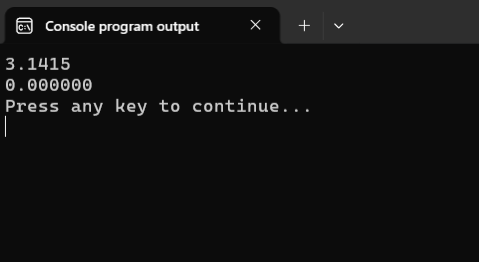
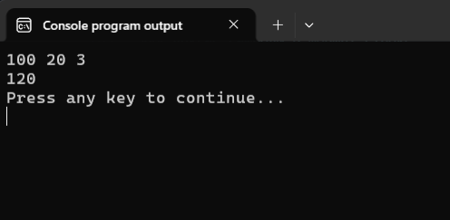
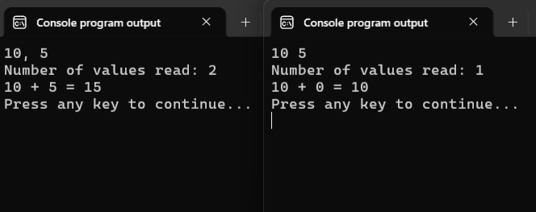

# Ввод данных в языке Си. Функция scanf

В прошлой заметке мы научились выводить значения, хранящиеся в переменных, на экран. Основная задача текущего шага -- научиться получать данные от пользователя и записывать их в переменные.

Продублируем последний листинг из прошлой заметки:

Листинг 1. Заготовка программ сложения двух чисел
```c
#include <stdio.h>

int main(void)
{
        int a, b, res;

        a = 10;
        b = 7;

        res = a + b;
        printf("%d + %d = %d\n", a, b, res);

        return 0;
}
```

И хотя эта программа может вычислить сумму значений, хранящихся в переменных `a` и `b`, но ей явно не хватает интерактивности! Значения переменных `a` и `b` заданы в исходном коде программы (иногда в таких случаях говорят, что значения =захардкожены=). Если нам потребуется вычислить сумму двух других чисел, то надо будет изменить исходник программы, заново её скомпилировать и запустить. 

Чтобы научить программу работать с данными, которые вводит пользователь, воспользуемся функцией `scanf`. Эта функция, так же как и функция `printf`, объявлена в заголовочном файле `stdio.h`. Т.к. он у нас уже подключен в первой строке, то мы можем свободно использовать функцию `scanf` в своей программе.

Чтобы считать данные, которые ввёл пользователь, и сохранить их в переменную, нужно вызвать функцию `scanf` со следующими параметрами:



В двойных кавычках указываем спецификатор формата. Спецификатор формата должен соответствовать типу переменной, куда мы собираемся сохранить данные.

Основные спецификаторы формата:
- `%d`   -- целые числа типа `int`;
- `%f`   -- вещественное число типа `float`;
- `%lf`  -- вещественное число типа `double` (первый символ английская буква эль в нижнем регистре, сокращение от `long float`);
- `%c`   -- символ.

% **Важно!**
Обратите внимание, что в функции `scanf` для типов `float` и `double` используются различные спецификаторы формата. 

После формат-строки нужно указать =адрес переменной=, в которую мы будем сохранять данные. Звучит страшно, но на самом деле, зная имя переменной, получить её адрес достаточно легко. Для этого достаточно перед её именем записать знак `&` (амперсанд).

% **Частая ошибка!** 
Не забывайте ставить знак `&` перед именем переменной. 

Если передать в функцию только имя переменной, а не её адрес, то функция `scanf` не сможет записать данные в переменную. Подробнее об этом читайте в дополнительных материалах к этому уроку. 

Торжественный момент! Мы готовы написать программу для сложения двух целых чисел.

Листинг 2. Программа «sum2» -- программа сложения двух целых чисел.  
```c
#include <stdio.h>

int main(void)
{
        int a = 0, b = 0, res;

        scanf("%d", &a); // считываем целое значение в переменную a
        scanf("%d", &b); // считываем целое значение в переменную b

        res = a + b;
        printf("%d + %d = %d\n", a, b, res);
        
        return 0;
}
```

Скомпилируйте и запустите эту программу. После запуска программа будет ждать, пока вы введёте данные. Ввести данные можно различными способами, попробуйте, например, следующие варианты:

```
// символом \n обозначается нажатие клавиши Enter
// символом \t обозначается нажатие клавиши Tab
// пробелом обозначается нажатие клавиши Пробел

10 5\n
10 \t\t 5\n
    10       5\n
10\n5\n
```

Во всех четырёх случаях результат будет один и тот же. Программа корректно считает число `10` в переменную `a`, число `5` в переменную `b`, вычислит их сумму и выведет на экран:
```
10 + 5 = 15
```




Пока не знаешь, как функция `scanf` обрабатывает данные из потока ввода, может показаться, что здесь происходит какая-то магия. Но, конечно, никакой магии тут нет. 


Думаю, что вы уже догадались, что на самом деле, функция `scanf` -- это функция форматного ввода (от английского scan formatted). Первый аргумент -- это формат-строка, а далее следуют адреса переменных, в которые требуется записать данные в соответствии со спецификаторами формата.


## Как работает функция `scanf`

Как вы уже догадались, функция `scanf` считывает данные из стандартного потока ввода (вы же ещё помните, что обычно он связан с клавиатурой) в соответствии с формат-строкой.

Формат-строка задаёт шаблон в соответствии с которым обрабатывается входной поток. Все символы, входящие в формат-строку, можно разделить на три группы:
- спецификаторы формата (начинаются с `%`);
- пробельные символы;
- все остальные символы.


### Спецификаторы формата

Спецификаторы формата указывают функции `scanf`, данные какого типа нужно считать из стандартного потока ввода.

Разберём построчно работу двух функций `scanf` в примере из Листинга 2. Продублируем этот кусок кода отдельно:  

Листинг 3. Считывание данные в программе «sum2»
```c
scanf("%d", &a); // считываем целое значение в переменную a
scanf("%d", &b); // считываем целое значение в переменную b
```

Предположим, что, запустив программу, пользователь ввёл число `10`, нажал клавишу `Пробел`, ввёл число `5` и нажал клавишу `Enter`. Так как о стандартных потоках можно думать просто как о последовательности символов, которые поступают в программу, то описанный пользовательский ввод можно представить в виде последовательности символов `10 5\n`.

Формат-строка `"%d"` означает, что требуется считать целое число из стандартного потока ввода.

Разберём первый вызов `scanf("%d", &a);`. Функция `scanf` читает по одному символы из входного потока.

1. Видит `1` → "Это цифра, значит начинаем собирать число";
2. Видит `0` → "Это тоже цифра, добавляем к предыдущей" (получается `10`);
3. Видит пробел → "Это не цифра, следовательно число закончилось";
4. Преобразует собранные цифры `10` в целое число и записывает в переменную `a`, после чего завершает работу.

При этом сам пробел и всё что идёт после него остаётся в потоке ввода для следующего чтения.

Разберём следующий вызов `scanf("%d", &b)`. В потоке ввода осталась последовательность: ` 5\n`.

Функция читает поток ввода посимвольно:
1. Видит пробел → "Это пробельный символ, он не может быть частью целого числа, поэтому пропускаем его";
2. Видит `5` → "Это цифра, начинаем собирать число";
3. Видит `\n` → "Это не цифра, значит число закончилось";
4. Преобразует собранную цифру `5` в целое число и записывает в переменную `b`, после чего завершает работу. При этом символ переноса строки `\n` остаётся в потоке ввода.

Интересный момент, функция `scanf` переходит в "режим собирания числа" не только встретив цифру, но и знаки `+` или `-`, а также спокойно обрабатывает числа с лидирующими нулями. Например, если мы запустим программу «sum2» и введём строку `-123 +00077\n`, то программа корректно "распознает" введённые числа. Проверьте это самостоятельно.




Какие важные нюансы мы увидели в этом примере:
1. Режим собирания числа завершается, как только встречается первый символ, который не может быть составной частью числа.
2. Если мы не находимся в режиме собирания числа, то любые пробельные символы просто считываются и игнорируются. =Пробельными символами= являются, например, пробел, перенос строки (`\n`), горизонтальная табуляция (`\t`).

Теперь вы можете самостоятельно прогнать любой из четырёх вариантов ввода двух чисел, которые были указаны ранее, и убедиться, что он корректно обработается фукнцией `scanf`.

Кстати говоря, вместо двух вызовов функции `scanf` мы могли бы обойтись и одним вызовом:

Листинг 4. Версия программы «sum2» с одним вызовом `scanf`
```c
#include <stdio.h>

int main(void)
{
        int a = 0, b = 0, res;

        scanf("%d%d", &a, &b); // считываем два целых числа в переменные a и b

        res = a + b;
        printf("%d + %d = %d\n", a, b, res);
        
        return 0;
}
```

Давайте пошагово разберём, как отработает вызов `scanf` из Листинга 4 на примере ввода `10 \t\t 5\n`:

1. Видит `1` → "Это цифра, начинаем собирать первое число";
2. Видит `0` → "Это тоже цифра, добавляем к предыдущей" (получается 10);
3. Видит пробел → "Это не цифра, первое число закончилось";
4. Записывает число 10 в переменную `a`;
5. Видит пробел → "Это пробельный символ, пропускаем его, т.к. мы не в режиме собирания числа";
6. Видит `\t` → "Это пробельный символ, пропускаем его, т.к. мы не в режиме собирания числа";
7. Видит `\t` → "Это пробельный символ, пропускаем его, т.к. мы не в режиме собирания числа";
8. Видит пробел → "Это пробельный символ, пропускаем его, т.к. мы не в режиме собирания числа";
9. Видит `5` → "Это цифра, начинаем собирать второе число";
10. Видит `\n` → "Это не цифра, второе число закончилось";
11. Записывает число 5 в переменную `b`.

Как видите, результат получился аналогичным. Если не верите, можете запустить программу и убедиться в этом самостоятельно.

Считывание чисел по форматам `%f` и `%lf` работает аналогично считыванию по формату `%d`. Имеется лишь один небольшой нюанс:

% **Важно!**
Символ `.` является допустимым символом в режиме собирания вещественного числа.

Например, следующий вызов функции `scanf`:

```c
float real_number;

scanf("%f", &real_number);
```

- для ввода `3.1415\n` сохранит в переменную `real_number` значение `3.1415`;
- для ввода `-2.7182\n` сохранит в переменную `real_number` значение `-2.7182`;
- для ввода `.001\n` сохранит в переменную `real_number` значение `0.001`;
- для ввода `000123.456\n` сохранит в переменную `real_number` значение `123.456`;
- для ввода `+6.4321\n` сохранит в переменную `real_number` значение `6.4321`;


Отдельно остановимся на работе спецификатора `%c`. Он используется для считывания одного **любого** символа (в том числе и любого пробельного символа) из потока ввода.

Рассмотрим следующий пример:

Листинг 5. Программа для считывания одного произвольного символа
```c
#include <stdio.h>

int main(void)
{
        char symbol;
        
        scanf("%c", &symbol);

        printf("|%c|\n", symbol);
         
        return 0;
}
```

Скомпилируем эту программу, а потом запустим её пять раз. В первый раз отправим во входной поток `3\n`, во второй -- `C\n`, в третий -- `Language\n`, в чётвёртый -- `\t\n`, а в пятый раз -- `\n`. 

Для наглядности я добавил в вывод символы `|`. Результат работы программы для всех пяти случаев представлен на следующем рисунке:



% **Важно!**
При считывании данных по формату `%c` пробельные символы не игнорируются.

А как же быть, если мы всё-таки хотим проигнорировать пробельные символы при считывании по формату `%c`? Для этого в формат-строку перед спецификатором `%с` нужно добавить пробел, т.е. заменить `"%с"` на `" %c"`. 

Чтобы понять, почему это сработает, давайте изучим, как обрабатываются

### Пробельные символы в формат-строке

Если в формат-строке функции `scanf` встречается любой пробельный символ, то это означает, что на его месте в потоке ввода может быть произвольное количество (даже нулевое) **любых** пробельных символов. Иначе говоря, один пробельный символ в формат-строке может соответствовать любому количеству пробелов, табуляций и переводов строки в потоке ввода.

Формат-строку `"%d%d"` из Листинга 4 можно было бы записать вот так `"%d %d"` или вот так `" %d\t%d"` и даже вот так `"\t\t\n %d \t\n\t %d"`. Результат работы функции `scanf` от этого никак не изменится.

Давайте прогоним вход `10 5\n` через вызов `scanf(" %d\t%d", &a, &b);`:

1. Видит пробел в формат-строке → "Нужно пропустить любое количество пробельных символов. Т.к. пробельных символов в потоке ввода нет, то считаем, что встретилось нуль пробельных символов."
2. Видит `1` → "Это цифра, начинаем собирать первое число"
3. Видит `0` → "Это тоже цифра, добавляем к предыдущей" (получается `10`)
4. Видит пробел → "Это не цифра, первое число закончилось"
5. Записывает число `10` в переменную `a`
6. Видит символ `\t` в формат-строке → "Это пробельный символ, значит нужно пропустить любое количество пробельных символов. Т.к. далее в потоке ввода идёт пробел, то он пропускается."
7. Видит `5` → "Это цифра, начинаем собирать второе число"
8. Видит `\n` → "Это не цифра, второе число закончилось"
9. Записывает число `5` в переменную `b`

Как видите, результат точно такой же, как и при использовании формат-строки `"%d%d"`. Пробельные символы в формат-строке просто явно говорят функции "пропусти любое количество пробельных символов", поэтому не важно, сколько их там стоит и какие именно это пробельные символы.

Подытожим:

% **Важно**
Один **любой** пробельный символ в формат-строке означает, что в потоке ввода на этом месте может быть нуль или более **любых** пробельных символов.

И хотя можно добавлять сколько угодно пробельных символов в формат строку, всё же в программах следует избегать лишних пробельных символов в формат-строке. Например, заменить `"%d%d"` на `"%d %d"` -- нормально, так как это улучшает читаемость строки формата, но писать что-то вроде `"\t\n%d\t\t%d"` не стоит.


### Другие символы в формат-строке

Если в формат-строке функции `scanf` встречается какой-то другой символ (не спецификатор формата и не пробельный символ), то это означает, что в потоке ввода на этом месте должен присутствовать точно такой же символ.

Например, формат-строка вида `"%d,%d"` означает, что во входном потоке должны быть записаны два целых числа, причём сразу за первым числом должна стоять запятая.

Разберём вызов `scanf("%d,%d", &a, &b);` на различных входных данных.

Входной поток: `10, 5\n`:

1. Видит `1` → "Это цифра, начинаем собирать первое число";
2. Видит `0` → "Это тоже цифра, добавляем к предыдущей" (получается 10);
3. Видит запятую → "Это не цифра, первое число закончилось";
4. Записывает число 10 в переменную `a`;
5. В формат-строке запятая → "Нужно найти точно такой же символ во входном потоке";
6. Видит запятую во входном потоке → "Отлично, символы совпали, идём дальше";
7. Видит пробел → "Это пробельный символ, пропускаем его";
8. Видит `5` → "Это цифра, начинаем собирать второе число";
9. Видит `\n` → "Это не цифра, второе число закончилось";
10. Записывает число 5 в переменную `b`.


А теперь разберём входной поток `10 5\n`:

1. Видит `1` → "Это цифра, начинаем собирать первое число";
2. Видит `0` → "Это тоже цифра, добавляем к предыдущей" (получается 10);
3. Видит пробел → "Это не цифра, первое число закончилось";
4. Записывает число 10 в переменную `a`;
5. В формат-строке запятая → "Нужно найти точно такой же символ во входном потоке";
6. Видит пробел → "Это не запятая! Ошибка чтения!";
7. Функция прекращает работу, не дойдя до чтения второго числа. В потоке ввода остаётся ` 5\n`.

Как видите, если в формат-строке есть непробельный символ (в данном случае запятая), то во входном потоке обязательно должен быть точно такой же символ на этом месте. Иначе функция завершит работу не дочитав оставшиеся данные.

Давайте проверим наши теоретические рассуждения и убедимся на практике, что нарушение формата входных данных приведёт к проблемам.

Листинг 6. Версия программы «sum2» с формат-строкой `"%d,%d"`
```c
#include <stdio.h>

int main(void)
{
        int a = 0, b = 0, res;

        scanf("%d,%d", &a, &b);

        res = a + b;
        printf("%d + %d = %d\n", a, b, res);
        
        return 0;
}
```

Результат работы этой программы представлен на картинке ниже:


Как видите, при входном потоке `10 5\n` значение в переменную `b` не было записано. Из-за чего итоговая сумма получилась неправильной (`10` вместо `15`).

Раз уж мы затронули тему ошибок, возникающих при работе с функцией `scanf`, то сразу оговорим основные правила работы с этой функцией.


% **Важно!**
Два основных правила работы с функцией `scanf`:
1. количество спецификаторов формата должно совпадать с количеством данных для ввода;
2. спецификаторы формата должны точно соответствовать типами переменных, переданным в функцию `scanf`.

Посмотрим на проблемы, к которым может привести нарушение этих правил

Листинг 7. 
```c
#include <stdio.h>

int main(void)
{
        double real;

        scanf("%f", &real); // частая ошибка
        // %f подходит для переменных типа float
        // переменная real имеет тип double
 
        printf("%f\n", real);
        
        return 0;
}
```

Результат работы программы Листинг 7: 



Листинг 8.
```c
#include <stdio.h>

int main(void)
{
        int a = 0, b = 0, c = 0;

        scanf("%d %d", &a, &b, &c); // количество спецификаторов
        // не совпадает с количеством переменных
 
        printf("%d\n", a + b + c);
        
        return 0;
}
```

Результат работы программы Листинг 8.



Особое коварство подобных ошибок заключается в том, что функция `scanf` не прерывает выполнение программы. И если о потенциальных проблемах в Листингах 7 и 8 нас предупредит компилятор, то проблему из Листинга 6 он отловить не в силах, т.к. она происходит непосредственно во время выполнения программы.

% **Важно!** 
Проверка того, что все данные были корректно считаны функцией `scanf`, лежит на плечах программиста.

### Значение, возвращаемое функцией `scanf`

Функция `scanf` возвращает целое число -- количество переменных, в которые функция `scanf` успешно записала значения из входного потока. Давайте посмотрим на это значение.

Немного модифицируем программу из Листинга 6. Добавим в неё переменную для хранения возвращаемого значения функции `scanf`.

Листинг 9. Демонстрация значения, возвращаемого функцией `scanf`
```c
#include <stdio.h>

int main(void)
{
        int a = 0, b = 0, values_read, res;

        // значение, возвращаемое функцией scanf,
        // присваиваем переменной values_read
        values_read = scanf("%d,%d", &a, &b); 

        // выводим количество успешно записанных переменных на экран
        printf("Number of values read: %d\n", values_read);

        res = a + b;
        printf("%d + %d = %d\n", a, b, res); 
        
        return 0;
}
```

Запустим эту программу на входных данных:
- соответствующих формат-строке `10, 5\n`;
- не соответствующих формат-строке `10 5\n`.



В первом случае в переменной `value_read` будет записано значение `2`, т.к. функция `scanf` успешно считает оба значения и запишет их в соответствующие переменные. Во втором случае в переменной `value_read` будет хранится значение `1`, т.к. из-за несоответствия входных данных формат-строке функция `scanf` не сможет прочитать второе значение и в результате своей работы присвоит значение лишь одной переменной `a`.

Далее в курсе (в шестом уроке), вы изучите особые конструкции языка Си, которые позволят вам в зависимости от того, сколько данных было считано, изменять поведение программы, например, выводить ошибку, если не получилось сохранить введённые данные.


Мы разобрали лишь самые базовые возможности функции `scanf`. Но даже так понятно, что формат-строка функции `scanf` устроена посложнее, чем формат-строка функции `printf`. На данном этапе вам будет достаточно этих знаний, а когда появится необходимость использовать что-то большее, вы сможете подтянуть этот материал самостоятельно по справочным руководствам.
