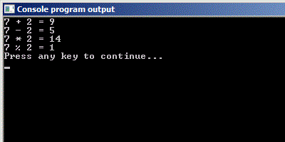
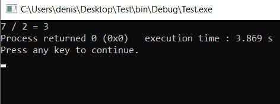

# Арифметические действия в языке Си

Начнём знакомство с математическими возможностями языка Си с наиболее простых вычислений, которые можно производить на компьютер, -- с арифметических действий.

Компилятор языка Си понимает основные арифметические операции: сложение, вычитание, умножение и деление. А также умеет находить остаток от деления.

Основные арифметические операторы языка Си.

`+` -- оператор сложения
`-` -- оператор вычитания
`*` -- оператор умножения
`%` -- оператор взятия остатка от деления
`/` -- оператор деления

Следующая программа иллюстрирует использование первых четырёх из них. Кстати, обратите внимание на то, как с помощью функции `printf` вывести на экран символ `%`.

Листинг 1.
```c
#include <stdio.h>

int main(void)
{
        int a = 7, b = 2;
        int res;

        res = a + b;
        printf("%d + %d = %d\n", a, b, res);
        res = a - b;
        printf("%d - %d = %d\n", a, b, res);
        res = a * b;
        printf("%d * %d = %d\n", a, b, res);
        res = a % b;
        printf("%d %% %d = %d\n", a, b, res);

        return 0;
}
```

Результат работы этой программы представлен на следующем рисунке.



Здесь всё чётко и понятно. Никаких неожиданностей. А теперь попробуем поделить число `7` (переменная `a`) на число `2`(переменная `b`). Т.к. результат должен получиться `3.5`, то переменную `res` объявим с типом `float`.

Листинг 2.
```c
#include <stdio.h>

int main(void)
{
        int a = 7, b = 2;
        float res;

        res = a / b;
        printf("%d / %d = %f\n", a, b, res);

        return 0;
}
```



Как видите, получился неожиданный результат. Это одна из особенностей оператора деления в языке Си.

% **Целочисленное деление:** 
При делении значения целого типа на значение целого типа результат операции деления тоже будет целого типа.

Так уж устроен язык Си. Поэкспериментируйте, попробуйте любые другие целые числа.

Вычислить результат целочисленного деления легко. Поделите числа и просто отбросьте всё, что получилось в дробной части.

*Пример:* Как получить результат целочисленного деления
* `7/2 = 3.5 → 3`
* `11/3 = 3.66 → 3`
* `2/5 = 0.4 → 0`

Для того, чтобы получить тот результат, который мы в данном случае ожидаем, одно из значений нужно сделать вещественным. Сделать это проще простого. Для этого необходимо рядом с ним в скобках записать `float` или `double` (в зависимости от требуемой точности вычислений. Для более точных вычисления используйте `double`).

Посмотрим на нашем примере:

Листинг 3.
```c
#include <stdio.h>

int main(void)
{
        int a = 7, b = 2;
        float res;

        res = (float) a / b;
        printf("%d / %d = %f\n", a, b, res);

        return 0;
}
```

Теперь результат будет `3.5`, как мы и предполагали изначально. Проделанный нами трюк называется =явным преобразованием типа=.

% **Явное преобразование (приведение) типа:**
Если какое-то значение нужно преобразовать (привести) к другому типу, нужно перед этим значением в скобках написать название требуемого типа данных.

Листинг 4. Примеры явного преобразования типа
```c
int a = 7, b;
float g = 9.81, v;

b = (int) g; // приводим значение 9.81 к типу int, получим 9
v = (float) a; // приводим значение 7 к типу float, получим 7.0
```
% **Важно!**
Преобразуется не тип исходной переменной, а только лишь значение, которое используется в выражении с этой переменной. 

В следующем видео-фрагменте об этом говорится подробнее.

<div class="lessonVideo">
  <iframe src="https://www.youtube.com/embed/9jLdsrF8iF8"  allowfullscreen></iframe>
</div>

Зеркало <a href="https://rutube.ru/video/3286ab3ed400e8e28f20b5ed40b1a111/?r=wd">на RuTube</a>, <a href="https://vkvideo.ru/video-31218664_456239035">на VK.Видео</a>

Обратите внимание, когда мы преобразовываем целое значение в вещественное, ничего особенного не происходит, т.к. вещественные числа включают в себя целые. Любое целое можно записать как вещественное, например, `3` это `3.0`, `10` это  `10.0`. 

Совсем иная ситуация, когда мы от вещественного значения переходим к целому. При этом переходе у нас теряется вся дробная часть. Не забывайте об этом.

Картинка, показывающая различия между операциями взятия остатка, целочисленного деления и обычного деления.


На всякий случай напомню, как работает остаток от деления. 

Допустим, у вас с другом есть роботы, которым для работы нужны лицензионные ключи. И вот вы нашли `7` конвертов с лицензионными ключами для роботов. Каждый из вас берет себе по три конверта, а один остаётся лишним. Если отдать его кому-то одному, то получится не очень честно. Разделить ключ на две части тоже бессмысленная затея, вот и остаётся один конверт лежать "в остатке". Значение `1` в таком случае называют остатком от деления числа `7` на `2` (`7 % 2 = 1`). 

Другой пример. Нам надо распределить `19` человек на команды по `5` человек. Получится `3` группы по `5` человек и `4` человека остаются лишними. В этом случае `4` -- остаток от деления `19` на `5` (`19 % 5 = 4`).

Важный нюанс, который надо знать про оператор `%`.

% **Важно!**
Знак остатка от целочисленного деления совпадает со знаком делимого (первого числа).

Следующая программа иллюстрирует этот нюанс.

Листинг 5.
```c
#include <stdio.h>

int main(void)
{

        printf("%d\n", 10 % 3);  // 1
        printf("%d\n", 33 % 17); // 16
        printf("%d\n", 20 % 5);  // 0
        printf("%d\n", -42 % 12); // -6
        printf("%d\n", -22 % -10); // -2
        printf("%d\n", 11 % -3); // 2

        return 0;
}
```

Кстати, в уроке, посвященном типам данных, я вскользь упомянул, что тип данных переменной влияет на то, какие действия с ней можно производить. Теперь настало время проиллюстрировать это на практике.

Попробуйте скомпилировать и запустить следующую программу:

Листинг 6.
```c
#include <stdio.h>

int main(void)
{
        int a = 10, b = 3, res, rem;
        double c = 10.0, d = 3.0, res_real, rem_real ;

        res = a / b;
        rem = a % b;

        printf("%d / %d = %d\n"
               "%d %% %d = %d\n", a, b, res, a, b, rem);
        res_real = c / d;
        rem_real = c % d; // ОШИБКА!

        printf("%.1f / %.1f = %.4f\n"
               "%.1f %% %.1f = %.4f\n", c, d, res_real, c, d, rem_real);

        return 0;
}
```

У вас не получится. Компилятор начнёт ругаться на строку `rem_real = c % b;`. Дело в том, что оператор `%` может работать только со значениями целого типа, а мы пытаемся ему подсунуть вещественные числа `10.0` и `3.0`. Поэтому он и ругается: `"Operands of '%' have incompatible types: 'double' and 'double'."`

Другой пример, когда тип данных влияет на результат операции -- это деление. Если оно целочисленное (оба числа целые) получаем один результат, если хотя бы одно из чисел вещественное, то получается другой результат. 

В общем, важно понимать, что тип данных не только задаёт диапазон значений, которые можно хранить в переменной, но и влияет на то, в каких операциях эта переменная может использоваться.

К нашему счастью все остальные операторы, изученные в этом уроке, более "всеядны" и могут работать как с целыми, так и с вещественными значениями.