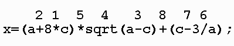

# Приоритет операций. Cложные математические выражения

В математических вычислениях важную роль играет порядок, в котором выполняются действия. Чему, например, равно значение выражения 2+2*2? Конечно же шесть, т.к. сначала выполняется умножение.

В C используется знакомый нам со школы порядок выполнения операций. Но т.к. в программировании есть свои особенности, то кое-какие отличия всё же есть. Выпишем приоритет для тех операций, которые мы уже знаем.

1. вычисляются функции (например, sqrt(), cos() и др.)
2. умножение, деление, остаток от деления (слева направо)
3. сложение, вычитание
4. выполняется присваивание

А каково значение переменной x после выполнения следующего кода `int x = 8 / 4 / 2;`

Правильный ответ 1. Т.к в случае одинакового приоритета операций, команды выполняются слева направо. Другими словами данный код эквивалентен коду `int x = (8 / 4) / 2;`

Если нам нужно изменить порядок выполнения действий, то мы можем использовать для этого круглые скобки, поэтому операции в скобках являются самыми приоритетными.

Листинг 1.

```
2+2*2 = 6
(2+2)*2 = 8 // действие в скобках будет выполнено прежде умножения
```

На следующем рисунке над каждым действием отмечено, каким оно выполнится по счёту.




Если в вашей программе вы написали довольно сложное выражение, в котором не сразу ясен порядок операций, то лучше добавить лишние скобки, чтобы явно задать последовательность операций. Это поможет избежать ошибок в вычислениях, которые потом будет сложно отловить.

## Сложные математические выражения

Иногда формулы, по которым нужно что-то вычислять, в программе могут принимать довольно ужасный вид.

При этом когда мы пишем программу, любая формула должна быть записана в одну строку. На начальном этапе это может вызвать у вас некоторые затруднения. Чтобы избавиться от этих затруднений, нужно овладеть навыком переводить формулу из стандартной математической записи в ту, которая используется в программировании и обратно.

И небольшой видео-фрагмент, в котором я попытался на простом примере показать, как можно поступать при записи сложных математических выражений.

<iframe class="video" src="https://www.youtube.com/embed/Gx6KUtmRmHs"  allowfullscreen></iframe>
