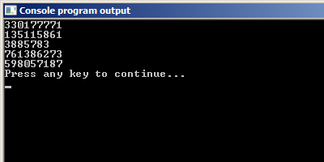
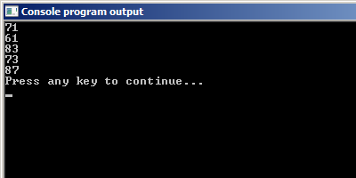

# Генерация случайных чисел в языке Си

Иногда может возникнуть необходимость в генерации случайных чисел. Простой пример.

> **Пример:** Программа для определения победитя в конкурсе репостов.
> В конкурсе репостов приняли участие 100 человек. Среди них необходимо случайным образом выбрать победителя. 

Если вы выберете его самостоятельно, то вас могут обвинить в предвзятости. Чтобы этого не произошло, вы решили написать программу, которая будет работать следующим образом: пользователь вводит количество участников `N`, после чего программа выводит одно случайное число от `1` до `N` включительно -- номер победителя.

Как получить число от пользователя, вам уже известно. А вот как заставить компьютер загадать случайное число? В этом уроке вы этому научитесь.

## Функция rand()
Функция `rand` возвращает случайное целое число в диапазоне `[0, RAND_MAX]` (от нуля до `RAND_MAX`). `RAND_MAX` -- это специальная константа языка Си, в которой записано наибольшее целое число, которое может быть возвращено функцией `rand`.

Функция `rand` определена в заголовочном файле `stdlib.h`. Поэтому, чтобы использовать `rand` в программе, не забудьте подключить этот заголовочный файл. Константа `RAND_MAX` тоже определена в этом файле. Вы можете найти этот файл у себя на компьютере и посмотреть её значение.

Давайте посмотрим на эту функцию в действии. Запустим следующий код:

Листинг 1.
```c
#include <stdio.h>   // чтобы пользоваться функцией printf
#include <stdlib.h>  // чтобы пользоваться функцией rand

int main(void)
{
        // генерируем пять случайных целых чисел
        printf("%d\n", rand());
        printf("%d\n", rand());
        printf("%d\n", rand());
        printf("%d\n", rand());
        printf("%d\n", rand());

        return 0;
}
```

Должно получиться что-то вроде этого.



Но нам бы хотелось получить числа от `1` до `100`, а не всё подряд. 
Ниже описано несколько приёмов, позволяющих наложить ограничения на функцию `rand`.

### Ограничить диапазон генератора случайных чисел сверху (справа)

Кто в школе ждал момента, когда ему пригодится математика, приготовьтесь. Этот момент наступил. Чтобы ограничить сверху случайные числа, можно воспользоваться операцией получения остатка от деления, которую мы разбирали в прошлом уроке. 

Думаю, вы знаете, что остаток от деления на число `K` всегда меньше самого числа `K`. Например, при делении положительного целого числа на `4` могут получиться остатки `0`, `1`, `2` и `3`. 


%  **Трюк**
Поэтому, если вы хотите ограничить сверху диапазон генерируемых случайных чисел значением `K`, то просто возьмите остаток от деления на `K + 1`: `rand() % (K + 1)`.

Единичку прибавлять обязательно, иначе сам число `K` никогда не будет сгенерировано.


Листинг 2.
```c
#include <stdio.h>
#include <stdlib.h>

int main(void)
{
        // генерируем пять случайных целых чисел <= 100
        printf("%d\n", rand() % 101);
        printf("%d\n", rand() % 101);
        printf("%d\n", rand() % 101);
        printf("%d\n", rand() % 101);
        printf("%d\n", rand() % 101);

        return 0;
}
```




### Ограничить числа снизу

Функция `rand` возвращает случайные числа из отрезка `[0, RAND_MAX]`. А что если нам нужны только числа большие числа `M` (например, `50`)? Как быть? Всё просто. Давайте прибавим к тому, что вернула функция `rand`, наше значение `M`. Тогда, если функция вернёт `0`, итоговый ответ будет `M`, если `2394`, то итоговый ответ будет `M + 2394`. Этим действием мы как бы сдвигаем все числа на `M` единиц вперёд.

% **Трюк**
Если вы хотите ограничить диапазон чисел, генерируемых функцией `rand`, снизу (слева) числом `M`, то используйте формулу `M + rand()` 


### Задать границы функции rand сверху и снизу

Теперь попробуем получить числа из диапазона `[80, 100]`. Кажется, что достаточно просто объединить два способа, которые приведены выше. Давайте так и сделаем. Получим что-то вроде этого:

Листинг 3.
```c
#include <stdio.h>
#include <stdlib.h>

int main(void)
{
        /* генерируем пять случайных целых чисел
        больше 80 и меньших 100 */

        printf("%d\n", 80 + rand() % 101);
        printf("%d\n", 80 + rand() % 101);
        printf("%d\n", 80 + rand() % 101);
        printf("%d\n", 80 + rand() % 101);
        printf("%d\n", 80 + rand() % 101);

        return 0;
}
```

Попробуйте запустить эту программу. Удивлены?

Да, такой способ работать не будет. Давайте рассмотрим следующий пример, чтобы понять, где мы допустили ошибку.

Допустим `rand` вернула число `143`. Остаток от деления `143` на `101` равен `42`. Дальше `80 + 42 = 122`, что больше верхнего ограничения `100` Значит такой способ не работает. Подобная конструкция выдаст числа от `80` до `180`.

Давайте разберём по действиям выражение `80 + rand() % 101`.

1. `rand() % 101` может выдать числа от `0` до `100` включительно. Т.е. из отрезка `[0, 100]`.
2. Добавя к диапазону `80` сдвигает наш отрезок на `80` единиц вправо. Получаем `[80, 180]`.

Как видим, проблема у нас заключается в правой границе отрезка, она сдвинута вправо на `80` единиц. Это как раз число `80`, которое мы прибавляем, чтобы сдвинуть нижнюю (левую) границу отрезка. Но добавлении числа сдвигает обе границы и нижнюю (левую) и верхнюю (правую). Давайте наведём порядок и сдвинем правую границу назад: `80 + rand()%(101 - 80)`. Теперь всё должно работать, как надо.

% **Трюк**
Если нужно получить числа из отрезка `[A, B]`, то можно воспользоваться следующей конструкцией:
`A + rand() % (B - A + 1)`

Используя этот трюк перепишем программу из Листинга 3:

Листинг 4.
```c
#include <stdio.h>
#include <stdlib.h>

int main(void) 
{
        /* генерируем пять случайных целых чисел
        из отрезка [80, 100] */

        printf("%d\n", 80 + rand() % (100 - 80 + 1));
        printf("%d\n", 80 + rand() % (100 - 79));
        printf("%d\n", 80 + rand() % 21);
        printf("%d\n", 80 + rand() % 21);
        printf("%d\n", 80 + rand() % 21);

        return 0;
}
```

Результат работы:

![Случайные числа из диапазона \[80, 100\]](./rand_a_b.png "Случайные числа из диапазона [80, 100]")


Ну вот, теперь вы можете решить исходную задачу урока. Сгенерировать число из отрезка `[1, N]`. 

Хотя нет, всё-таки не можете. Запустите последнюю программу (Листинг 4) три раза подряд и записывайте себе случайные числа, которые она генерирует. Заметили проблему?

## Функция srand.

Да, каждый раз появляются одни и те же одинаковые числа. «Так себе генератор!» – скажете вы. И будете не совсем правы. Действительно, генерируются всё время одинаковые числа. Но мы можем на это повлиять, для этого используется функция `srand`, которая также определена в заголовочном файле `stdlib.h`. Она инициализирует генератор случайных чисел начальным числом.

Скомпилируйте и запустите несколько раз следующую программу:

Листинг 5.
```c
#include <stdio.h>
#include <stdlib.h>

int main(void)
{
        srand(2);
        
        /* генерируем пять случайных целых чисел из отрезка [80, 100] */
        printf("%d\n", 80 + rand()%(100 - 80 + 1));
        printf("%d\n", 80 + rand()%(100 - 79));
        printf("%d\n", 80 + rand()%21);
        printf("%d\n", 80 + rand()%21);
        printf("%d\n", 80 + rand()%21);

        return 0;
}
```

Теперь поменяйте аргумент функции `srand` на другое число (надеюсь вы ещё не забыли, что такое аргумент функции?) и снова скомпилируйте и запустите программу. Последовательность чисел должна измениться. 

Как только мы меняем аргумент в функции `srand` -– меняется и последовательность. Не очень практично, не правда ли? Чтобы изменить последовательность, нужно перекомпилировать программу. Вот бы это число менялось автоматически.

И это можно устроить. Например, воспользуемся функцией `time`, которая определена в заголовочном файле `time.h`. Если в функцию `time` в качестве аргумента передать `NULL`, то она вернёт количество секунд, прошедших c 1 января 1970 года, а значит аргумент функции `srand` будет каждую секунду разный. Вот посмотрите, как это делается.

Листинг 6.
```c
#include <stdio.h>
#include <stdlib.h>
#include <time.h> // чтобы использовать функцию time()

int main(void)
{
  srand(time(NULL));

  /* генерируем пять случайных целых чисел из отрезка [80, 100] */
  printf("%d\n", 80 + rand()%(100 - 80 + 1));
  printf("%d\n", 80 + rand()%(100 - 79));
  printf("%d\n", 80 + rand()%21);
  printf("%d\n", 80 + rand()%21);
  printf("%d\n", 80 + rand()%21);

  return 0;
}
```

Вы спросите, а что такое `NULL`? Резонный вопрос. А я вам пока отвечу, что это такое специальное зарезервированное слово. Могу ещё сказать, что им обозначают нулевой указатель, но т.к. это для вас никакой информации не несёт, то на данный момент рекомендую об этом не думать. А просто запомнить как некоторый хитрый трюк. В будущих уроках мы остановимся на этой штуке поподробнее.


Вот теперь вы готовы написать программу для определения победителя в конкурсе репостов.