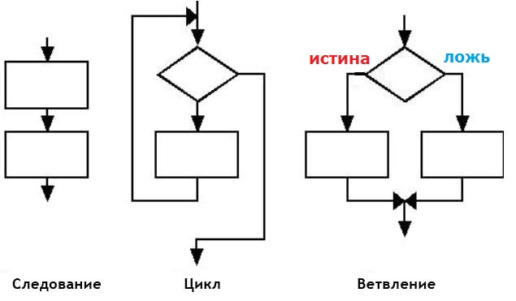

# Парадигмы программирования. Структурное программирование

Допустим, я хочу из точки А попасть в точку B. Какие есть для этого варианты? Например:

- дойти пешком;
- доскакать на лошади (вряд ли конечно, но пусть будет для наглядности примера);
- домчаться на мотоцикле;
- докатиться на электрическом самокате.

Задача одна, а вариантов достижения много. Между этими вариантами есть существенные различия. Они заключаются в устройстве процесса передвижения. В первом случае, мы просто используем силу своих мышц, во втором -- силу мышц более сильного животного, в третьем -- энергию двигателя внутреннего сгорания, в четвёртом -- электрическую энергию. Минимум четыре различных подхода (парадигмы).

В программировании тоже есть различные подходы к устройству программ. Эти подходы называются `парадигмами программирования`. Мы начнём с рассмотрения одного из таких подходов -- `структурного программирования`.

Идея в следующем. Любой алгоритм нужно представить в виде всего трёх возможных структур:

- последовательность
- ветвление
- цикл.
И оказывается, этого будет достаточно, чтобы написать программу любой сложности.



Проясним ситуацию.

## Следование
С этой конструкцией вы уже хорошо знакомы. Это самая простая структура. Все программы, которые вы писали ранее, использовали эту структуру. В ней команды выполняются друг за другом. Следующая команда выполняется после того, как завершится предыдущая.

```c
Команда 1;
Команда 2;
Команда 3;
```

## Цикл
Вспомните исполнителя-птичку. Что бы вы делали, если бы свинья находилась точно под птичкой, но на расстоянии 1000 клеток? Писать 1000 раз команду «Переместить вперёд» как-то не очень круто. Вот для подобных случаев и используется структура Цикл. Данная конструкция нужна для того, чтобы выполнять команды несколько раз.

Вернитесь к [игрушке](https://studio.code.org/s/20-hour/stage/2/puzzle/6) и пройдите задания с 6 по 9 включительно.

```c
ПОВТОРЯЙ 1000 РАЗ
  Команда 1;
```

В самом простом случаем мы заранее задаём количество раз, которое должны выполнится команды. Но есть и более продвинутый вид цикла -- он выполняется пока не выполнится некоторое условие. [Задачи](https://studio.code.org/s/20-hour/stage/2/puzzle/10) с 10 по 13 включительно помогут тебе разобраться с этой конструкцией.

```c
ПОВТОРЯЙ
  Команда 1;
ПОКА Условие1
```

## Ветвление

Допустим мы хотим программу-секрет. После запуска она просит пользователя ввести пароль. Если пароль правильный, то она показывает секретную фразу, а если неправильный, то фразу «Вы ввели неправильный пароль». Понятно, что нам нужно взять готовый пароль и сравнить его с тем, который ввёл пользователь. Тут-то нам и придёт на помощь структура «ветвление».

```c
ЕСЛИ условие ТО
  Команда 1;
ИНАЧЕ
  Команда 2;
```

Если условие выполнено, то выполнится `Команда1`, иначе (если условие не выполнено) выполнится `Команда2`. Решите [оставшиеся задачи](https://studio.code.org/s/20-hour/stage/2/puzzle/14), чтобы потренироваться в использовании данных управляющих структур.

Как вы наверное уже поняли, в следующих уроках вам предстоит разобраться с тем, как данные структуры управления реализованы в языке Си.
