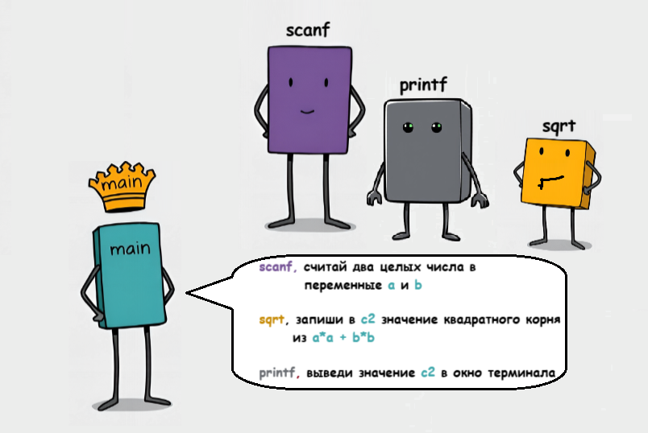

# Процедурное программирование

Давайте на секунду задумаемся о программах, которые были написаны нами в прошлых уроках. Вот пара примеров:

Листинг 1. Программа «Hello, World» 
```c
#include <stdio.h>

int main(void)
{
        printf("Hello, World!\n");
  
        return 0;
}
 ```

Листинг 2. Программа для вычисления длины гипотенузы в прямоугольном треугольнике
```c
#include <stdio.h>
#include <math.h>

int main (void)
{
        int a, b, c2;

        scanf("%d", &a);
        scanf("%d", &b);

        c2 =  a*a + b*b;
        printf("c = %.2f\n", sqrt(c2));

        return 0;
}
```

В каждой из этих программ в теле функции `main`, которое написали мы, вызываются другие функции, написанные кем-то до нас, например:   `printf`, `scanf`, `sqrt`. 

Ранее мы говорили, что инструкции являются строительными блоками программы и это, конечно, верно. Теперь же давайте поднимемся чуть выше по лестнице абстракции и с этой новой высоты посмотрим на наши программы.


Перед нашим взором предстанут отдельные функции, которые, взаимодействуя между собой (обмениваясь данными через аргументы и возвращаемые значения), решают поставленную задачу. При этом каждая функция выполняет строго свою, отведённую ей задачу, и может быть вызвана в любое время и любое количество раз. 

Функция `main` (не зря её называют главной) берёт на себя управление всем этим процессом, словно дирижёр в оркестре различных функций. И если функцию `main` мы по сути считаем нашей программой, то все другие функции можно рассматривать как вспомогательные =подпрограммы= — автономные блоки кода со своим именем, которые можно многократно переиспользовать.



Такой подход написанию программ (и организации кода программ) получил название -- =процедурное программирование=. 

### Почему же «процедурное», если везде выше мы говорили о функциях?

Термин «процедура» достался нам в наследство от ранних языков программирования, где подпрограммы делились на: 
- **процедуры** -- блоки кода, которые только выполняют какое-то действие, например, вывод на экран переданного аргумента, но не возвращают никакого значения;  
- **функции** -- блоки кода, которые помимо выполнения какого-либо действия возвращают какой-то результат в вызывающую их функцию,например, значение квадратного корня от переданного аргумента.

Т.е. и те и другие можно вызывать многократно, можно передавать им аргументы, они могут выполнять какие-то действия, а разница между ними лишь в том, что процедуры не возвращают значения, а функции возвращают.

В языке Си эти различия стёрты: все подпрограммы называются функциями, даже если они ничего не возвращают. Однако название «процедурное программирование» сохранилось.

## Особенности процедурной парадигмы

Оставляя историко-лингвистические нюансы позади, вернёмся к основной теме заметки и сформулируем **основные черты процедурной парадигмы**:

1. Разделение кода на отдельные функции (подпрограммы), которые вызываются из других частей программы. 
2. Каждая функция решает одну конкретную задачу. 
3. Обмен данными между функциями происходит через аргументы и возвращаемые значения.


Процедурный подход:

- Улучшает читаемость кода. 
- Позволяет работать над отдельными частями программы независимо.
- Когда функция уже написана и протестирована, то можно "забыть" о том, как она работает.

% **Важно**
Язык Си полностью поддерживает процедурную парадигму программирования.

Созданию пользовательских функций в курсе будет посвящён отдельный урок.


В этой заметке в качестве иллюстрации я использовал функции, которые были уже написаны до нас. На этих примерах можно лишь показать саму суть процедурной парадигмы (взгляд на программу, как на процесс взаимодействия различных функций), но не получится продемонстрировать все преимущества её применения в реальных программах. Поэтому первые два пункта мы пока оставим в качестве клиффхэнгера для будущих уроков, а вот последний пункт обсудим чуть подробнее.

Тут нам снова приходит на помощь концепция черного ящика. Если задуматься, то мы используем стандартные функции `printf`, `scanf`, `sqrt` и пр. в качестве "чёрного ящика". Мы ведь понятия не имеем, как они устроены внутри, как конкретно они работают, какие инструкции используют. Мы знаем о них лишь то, какие данные и в каком виде им нужно передать и то, что они в итоге сделают. Нюансы внутренней реализации для нас, как пользователей этих функций, не особо важны и остаются сокрыты.

Так же будет и с функциями, которые вы создадите самостоятельно. Написав и хорошенько протестировав работу функции, вы уже будете просто использовать её в дальнейшем. По крайней мере до тех пор, пока не выясните, что иногда она работает неправильно =D


Кстати, обращаю ваше внимание на ещё на один побочный, но крайне важный эффект от использования процедурного подхода. Выделение отдельных функций позволяет удобно пользоваться наработками других программистов. Мы подключаем файл, где определены нужные нам функции, изучаем их формат и вуаля, можно самому не писать сотни строк кода, ведь кто-то уже написал его для нас.

В заключение отмечу, что процедурное и структурное программирование обычно используются совместно. Кроме того, в некоторых материалах концепцию подпрограммы включают в описание структурного программирования, а в других -- вовсе выделяют только процедурное программирование, предполагая, что управляющие конструкции структурного программирования являются данностью любого высокоуровневого языка программирования.
