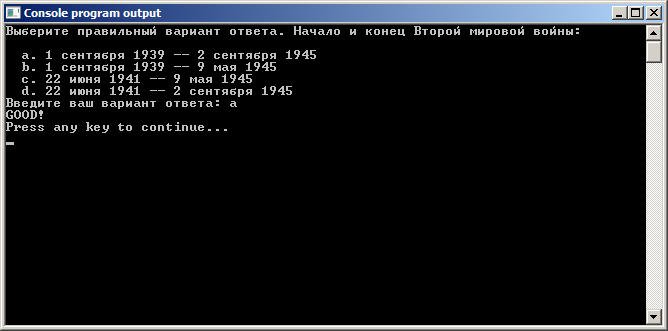

# Оператор выбора (переключатель) switch

Начнём, как обычно, с примера задачи, которую поможет решить данный оператор.

Задача на оператор `switch`. Программа-тест.
```
Написать программу, которая проверяет знание начала и конца Второй мировой войны. Выберите правильный вариант ответа. Начало и конец Второй мировой войны:
a. 01.09.1939 -- 2.09.1945
b. 01.09.1939 -- 9.05.1945
c. 22.06.1941 -- 9.05.1945
d. 22.06.1941 -- 2.09.1945

При выборе правильного варианта вывести GOOD, при выборе неправильного BAD. Если выбран вариант, которого нет в ответах, вывести ERROR.
```

Сделаем заготовку.

Листинг 1.

```
#include <stdio.h>
#include <locale.h> // для функции setlocale

int main(void) {
  setlocale(LC_ALL, ""); // чтобы использовать русские символы

  printf("Выберите правильный вариант ответа. Начало и конец Второй мировой войны:\n");
  printf("  a. 1 сентября 1939 -- 2 сентября 1945\n");
  printf("  b. 1 сентября 1939 -- 9 мая 1945\n");
  printf("  c. 22 июня 1941 -- 9 мая 1945\n");
  printf("  d. 22 июня 1941 -- 2 сентября 1945\n");

  char answer;
  printf("Введите ваш вариант ответа: ");
  scanf("%c",&answer);

  return 0;
}
```

Посмотрите на эту заготовку. Там есть две строчки, которые вам пока неизвестны. В комментариях я кратко подписал, для чего эти строчки нужны.

Используйте заголовочный файл `locale.h` и функцию `setlocale` в своих программах, если хотите использовать русские символы.

## Шаблон оператора switch

Общий шаблон для оператора `switch`:

Листинг 2.

```
switch (выражение) {
  case ключ_1: операторы_1
  case ключ_2: операторы_2
  case ключ_3: операторы_3
  case ключ_4: операторы_4

  default: операторы_стандарт
}
```

Работает он следующим образом.

Вычисляется, если необходимо, выражение, записанное в скобках. Именно от значения этого выражения зависит, какая из ветвей программы будет выполняться. Сразу же отметим первое ограничение, которое накладывается на это выражение.

**Важно:** В качестве выражения может использоваться переменная типа `int`, переменная типа `char` или любое выражение, результат которого будет иметь данные типы.

Примеры корректных и ошибочных выражений:
```
int i, k;
char c;
double g;

switch (i)        //Правильно (целая переменная)
switch ((i+k)+6)  //Правильно (выражение целого типа)
switch (g)        //Неправильно (вещественная переменная)
switch (c)        //Правильно (символьная переменная)
```

После того как выражение вычислено, его результат проверяется на совпадение с `ключ_1`, потом с `ключ_2`, потом с `ключ_3` и т.д.

Если выражение и какой-нибудь ключ совпали, то выполняются операторы, которые расположены после данного ключа.

**Важно:** Внимательно следите за тем, чтобы у каждый ветки `case` был свой уникальный ключ.

Если совпадений не обнаружено, то выполняются операторы, записанные в ветке `default`.

Надеюсь, общий принцип работы оператора `switch` ясен. А если не ясен, посмотрите на следующую картинку. На ней я нарисовал условную блок-схему для этого оператора и нашей задачки.


Теперь давайте дополним нашу программу. В качестве выражения-переключателя у нас будет выступать переменная `answer`. В качестве ключей буквы `a`, `b`, `c` и `d`. Получится вот такой код.

Листинг 3.

```
#include <stdio.h>
#include <locale.h> // для функции setlocale

int main(void) {
  setlocale(LC_ALL, ""); // чтобы использовать русские символы

  printf("Выберите правильный вариант ответа. Начало и конец Второй мировой войны:\n");
  printf("  a. 1 сентября 1939 -- 2 сентября 1945\n");
  printf("  b. 1 сентября 1939 -- 9 мая 1945\n");
  printf("  c. 22 июня 1941 -- 9 мая 1945\n");
  printf("  d. 22 июня 1941 -- 2 сентября 1945\n");

  char answer;
  printf("Введите ваш вариант ответа: ");
  scanf("%c",&answer);

  switch (answer) {
    case 'a': printf("GOOD!\n");
    case 'b': printf("BAD!\n");
    case 'c': printf("BAD!\n");
    case 'd': printf("BAD!\n");
    default: printf("ERROR!\n");
  }

  return 0;
}
```

## Оператор break
Теперь давайте потестируем нашу программу. Запустим её и введём правильный ответ. Результат работы:


Ууппс… Не ожидали? А я ожидал. ;) Это одна из особенностей оператора `switch`, о которой я вам пока не рассказал. Эта особенность называется `сквозное выполнение`. Поясню, как это работает.

После того как нашлось совпадение в одной из веток case, если явно не указан выход из оператора `switch`, то выполнятся последовательно все остальные ветки, записанные в коде после той, в которой произошло совпадение. Если в какой-то из них будет оператор выхода, то выполнение оператора `switch` завершится.

В нашем случае мы ввели символ `a`, программа выполнила первую ветку, и т.к. нет оператора выхода, то стали выполняться остальные ветки. При этом проверка на совпадение с ключами этих веток игнорируются. Чуть ниже я покажу, как можно использовать эту особенность для пользы дела.

А теперь собственно об операторе безусловного выхода. Наверное вы уже догадались, что это оператор `break`. Данный оператор завершает выполнение ближайшего к нему оператора `switch`, в котором он расположен.

Давайте добавим этот оператор в нашу программу.

Листинг 4.

```
#include <stdio.h>
#include <locale.h> // для функции setlocale

int main(void) {
  setlocale(LC_ALL, ""); // чтобы использовать русские символы

  printf("Выберите правильный вариант ответа. Начало и конец Второй мировой войны:\n");
  printf("  a. 1 сентября 1939 -- 2 сентября 1945\n");
  printf("  b. 1 сентября 1939 -- 9 мая 1945\n");
  printf("  c. 22 июня 1941 -- 9 мая 1945\n");
  printf("  d. 22 июня 1941 -- 2 сентября 1945\n");

  char answer;
  printf("Введите ваш вариант ответа: ");
  scanf("%c",&answer);

  switch (answer) {
    case 'a': printf("GOOD!\n"); break;
    case 'b': printf("BAD!\n"); break;
    case 'c': printf("BAD!\n"); break;
    case 'd': printf("BAD!\n"); break;
    default: printf("ERROR!\n"); break;
  }

  return 0;
}
```




Теперь всё работает как надо. Разберём ещё пару нюансов.

**Нюанс 1:** Ветви `case` оператора `switch` можно разместить в любом порядке.

Например, так:

Листинг 5.

```
switch (answer) {
  case 'a': printf("GOOD!\n"); break;
  default: printf("ERROR!\n"); break;
  case 'd': printf("BAD!\n"); break;
  case 'b': printf("BAD!\n"); break;
  case 'c': printf("BAD!\n"); break;
 }
 ```

### Сквозное выполнение.

Обратим сквозное выполнение себе на пользу.

Обратите внимание, что у нас имеется три ветки, которые выполняют по сути один и тот же код. Не важно, ввёл пользователь `b`, `c` или `d`, программа должна вывести BAD!. Тогда можно сделать, например, так:

Листинг 6.

```
switch (answer) {
  case 'a': printf("GOOD!\n"); break;
  case 'b':
  case 'c':
  case 'd': printf("BAD!\n"); break;
  default: printf("ERROR!\n"); break;
}
```

Поняли трюк? Пользователь выбирает, например, ответ `b`. Сначала выполняются операторы этой ветки. Там их нет. При этом нет и оператора `break`. А значит, идёт сквозное выполнение. Выполняется ветка `c`. Там тоже нет `break`. Выполняется ветка `d`. Выводится строчка `BAD!`. Дальше следует оператор `break`. Выходим из оператора `switch`. Удобно, не правда ли?

**Нюанс 2:** Ветка `default` необязательная.

В нашей программе данная ветвь присутствует только для того, чтобы выполнить одно из условий задачи. Мы вполне могли бы её удалить. Но тогда мы не смогли бы выводить сообщение об ошибке при вводе каких-либо символов, кроме a, b, c и d.

Как я писал выше, операторы ветки `default` выполняются в том случае, если выражение-переключатель не совпало ни с одним ключом в ветках `case`. Если бы данной ветки не было, то программа просто завершила бы выполнение оператора `switch`. Ни одна из его веток так и не была бы выполнена.

Для понимания можно провести аналогию с тем, что мы уже изучили. Каждая ветка представляет своего оператор условия: `if('a' == answer)`, `if ('b' == answer)` и так далее, а ветка `default` представляет собой `else`, то есть выполняется, если не выполнились операторы `if`

И последнее.

**Нюанс 3:** Операторы switch могут быть вложенными.

В любой ветке оператора `switch` вы снова можете использовать новый оператор `switch`. Вот небольшой пример. Следующая программа определяет делится ли введённое число на 6.

Листинг 7. Проверка делимости на 6

```
#include <stdio.h>

int main(void) {
  printf("Enter the number: ");

  int num = 0;
  scanf("%d",&num);

  switch (num%3) {
    case 0 :
      switch (num%2) {
        case 0 : printf("GOOD!\n"); break;
        case 1 : printf("BAD!\n"); break;
      }
      break;
    case 1 :
    case 2 : printf("BAD!\n"); break;
  }

  return 0;
}
```
**Важно:** Вложенный `switch` представляет собой просто действия в этой ветке, поэтому в конце ветки `case 0` тоже должен быть `break;`, как и в любой другой ветке.

Итоговая программа, которая решает задачу, предложенную в начале урока после всех улучшений и дополнений:

Листинг 8.

```
#include <stdio.h>
#include <locale.h> // для функции setlocale

int main(void) {
  setlocale(LC_ALL, ""); // чтобы использовать русские символы

  printf("Выберите правильный вариант ответа. Начало и конец Второй мировой войны:\n");
  printf("  a. 1 сентября 1939 -- 2 сентября 1945\n");
  printf("  b. 1 сентября 1939 -- 9 мая 1945\n");
  printf("  c. 22 июня 1941 -- 9 мая 1945\n");
  printf("  d. 22 июня 1941 -- 2 сентября 1945\n");

  char answer;
  printf("Введите ваш вариант ответа: ");
  scanf("%c",&answer);

  switch (answer) {
    case 'a': printf("GOOD!\n"); break;
    case 'b':
    case 'c':
    case 'd': printf("BAD!\n"); break;
    default:  printf("ERROR!\n"); break;
  }

  return 0;
}
```

В комментариях к одному из практических заданий моё внимание обратили на тот факт, что во всех примерах урока в качестве операторов в ветках `case` используется вызов функции `printf`. У некоторых учеников сложилось впечатление, что там можно использовать только функцию вывода. Нет, это не так. В любой ветке `case` вы можете производить любые действия: вычислять значения, объявлять переменные, использовать другие переключатели и управляющие конструкции и пр. Приведу наглядный пример.

Листинг 9.

```
#include <stdio.h>
int main(void){
  int a = 2;
  int value = 1;
  scanf("%d", &value);

  switch (value){
    case 2 : a = a*value; break;
    case 3 : a = a + value; break;
  }
  printf("result = %d\n", a);

return(0);
}
```
