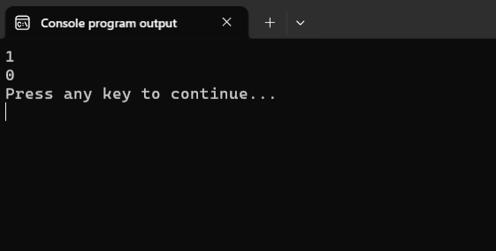
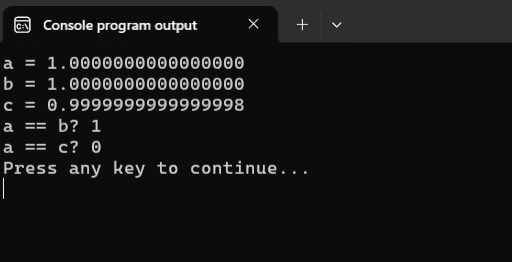

# Отношения и логические операторы

Как нам уже известно из вводного урока, инструкция `if-else` выполняет те или иные действия в зависимости от результата проверки дополнительных условий. Прежде чем переходить к её подробному изучению, давайте разберёмся, какие возможности предоставляет язык Си для записи этих самых дополнительных условий.

Самая базовая возможность -- это сравнение двух значений. Для этого в Си определены следующие =операторы сравнения=:

Листинг 1.
```c
>  -- больше чем
>= -- больше чем или равно
<  -- меньше чем
<= -- меньше чем или равно

== -- равно
!= -- не равно
```

### Как работают операторы сравнения

Принцип работы операторов сравнения разберём на простом примере.

Допустим, мы записали следующее выражение `10 > 3`. Такие выражения с операторами сравнения часто называют =логическими выражениями=.

Оператор `>` проверяет, что значение, записанное слева от него, **больше чем** значение, записанное от него справа. 

В нашем случае `10 > 3`, значение `10`, записанное слева от оператора, больше чем значение `3`, записанное от оператора справа, следовательно результат проверки положительный. В таких случаях ещё говорят логическое выражение истинно или отношение истинно.

Хорошо, мы выяснили, что выражение `10 > 3` истинно. Но каков его результат? Другими словами, каково значение этого логического выражения? Например, для выражения `3 + 7` результат `10`, а каков результат для выражения `10 > 3`? Что такое истина для компьютера? Как её записать в виде числа?

А тут всё довольно просто. Если выражение истинно, то его результат равен `1`, а если выражение ложно, то его результат равен `0`.

% **Важно!**
Каждый из операторов сравнения возвращает либо `1`, если проверяемое отношение истинно, либо `0`, если проверяемое отношение ложно.

Давайте посмотрим на следующие примеры простых логических выражений:

Листинг 2.
```c
#include <stdio.h>

int main(void)
{
        int a = 10, b = 5, c = 2;
        char ch = 'a';

        printf("%d\n", b > c);       // 5 > 2 истина
        printf("%d\n", a == b * c);  // 10 ==  5 * 2  истина
        printf("%d\n", a != b * c);  // 10 != 5 * 2 ложь
        printf("%d\n", 5 < c);       // 5 < 2 ложь
        printf("%d\n", b >= c + 3);  // 5 >= 2 + 3 истина
        printf("%d\n", -1 <= 2);     // -1 <= 2 истина
        printf("%d\n", ch == 'a');   // 'a' == 'a' истина 
        printf("%d\n", ch != 'b');   // 'a' != 'b' истина

        return 0;
}
```

Обратите внимание, что операторы сравнения могут проверять отношения не только между конкретными числами, но и между переменными (например, `b > c`) и даже между выражениями (`b > c + 3`). В таких случаях сначала вычисляется значения выражения, а уже потом проверяется отношение. Это связано с тем, что приоритет операторов сравнения ниже, чем приоритет любых арифметических операторов. Но об этом поговорим подробнее чуть позже.

% **Частая ошибка**
Использовать при сравнении `=` вместо `==`.
Для проверки на равенство используется оператор `==` (два знака равно), т.к. оператор `=` (один знак равно) уже занят и используется для операции присваивания. Будьте внимательны и не забывайте об этом.

### Проверка равенства двух вещественных значений

Отдельно остановимся на проверке равенства (`==`) двух вещественных чисел.

Посмотрите на следующий пример.
Листинг 3. Проверка равенства двух вещественных значений
```c
#include <stdio.h>

int main(void)
{
        printf("%d\n", 1.0 == 10 * 0.1);
        printf("%d\n", 1.0 == 0.1 + 0.1 + 0.1 + 
                              0.1 + 0.1 + 0.1 + 
                              0.1 + 0.1 + 0.1 + 0.1);

        return 0;
}
```

Здесь мы сравниваем между собой вещественное число `1.0` и значения выражений `10 * 0.1` и `0.1 + 0.1 + 0.1 + 0.1 + 0.1 + 0.1 + 0.1 + 0.1 + 0.1 + 0.1`. В математике оба эти отношения, конечно, истинны. Т.к. умножение `10` на `0.1` также как и сложение десяти слагаемых по `0.1` дают единицу.

Но в программировании, как я уже отмечал ранее, прописные математические истины могут давать сбой. Поэтому если мы скомпилируем и запустим это программу, то увидим следующий результат:



Проблема возникает из-за того, что компьютер хранит вещественные числа не точно, а с маленькими погрешностями. Когда мы делаем с ними много операций, то погрешности накапливаются. Давайте добавим вывод получившихся значений на экран, чтобы в этом убедиться:

Листинг 4.
```c
#include <stdio.h>

int main(void)
{

        double a = 1.0;
        double b = 10 * 0.1;
        double c = 0.1 + 0.1 + 0.1 + 
                   0.1 + 0.1 + 0.1 + 
                   0.1 + 0.1 + 0.1 + 0.1;

        // выводим числа
        printf("a = %.16f\n", a);
        printf("b = %.16f\n", b);
        printf("c = %.16f\n", c);

        // точное сравнение
        printf("a == b? %d\n", a == b);
        printf("a == c? %d\n", a == c);

        return 0;
}
```



Видите? Хотя все три числа должны быть равны `1.0`, из-за накопления погрешностей число `c` получилось чуть-чуть меньше единицы. Поэтому оператор сравнение `a == c` показывает, что значения в переменных `a` и `c` не равны между собой.

Как же в таком случае правильно сравнивать вещественные числа? Приближённо. Будем проверять, что разница между ними меньше некоторого очень маленького числа (например, `0.00000001`):

Листинг 5. Проверка приблизительного равенства вещественных значений
```c
#include <stdio.h>
#include <math.h>

int main(void)
{
        double a = 1.0;
        double b = 10 * 0.1;
        double c = 0.1 + 0.1 + 0.1 + 
                   0.1 + 0.1 + 0.1 + 
                   0.1 + 0.1 + 0.1 + 0.1;

        // Выводим числа
        printf("a = %.16f\n", a);
        printf("b = %.16f\n", b);
        printf("c = %.16f\n", c);

        // Точное сравнение
        printf("exactly: a == c? %d\n", a == b);


        // Приблизительное сравнение с погрешностью
        double diff = fabs(a - c);  // Находим разницу по модулю
        printf("|a - c| = %.16f\n", diff);
        printf("approximately: a == c? %d\n", diff < 0.00000001);

        /* дополнительную переменную я добавил для наглядности
           можно обойтись и без неё
          printf("approximately: a == c? %d\n", fabs(a - c) < 0.00000001);
        */

        return 0;
}
```

При таком подходе к сравнению мы считаем два числа примерно равными, если они отличаются меньше чем на `0.00000001`. Такое сравнение хотя и приближённое, но работает гораздо надёжнее для вещественных чисел. Причём точность сравнения мы можем задавать самостоятельно.

Теперь разберём ещё один практический вопрос.

### Как проверить попадание значения в диапазон

Допустим, мы хотим проверить, что значение переменной `x` попадает в диапазон от `18` до `100`. 

Некоторые ученики по привычке записывают это условие по правилам математики: `18 <= x <= 100`.
Но в программах на Си такое выражение будет работать не совсем так, как они ожидают. 

Допустим, пользователь ввёл значение `22`. Программа начинает последовательно, слева направо вычислять значение выражения `18 <= 22 <= 100`.

Сначала вычисляется первая половинка выражения: `18 <= 22`. Т.к. это отношение истинно, то оператор `<=` вернёт значение `1`. 
Подставляя `1` вместо `18 <= 22`, мы получим новое выражение: `1 <= 100`. Оно тоже, конечно, истинно, а значит итоговый результат всего выражения будет `1`. 

Самые внимательные уже догадались, что здесь притаилась проблема. Давайте проверим это же выражение при `x = 10`.
Вычисляем первую часть: `18 <= 10` -- ложь, значит это выражение равно `0`. Подставляем `0` вместо `18 <= 10`, получаем: `0 <= 100`. Это отношение истинно, а значит итоговый результат всего выражения будет `1`. 

Можете проверить самостоятельно:
```c
int x = 22;
printf("%d\n", 18 <= x <= 100); // выведет 1. ОК

x = 10;
printf("%d\n", 18 <= x <= 100); // выведет 1. ОШИБКА!
```

Чтобы корректно проверять условия, состоящие из нескольких частей, нужно использовать

## Логические операторы

=Логические операторы= используются для того, чтобы из простых условий (логических выражений) создавать сложные или =составные логические выражения=.

Логических операторов всего три штуки:

Листинг 6.
```c
!  -- логическое НЕ
&& -- логическое И
|| -- логическое ИЛИ
```

### Оператор `!` логическое НЕ
Оператор `!` используется для отрицания результата логического выражения, к которому он был применён. Истину он делает ложью, а ложь, наоборот, превращает в истину.

Посмотрите на пример:

Листинг 7.
```c
#include <stdio.h>

int main(void)
{

        int a = 10, b = 5, c = 2;

        printf("%d\n", a == b * c);     // выражение 1
        printf("%d\n", !(a == b * c));  // отрицание выражения 1
        printf("%d\n", a != b * c);     // выражение 2
        printf("%d\n", !(a != b * c));  // отрицаине выражения 2

        printf("%d\n", !0);
        printf("%d\n", !1);
        printf("%d\n", !5);
        printf("%d\n", !3.14);
        printf("%d\n", !'a');


        return 0;
}
```

Отдельное внимание хочу обратить на результат последних пяти примеров: `!0`, `!1`, `5!`, `!3.14` и `!'a'`.  

С `0` и `1` всё более-менее понятно, нуль обозначает ложь, а единица -- истину, поэтому результат более менее предсказуем. Но вот дальше происходит какая-то магия. 

На самом деле, конечно, никакой магии в этом нет. Дело в том, что в логических выражениях язык Си любое значение, отличное от нуля, интерпретирует как истинное.

% **Важно!**
В логических выражениях любое значение, отличное от **числа нуль**, интерпретируется как ИСТИНА.
Числа `0` и `0.0` интерпретируются как ЛОЖЬ.  

Пометка про число важна, т.к. одиночный символ `'0'` не является числом `0` и интерпретируется как ИСТИНА.


### Оператор `&&` логическое И

`(условие1) && (условие2)` -- оператор `&&`(логическое И) возвращает `1`, если оба условия истинны. Иначе возвращает `0`.

Примеры:
Листинг 8.

```c
#include <stdio.h>

int main(void)
{
        printf("true && true = %d\n", 1 && 1);
        printf("true && false = %d\n", 1 && 0);
        printf("false && true = %d\n", 0 && 1);
        printf("false && false = %d\n", 0 && 0);
        
        return 0;
}
```

### Оператор `||` логическое ИЛИ

`(условие1) || (условие2)` -- оператор `||`(логическое ИЛИ) возвращает `1`, если хотя бы одно из условий истинно или оба условия истинны. Иначе возвращает значение `0`.

Примеры:
Листинг 9.

```c
#include <stdio.h>

int main(void)
{
        printf("true || true = %d\n", 1 || 1 );
        printf("true || false = %d\n", 1 || 0 );
        printf("false || true = %d\n", 0 || 1 );
        printf("false || false = %d\n", 0 || 0 );

        return 0;
}
```

% **Важно!**
Обязательно надо использовать два значка для логических операторов И `&&` и ИЛИ `||`. Операторы `&` и `|` тоже есть, но они используются для других целей.

Теперь, вооружившись знанием о том, как работают логические операторы, мы можем записать корректное условие для проверки того, что значение переменной `x` попадает в диапазон от `18` до `100` включительно. 

Нам надо, чтобы одновременно выполнялось два простых условия `18 <= x ` **И** `x <= 100`. Для такого случая как раз подходит оператор `&&` (логическое И), который возвращает `1` только в том случае, когда и первое и второе условия истинны.

Листинг 10. Корректная проверка попадания значения в диапазон
```c
#include <stdio.h>

int main(void)
{
        int x = 22;
        printf("%d\n", (18 <= x) && (x <= 100)); // выведет 1 ОК

        x = 10;

        int res = (18 <= x) && (x <= 100); // а чё, так можно что ли? ДА!
        printf("%d\n", res); // выведет 0 ОК
        
        return 0;
}
```

Обратите внимание, что раз значение логического выражения это всегда целое число (`0` или `1`), то с ним можно обращаться как с любым другим целым значением, например, сохранить его в переменную или использовать в других арифметических выражениях.


## Приоритет операторов сравнения и логических операторов
 
Операторы сравнения и логические операторы также имеют определённый приоритет. Давайте включим их в таблицу приоритетов вместе с другими разобранными ранее операторами.

1. действия в скобках `()`
2. явное приведение типов
3. вызов и вычисление функций (например, `sqrt()`, `cos()` и пр.)
4. **логическое НЕ** `!`
4. умножение `*`, деление `/`, остаток от деления `%`
5. сложение `+`, вычитание `-`
6. **сравнения `<`, `>`, `<=`, `>=`** 
7. **проверка равенства и неравенства `==`, `!=`**
8. **логическое И `&&`**
9. **логическое ИЛИ `||`**
10. присваивание `=`

Из-за того, что оператор присваивания `=` имеет приоритет ниже, чем операторы `<=` и `&&`, а оператор `&&` в свою очередь имеет приоритет ниже, чем оператор `<=`, то в выражении `int res = (18 <= x) && (x <= 100);` из Листинга 10 мы можем убрать скобки и результат останется прежним. Но, как и прежде, я рекомендую вам не пренебрегать скобками и явно задавать порядок выполнения операций, чтобы не допустить случайных ошибок.
