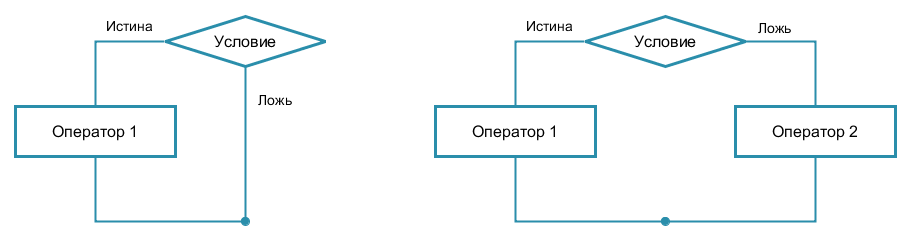
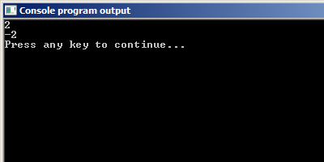

# Условный оператор if -- else

Теперь, когда с условными выражениями разобрались, можно переходить к основной теме урока – условному оператору.

## Шаблон оператора if -- else

Тут возможны два основных варианта:

Листинг 1.

```c
// первый вариант
if (условное_выражение)
  оператор_1;

// второй вариант
if (условное_выражение)
  оператор_1;
else
  оператор_2;
```

Ну и картинки, конечно. Куда же без картинок?



Работает этот оператор так. Вычисляется значение условного выражения. Если получается истина, то выполняется `оператор_1` из основной ветки, а если ложь, то либо ничего не происходит (в первом варианте), либо выполняется `оператор_2` из побочной ветки (во втором варианте).

Предлагаю сразу на примерах разбираться. Например, как вы думаете, что выведет на экран следующий код? Проверьте свою догадку.

Листинг 2.

```c
#include <stdio.h>

int main(void) {

  if ( 1 )
    printf("TRUE!\n");
  else
    printf("FALSE!\n");

  return 0;
}
```

Ну да, правильно, он выведет `TRUE!`. Условие же истинно. Вы же ещё не забыли, что единица – это истина? Я сейчас страшное скажу. Любое ненулевое число воспринимается как истина. Проверьте это самостоятельно.

Проверьте, не ленитесь! Проверили? Ну ладно, а теперь вот такой пример. Что по-вашему выведет данная программа?

Листинг 3.

```c
#include <stdio.h>

int main(void) {

  if ( 0 )
    printf("FALSE!\n");

  return 0;
}
```

Надеюсь, вы дали правильный ответ и вас не смутила строчка с выводом `FALSE!`, которую я специально добавил, чтобы запутать вас. Да, эта программа ничего не выведет. Условие в скобах ложно, а значит, оператор не будет выполнен. Всё по правилам.

Давайте ещё один примерчик, для закрепления. Будьте предельно внимательны, я там подготовил для вас всякого. Итак, что выведет данный код?

Листинг 4.

```c
#include <stdio.h>

int main(void) {

  int x = 12;

  if ( !( !( x%3 == 0) && !( x%2 == 0 ) ) )
    printf("kratno\n");
  else
    printf("ne kratno\n");

  return 0;
}
```

Верю, что у вас всё получилось! Если не получилось, не расстраивайтесь -- ещё будет время потренироваться.

Ну а сейчас давайте о нюансах -- они, как обычно, имеются.

**Нюанс 1:** В каждой ветке условного оператора может быть записан лишь ОДИН оператор.

Вот, посмотрите на пример.

Листинг 5.

```c
#include <stdio.h>

int main(void) {

  int x = 0;
  scanf("%d", &x);

  if ( x < 0 )
    printf("x = %d\n", x);
    x = (-1)*x;

  printf("%d\n", x);

  return 0;
}
```

Кажется, что программа должна работать следующим образом. Пользователь вводит целое число. Если число меньше нуля, то меняем его знак на противоположный. В противном случае ничего не делаем. После этого выводим число на экран консоли.

А теперь внимание на экран.



Но решение есть! И это решение -- `составной оператор {}`. Если мы заключим несколько операторов в фигурные скобки, то они будут восприниматься как один единый оператор. Поэтому, чтобы программа заработала правильно, добавим в неё составной оператор:

Листинг 6.

```c
#include <stdio.h>

int main(void) {

  int x = 0;
  scanf("%d", &x);

  if ( x < 0 ){
    printf("x = %d\n", x);
    x = (-1)*x;
  }

  printf("%d\n", x);

  return 0;
}
```

Ну вот, теперь совсем другой коленкор! Проверьте самостоятельно. Кстати, из опыта. Я вам настоятельно советую всегда использовать фигурные скобки, даже если внутри них будет один оператор. Очень часто это позволяет избежать глупых ошибок. С другой стороны, когда вы захотите добавить ещё один оператор, вы уже точно не забудете поставить фигурные скобки.


**Нюанс 2:** Внутри управляющей конструкций `if-else` можно использовать любые конструкции языка, в том числе ещё одну конструкцию `if-else`.

Вот так например:

Листинг 7.

```c
#include <stdio.h>

int main(void) {

  int x = 0;
  scanf("%d", &x);

  if ( x < 0 ) {
    printf("Negative!\n");
  } else {
    if ( x == 0 ){
      printf("Zero!\n");
    } else {
      printf("Positive!\n");
    }
  }
  return 0;
}
```

Думаю, понятно, что используя вложенные условные операторы, вы можете сделать конструкцию аналогичную оператору выбора `switch`.

Использование вложенных условных операторов порождает ещё одну особенность.

**Нюанс 3:** `else` всегда относится к ближайшему `if`, у которого нет своего `else`

Для примера:

Листинг 8.

```c
if ( n > 0 )
  if ( а > b )
    z = a;
  else
    z = b;
```

Согласно нашему правилу, `else` относится к внутреннему (второму) `if`. Если хотим, чтобы `else` относился к внешнему (первому) `if`, то можно воспользоваться составным оператором.

Листинг 9.
```c
if ( n > 0 ) {
  if (а > b)
    z = a;
}
else
  {z = b;}
```
Как я уже упоминал, лучше всегда использовать фигурные скобки, дабы избежать случаев неправильного толкования записи. Искать подобные ошибки в программах очень тяжело. Обратите внимание также на расстановку отступов. Я использую их, чтобы по коду сразу стало ясно, какая ветвь к какому `if` относится.
