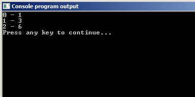

# Цикл со счётчиком for

Давайте вспомним урок про генерацию псевдослучайных чисел: там была муторная, но любопытная задача для самостоятельного исследования. Вот её условие:

**Пример:** Равномерность случайных чисел

> Числа, генерируемые функцией `rand`, имеют равномерное распределение. Это значит, что если запускать функцию `rand` очень много раз и каждый раз записывать, какое число выпало, то различные числа выпадут примерно одинаковое число раз.

> Например, если генерировать только числа `0` и `1`, то через `100` запусков примерно `50` раз выпадет ноль и `50` раз единичка. Обратите внимание, что я говорю примерно. Может быть, например, `49` и `51`, или `53` и `47`.

> Если рассматривать отношение этих чисел к общему количеству генераций, получим `49/100` и `51/100` или `53/100` и `47/100`. Но чем больше экспериментов мы проведём, тем эти значения будут к `1/2`.

> Проведите самостоятельно эксперимент с `10`, `50` и `100` запусками. Это муторно и долго, если делать руками, но что поделать? В будущем мы напишем программу, чтобы проверить свойство равномерности распределения этих псевдослучайных чисел.

Настало время выполнить это обещание. Сперва напишем "в лоб" программу, которая генерирует одно из двух чисел: `0` или `1` десять раз и подсчитывает количество нулей и единиц. 

Листинг 1. 
```c
#include <stdio.h>
#include <stdlib.h>
#include <time.h>

int main(void)
{

        srand(time(NULL));
        
        // переменные для подсчёта выпавших
        // нулей и единиц
        int zeros_count = 0, 
            ones_count = 0;

        int rand_number; 

        // первый эксперимент
        rand_number = rand() % 2;
        if (rand_number) {
                ones_count = ones_count + 1;
        } else {
                zeros_count = zeros_count + 1; 
        }

        // второй эксперимент
        rand_number = rand() % 2;
        if (rand_number) {
                ones_count = ones_count + 1;
        } else {
                zeros_count = zeros_count + 1; 
        }

        // третий эксперимент
        rand_number = rand() % 2;
        if (rand_number) {
                ones_count = ones_count + 1;
        } else {
                zeros_count = zeros_count + 1; 
        }
        
        // четвёртый эксперимент
        rand_number = rand() % 2;
        if (rand_number) {
                ones_count = ones_count + 1;
        } else {
                zeros_count = zeros_count + 1; 
        }
        
        // пятый эксперимент
        rand_number = rand() % 2;
        if (rand_number) {
                ones_count = ones_count + 1;
        } else {
                zeros_count = zeros_count + 1; 
        }
        
        // шестой эксперимент
        rand_number = rand() % 2;
        if (rand_number) {
                ones_count = ones_count + 1;
        } else {
                zeros_count = zeros_count + 1; 
        }
        
        // седьмой эксперимент
        rand_number = rand() % 2;
        if (rand_number) {
                ones_count = ones_count + 1;
        } else {
                zeros_count = zeros_count + 1; 
        }
        
        // восьмой эксперимент
        rand_number = rand() % 2;
        if (rand_number) {
                ones_count = ones_count + 1;
        } else {
                zeros_count = zeros_count + 1; 
        }
        
        // девятый эксперимент
        rand_number = rand() % 2;
        if (rand_number) {
                ones_count = ones_count + 1;
        } else {
                zeros_count = zeros_count + 1; 
        }
        
        // десятый эксперимент
        rand_number = rand() % 2;
        if (rand_number) {
                ones_count = ones_count + 1;
        } else {
                zeros_count = zeros_count + 1; 
        }
  
        printf("0 - %d\n1 - %d\n", zeros_count, ones_count);

        return 0;
}
```

Если вы не понимаете, как работает данная программа, то проработайте уроки [Приручаем случайность](../4/sluchainie_chisla_na_c.php) и [Инструкция if-else](../6/operator_if_else.php).

Программа получилась объемной (почти 100 строк кода), но довольно простой. В ней одни и те же действия (генерация случайного числа и условная конструкция) повторяются буквально без изменений 10 раз. Естественно, что я написал эти действия один раз, а потом просто копипастил ещё девять раз, изменяя только комментарии.

Результат трёх запусков этой программы представлен на рисунке ниже.



Как видите, результат не очень устойчивый. Иногда значения распределяются ровно поровну или почти поровну, а иногда ни одного нуля на десять единиц. 

Теперь наша задача состоит в том, чтобы увеличить количество экспериментов до `100` раз. Конечно, можно было бы ещё несколько раз сделать copy-paste (осуждаю!). Другой вариант:  запустить программу ещё `7` раз и вручную сложить результаты всех `10` запусков полученные результаты, но и это не самый удобный вариант.

Я предлагаю изучить цикл `for` и с его помощью справиться с этой проблемой.


## Синтаксис цикла `for`

Листинг 2.
```c
for (инициализация; управлящее_выражение; модификация) // заголовок цикла
        инструкция;                                    // тело цикла
```

Циклическая конструкция `for` состоит из двух частей: =заголовок цикла= и =тело цикла=.

### Тело цикла

=Тело цикла= -- это **одна** инструкция, которую необходимо повторить несколько раз. Если нужно повторить несколько инструкций, а не одну, то используем фигурные скобки `{ }`. Мы уже разбирались с ними, когда изучали условную инструкцию `if`.

Применительно к нашей задаче тело цикла `for` будет выглядеть следующим образом:

Листинг 3.
```c
{ // начало тела цикла
        rand_number = rand() % 2;
        if (rand_number) {
                ones_count = ones_count + 1;
        } else {
                zeros_count = zeros_count + 1; 
        }
} // конец тела цикла
```

В теле цикла две инструкции: присваивание и `if-else`. Как раз те самые, которые я копипастил. А раз их две, то пришлось "обернуть" их в фигурные скобки.

Разберём подробно из чего состоит управляющая конструкция `for`.

### Структура заголовка цикла `for`

Заголовок начинается с ключевого слова `for` после которого в круглых скобках записаны три выражения, разделённые символом `;`:

1. инициализация (выражение 1);
2. управляющее выражение (выражение 2);
3. модификация (выражение 3);

Первое выражение -- **инициализация**.

Чаще всего в этой части мы создаём =переменную-счетчик= (параметр) и присваиваем ей начальное значение. Это настолько типичная ситуация, что цикл `for` очень часто называют =цикл со счётчиком= или =цикл с параметром=.

В качестве счётчика, как правило, выступает целочисленная переменная, но если того требует задача, то можно использовать и переменные других типов, например:

Листинг 4.
```c
// объявляем переменную-счётчик exp_number
// присваиваем ей значение 0
for (int exp_number = 0; ; )

// объявляем целочисленную переменную-счётчик i 
// присваиваем ей значение 0
for (int i = 0; ; )

// объявляем переменную t типа double
// присваиваем ей значение 0.0
for (double t = 0.0; ; )
```

Обратите внимание, что в последнем примере в качестве параметра цикла используется переменная типа `double`. 

Созданную в этом блоке переменную мы можем использовать в любом месте цикла `for` как в заголовке, так и в теле цикла.

Вторая часть заголовка –- **управляющее выражение**.

Это самая важная часть в заголовке цикла, т.к. именно это выражение определяет надо ли выполнять тело цикла или нет. Поэтому его иногда называют =условием цикла=. 

Тело цикла `for` будет выполняться до тех пор, пока значение управляющего выражения будет истинно. 

Чаще всего в качестве управяющего выражения используют простое или составное логическое выражение. Вот несколько примеров:

Листинг 5.
```c
// выполняем тело цикла, если exp_number < 100
for (int exp_number = 0; exp_number < 100; )

// выполняем тело цикла, пока i не равно нулю
for (int i = 127; i != 0; )

// выполняем тело цикла, если t <= 1.0
for (double t = 0.0; t <= 1.0; )
```

И последнее выражение -- **модификация**.

В этой части мы указываем, какие действия нужно выполнить после каждого выполнения тела цикла. 

Чаще всего в этой части записывают, как необходимо изменить переменную-счётчик или параметр цикла после каждой итерации. =Итерацией= программисты называют одно повторение тела цикла.

Например:
Листинг 6.
```c
// увеличиваем переменную-счётчик exp_number на единицу
for (int exp_number = 0; exp_number < 100; exp_number = exp_number + 1)

// каждый раз уменьшаем счётчик на 1 
for (int i = 127; i != 0; i = i - 1)

// увеличиваем параметр t на одну сотую
for (double t = 0.0; t <= 1.0; t = t + 0.01)
```

Разобравшись с составными частями цикла `for`, давайте опишем, как же он работает.

## Как работает цикл `for`

1. Ключевое слово `for` сообщает программе, что далее записана циклическая конструкция.
2. Выполняется **инициализация**.
3. Вычисляется, если необходимо, значение **управляющего выражения**.
4. Если значение управляющего выражения `ЛОЖЬ`, то выполнение цикла прерывается. Поток выполнения переходит к инструкции, записанной после **тела цикла**.
5. Если значение управляющего выражения `ИСТИНА`, то выполняется тело цикла.
6. Выполняется **модификация**. 
7. Возвращаемся к пункту `3`.

Для наглядности я нарисовал блок-схему, иллюстрирующую работу цикла `for`.  


Что же мы видим.
Сперва единожды выполняетcя **инициализация**.
Затем начинается циклическая часть, состоящая из трёх шагов:
- проверяем **условие цикла**;
- выполняем тело цикла;
- выполняем **модификацию**.

Циклическая часть выполняется до тех пор, пока управляющее выражение не примет значение ЛОЖЬ.

Обратите внимание, что сперва проверяется условие цикла, а лишь затем, если оно ИСТИНА, выполняется тело цикла. Т.к. условие проверяется **перед** телом цикла циклическую инструкцию `for` относят к =циклам с предусловием=.
Как следствие, нам важно понимать, что если при первой проверке условие ложно, то тело цикла не выполнится ни разу.

Используя полученные знания о цикле `for`, перепишем программу из Листинга 1.

Листинг 7.
```c
#include <stdio.h>
#include <stdlib.h>
#include <time.h>

int main(void)
{
        srand(time(NULL));
        
        // переменные для подсчёта нулей и единиц
        int zeros_count = 0, 
            ones_count = 0;

        int rand_number;

        for (int exp_num = 0; exp_num < 100; exp_num = exp_num + 1) {
                rand_number = rand() % 2;
                if (rand_number) {
                        ones_count = ones_count + 1;
                } else {
                        zeros_count = zeros_count + 1; 
                }
        } 

        printf("0 - %d\n1 - %d\n", zeros_count, ones_count);

        return 0;
}
```

Результат трёх запусков этой программы представлен на рисунке ниже:


Программа стала **существенно** короче и нагляднее.

Давайте пошагово опишем процесс работы цикла `for` в этой программе.

- Встретили ключевое слово `for`, значит здесь начинается циклическая конструкция. 
- Инициализация: `int exp_num = 0`. Заводим переменную-счётчик `exp_num` и присваиваем ей значение `0`.
- Проверяем условие `exp_num < 100`. Т.к. `exp_num = 0`, то условие `ИСТИНА`.
- Т.к. условие истинно, то выполняем тело цикла. Генерируем число от `0` до `1`. С помощью `if-else` определяем, какое число было сгенерировано, и увеличиваем значение соответствующей переменной на единицу.
- Модификация: `exp_num = exp_num + 1`. Т.е. теперь `exp_num = 0 + 1 = 1`.
- Возвращаемся к управляющему выражению.
- Проверяем условие `exp_num < 100`. Т.к. `exp_num = 1`, то условие `ИСТИНА`.
- Выполняем тело цикла. Генерируем число от `0` до `1`. С помощью `if-else` определяем, какое число было сгенерировано, и увеличиваем значение соответствующей переменной.
- Выполняем модификацию. Теперь `exp_num = 1 + 1 = 2`. 
- Возвращаемся к управляющему выражению.
- ...

И так ещё `98` раз (от `exp_num = 2` до `exp_num = 99`), пока `exp_num` не станет равным `100`. В этом случае при проверке условия получим `ЛОЖЬ`, т.к. выражение `100 < 100` ложно. Выполнение цикла прерывается. Программа начинает выполнять инструкции, расположенные за циклом.

Прежде чем продолжить, давайте подумаем о том, насколько циклическая конструкция `for` упрощает жизнь программистам. 

Используя `for` мы можем буквально парой строк заставить программу выполнить хоть миллион повторений каких-либо инструкций. 

Ранее для нас это было практически невыполнимой задачей, а теперь достаточно поменять в заголовке число `100` на `1000000` и всё готово. Круто же!

Но, допустим, что кто-то всё-таки путём copy-paste сделал программу, которая проводит миллион экспериментов (представляете, сколько в ней строк и сколько будет весить файл с исходником?). Но что, если мы решим немного изменить эксперимент и генерировать числа от `0` до `3`, а не только `0` и `1`. Или захотим выводить промежуточные результаты после каждых `10000` испытаний. Внести необходимые изменения в Листинг 7 довольно легко, а вот нашему оппоненту, который не пожелал воспользоваться циклом `for` и понадеялся на копипаст, придётся попотеть.

Перейдём к разбору практических примеров.

Посмотрите на следующий код:
Листинг 8.
```c
#include <stdio.h>

int main(void)
{       
        for (int i = 0; i < 5; i = i + 1);
                printf("Hello, World!\n");
        
        return 0;
}
```

Может показаться, что он выведет пять строк `Hello, World!`. Но если мы его запустим, то на экране увидим только одну строку `Hello, World!`. Проверьте это самостоятельно.

Это произошло из-за того, что после заголовка цикла мы записали `;`. 

% **Важно!**
Заголовок и тело цикла вместе составляют ОДНУ составную инструкцию. Весь код от ключевого слова `for` и до самого конца тела цикла является одной инструкцией.

Но почему же тогда компилятор не сообщил нам об ошибке? Дело в том, что в языке Си есть так называемая =пустая инструкция (null statement, empty statement)=. Она состоит из знака `;` и нужна для того, чтобы ничего не делать. Т.е. она ничего не делает, но при этом всё же является инструкцией. 

И раз тело цикла -- это **всегда** одна инструкция, то в данном случае этой одной инструкцией является пустая инструкция `;`. И Листинг 8, если в нём правильно расставить отступы можно переписать так:

Листинг 9:
```c
#include <stdio.h>

int main(void)
{       
        for (int i = 0; i < 5; i = i + 1) // заголовок цикла
                ;  // тело цикла, состоящее из пустой инструкции
    
        printf("Hello, World!\n");
        
        return 0;
}
```

Так что мы написали программу, которая в цикле `5` раз делает "ничего", а потом выводит строку `Hello, World!`.

Чтобы избежать этого недоразумения:

% **Рекомендация:**
Всегда заключайте тело цикла в фигурные скобки `{ }`.

Конечно, это не панацея, но скорее всего запись вида:
 `for (int i = 0; i < 5; i = i + 1); {` сразу бросится вам в глаза своей нелепостью и вы захотите убрать лишнюю `;`.
    
Кстати, чтобы обозначить окончание цикла `for` отдельная `;` не нужна, для этого используется `;`, которой завершается тело цикла. Если же тело цикла записано в фигурных скобках, то роль этой `;` выполняет закрывающая фигурная скобка `}`.

Листинг 10:
```c
#include <stdio.h>

int main(void)
{       
        for (int i = 1; i < 5; i = i + 1) 
                printf("Hello, World!\n"); // здесь ; завершает
                                           // и вызов функции printf
                                           // и цикл for

        for (int i = 1; i < 5; i = i + 1) {
                printf("Hello, World!\n");
        } // здесь роль ; обозначающей конец инструкции for 
          // выполняет закрывающая фигурная скобка

        return 0;
}
```

% **Нюанс**
Выражения для инициализации и модификации могут быть опущены, но разделяющие `;` должны остаться всё равно.

Давайте перепишем нашу программу из Листинга 7 так, чтобы пользователь мог сам задать количество экспериментов.

Листинг 11:
```c
#include <stdio.h>
#include <stdlib.h>
#include <time.h>

int main(void)
{
        srand(time(NULL));
        
        int zeros_count = 0, 
            ones_count = 0;

        int rand_number;
        int exp_num = 0;

        printf("Enter the total number of experiments: ");
        scanf("%d", &exp_num);

        for ( ; exp_num > 0; ) { // в заголовке цикла опущены выражения 1 и 3
                // в качестве переменной-счётчика используем 
                // переменную exp_num, объявленную до цикла

                rand_number = rand() % 2;
                if (rand_number) {
                        ones_count = ones_count + 1;
                } else {
                        zeros_count = zeros_count + 1; 
                }

                // выражение изменяющее переменную-счётчик
                // перенесено в конец тела цикла
                // после каждого эксперимента уменьшаем exp_num на 1
                exp_num = exp_num - 1; 
        }

        printf("0 - %d\n1 - %d\n", zeros_count, ones_count);

        return 0;
}
```

Здесь мы вне цикла объявляем переменную `exp_num`, куда записываем число введённое пользователем. Затем мы используем эту переменную в управляющем выражении цикла `for`.

Эта программа по прежнему будет корректно работать, хотя мы оставили пустыми выражения 1 и 3 в заголовке цикла. Конечно, исправить программу из листинга 7 можно было гораздо проще, не опуская выражения 1 и 3 в заголовке цикла `for`. Мне же захотелось просто показать вам, что цикл `for` может работать и без этих выражений.


% **Важно!**
Всегда следите за тем, чтобы в теле цикла или блоке модификации (выражение 3) происходило изменение переменных от которых зависит управляющее выражение (выражение 2).

Для иллюстрации того, к чему это может привести, давайте закомментируем в Листинге 11 строку с изменением значения переменной `exp_num`.

Листинг 12.
```c
#include <stdio.h>
#include <stdlib.h>
#include <time.h>

int main(void)
{
        srand(time(NULL));
        
        int zeros_count = 0, 
            ones_count = 0;

        int rand_number;
        int exp_num = 0;

        printf("Enter the total number of experiments: ");
        scanf("%d", &exp_num);

        for ( ; exp_num > 0; ) { 
                rand_number = rand() % 2;
                if (rand_number) {
                        ones_count = ones_count + 1;
                } else {
                        zeros_count = zeros_count + 1; 
                }

                // закоментировали строку с изменением значения exp_num
                // exp_num = exp_num - 1; 
        }

        printf("0 - %d\n1 - %d\n", zeros_count, ones_count);

        return 0;
}
```

Если запустить эту программу, то она будет работать некорректно. Мы введём число, но программа не выведет нам результат. 


При этом программа работает: занимает оперативную память и "пожирает" ресурсы процессора:


Дело в том, что наша программа =зациклилась= (произошло =зацикливание (looping)=). Так говорят, когда программа попала в цикл из которого не может выйти. 

Давайте разбираться. Я ввёл в программе значение `5`, оно было записано в переменную `exp_num`. 
Далее началось выполнение цикла. Проделаем пару итераций "на листочке".

1. Инициализация пустая. Поэтому этот шаг пропускаем.
2. Вычисляем значение управляющего выражения. Т.к. `exp_num = 5`, то получаем `5 > 0` -- `ИСТИНА`.
3. Выполняем тело цикла. Генерируем число и увеличиваем соответствующий счётчик.
4. Выражение 3 отсутствует, а значит пропускаем его. И снова переходим к вычислению значения управляющего выражения.
5. ...

Так, стоп! С момента, когда мы в прошлый раз проверяли условие выполнения цикла значение в переменной `exp_num` никак не изменилось. А значит мы снова получим ИСТИНУ. И так будет повторяться раз за разом. 

Давайте в теле цикла выведем значение `exp_num` на экран.

Листинг 13.
```c
#include <stdio.h>
#include <stdlib.h>
#include <time.h>

int main(void)
{
        srand(time(NULL));
        
        int zeros_count = 0, 
            ones_count = 0;

        int rand_number;
        int exp_num = 0;

        printf("Enter the total number of experiments: ");
        scanf("%d", &exp_num);

        for ( ; exp_num > 0; ) { 
                rand_number = rand() % 2;
                if (rand_number) {
                        ones_count = ones_count + 1;
                } else {
                        zeros_count = zeros_count + 1; 
                }

                printf("exp_num = %d\n", exp_num);

                // закоментировали строку с изменением значения exp_num
                // exp_num = exp_num - 1; 
        }

        printf("0 - %d\n1 - %d\n", zeros_count, ones_count);

        return 0;
}
```


Как видите, значение переменной `exp_num` не изменяется от итерации к итерации, а потому значение управляющего выражения всегда остаётся истинным, а значит тело цикла будет выполняться бесконечно. Ну, ладно, по крайней мере до тех пор, пока нам это не надоест и мы не завершим принудительно выполнение программы или не выключим компьютер. =)


### Примеры использования цикла `for`

Давайте разберём несколько базовых примеров использования управляющей инструкции `for`.

> **Пример 1.** Напишем программу, которая выводит таблицу умножения на число `7`. Сначала в прямом порядке, а потом в обратном.

Листинг 14:
```c
#include <stdio.h>

int main(void)
{
        int base = 7; 
        // прямой порядок

        // создаём переменную счётчик i и присваиваем ей значение 1
        // выполняем тело цикла до тех пор, пока i <= 10
        // после каждой итерации увеличиваем значение i на 1
        for (int i = 1; i <= 10; i = i + 1) {
                printf("%2d X %2d = %2d\n", base, i, base * i);
        }

        printf("\n");
        // обратный порядок

        // создаём переменную счётчик i и присваиваем ей значение 10
        // выполняем тело цикла до тех пор, пока i > 0
        // после каждой итерации уменьшаем значение i на 1
        for (int i = 10; i > 0; i = i - 1) {
              printf("%2d X %2d = %2d\n", base, i, base * i);  
        }

        return 0;
}
```

Обратите внимание на следующий момент. Мы как будто бы два раза объявили в программе переменную с именем `i`: сначала в заголовке первого цикла, а потом в заголовке второго цикла.

На самом деле, ошибки здесь нет. Дело в том, что переменная `i`, которую мы объявили в заголовке первого цикла, видна лишь внутри первого цикла `for`. Ещё говорят, что =область видимости= переменной `i` ограничена циклом `for`. После завершения цикла эта переменная и вовсе удаляется . Или, говоря более профессиональным языком, =время жизни переменной= ограничено выполнением цикла `for`. 

% **Важно:**
Переменная, объявленная в блоке инициализация, доступна только в пределах цикла. После выхода из цикла переменная удаляется.

Если, например, мы попробуем вывести значение переменной `i` вне цикла, то программа даже не скомпилируется. Компилятор будет ругаться на то, что мы пытаемся использовать необъявленную переменную `i`. Убедитесь в этом самостоятельно, скомпилировав программу из Листинга 15.

Листинг 15.
```c
#include <stdio.h>

int main(void)
{
        int base = 7; 
 
        for (int i = 1; i <= 10; i = i + 1) {
                printf("%2d X %2d = %2d\n", base, i, base * i);
        }

        printf("%d", i); // ОШИБКА! Переменная i здесь уже не существует
        printf("\n");
 
        for (int i = 10; i > 0; i = i - 1) {
              printf("%2d X %2d = %2d\n", base, i, base * i);  
        }

        return 0;
}
```

Следующий код не приведёт ни к каким ошибкам. 

Листинг 16:
```c
#include <stdio.h>

int main(void)
{
        int base = 7; 
        int i;
        for (i = 1; i <= 10; i = i + 1) {
                printf("%2d X %2d = %2d\n", base, i, base * i);
        }

        printf("%d", i); // Здесь i = 11 
        printf("\n");
 
        for (i = i - 1; i > 0; i = i - 1) {
              printf("%2d X %2d = %2d\n", base, i, base * i);  
        }

        return 0;
}
```

Т.к. мы объявили переменную до цикла `for`, то её область видимости -- от момента объявления и до конца тела функции `main`. В этот раз в блоке инициализации первого цикла мы уже не создаём переменную, а лишь присваиваем значение `1` уже существующей переменной.


> **Пример 2.**  Напишем программу, которая выводит на экран сумму натуральных чисел из промежутка `[A;B]`. Числа `A` и `B` (`B > A > 0`) вводятся пользователем.

Листинг 17.
```c
#include <stdio.h>

int main(void)
{
        int a = 0, b = 0;
        scanf("%d %d", &a, &b);
        
        int sum = 0; // сюда будем записывать результат

        // создаём переменную счётчик k и присваиваем ей значение a
        // выполняем тело цикла до тех пор, пока k <= b
        // после каждой итерации 
        // увеличиваем значение k на 1 (выражение 3)
        for (int k = a; k <= b; k = k + 1) {
                // добавляем к текущему значению sum значение переменной k
                sum = sum + k;
        }

  printf("%d\n", sum);

  return 0;
}
```

Обратите внимание, что в этой программе мы инициализируем переменную-счётчик не просто числом, а значением переменной `a`. 

Давайте пошагово разберём работу этой программы.

Предположим, пользователь ввёл `A = 3` и `B = 6`. 

Программа должна вычислить сумму чисел от `3` до `6` включительно: `3 + 4 + 5 + 6 = 18`.

**Шаг 1:** 
Значения переменных `a = 3`, `b = 6` (ввёл пользователь), `sum = 0` (начальное значение суммы)

**Шаг 2:** Запуск цикла и первая итерация.
- Блок инициализации: `k = a = 3`
- Проверка условия: `k <= b` → `3 <= 6` → `ИСТИНА` → выполняем тело цикла
- Тело цикла: `sum = sum + k` → `sum = 0 + 3` → `sum = 3`
- Блок модификации: `k = k + 1` → `k = 3 + 1` → `k = 4`

**Шаг 3:** Вторая итерация цикла
- Проверка условия: `k <= b` → `4 <= 6` → `ИСТИНА` → выполняем тело цикла
- Тело цикла: `sum = sum + k` → `sum = 3 + 4` → `sum = 7`
- Блок модификации: `k = k + 1` → `k = 4 + 1` → `k = 5`

**Шаг 4:** Третья итерация цикла
- Проверка условия: `k <= b` → `5 <= 6` → `ИСТИНА` → выполняем тело цикла
- Тело цикла: `sum = sum + k` → `sum = 7 + 5` → `sum = 12`
- Блок модификации: `k = k + 1` → `k = 5 + 1` → `k = 6`

**Шаг 5:** Четвёртая итерация цикла
- Проверка условия: `k <= b` → `6 <= 6` → `ИСТИНА` → выполняем тело цикла
- Тело цикла: `sum = sum + k` → `sum = 12 + 6` → `sum = 18`
- Блок модификации: `k = k + 1` → `k = 6 + 1` → `k = 7`

**Шаг 6:** Пятая итерация цикла
- Проверка условия: `k <= b` → `7 <= 6` → `ЛОЖЬ` → выходим из цикла

**Результат:** `sum = 18`, программа выводит `18` на экран.

Иногда, когда в программах с циклами появляются ошибки, бывает полезно прогнать цикл "на листочке", выписывая значения переменных, участвующих в цикле, в виде таблицы:

```
| Итерация | k | k <= b | sum до | sum после |
|----------|---|--------|--------|-----------|
| Инициал. | 3 | -      | 0      | 0         |
| 1        | 3 | ИСТИНА | 0      | 3         |
| 2        | 4 | ИСТИНА | 3      | 7         |
| 3        | 5 | ИСТИНА | 7      | 12        |
| 4        | 6 | ИСТИНА | 12     | 18        |
| 5        | 7 | ЛОЖЬ   | 18     | -         |
```

> **Пример 3.** Напишем программу, которая вычисляет сумму всех **чётных** чисел из промежутка `[A; B]`.

До сих пор мы использовали цикл `for` с шагом `1`: после каждой итерации мы увеличивали или уменьшали переменную-счётчик на единицу. Но что делать, если нам нужно перебирать числа с другим шагом? 

Для этого достаточно изменить блок модификация в заголовке цикла. Вместо `i = i + 1` мы будем использовать `i = i + 2`, чтобы перепрыгивать через нечётные числа.

Листинг 18.
```c
#include <stdio.h>

int main(void)
{
        int a = 0, b = 0;
        scanf("%d %d", &a, &b);
        
        int sum = 0; // сюда будем записывать сумму чётных чисел

        // находим первое чётное число в промежутке [a; b]
        // если a чётное, то start = a
        // если a нечётное, то start = a + 1 (следующее чётное число)
        int start = a;
        if (a % 2 != 0) { // проверка на чётность
                start = a + 1;
        }

        // создаём переменную счётчик i и присваиваем ей значение start
        // выполняем тело цикла до тех пор, пока i <= b
        // после каждой итерации увеличиваем значение i на 2
        // таким образом перебираем только чётные числа
        for (int i = start; i <= b; i = i + 2) {
                // добавляем к текущему значению sum значение переменной i
                sum = sum + i;
        }

        printf("%d\n", sum);

        return 0;
}
```

В этой программе мы используем операцию остатка от деления `%` для проверки чётности числа. Если `a % 2 != 0`, то число `a` нечётное, и мы начинаем перебор со следующего числа `a + 1`.

Обратите внимание, что шаг цикла может быть любым числом, не только `1` или `2`. Например, можно перебирать числа с шагом `3`, `5`, `10` или любым другим значением, которое требуется для решения конкретной задачи. Кроме того, надо понимать, что мы можем не только добавлять или отнимать какое-то число, мы можем производить **любые**, требуемые нам изменения.


> **Пример 4.** Пусть пользователь вводит `5` целых чисел. Напишем программу, которая считает сумму **положительных** чисел, введённых пользователем. Отрицательные числа суммировать не нужно.

Листинг 19
```c
#include <stdio.h>

int main(void)
{
        int sum = 0; // переменная для хранения итоговой суммы

        // объявляем переменную-счётчик i и присваем ей значение 0
        // выполняем тело цикла, пока i < 5 (5 раз)
        // после каждой итерации увеличиваем i на единицу
        for (int i = 0; i < 5; i = i + 1) {
                // объявляем временную переменную
                // и считываем в неё значение
                int number;            
                scanf("%d", &number); 

                // проверяем условие суммирования (положительное число)
                if (number > 0) {
                        // если условие выполнено, то добавляем число 
                        // к текущему значению суммы
                        sum = sum + number;
                } 
        }

        printf("%d\n", sum);

        return 0;
}
```

Результат работы программы на различных входных данных.


Этот пример показывает нам, что внутри тела цикла мы вольны использовать любые другие инструкции языка Си.

Обратите внимание, что в данной программе мы как бы "фильтруем" входные данные. 
Мы в цикле считываем 5 чисел. Но на каждой итерации мы проверяем подходит ли оно нам это число или нет. Если подходит, то выполняем суммирование, а если не подходит, то ничего не делаем.


## Вложенные циклы for

До сих пор мы рассматривали программы с одним циклом `for`. Но что делать, если нам нужно выполнить повторяющиеся действия, которые сами по себе содержат повторяющиеся действия? 

> **Пример 5.** Напишем программу, которая будет выводить на экран таблицу Пифагора.

Для решения этой задачи нам понадобится использовать один цикл внутри другого. Такая конструкция называется =вложенными циклами=.

Листинг 20:
```c
#include <stdio.h>

int main(void)
{
        // внешний цикл: перебираем числа от 1 до 10
        // переменная i будет обозначать первый сомножитель
        for (int i = 1; i <= 10; i = i + 1) {
                // внутренний цикл: перебираем числа от 1 до 10
                // переменная j будет обозначать второй сомножитель
                for (int j = 1; j <= 10; j = j + 1) {
                        // выводим произведение i * j
                        // используем форматирование для красивого вывода
                        printf("-%4d", i * j);
                }
                // после того, как вывели все произведения для числа i,
                // переходим на новую строку
                printf("\n");
        }

        return 0;
}
```

Давайте разберём, как работает эта программа.

В программе есть два цикла `for`:
- =внешний цикл= с переменной-счётчиком `i` (от `1` до `10`);
- =внутренний цикл= с переменной-счётчиком `j` (тоже от `1` до `10`).

Внутренний цикл записан в теле внешнего цикла. Это означает, что для каждого значения `i` внешний цикл полностью выполнит внутренний цикл со всеми значениями `j` от `1` до `10`.

Пошагово опишем процесс работы программы:

1. Внешний цикл начинает работу: `i = 1`.
2. Проверяем условие внешнего цикла: `1 <= 10` -- ИСТИНА.
3. Выполняем первую итерацию внешнего цикла:
   - Внутренний цикл начинает работу: `j = 1`.
   - Проверяем условие внутреннего цикла: `1 <= 10` -- ИСТИНА.
   - Выполняем тело внутреннего цикла: выводим `i * j`, т.е `1 * 1 = 1`.
   - Выполняем модификацию переменной-счётчика внутреннего цикла. Теперь `j = 2`.
   - Проверяем условие внутреннего цикла: `2 <= 10` -- ИСТИНА.
   - Выполняем тело внутреннего цикла: выводим `1 * 2 = 2`
   - Выполняем модификацию переменной-счётчика внутреннего цикла. Теперь `j = 3`.
   - Проверяем условие внутреннего цикла: `3 <= 10` -- ИСТИНА.
   - Выполняем тело внутреннего цикла: выводим `1 * 3 = 3`
   - и так далее, пока `j` не станет равным `11`.
4. Когда внутренний цикл завершился (выведены все произведения для `i = 1`), выполняем `printf("\n")` для перехода на новую строку.
5. Выполняем обновление внешнего цикла: `i = i + 1 = 1 + 1 = 2`.
6. Проверяем условие внешнего цикла: `2 <= 10` -- ИСТИНА.
7. Снова выполняем внутренний цикл полностью для `i = 2` (от `j = 1` до `j = 10`).
8. И так далее, пока `i` не станет равным `11`.

В результате программа выведет таблицу размером `10 x 10`, где каждая строка соответствует умножению одного числа на все числа от `1` до `10`.

% **Важно!**
Переменные-счётчики во внешнем и внутреннем циклах должны иметь разные имена. 

В нашем примере мы использовали `i` для внешнего цикла и `j` для внутреннего. Если бы мы использовали одно и то же имя, то внутренний цикл изменил бы значение переменной внешнего цикла, что привело бы к неправильной работе программы.

Обратите внимание на область видимости переменных во вложенных циклах. Переменная `i`, объявленная во внешнем цикле, доступна и во внутреннем цикле. А вот переменная `j`, объявленная во внутреннем цикле, существует только внутри внутреннего цикла и недоступна во внешнем цикле.

Давайте немного модифицируем программу, чтобы она выводила таблицу Пифагора в более читаемом формате с заголовками строк и столбцов.

Листинг 21:
```c
#include <stdio.h>

int main(void)
{
        // выводим заголовок таблицы
        printf("    ");
        for (int j = 1; j <= 10; j = j + 1) {
                printf("%4d", j);
        }
        printf("\n");

        // выводим разделительную линию
        printf("    ");
        for (int j = 1; j <= 10; j = j + 1) {
                printf("----");
        }
        printf("\n");

        // внешний цикл: перебираем числа от 1 до 10 (строки)
        for (int i = 1; i <= 10; i = i + 1) {
                // выводим номер строки
                printf("%2d |", i);
                
                // внутренний цикл: перебираем числа от 1 до 10 (столбцы)
                for (int j = 1; j <= 10; j = j + 1) {
                        // выводим произведение i * j 
                        // ячейка на пересечении i-ой строки и j-го столбца
                        printf("%4d", i * j);
                }
                // переходим на новую строку
                printf("\n");
                // добавляем пустую строку с разделителем, 
                // чтобы таблица получилась более квадратной
                printf("   |\n");
        }

        return 0;
}
```

В этой программе мы добавили два дополнительных цикла `for` для вывода заголовка таблицы. Обратите внимание, что мы можем использовать переменную `j` в разных циклах, потому что каждый раз она объявляется заново и существует только в пределах своего цикла.


Количество уровней вложенности циклов не ограничено. Вы можете вложить цикл в цикл, который вложен в другой цикл, и так далее. Однако на практике редко используется более трёх уровней вложенности, так как это усложняет понимание и отладку программы. 

% **Рекомендация:**
Избегайте чрезмерной вложенности циклов.
