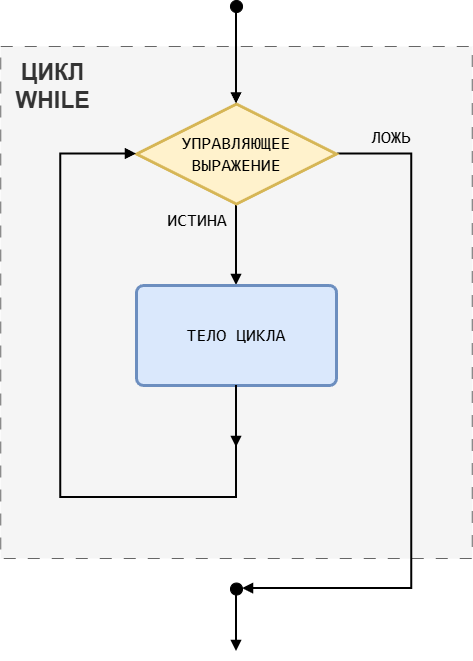
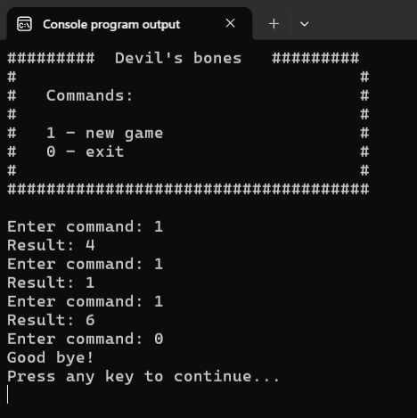
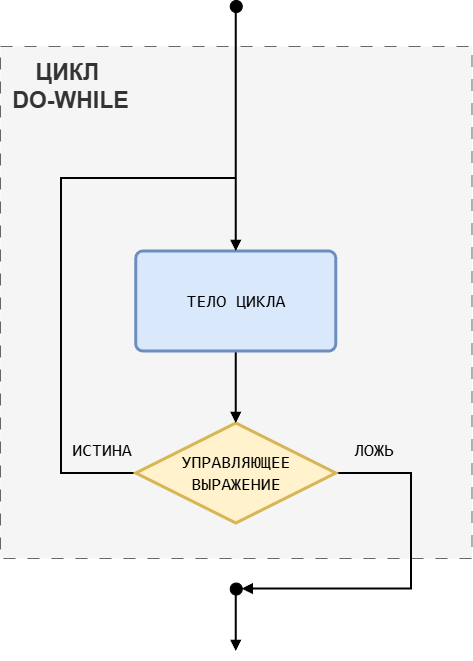

# Циклы с условиями

Цикл `for`, изученный нами в предыдущем уроке, очень удобно применять, когда заранее известно количество итераций или когда это количество можно легко вычислить. Но бывают ситуацию, когда мы не знаем заранее, сколько раз должен выполниться цикл. Например, когда количество повторений зависит от действий пользователя или от данных, с которыми работает программа. Например:

**Программа:** «Игральный кубик» 
> Программа заменяет обычный шестигранный игральный кубик.
>
> Управление:
>
> * 1 -- бросить кубик;
> * 0 -- закончить игру.

Давайте напишем заготовку для нашей программы.

Листинг 1.

```c
#include <stdio.h>
#include <stdlib.h>
#include <time.h>

int main(void)
{
        srand(time(NULL));

        printf("#########  Devil\'s bones   #########\n");
        printf("#                                   #\n");
        printf("#   Commands:                       #\n");
        printf("#                                   #\n");
        printf("#   1 - new game                    #\n");
        printf("#   0 - exit                        #\n");
        printf("#                                   #\n");
        printf("#####################################\n\n");

        int control;
        int value = 0;

        printf("Enter command: ");
        scanf("%d", &control);

        switch (control) {
                case 1:
                      value = 1 + rand() % 6;
                      printf("Result: %d\n", value);
                      break;
                case 0:
                      printf("Good bye!\n");
                      break;
                default:
                      printf("Error! Try again...\n");
                      break;
        }

        return 0;
}
```

Эта программа работает, но работает лишь один раз, а мы бы хотели, чтобы она бросала кубик до тех пор, пока мы сами не решим закончить игру и не введём число `0`. Тут-то мы и сталкиваемся с проблемой. Понятно, что заранее узнать, когда игра закончится невозможно. А значит использовать цикл `for` в лоб не получится. Да и не нужно, ведь есть более элегантный выход -- использование других циклических конструкций. Например, цикла `while`.

## Цикл с предусловием `while`

  ### Синтаксис цикла `while`

Листинг 2.

```c
while (управляющее_выражение)  // заголовок цикла
        инструкция;            // тело цикла
```

Циклическая конструкция `while` состоит из двух уже знакомых нам частей: =заголовок цикла= и =тело цикла=. 

**Заголовок цикла** начинается с ключевого слова `while`, после которого в круглых скобках записывается =управляющее_выражение (условие цикла)= -- логическое выражение, которое определяет, нужно ли выполнять тело цикла или нет.

**Тело цикла** -- это **одна** инструкция, которую необходимо повторить несколько раз.

Как и в случае с циклом `for`, если нужно повторять несколько инструкций, то мы используем фигурные скобки `{}`.

% **Рекомендация:**
Всегда заключайте тело цикла в фигурные скобки `{ }`, даже если оно состоит из одной инструкции. Это делает код более читаемым и помогает избежать ошибок при добавлении новых инструкций.

### Как работает цикл `while`

Работает эта конструкция так:

1. Программа встречает ключевое слово `while`, значит дальше идёт циклическая конструкция;
2. Вычисляется, если необходимо, **управляющее выражение**, записанное в скобках. Иногда ещё говорят, что проверяется условие цикла;
3. Если значение управляющего выражения `ЛОЖЬ`, то выполнение цикла завершается. Управление передаётся на инструкцию, следующую за телом цикла.
4. Если значение условия `ИСТИНА`, то выполняется **тело цикла**. После чего возвращаемся к пункту 2; 

Для наглядности ниже приведена блок-схема, иллюстрирующая работу циклической конструкции `while`.



Обратите внимание, что в цикле `while` (как и в цикле `for`) прежде чем выполнить тело цикла сперва проверяется условие (значение управляющего выражения). Из-за этого `while` так же относится к циклам с предусловием.  

Ещё одно название цикла `while` -- `цикл ПОКА`. Это дословный перевод с английского ключевого слова `while`. Т.е. в самом названии есть подсказка о том, как работает этот цикл.

% **Мнемоническое правило:**
ПОКА условие ИСТИНА, выполняй тело цикла.

Вооружившись базовыми знаниями о цикле `while`, давайте перепишем нашу программу с использованием данного цикла.

Листинг 3. Программа «Игральный кубик» v.1.0
```c
#include <stdio.h>
#include <stdlib.h>
#include <time.h>

int main(void)
{
        srand(time(NULL));

        printf("#########  Devil\'s bones   #########\n");
        printf("#                                   #\n");
        printf("#   Commands:                       #\n");
        printf("#                                   #\n");
        printf("#   1 - new game                    #\n");
        printf("#   0 - exit                        #\n");
        printf("#                                   #\n");
        printf("#####################################\n\n");

        int control;
        int value = 0;

        printf("Enter command: ");
        scanf("%d", &control);
        
        while (control != 0) {
                switch (control) {
                        case 1:
                                value = 1 + rand() % 6;
                                printf("Result: %d\n", value);
                                break;
                        default:
                                printf("Error! Try again...\n");
                                break;
                }

                printf("Enter command: ");
                scanf("%d", &control);
        }
        
        printf("Good bye!\n");

        return 0;
}
```

Опишем алгоритм работы данной программы:

1. Выводим меню пользователя и предложение ввести команду;
2. Считываем код команды в переменную `control`;
3. Встречаем ключевое слово `while`, значит далее следует циклическая конструкция.
4. Проверяем условие `control != 0`;
5. Если пользователь ввёл `0`, то управляющее выражение `control != 0` принимает значение `ЛОЖЬ`. Тело цикла не выполняется. Управление передаётся на следующую за циклом инструкцию. Выводится строка `Good bye!`. Программа завершается.
6. В противном случае, если пользователь ввёл не `0`, выполняем тело цикла.
  - Инструкция `switch`:
    - Если пользователь ввёл `1`, то генерируем случайное число от `1` до `6` и выводим его на экран. Завершаем инструкцию `switch`;
    - Если пользователь ввёл что-то иное, выводим сообщение об ошибке. Завершаем инструкцию `switch`;.
  - Выводим пользователю предложение ввести новую команду;
  - Считываем код команды в переменную `control`;
  - Возвращаемся к проверке условия. Пункт 3.

Результат работы программы на рисунке 2.



Теперь программа работает так, как мы и хотели изначально: мы запускаем её один раз и она генерирует нам значение на кубике до тех пор, пока мы не введём команду `0`.

Вроде бы всё хорошо, но когда я смотрю на этот код, то кое-что меня в нём напрягает. Посмотрите внимательно на код из Листинга 3, вас что-нибудь напрягает? Не кажется ли вам, что там есть что-то лишнее? 

Ладно, не буду вас долго томить, сразу перейдем к делу. Вы заметили, что мы повторяем код

Лиситнг 4.
```c 
printf("Enter command: ");
scanf("%d", &control);
```

в двух разных местах программы: перед циклом и в теле цикла.

При чём в обоих случаях он необходим программе и его нельзя просто взять и удалить. Если мы так сделаем, то программ будет работать неправильно. 

Допустим, мы удалим этот код перед циклом `while`. Тогда на момент проверки условия цикла в переменной `control` будет храниться мусор, т.к. мы её никак не инициализировали при объявлении. Если нам повезёт и в ней окажется значение `1`, то программа сразу смоделирует бросок кубика, выведет результат на экран и предложит ввести очередную команду. Но если в переменной `control` окажется значение `0`, то программа попрощается с нами и сразу же завершится. Если же будет какое-то другое значение, то мы получим сначала сообщение об ошибке и предложение ввести команду ещё раз. В общем, во всех трёх случаях программа ведёт себя не так, как ей следовало бы себя вести.

Теперь допустим, что мы удалили этот кусок кода из тела цикла `while`. Что же произойдёт в этом случае? 

Если мы первой командой введём значение `0`, то программа с нами попрощается и завершится. Так и должно быть. Но вот если мы введём `1` или какое-то другое число, то программа зациклится. Попробуйте это сделать самостоятельно. 

Понимаете почему это произошло? Да, дело в том, что управляющее выражение зависит только от значения переменной `control`. И код, который мы удалили, отвечал за то, чтобы на каждой итерации сохранять в эту переменную новое значение, введённое пользователем. А теперь, когда мы удалили этот кусок, значение в переменной `control` не изменяется между итерациями, а поэтому программа никак не может выйти из цикла.

Давайте пошагово разберём следующий Листинг, чтобы понять как появляется зацикливание.

Листинг 5.
```c
printf("Enter command: ");
scanf("%d", &control);

while (control != 0) {
        switch (control) {
                case 1:
                        value = 1 + rand() % 6;
                        printf("Result: %d\n", value);
                        break;
                default:
                        printf("Error! Try again...\n");
                        break;
        }

        // printf("Enter command: ");
        // scanf("%d", &control);
}
```

Допустим, пользователь вводит значение `2`, это значение сохраняется в переменную `control`;
**Шаг 1.** Программа встречает цикл `while` и проверяет условие `control != 0`. В переменной `control` хранится значение `2`, значит условие `2 != 0` принимает значение `ИСТИНА`. Значит надо выполнить тело цикла;

**Шаг 2.** Выполняется инструкция `switch`. 
- Управляющее выражение вычислять не нужно, оно равно значению переменной `control`, т.е. `2`:
   - Значение `2` не совпадает ни с `case 1:`, ни с `case 0:`, поэтому выполняется ветка `default:`;
   - Выводится сообщение `"Error! Try again...\n"`;
   - Выполняется `break`. Выходим из инструкции выбора `switch`;

**Шаг 3.** Программа доходит до конца тела цикла. Строки `printf("Enter command: ");` и `scanf("%d", &control);` закомментированы, поэтому они не выполняются;

**Шаг 4.** Возвращаемся к проверке условия цикла `while`. В переменной `control` по-прежнему хранится значение `2` (оно не изменилось, т.к. мы не выполняли `scanf`). Управлящее выражение `2 != 0` снова принимает значение `ИСТИНА`;

**Шаг 5.** Тело цикла выполняется снова. Вновь выводится сообщение об ошибке;

**Шаг 6.** Снова возвращаемся к проверке условия. Значение в `control` всё ещё `2`. 

В общем, цикл продолжается бесконечно.

Что же получается, от повтора никак нельзя избавиться? Конечно, можно. Есть различные способы, но мы пока рассмотрим тот, который предполагает использование циклической конструкции `do-while`.


## Цикл с постусловием `do-while`

Цикл `do-while` -- это ещё один вариант циклической конструкции, предусмотренный в языке Си. 

Данный цикл примечателен тем, что управляющее выражение проверяется не перед выполнением тела цикла, а **после** выполнения тела цикла (поэтому это цикл с постусловием). Таким образом тело цикла в любом случае будет выполнено хотя бы один раз (первый).

### Синтаксис цикла `do-while`

Листинг 6.
```c
do
        инструкция;             // тело цикла
while (управляющее_выражение);
```

% **Важно!**
Обратите внимание, что в конце циклической конструкции `do-while` необходимо поставить точку с запятой `;`. Без неё программа не скомпилируется.

Как и во всех других циклических конструкциях, если нам необходимо выполнить в цикле несколько инструкций, то необходимо использовать фигурные скобки `{}`.

### Как работает цикл `do-while`

Работает эта конструкция следующим образом:

1. Программа встречает ключевое слово `do`. Значит далее будет записана циклическая конструкция `do-while`;
2. Выполняется тело цикла;
3. Вычисляется, если необходимо, значение управляющего выражения.
4. Если значение управляющего выражения `ЛОЖЬ`, то выполнение цикла завершается. Управление передаётся на инструкцию, следующую  циклом `do-while`.
5. Если значение -- `ИСТИНА`, то возвращаемся к пункту 2; 

Ещё раз обращаю внимание, что условие проверяется **после** того, как будет выполнено тело цикла. Т.е. тело цикла будет выполнено минимум один раз, даже если условие изначально ложно.

**Мнемоническое правило:** ВЫПОЛНЯЙ тело цикла, ПОКА условие ИСТИНА.

На следующем рисунке изображена блок-схема цикла `do-while`.



Перепишем нашу программу из Листинга 3 с использованием данного типа циклической конструкции.

Листинг 7. Программа «Игральный кубик» v.2.0

```c
#include <stdio.h>
#include <stdlib.h>
#include <time.h>

int main(void)
{
        srand(time(NULL));

        printf("#########  Devil\'s bones   #########\n");
        printf("#                                   #\n");
        printf("#   Commands:                       #\n");
        printf("#                                   #\n");
        printf("#   1 - new game                    #\n");
        printf("#   0 - exit                        #\n");
        printf("#                                   #\n");
        printf("#####################################\n\n");

        int control;
        int value = 0;
        
        do {
                printf("Enter command: ");
                scanf("%d", &control);
                
                switch (control) {
                        case 0:
                                printf("Good bye!\n");
                                break;
                        case 1:
                                value = 1 + rand() % 6;
                                printf("Result: %d\n", value);
                                break;
                        default:
                                printf("Error! Try again...\n");
                                break;
                }

        } while (control != 0); 

        return 0;
}
```

В общем-то очень похоже на предыдущий код. Правда, пришлось вернуть ветку `case 0:` в инструкцию `switch`. Иначе из-за того, что проверка производится после выполнения тела цикла, программа работала бы некорректно. Если бы мы ввели нуля, то выводилось бы сообщение об ошибке. В программе с циклом `while` подобной ситуации быть не могло, т.к. равенство нулю проверялось в условии цикла. При вводе нуля условие стало бы ложью и тело цикла бы не выполнилось.

Опишем алгоритм работы данной программы:

1. Выводим меню пользователя;
2. Встречаем ключевое слово `do`, значит далее следует циклическая конструкция `do-while`;
3. Сразу начинаем выполнять тело цикла (проверка условия происходит только после выполнения тела):
   - Выводим пользователю предложение ввести команду;
   - Считываем код команды в переменную `control`;
   - Выполняем инструкцию `switch`:
     - Если пользователь ввёл `0`, то выводим строку `Good bye!` и завершаем инструкцию `switch`;
     - Если пользователь ввёл `1`, то генерируем случайное число от `1` до `6` и выводим его на экран. Завершаем инструкцию `switch`;
     - Если пользователь ввёл что-то иное, выводим сообщение об ошибке и завершаем инструкцию `switch`;
4. Проверяем условие `control != 0`;
5. Если значение управляющего выражения `ИСТИНА` (пользователь ввёл не `0`), то возвращаемся к пункту 3 и снова выполняем тело цикла;
6. Если значение управляющего выражения `ЛОЖЬ` (пользователь ввёл `0`), то выполнение цикла завершается. Управление передаётся на следующую за циклом инструкцию. 
7. Программа завершается.

Нам удалось избавиться от дублирования одного и того же кода. 

## Сравнение циклов в языке Си

Теперь, когда мы освоили три вида циклических конструкций, у вас могут возникнуть резонные вопросы: "А какая же из них самая крутая? Почему вообще есть три вида циклов? Ведь когда в 5 уроке мы разбирали структурное программирование, то говорилось, что теоретически достаточно лишь одной циклической конструкции ПОКА (цикл ПОКА `while`).

Что ж, давайте разбираться, а заодно посмотрим на типовые примеры использования циклических конструкций.

Самый базовый цикл -- это, конечно, цикл `while`. В принципе, его одного было бы достаточно для любых задач, т.к. циклы `for` и `do-while` можно переписать используя конструкцию `while`. 


Общая схема замены цилка `for` на цикл `while` выглядит следующим образом:

Листинг 8. Схема замены цикла `for` циклом `while`
```c
for (инициализация; условие; модификация){
        тело цикла for;
} 

// меняем на 

инициализация;
while (условие) {
        тело цикла for;
        модицикация;
}
```

Для примера перепишем цикл `for` из прошлого урока (Листинг 7) с использованием цикла `while`.

Листинг 9.
```c
// цикл for из прошлого урока Листинг 7
for (int exp_num = 0; exp_num < 100; exp_num = exp_num + 1) {
        rand_number = rand() % 2;
        if (rand_number) {
                ones_count = ones_count + 1;
        } else {
                zeros_count = zeros_count + 1; 
        }
}


// аналогичный цикл с использованием while
int exp_num = 0;

while (exp_num < 100) {
        rand_number = rand() % 2;
        if (rand_number) {
                ones_count = ones_count + 1;
        } else {
                zeros_count = zeros_count + 1; 
        }

        exp_num = exp_num + 1;
}
```

Эти два куска кода работают аналогично, но цикл `for`, во-первых, записывается более компактно, а во-вторых, наглядно показывает, что происходит с переменной-счётчиком на каждой итерации. 

Когда мы используем здесь цикл `while`, то нам надо быть более внимательными, чтобы сначала объявить переменную счётчик, а потом проверить, что в теле цикла происходит её изменение. В цикле `for` всё это делается в заголовке цикла, поэтому случайно забыть что-то из этого будет сложнее.

Кроме того, как мы помним переменная, созданная в заголовке цикла `for` существует пока работает цикл `for`, это позволяет чуть-чуть более эффективно использовать память, выделенную нашей программе.  


### Когда использовать for
Цикл `for` обычно используют:

- при переборе массивов и строк (с этими структурами данных вы познакомитесь чуть позже в Курсе);
- когда известно точное количество итераций, которые надо выполнить;
- если есть явная переменная-счётчик, которая изменяется по очень простым правилам.


Цикл `do-while` можно заменить циклом `while`. Общая схема будет выглядеть так:

Листинг 10. Схема замены цикла `do-while` циклом `while`
```c
do {
        тело цикла do-while;
} while(условие);

// заменяется на 

тело цикла do-while;
while (условие) {
        тело цикла do-while;
}
```

Давайте проведём замену по этой схеме в Листинге 7 этого урока.

Листинг 11.
```c
#include <stdio.h>
#include <stdlib.h>
#include <time.h>

int main(void)
{
        srand(time(NULL));

        printf("#########  Devil\'s bones   #########\n");
        printf("#                                   #\n");
        printf("#   Commands:                       #\n");
        printf("#                                   #\n");
        printf("#   1 - new game                    #\n");
        printf("#   0 - exit                        #\n");
        printf("#                                   #\n");
        printf("#####################################\n\n");

        int control;
        int value = 0;
   
        printf("Enter command: ");
        scanf("%d", &control);
                
        switch (control) {
                case 0:
                        printf("Good bye!\n");
                        break;
                case 1:
                        value = 1 + rand() % 6;
                        printf("Result: %d\n", value);
                        break;
                default:
                        printf("Error! Try again...\n");
                        break;
        }

        while (control != 0) {
                printf("Enter command: ");
                scanf("%d", &control);
                
                switch (control) {
                        case 0:
                                printf("Good bye!\n");
                                break;
                        case 1:
                                value = 1 + rand() % 6;
                                printf("Result: %d\n", value);
                                break;
                        default:
                                printf("Error! Try again...\n");
                                break;
                }
        }

        return 0;
}
```

Получилось довольно громоздко, но вы можете самостоятельно убедиться, что эта программа корректно работает, хотя и выглядит не очень эстетично. 

Разобранные примеры, думаю, хорошо показывают, что в некоторых ситуациях использование специфического цикла делает код более изящным и понятным. Поэтому можно сказать, что основная причина наличия нескольких вариантов циклических конструкций в Си, состоит в том, чтобы сделать язык более удобным и выразительным.

### Когда использовать do-while
Цикл `do-while` отлично подходит для ситуаций, когда:

- количество итераций неизвестно заранее, но точно нужна минимум одна итерация;
- очевидно, что сначала нужно что-то сделать, а потом проверять условие повторения.


### Когда использовать while

Цикл `while` лучше всего подходит для ситуаций, когда:

- количество итераций неизвестно заранее и возможна ситуация, что тело цикла ни разу не выполнится;
- заранее ясно, что перед тем, как начать что-то делать нужно проверить выполнение какого-то условия.


## Примеры использования циклов с условиями

В заключение урока приведу несколько очень простых учебных программ с циклами `while` и `do-while`. Цель этих примеров показать базовый синтаксис использования циклов с условиями.

> **Пример 1.** Программа должна вывести на экран 10 раз строку "hello, friend!"

Для такой простой задачки подойдёт любой из изученных циклов:

Листинг 12.
```c
#include <stdio.h>

int main(void)
{
        int count = 0;

        while(count < 5) {
                printf("hello, friend!\n");
                count++;
        }

        return 0;
}
```

Листинг 13.
```c
#include <stdio.h>

int main(void)
{
        int count = 0;

        do {
                printf("hello, friend!\n");
                count++;
        } while (count < 5);

        return 0;
}
```

Но, конечно, вариант с `for` самый компактный и понятный.

Листинг 14.
```c
#include <stdio.h>

int main(void)
{
        for (int count = 0; count < 5; count++){
                printf("hello, friend!\n");
        }

        return 0;
}
```

> **Пример 2.** Программа должна последовательно считывать и сразу выводить на экран числа, вводимые пользователем, до тех пор, пока он не введёт число `0`. Предполагаем, что пользователь может сразу же первым числом ввести `0`.

Снова приведу три варианта с различными циклами.

Листинг 15.
```c
#include <stdio.h>

int main(void)
{
        int number;
        scanf("%d", &number);

        while (number != 0) {
                printf("You entered: %d\n", number);
                scanf("%d", &number);
        }

        return 0;
}
```

Листинг 16.
```c
#include <stdio.h>

int main(void)
{
        int number;
        
        do {
                scanf("%d", &number);
                if (number) {
                        printf("You entered: %d\n", number);
                }
        } while (number != 0);

        return 0;
}
```

Обратите внимание, что в тела цикла можно использовать **любые инструкции** языка Си: вызовы функций, условия, любые виды циклов и т.д.

Листинг 17.
```c
#include <stdio.h>

int main(void)
{
        int number;
        
        for(scanf("%d", &number); number != 0; scanf("%d", &number)) {
                printf("You entered: %d\n", number);
        }

        return 0;
}
```

Кмк, наиболее понятным в этой ситуации выглядит цикл `while`.

Но если мы слегка изменим условие задачи, например, предположим, что будет хотя бы одно число перед `0`, то получим уже совсем другую картину.

Листинг 15 и Листинг 17 останутся без изменений, но вот Листинг 16 можно будет упростить, т.к. теперь мы точно значем, что как минимум первый раз пользователь введёт не `0`, т.е. обязательно будет хотя минимум одна итерация.

Листинг 18.
```c
#include <stdio.h>

int main(void)
{
        int number;
        
        do {
                scanf("%d", &number);
                printf("You entered: %d\n", number);
        } while (number != 0);

        return 0;
}
```

Теперь уже этот вариант кажется мне более понятным и симпатичным.

> **Пример 3.** Программа проверяющая, что пользователь ввёл корректное значение `[12; 130]` в поле `age`.
>
> В случае некорректного ввода программа должна предлагать заново ввести значение.


Листинг 19. 
```c
#include <stdio.h>

int main(void)
{
        int CORRECT_MIN_AGE = 12, CORRECT_MAX_AGE = 130;
        int age;

        printf("Enter your age (number between %d and %d: ", 
               CORRECT_MIN_AGE,
               CORRECT_MAX_AGE);
        scanf("%d", &age);

        while (age < CORRECT_MIN_AGE || age > CORRECT_MAX_AGE) {
                printf("Enter your age (number between %d and %d: ",    
                       CORRECT_MIN_AGE, 
                       CORRECT_MAX_AGE);
                scanf("%d", &age);
        }

        printf("You entered: %d\n", age);

        return 0;
}
```

Обратите внимание на следующие нюансы: 

1. в качестве управляющего выражения мы используем сложное логическое выражение;
2. если пользователь сразу введёт корректное число, то условие `number < 12 || number > 130` будет ложным, и тело цикла не выполнится ни разу. Как мы знаем, это правильное поведение для цикла с предусловием.
3. происходит дублирование кода, выводящего подсказку и считывающего значение в переменную `age`.

Давайте избавимся от дублирования кода, воспользовавшись циклом `do-while`.

Листинг 20.
```c
#include <stdio.h>

int main(void)
{
        int CORRECT_MIN_AGE = 12, CORRECT_MAX_AGE = 130;
        int age;
        
        do {
                printf("Enter your age (number between %d and %d: ", 
                       CORRECT_MIN_AGE, 
                       CORRECT_MAX_AGE);
                scanf("%d", &age);
        } while (age < CORRECT_MIN_AGE || age > CORRECT_MAX_AGE);
          
        printf("You entered: %d\n", age);

        return 0;
}
```

Теперь код выглядит чище и компактнее.

А вот ещё один вариант реализации этой программы, позволяющий избежать дублирования кода за счёт использования дополнительной переменной.

Листинг 21.
```c
#include <stdio.h>

int main(void)
{
        int CORRECT_MIN_AGE = 12, CORRECT_MAX_AGE = 130;
        int age = 0, need_input_age = 1;
        
        while (need_input_age) {
                printf("Enter your age (number between %d and %d: ", 
                       CORRECT_MIN_AGE, 
                       CORRECT_MAX_AGE);
                scanf("%d", &age);
                
                need_input_age = age < CORRECT_MIN_AGE || 
                                 age > CORRECT_MAX_AGE;
        }
          
        printf("You entered: %d\n", age);

        return 0;
}
```

Напоследок давайте перепишем программу, которая выводит таблицу Пифагора с использованием вложенных циклов `while` и `do-while` (Листинг 20 урока про цикл `for`).

Листинг 22.
```c
#include <stdio.h>

int main(void)
{
        int i = 1;
        while (i <= 10) {   // внешний цикл
                int j = 1;
                do {    // вложенный цикл
                        printf("%4d", i * j);
                        j = j + 1;
                } while (j <= 10);

                printf("\n");
                
                i = i + 1;
        }

        return 0;
}
```

Само собой разумеется, мы можем комбинировать между собой любые циклы, в любом порядке, но не забывайте, что следует избегать чрезмерной вложенности циклов. Такие программы довольно сложно читать и понимать.