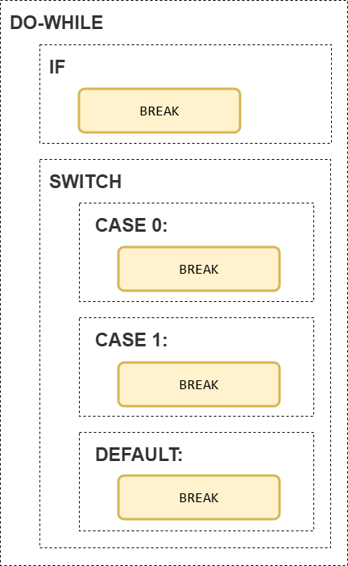
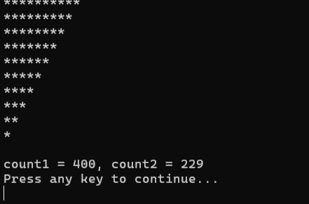
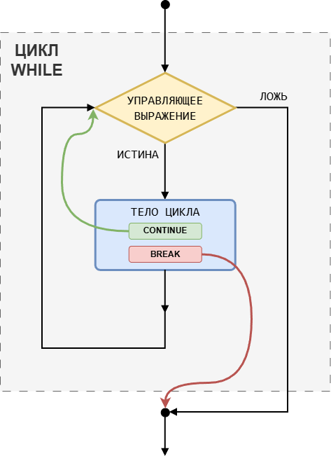
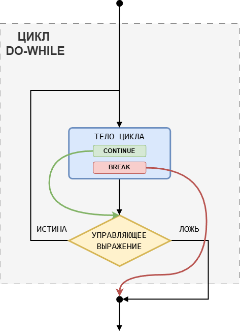
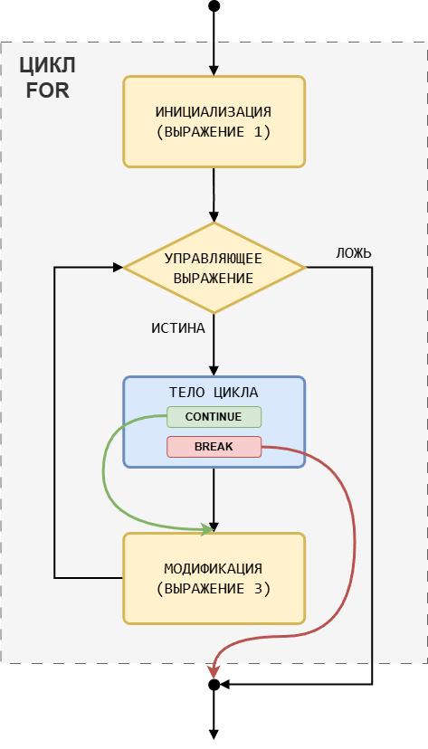

# Управление циклом: `break` и `continue`

В языке Си предусмотрены две инструкции, которые позволяют управлять выполнением цикла:
- `break` -- принудительно завершает работу цикла;
- `continue` -- принудительно завершает текущую итерацию цикла.

Давайте разберём нюансы их работы.

## Инструкция `break`

С `break` мы уже знакомы по инструкции выбора `switch`. С её помощью мы прерывали сквозное выполнение и выходили из инструкции `switch`. Аналогичную функцию `break` выполняет и в циклических конструкциях -- немедленно завершает выполнение цикла. Иными словами, если по какой-либо причине нам нужно здесь и сейчас завершить выполнение цикла, вне зависимости от истинности условия -- мы используем инструкцию безусловного выхода `break`.

Для наглядности разберём конкретный пример. 

Добавим в программу «Игральный кубик» v.3.0 (Листинг 23 предыдущего урока) следующее ограничение:

> Если при очередном броске кубика общая сумма очков превышает какое-то наперёд заданное значение, то при следующей попытке бросить кубик программа должна выводить сообщение `You reached the game's limit!`, а также информацию об общем количестве ходов и сумму очков.

Листинг 1. «Игральный кубик» v.3.1
```c
#include <stdio.h>
#include <stdlib.h>
#include <time.h>

int main(void)
{
        srand(time(NULL));

        printf("#########  Devil\'s bones   #########\n");
        printf("#                                   #\n");
        printf("#   Commands:                       #\n");
        printf("#                                   #\n");
        printf("#   1 - new game                    #\n");
        printf("#   0 - exit                        #\n");
        printf("#                                   #\n");
        printf("#####################################\n\n");
        
        int MAX_SUM = 40;       // ограничение на общее количество очков
        int control;
        int value = 0, 
            total_runs = 0,     // количество бросков
            sum_results = 0;    // сумма очков за всю игру
        
        do {
                printf("Enter command: ");
                scanf("%d", &control);

                if (sum_results >= MAX_SUM) {
                        printf("\nYou reached the game\'s limit!\n");
                        break; // принудительно выходим из цикла
                }
                
                switch (control) {
                        case 0: 
                                printf("\nGood bye!\n");
                                break;
                        case 1:
                                value = 1 + rand() % 6;
                                printf("Result: %d\n", value);

                                total_runs += 1;        // увеличиваем кол-во бросков
                                sum_results += value;   // добавляем значение к сумме очков
                                break;
                        default:
                                printf("Error! Try again...\n");
                                break;
                }

        } while (control != 0);

        printf("Total number of die rolls: %d\n", total_runs);
        printf("Sum of all die rolls: %d\n", sum_results);

        return 0;
}
```

Как видите, ничего особо сложного. Мы создали переменную `MAX_SUM`, сохранив туда значение `40` (ограничение на общее количество очков за всю игру). А в тело цикла добавили проверку, что ограничение не нарушено. Если текущая сумма очков `>= MAX_SUM`, то выводим строку `You reached the game's limit!`, а потом сразу же завершаем выполнение цикла `do-while` с помощью инструкции `break`. Далее выполняются инструкции, расположенные за циклом `do-while`.

% **Важно:** 
Инструкция безусловного выхода `break` работает **во всех** циклических конструкциях (`for`, `while`, `do-while`), а также в инструкции выбора `switch`.

Внимательный читатель уже, наверное, заметил, что в программе «Игральный кубик» v.3.1 (Листинг 1) инструкция `break` была и раньше (в каждой ветке `switch`). Почему же не завершался цикл? А ответ довольно прост:

% **Важно!**
Инструкция `break` всегда выходит только из ближайшей к ней инструкции (`switch`, `for`, `while` или `do-while`)

Разберём на примере нашей программы.



Первая инструкция `break` находится внутри условной конструкции `if`, которая находится внутри цикла `do-while`. Т.к. на `if` инструкция `break` не действует, то ближайшей инструкцией является цикл `do-while`. Поэтому в этом случае `break` завершает цикл.

Следующие три инструкции `break` находятся внутри инструкции `switch`, которая находится внутри цикла `do-while`. Следовательно, завершается `switch`, а не цикл.

## Инструкция `continue`

=Инструкция `continue`= используется **исключительно внутри циклов**, чтобы прервать текущую итерацию цикла.

Другими словами, если компьютер встречает инструкцию `continue`, то он прерывает выполнение тела цикла и переходит к проверке условия цикла. Для цикла `for` сперва выполняется модификация (третье выражение из заголовка цикла `for`), затем проверяется условие продолжения цикла.

Чтобы продемонстрировать работу `continue`, давайте добавим в нашу программу новую фишку: 

> если на кубике выпадает `6`, то эта попытка не учитывается в общей сумме очков, но учитывается при подсчёте общего количества ходов.

Листинг 2. «Игральный кубик» v.3.2
```c
#include <stdio.h>
#include <stdlib.h>
#include <time.h>

int main(void)
{
        srand(time(NULL));

        printf("#########  Devil\'s bones   #########\n");
        printf("#                                   #\n");
        printf("#   Commands:                       #\n");
        printf("#                                   #\n");
        printf("#   1 - new game                    #\n");
        printf("#   0 - exit                        #\n");
        printf("#                                   #\n");
        printf("#####################################\n\n");
        
        int MAX_SUM = 40;       // ограничение на общее количество очков
        int control;
        int value = 0, 
            total_runs = 0,     // количество бросков
            sum_results = 0;    // сумма очков за всю игру
        
        do {
                printf("Enter command: ");
                scanf("%d", &control);

                if (sum_results >= MAX_SUM) {
                        printf("\nYou reached the game\'s limit!\n");
                        break;
                }
                
                switch (control) {
                        case 0: 
                                printf("\nGood bye!\n");
                                break;
                        case 1:
                                value = 1 + rand() % 6;
                                printf("Result: %d\n", value);

                                total_runs += 1;        // увеличиваем кол-во бросков
        
                                if (value == 6) {
                                        continue;
                                }
                                sum_results += value;   // добавляем значение к сумме очков
                                break;
                        default:
                                printf("Error! Try again...\n");
                                break;
                }

        } while (control != 0);

        printf("Total number of die rolls: %d\n", total_runs);
        printf("Sum of all die rolls: %d\n", sum_results);

        return 0;
}
```

Допустим, что на очередной итерации программы мы попадаем в ветку `case 1:` и получаем `value = 6`. 
- с помощью функции `printf` выводим на экран строку `Result: 6`; 
- увеличиваем счётчик бросков кубика на единицу;
- встречаем условную инструкцию `if`. Т.к. `value = 6`, то управляющее выражение `ИСТИНА`, значит выполняем основную ветвь инструкции `if`; 
- в основной ветви всего одна команда -- `continue`, которая сообщает нам, что необходимо завершить текущую итерацию цикла. Следовательно, инструкции `sum_results += value;` и `break;`, расположенные далее в ветке `case 1:`, будут проигнорированы и мы сразу перепрыгнем на проверку условия выполнения цикла `control != 0`.

Заметьте, хотя `continue` находится внутри `switch`, но действует она только на внешний цикл `do-while`, т.к. `continue` работает только с циклами. Если бы инструкция `continue` была внутри вложенного цикла, она бы действовала только на этот внутренний цикл.

И раз уж зашла речь о вложенных циклах, давайте разберём какой-нибудь простой пример. 

Листинг 3. 
```c
#include <stdio.h>

int main(void)
{
        int SIZE = 4;

        for (int i = 0; i < SIZE; i++) {
                for (int j = 0; j < SIZE; j++) {
                        if (i + j >= SIZE) {
                                continue;
                        } 
                        printf("*");
                }
                printf("\n");
        }

        return 0;
}
```

Программа Листинг 3 выводит аккуратный треугольник из символов `*`:
```
****
***
**
*
```
Размер треугольника задаётся параметром `SIZE`.

Обращаю ваше внимание, что инструкция `continue` завершает итерацию только для вложенного цикла и никак не затрагивает внешний цикл.

Кстати, аналогичного вывода можно было добиться и с помощью инструкции `break`.

Листинг 4.
```c
#include <stdio.h>

int main(void)
{
        int SIZE = 4;

        for (int i = 0; i < SIZE; i++) {
                for (int j = 0; j < SIZE; j++) {
                        if (i + j == SIZE) {
                                break; // выходим из вложенного цикла
                        }
                        printf("*");
                }
                // сюда мы попадём после выполнения break 
                printf("\n");
        }

        return 0;
}
```

Обратите внимание, что инструкция `break` завершает только внутренний цикл `for`.

С точки зрения конечного результата эти программы идентичны. Но обратите внимание, что программа с инструкцией `continue` часть времени работает как бы "вхолостую". 

Давайте посчитаем сколько раз выполняется тело вложенного цикла в этих двух программах. Для этого объединим их и добавим соответствующие счётчики.

Листинг 5. 
```c
#include <stdio.h>

int main(void)
{
        int SIZE = 20;
        
        int count1 = 0, count2 = 0;

        for (int i = 0; i < SIZE; i++) {
                for (int j = 0; j < SIZE; j++) {
                        
                        count1++; // увеличиваем первый счётчик на 1
                        
                        if (i + j >= SIZE) {
                                continue;
                        } 
                        printf("*");
                }
                printf("\n");
        }

        printf("\n");
         
        for (int i = 0; i < SIZE; i++) {
                for (int j = 0; j < SIZE; j++) {

                        count2++; // увеличиваем второй счётчик на 1
                        
                        if (i + j == SIZE) {
                                break;
                        }
                        printf("*");
                }
                printf("\n");
        }
        
        printf("\n");
        printf("count1 = %d, count2 = %d\n", count1, count2);

        return 0;
}
```

Чтобы разница была более наглядной, я увеличил размер треугольников с `4` до `20`. Результат работы программы:



Вы, возможно, уже подумали, что инструкция `continue` гораздо хуже, чем инструкция `break`, но это, конечно, абсолютно не верно. Полученный результат лишь показывает, что `continue` в данной программе используется не по назначению и здесь более уместно использовать инструкцию `break`.

% **Важно!** Инструкции `break` и `continue` используются для совершенно разных целей. Они не являются взаимозаменяемыми, а приведённый пример является специально подобранным исключением.

В заключение урока приведём блок-схемы циклических конструкций, наглядно показывающие, куда передают управление инструкции `break` и `continue`.







