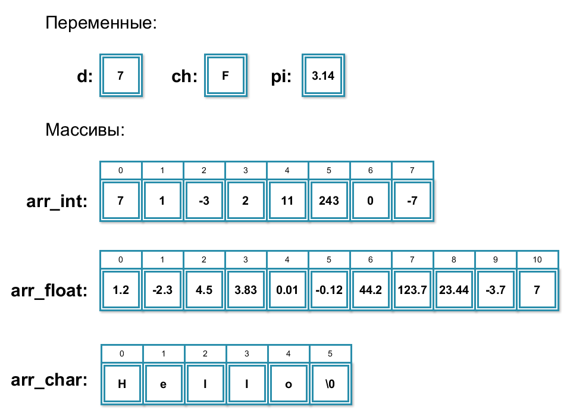

# Одномерные массивы

`Массив` -- это простейший составной тип данных. Когда мы обсуждали переменные, у нас была хорошая аналогия с коробкой. Вернёмся к ней. Если переменная -- это один ящик, то массив -- это несколько пронумерованных одинаковых ящиков, которые имеют одно и то же имя, а различаются между собой только порядковым номером.



На картинке выше изображено три массива:

* целочисленный массив из 8 элементов с именем `arr_int`
* вещественный массив из 11 элементов с именем `arr_float`
* символьный массив из 6 элементов с именем `arr_char`

У массива, как и у переменной, имеются свои имя и тип данных. Кроме того, у массива ещё есть одна дополнительная характеристика -- размер массива. Размер массива -- количество элементов, которые могут в нём храниться. В нашей аналогии с коробочками это количество коробок.

**Важно:** нумерация элементов массива начинается с нуля, а не с единицы.

## Объявление и инициализация массива

Объявление массива очень похоже на объявление переменной. Отличие лишь в том, что следует дополнительно указать размер массива в квадратных скобках. Вот несколько примеров:

Листинг 1.

```c
int arr_int[8];
double arr_float[11];
float number[2000];
```

На имя массива накладываются ограничения, аналогичные тем, которые накладываются на имя переменной.

**Правило именования массивов:** имя массива -- любая последовательность символов, цифр и знака нижнего подчеркивания `_`, которая начинается с буквы. Регистр букв важен.

Вот ещё несколько примеров объявления массивов:

Листинг 2.

```c
int grades[50], order[10];
double prices[500];
```

Массиву, как и любой переменной, можно присвоить начальные значения при объявлении. Если элементам массива не присвоить никакого значения, то в них будет храниться мусор, как и в обычных переменных.

Листинг 3.

```c
int arr_int[5] = {2, 5, 5, 3, 4};
double arr_float[11] = {1.2, -2.3, 4.5, 3.83, 0.01, -0.12, 44.2, 123.7, 23.44, -3.7, 7};
```

Если нужно присвоить нулевые значения всем элементам массива, то можно сделать вот так:

Листинг 4.

```c
double arr[50] = {0};
```

## Работа с отдельными элементами массива

Чтобы обратиться к отдельному элементу массива, необходимо написать его имя и порядковый номер в квадратных скобках. Не забывайте, что нумерация начинается с нуля, а не с единицы.

Давайте, например, выведем элементы массива из пяти элементов на экран.

Листинг 5.

```c
#include <stdio.h>

int main(void){
  int arr[5] = {2, 4, 3, 5, 5};

  printf("%d %d %d %d %d\n",arr[0], arr[1], arr[2], arr[3], arr[4]);

  return(0);
}
```

Конечно, если массив будет очень большой, то выводить его поэлементно подобным образом то ещё удовольствие. Да и с маленькими массивами так никто не делает. Лучше и правильнее использовать циклы. Например:

Листинг 6.

```c
#include <stdio.h>

int main(void){
  int arr[100] = {0};

  for(int i = 0; i < 100; i = i + 1){
    arr[i] = 2*i;
  }

  for(int i = 0; i < 100; i = i + 1){
    printf("%d\t",arr[i]);
  }

  return(0);
}
```

Программа в первом цикле сохраняет в массив первую сотню чётных чисел, а во втором цикле выводит их на экран.

Вооружившись новыми инструментами, давайте перепишем нашу программу из начала урока так, чтобы она использовала массив для хранения статистики выпадения случайных чисел.

Листинг 7.

```c
#include <stdio.h>
#include <stdlib.h>
#include <time.h>

int main(void) {
  srand(time(NULL));
  int count[3] = {0};
  int rand_number;

  for (int i = 0; i < 100000; i = i + 1){
    rand_number = rand()%3;
    count[rand_number] = count[rand_number] + 1;
  }

  for(int i = 0; i < 3; i = i + 1){
    printf("%d - %d\n", i, count[i]);
  }

  return 0;
}
```

Обратите внимание на приём, который используется в этой программе.

В нулевом элементе массива хранится количество выпадений числа `0`, в первом элементе -- количество выпадений числа `1`, во втором элементе -- числа `2`. То есть само сгенерированное число позволяет определить, к какому элементу массива необходимо добавить единичку. Поэтому необходимость в операторе выбора `switch` отпадает. Удобно, не так ли?