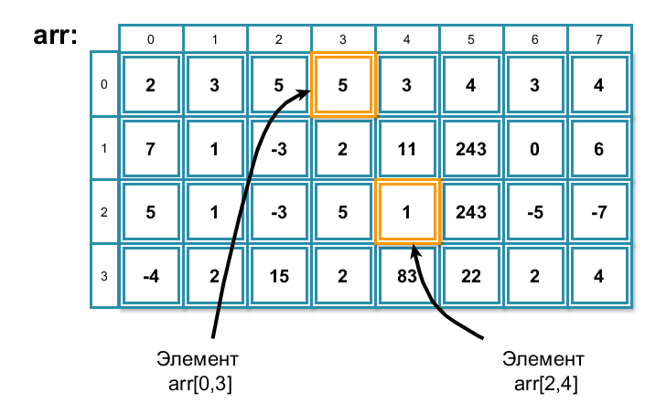

# Двумерные массивы

Иногда данные гораздо удобнее хранить в таблице, чем в столбике/строке. Например, пишем мы игру-лабиринт. Нам нужно как-то хранить карту, где будут отмечены проходы и стены. Например, она могла бы выглядеть вот так.


И тогда её можно было бы хранить в виде таблицы символов, где стены обозначены 1, проходы 0, начальная точка 3, конечная точка 9.

Листинг 1.

```c
0 9 0 0 0 1 1 1 1 0 0 0 1 1 0
1 1 1 1 0 1 1 1 1 0 1 0 0 1 0
0 0 0 1 0 0 0 1 0 0 1 1 0 0 0
0 1 0 1 0 1 0 1 0 0 1 1 1 1 0
0 1 1 1 0 0 0 0 0 0 0 1 0 0 0
0 1 0 0 0 1 0 1 1 0 0 1 1 0 0
0 1 0 1 1 1 0 0 1 1 0 0 0 1 0
0 1 0 0 1 1 1 0 0 0 0 0 0 0 1
0 0 1 0 1 1 1 1 1 1 0 1 1 1 1
1 1 1 0 0 0 0 0 0 0 0 1 0 0 0
1 0 1 0 1 1 1 1 1 0 0 0 0 1 0
1 0 1 0 0 0 0 0 1 0 1 0 1 1 0
0 0 1 0 0 1 1 0 0 0 1 0 0 1 0
0 1 1 1 0 0 1 0 0 1 1 0 1 1 0
0 0 0 0 0 0 0 3 0 0 1 0 0 0 0
```

Или таблица 12 на 31, где можно было бы хранить температуру в течение года. Понятно, что в некоторых месяцах будут заполнены не все клеточки таблицы, но это ничего страшного. Договоримся и будем туда записывать, например, число -9999.99, которое будет обозначать, что данные не определены.
Ещё примеры: таблица Пифагора, поле для игры в крестики нолики, поле для игры 2048.

В подобных случаях используют =двумерные массивы=, т.е. массивы, у которых два измерения (два счётчика).


Объявить двумерный массив не сложнее, чем объявить одномерный массив. Просто необходимо указать обе его размерности в квадратных скобках. Первое число -- количество строк, второе -- количество столбцов.

Например, для массива с картинки объявление выглядело бы вот так:

Листинг 2.

```c
int arr2[4][8];
```

Нумерация строк и столбцов, как и в одномерных массивах, начинается с нуля.

Имеется возможность инициализировать массив при объявлении.

Листинг 3.

```c
int arr2[4][8] = {0}; // нулями
int arr [2][4] = {{1,2,4,29},{3,4,6,1}}; //произвольными значениями
```


Пока элементы массива не инициализированы, они заполнены мусором. Проверьте это самостоятельно.

Обращение к конкретному элементу двумерного массива происходит так же, как и в одномерном массиве. Сначала пишется имя массива, а затем в отдельных квадратных скобках номер строки и номер столбца. Главное тут не перепутать. Сначала пишем номер строки, затем номер стоблца. Ну и не забывайте про то, что нумерация начинается с нуля.



% **Важно!**
Первый индекс -- строки.
Второй индекс -- столбцы.
Нумерация начинается с нуля.

Следующая программа иллюстрирует основные операции для работы с двумерными массивами.

Листинг 4.

```c
#include <stdio.h>

int main(void)
{

    int arr[4][8] = {{2,3,5,5,3,4,3,4},
                    {7,1,-3,2,11,243,0,6},
                    {5,1,-3,5,1,243,-5,-7},
                    {-4,2,15,2,83,22,2,4}};

    printf("%d\t%d\n\n", arr[0][3], arr[2][4]);

    /* Построчно обходим двумерный массив
       и выводим его элементы на экран
    */
    for (int i = 0; i < 4; i = i + 1){
        for(int j = 0; j < 8; j = j + 1){
            printf("%d\t", arr[i][j]);
        }
        printf("\n");
    }

    return 0;
}
```

Как видите, если в одномерном массиве мы использовали один цикл для перебора всех элементов массива, то в двумерном два цикла. Первый цикл последовательно перебирает строчки, а второй последовательно перебирает элементы строки. Индексы массива в цикле будут перебираться в следующей последовательности:

```
i = 0;
    j = 0;
    j = 1;
    j = 2;
    j = 3;
    j = 4;
    j = 5;
    j = 6;
    j = 7;
i = 1;
    j = 0;
    j = 1;
    j = 2;
    j = 3;
    j = 4;
    j = 5;
    j = 6;
    j = 7;
и т.д.
```

Следующая программа заполнит массив числами по порядку, а потом выведет его на экран.

Листинг 5.

```c
#include <stdio.h>

int main(void)
{

    int arr[4][8] = {0};
    int counter = 1;

    for (int i = 0; i < 4; i = i + 1){
        for(int j = 0; j < 8; j = j + 1){
            arr[i][j] = counter;
            counter = counter + 1;
        }
    }

    for (int i = 0; i < 4; i = i + 1){
        for(int j = 0; j < 8; j = j + 1){
            printf("%d\t", arr[i][j]);
        }
        printf("\n");
    }

    return 0;
}
```

Вот и всё, что вам необходимо знать на начальном этапе о массивах. Теперь нужно хорошенько потренироваться в их использовании на практике.