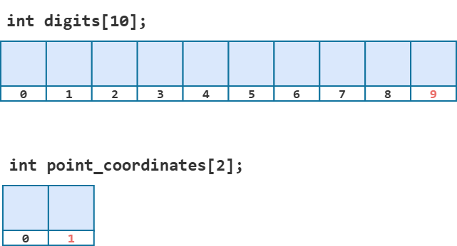
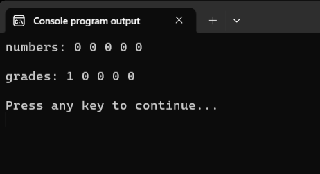
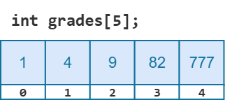
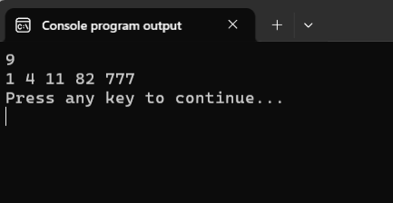
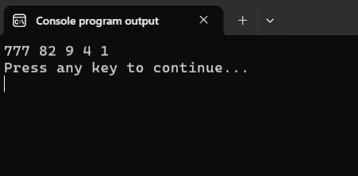
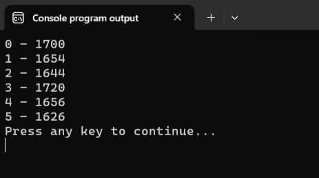
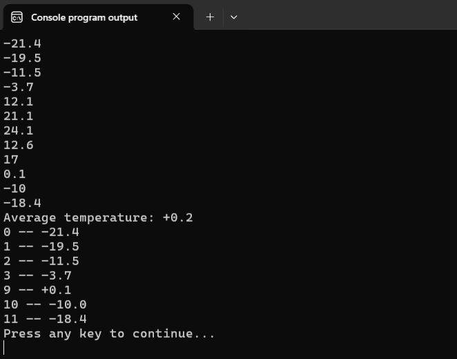
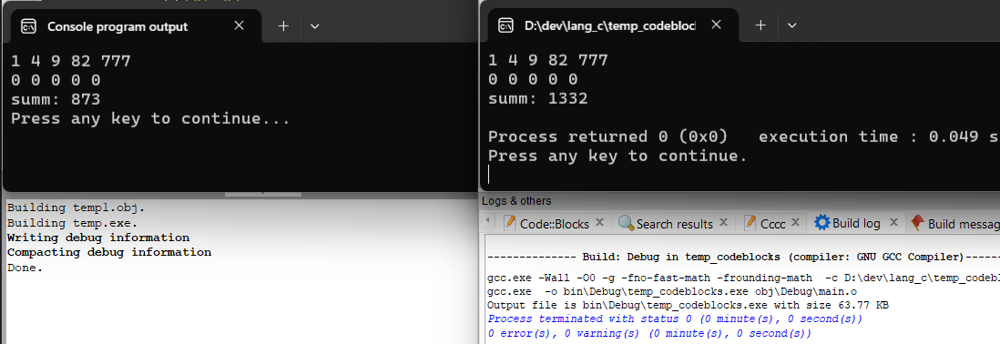

# Одномерные массивы

Теперь, когда мы уже имеем представление о том, что такое массив, зачем он нужен и какие у него есть характеристики, давайте разберёмся, как эта структура данных реализована в языке Си. И начнём с того, что научимся создавать массивы.

## Объявление массива

Объявление массива очень похоже на объявление переменной. Отличие лишь в том, что следует дополнительно указывать размер создаваемого массива в квадратных скобках. 

Ниже объявлены три массива с именами `digits`, `point_coordinates` и `alphabet`:

Листинг 1.
```c
// объявление массивов
int digits[10];   // digits -- массив из 10 элементов типа int
double point_coordinates[2]; // point_coordinates -- массив из 2 элементов типа double
char alphabet[26];  // alphabet -- массив из 26 элементов типа char 
```

Ограничения на имя массива стандартные: любая последовательность латинских букв, цифр и знака нижнего подчеркивания `_`, которая начинается с буквы. Регистр символов имеет значение.

При объявлении массива в квадратных скобках после его имени мы должны явно указать конкретное число -- размер массива (количество элементов в массиве). С этим числом связана одна часто встречающаяся ошибка, с которой сталкиваются новички. 

Как уже говорилось ранее, **нумерация элементов массива начинается с нуля**. Поэтому, когда мы, например, объявляем массив размером в `10` элементов, то номер последнего элемента будет равен `9`, т.е. на единицу меньше. Следующий рисунок наглядно это иллюстрирует.



% **Важно!** 
% При объявлении массива из `N` элементов, номер последнего элемента массива будет `N - 1`.

Кстати, как и в случае с обычными переменными, можно в одной инструкции объявить сразу несколько массивов, например:

Листинг 2.
```c
int grades[5], orders[100];
```

Здесь мы объявили два массива:
- `grades` -- массив из `5` элементов типа `int`; 
- `orders` -- массив из `100` элементов типа `int`.


## Инициализация элементов массива начальными значениями

После объявления массива в его элементах хранится "мусор", как и в обычных переменных. Но мы можем присвоить начальные значения элементам массива при его объявлении. 

Листинг 3.
```c
int grades[5] = { 1, 4, 9, 82, 777 };
double point[2] = { 1.2, -2.3 };
```

Значения из фигурных скобок записываются по порядку в элементы массива: первое -- в элемент с номером `0`, второе -- в элемент с номером `1` и так далее. Если значений в скобках меньше, чем элементов в массиве, то оставшимся элементам присваивается `0`. Это называется =частичная инициализация массива=.

Это правило можно использовать для того, чтобы обнулить все элементы массива при инициализации.  

Листинг 4.
```c
int numbers[5] = {0};
```
Код из Листинга 4 обнулит все пять элементов массива `numbers`. В нулевой элемент явно кладём `0`, а остальные элементы инициализируются нулями в силу правила частичной инициализации.

Но если мы попытаемся написать `int grades[5] = {1};` в надежде заполнить массив `grades` единицами (или любыми другими ненулевыми значениями), то из этого ничего не выйдет. 

Листинг 5.
```c
#include <stdio.h>

int main(void)
{
        int numbers[5] = {0}; // хак с частичной инициализацией
        int grades[5] = {1};  // пытаемся инициализировать элементы массива единицами
        
        printf("numbers: ");
        for(int i = 0; i < 5; i++) {
                printf("%d ", numbers[i]);
        }
        printf("\n\n");

        printf("grades: ");
        for(int i = 0; i < 5; i++) {
                printf("%d ", grades[i]);
        }
        printf("\n\n");

        return 0;
}
```



Инициализация нулями сработала корректно, а вот инициализировать элементы массива единичками не вышло. Единица была записана только в самый первый элемент массива, а все остальные элементы массива были проинициализированы нулями.

Если количество значений, записанных в фигурных скобках, превышает размер массива, то компилятор выдаст ошибку. Обязательно убедитесь в этом самостоятельно.

Кстати, обратите внимание, как ловко в Листинге 5 мы вывели все элементы массива на экран с помощью цикла `for`. Давайте разберём этот момент поподробнее.

## Работа с отдельными элементами массива

Итак, положим, что мы объявили массив `grades` и инициализировали его начальными значениями: `int grades[5] = { 1, 4, 9, 82, 777 };`. 

Возвращаясь к языку ящиков и коробок, скажем, что мы взяли пять обычных коробок для целых чисел, сколотили из них один большой ящик с пятью секциями и пронумеровали их начиная с нуля. После чего в коробку с номером `0` положили значение `1`, в коробку с номером `1` положили значение `4`, в коробку `2` -- значение `9` и так далее.



Хорошо, у нас есть большой ящик с отдельными коробками-секциями. И теперь мы можем работать с каждой такой коробочкой-секцией как с отдельной переменной соответствующего типа. Мы можем присвоить ей значение или вывести её текущее значение на экран.
Для этого мы должны обращаться к отдельной коробочке, используя общее имя массива и номер коробки. Например, `grades[3]` -- обращение к коробке с порядковым номером `3`.

Т.е. `grades[3]` это как бы новое имя нашей исходной коробочки. Используя это имя мы можем получить значение, хранящееся в этой коробке, или положить в неё какое-то новое значение.

Следующая программа как раз демонстрирует это.

Листинг 6.
```c
#include <stdio.h>

int main(void)
{
        int grades[5] = { 1, 4, 9, 82, 777 };

        printf("%d\n", grades[2]); // выводим на экран значение из коробки с номером 2

        grades[2] = 11; // сохраняем в коробку с номером 2 значение 11

        // выводим на экран содержимое всех коробок из массива grades
        printf("%d %d %d %d %d\n", grades[0], 
                                   grades[1], 
                                   grades[2], 
                                   grades[3], 
                                   grades[4]);

        return(0);
}
```



Итак, с отдельным элементом массива мы можем работать как с обычной переменной соответствующего типа. Чтобы обратиться к конкретному элементу массива необходимо использовать имя массива и порядковый номер элемента (индекс элемента). Главное не забывать, что нумерация элементов массива начинается с `0`, а не с `1`.

### Оператор индексации массива `[]`

На самом деле квадратные скобки `[]` -- это отдельный =оператор индексации массива= или =оператор доступа по индексу=. Он используется, чтобы получить доступ к элементу массива с индексом, указанным внутри квадратных скобок.

Но настоящая мощь этого оператора заключается в том, что в качестве индекса мы можем передать не просто число, а целочисленную переменную. Именно так мы поступили в Листинге 5, когда использовали цикл `for` для вывода элементов массива на экран.

Давайте перепишем Листинг 6 так, чтобы вывод элементов массива на экран был организован с использованием цикла `for`, а заодно разберём, как это работает.

Листинг 7.
```c
#include <stdio.h>

int main(void)
{
        int grades[5] = { 1, 4, 9, 82, 777 };

        printf("%d\n", grades[2]);

        grades[2] = 11; 

        // выводим на экран элементы массива grades,
        // используя цикл for
        for (int i = 0; i < 5; i++) {
                printf("%d ", grades[i]);
        }
        printf("\n");

        return(0);
}
```

Итак, в заголовке цикла `for` мы создаём целочисленную переменную-счётчик `i` и присваиваем ей начальное значение `0`. В теле цикла мы вызываем функцию `printf` и передаём ей для вывода `grades[i]`. 

В отличие от Листинга 6 здесь в квадратных скобках записано не число, а целочисленная переменная. Но, как уже было сказано, оператор индексации массива умеет работать и с переменными. Он заменяет переменную на её текущее значение и использует его в качестве индекса. Сейчас у нас `i = 0`, а значит `grades[i]` на самом деле `grades[0]` -- т.е. обращение к элементу массива с номером `0`. В этом элементе записано значение `1`, его и выведет на экран функция `printf` на первой итерации. 

На следующей итерации значение переменной `i` уже будет равно `1`, а значит `grades[i]` будет обозначать обращение к элементу массива `grades` с индексом `1`. А значит на второй итерации на экран будет выведено значение `4`. Ну и так далее.

На самом деле, оператор индексации массива `[]` может работать не только с переменными, но и с любыми целочисленными выражениями.

Посмотрите на следующий пример, в нём мы тоже выводим элементы массива `grades`, но в обратном порядке.

Листинг 8.
```c
#include <stdio.h>

int main(void)
{
        int grades[5] = { 1, 4, 9, 82, 777 };

        for (int i = 0; i < 5; i++) {
                printf("%d ", grades[5 - i - 1]);
        }

        printf("\n");

        return(0);
}
```



Здесь в квадратных скобках стоит выражение `5 - 1 - i`. Оператор индексации сначала его вычисляет, а уже потом использует результат как номер элемента.

На первой итерации `i = 0`, значит `5 - i - 1` равно `4`, и мы обращаемся к `grades[4]`.
На второй итерации `i = 1`, выражение даёт `3`, печатается `grades[3]`.
И так далее, пока не дойдём до `grades[0]`.

Понятно, что это лишь демонстрационный пример и такого же эффекта мы могли бы добиться просто чуть-чуть изменив заголовок цикла: `for (int i = 4; i > 0; i--)`.


Вооружившись новыми инструментами, давайте напишем программу для проверки распределения чисел, генерируемых функцией `rand`, с которой мы начали урок про массивы.

Листинг 9.
```c
#include <stdio.h>
#include <stdlib.h>
#include <time.h>

int main(void)
{
        srand(time(NULL));
        int digits_count[6] = {0}; // создаём массив из 6 элементов типа int
        int rand_number;

        for (int i = 0; i < 10000; i++) {
                rand_number = rand() % 6; // генерируем случайное число от 0 до 5
                digits_count[rand_number] += 1; // увеличиваем соответствующий счётчик
        }

        for (int i = 0; i < 6; i++) {
                printf("%d - %d\n", i, digits_count[i]);
        }

        return 0;
}
```



Хочу обратить ваше внимание на приём, который мы использовали в этой программе.

Для хранения данных о выпадениях чисел от `0` до `5`, мы используем массив `digits_count`. В элементе массива с индексом `0` мы будем хранить количество выпадений числа `0`, в элементе с индексом `1` -- количество выпадений числа `1`, в элементе с индексом `2` -- количество выпадений числа `2` и т.д. 

После того, как мы сгенерировали новое число и записали его в переменную `rand_number`, нам, в зависимости от значения в этой переменной, нужно увеличить значение в соответствующем элементе массива. Самый простой способ это сделать -- использовать инструкцию `switch-case`. Что-то типа того:

Листинг 10.
```c
switch (rand_number) {
        case 0:
                digits_count[0]++;
                break;
        case 1:
                digits_count[1]++;
                break;
        case 2:
                digits_count[2]++;
                break;
        // и т.д.
}
```

Но обратите внимание, что само сгенерированное число `rand_number` подсказывает нам, к какому элементу массива необходимо добавить единичку. Поэтому мы можем всю эту монструозную конструкцию заменить одной строчкой `digits_count[rand_number] += 1;` или даже  `digits_count[rand_number]++;` Удобно, не так ли? 


## Нюансы работы с массивами в языке Си

В языке Си нет никакого простого способа изменить сразу все элементы массива. Использовать инициализирующие значения, записанные в `{}`, можно только при объявлении массива. 

Например, следующий код не сработает.

Листинг 11.
```c
#include <stdio.h>

int main(void)
{
        int grades[5] = { 1, 4, 9, 82, 777 };

        for (int i = 0; i < 5; i++) {
                printf("%d ", grades[i]);
        }
        printf("\n");

        grades = {0}; // пытаемся обнулить все элементы массива
                      // ЭТО ОШИБКА! Так сделать нельзя

        return(0);
}
```

Единственный способ присвоить значения всем элементам массива -- использовать цикл, внутри которого присваивать значения каждому отдельному элементу массива. Давайте, например, обнулим все элементы массива `grades` с помощью цикла `for`.

Листинг 12.
```c
#include <stdio.h>

int main(void)
{
        int grades[5] = { 1, 4, 9, 82, 777 };

        for (int i = 0; i < 5; i++) {
                printf("%d ", grades[i]);
        }
        printf("\n");

        for (int i = 0; i < 5; i++) { // i пробегает значения от 0 до 4
                grades[i] = 0;        // каждому элементу присваиваем значение 0
        }

        return(0);
}
```

Кстати, обратите внимание, что также нет способа вывести на экран все элементы массива. Для вывода массива на экран, мы тоже используем цикл по всем элементам массива.

Аналогично, если мы хотим считать значения со стандартного потока ввода и записать их в массив, то нам тоже придётся использовать цикл. В языке Си нет никакой специальной конструкции или стандартной функции, которая позволяет это сделать.

В следующей программе мы считываем со входа значения в массив `temperatures`, вычисляем по ним среднюю температуру, а потом выводим на экран элементы массива, меньшие средней температуры, а также их индексы (порядковые номера в массиве).

Листинг 13.
```c
#include <stdio.h>

int main(void)
{
        double temperatures[12] = { 0 };

        // считываем данные в массив temperatures
        for (int i = 0; i < 12; i++) {
                scanf("%lf", &temperatures[i]);
        }
        
        // вычисляем сумму температур
        double total = 0;
        for (int i = 0; i < 12; i++) {
                total += temperatures[i];       
        }

        // вычисляем и выводим среднюю температуру
        double average_temp = total / 12;
        printf("Average temperature: %+.1f\n", average_temp);

        // выводим на экран индексы и значения элементов массива, удовлетворяющих условию 
        for (int i = 0; i < 12; i++) {
                if (temperatures[i] < average_temp) {
                        printf("%d -- %+.1f\n", i, temperatures[i]);
                }
        }

        return(0);
}
```



### Выход за границы массива

Оператор индексации `[]` не проверяет, существует ли в массиве элемент с таким номером. Поэтому, если обратиться к несуществующему элементу, например написать `grades[10]` или `grades[-1]` для массива `int grades[5]`, то мы получим неопределённое поведение (UB). 

Ошибки такого рода называют =выходом за пределы массива= и из-за того, что поведение неопределено -- это очень коварные ошибки. Если мы допустим такую ошибку, то программа скорее всего скомпилируется без каких-либо предупреждений и ошибок со стороны компилятора. И при этом, она может выглядеть вполне рабочей, но иногда будет читать или портить чужую память -- соседние переменные, мусор, а иногда просто аварийно завершаться. 

Причём одна и та же программа при компиляции разными компиляторами может вести себя по-разному. Например, скомпилируем и запустим программу Листинг 14 в Pelles C и в Code::Blocks.

Листинг 14.
```c
#include <stdio.h>

int main(void)
{
        int summ = 0;
        int grades[5] = { 1, 4, 9, 82, 777 };

        for (int i = 0; i < 5; i++) {
                printf("%d ", grades[i]);
        }
        printf("\n");


        for (int i = 0; i <= 5; i++) { // ОШИБКА
                summ += grades[i];     // при i = 5
                grades[i] = 0;         // выход за пределы массива
        }

        for (int i = 0; i < 5; i++) {
                printf("%d ", grades[i]);
        }
        printf("\n");

        printf("summ: %d\n", summ);

        return(0);
}
```

Ни Pelles C, ни CodeBlock не выдали нам никаких ошибок или предупреждений на этапе компиляции, но при этом результат работы этой программы различается.



% **Важно!** В программах на языке Си программист должен самостоятельно следить за тем, чтобы случайно не выйти за границы массива.
