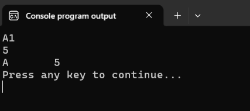
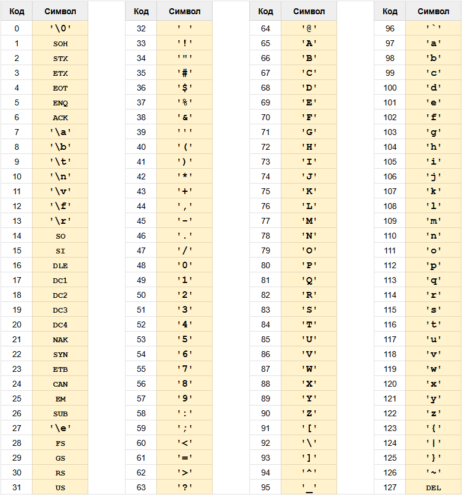
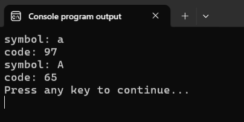
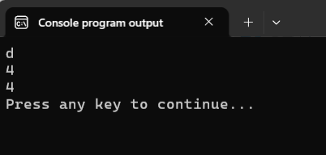
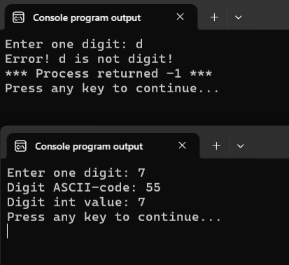

# Тип данных char

Как мы уже знаем, тип данных `char` используется для хранения одного отдельного символа (записывается в одинарных кавычках).  На всякий случай напомню, что символ это не только буквы, но и цифры (`0` - `9`), знаки пунктуации, различные скобочки, пробел и пр., а также управляющие символы (например, перенос строки `\n`, табуляция `\t` и др.).

В следующем листинге приводятся самые основы работы с переменными этого типа данных: объявление, инициализация, вывод

Листинг 1.
```c
#include <stdio.h>

int main(void)
{
        char ch; // объявление переменной типа char

        // объявление и инициализация переменных типа char
        char letter = 'a';
        char shift = '\t';

        ch = '1'; // сохраняем в переменной типа char значение '1' 
                  // это не число, а символ 
        
        // выводим значение переменных типа char
        printf("%c%c\n", letter, ch);

        scanf("%c", &ch); // считываем значение в переменную типа char

        printf("%c%c%c\n", letter, shift, ch);

        return 0;
}
```



Но у типа `char` есть один важный секрет о котором я раньше не рассказывал.

## Главный секрет типа `char`

Как вы уже знаете, в памяти компьютера абсолютно все данные хранятся в двоичном виде (последовательности нулей и единиц). Допустим, мы объявляем переменную типа `int` и инициализируем её значением `97`:
```c
int code = 97;
```

Предположим, что в нашей системе размер переменной типа `int` равен `4` байтам, т.е. каждая переменная типа `int` будет занимать `4` последовательные ячейки по `1` байту каждая. Или `4 * 8 = 32` бита, т.к. в настоящее время на большинстве современных систем в одном байте обычно `8` бит. В двоичной системе счисления число `97` представляется в виде последовательности `1100001`. Получилось всего `7` бит. Оставшиеся `25` бит будут заполнены нулями, т.е. получим следующее двоичное представление: `00000000000000000000000001100001`. 

Чуть сложнее устроено двоичное представление для отрицательных и вещественных чисел, но всё-таки это тоже числа. А как же быть с буквами или, например, со знаками препинания? Как, например, хранится в памяти компьютера символ `a`? Или символ `\n`? 

Для этого используется довольно понятная идея. Раз мы умеем переводить в двоичную систему числа, то давайте каждому символу назначим своё число (закодируем символ определённым числовым кодом) и уже это число (код) будем переводить в двоичную систему счисления. В результате у нас получится некоторая таблица соответствия между символами и их кодами, например, такая, как на Рисунке 2.



На Рисунке 2 представлена =таблица ASCII (American Standard Code for Information Interchange)=. Именно она используется в языке Си для кодирования символов.  

Обратите внимание, что порядок символов в таблице не хаотичный, а всё-таки имеет некоторую структуру. 

Например, первые `32` символа (коды `0 -- 31`) отведены под различные управляющие символы, большинство из которых уже не очень актуальны. Но некоторые из них нам уже знакомы, например: `\n` и `\t`. Кроме того, очень скоро мы познакомимся с ещё одним очень важным управляющим символом -- `\0`.

Коды `48 -- 57` отведены для цифр от `0` до `9`.
Коды `65 -- 90` отведены для заглавных букв латинского алфавита.
Коды `97 -- 122` используются для строчных букв латинского алфавита. 

Итак, предположим, что в нашей программе имеется следующая строка:
```c
char letter = 'A';
```

Как работает этот код?

В памяти выделятся одна ячейка размером `1` байт (это размер переменной типа `char`). Символу `A` в таблице ASCII соответствует код `65`. Это число переводится в двоичную систему счисления `0100 0001` и записывается в выделенную ранее ячейку памяти. 

% **Главный секрет типа `char`**
Тип `char` -- это ещё один тип данных для хранения целых чисел. В память записывается не сам символ, а целое положительное число -- код, который соответствует этому символу в таблице ASCII. 


Размер переменной типа `char` равен `1` байт (т.е. в переменной этого типа можно сохранить `2^8 = 256` значений).

## Примеры работы с переменными типа `char`

Убедимся на практике, что переменная типа `char` пригодна как для хранения символов, так и для хранения целых чисел.

Листинг 2.
```c
#include <stdio.h>

int main(void)
{
        char letter = 'a'; // сохраняем в переменную типа char символ 'a'

        // выводим значение, хранящееся в переменной letter 
        printf("symbol: %c\n", letter); // как символ
        printf("code: %d\n", letter);   // как ЦЕЛОЕ ЧИСЛО, через %d

        letter = 65; // сохраняем в переменную типа char ЦЕЛОЕ ЧИСЛО 65

        // выводим значение, хранящееся в переменной letter
        printf("symbol: %c\n", letter); // как символ
        printf("code: %d\n", letter);   // как ЦЕЛОЕ ЧИСЛО, через %d

        return 0;
}
```

Результат работы программы, представлен на следующем рисунке:



Эта программа иллюстрирует два важных момента: 

1. переменной типа `char` можно присвоить как символ, так и целое число. 
2. если при выводе переменной типа `char` использовать спецификатор `%c`, то значение, хранимое в переменной, будет интерпретировано и отображено как символ, если использовать спецификатор `%d` -- то как целое число.

И раз `char` это целочисленный тип, то переменные этого типа можно использовать везде, где допустимо использовать целые числа. Например, с переменными этого типа можно производить арифметические операции.

Следующая программа принимает на вход букву латинского алфавита, записанную в нижнем регистре, и выводит её порядковый номер.

Листинг 3. Арифметические операции с типом `char`
```c
#include <stdio.h>

int main(void)
{
        char letter;
        scanf("%c", &letter);
        
        // вариант 1
        int code = letter - 97 + 1;
        printf("%d\n", code);

        // вариант 2
        letter = letter - 'a' + 1; // а чё, так можно было что ли!? Да!
        printf("%d\n", letter);

        return 0;
}
```



Разберёмся, как работает эта программа. Допустим пользователь вводит значение `d` и нажимает `Enter`. 

**Шаг 1: Считывание символа**
Функция `scanf("%c", &letter)` считывает символ из стандартного потока ввода и сохраняет его в переменную `letter`. Как мы уже знаем, в переменную сохраняется не сам символ `d`, а его числовой код из таблицы ASCII. Для символа `d` этот код равен `100`. Т.е. фактически сейчас в переменной `letter` сохранено число `100`.


**Шаг 2: Вариант 1**
В первом варианте программы выполняется следующее вычисление:
```c
int code = letter - 97 + 1;
```
Давайте разберём это выражение по частям:
- `letter` содержит код символа `d`, т.е. `100`
- `97` — это код символа `a` в таблице ASCII (первая буква алфавита в нижнем регистре)
- Вычитая `97` из `100`, мы получаем `3` — это количество позиций, на которое буква `d` сдвинута относительно буквы `a` (`a = 0, b = 1, c = 2, d = 3`)
- Прибавляя `1`, мы получаем порядковый номер буквы в алфавите: `3 + 1 = 4` (`a = 1, b = 2, c = 3, d = 4`)

Результат вычислений сохраняется в переменную `code` типа `int` и выводится на экран.

**Шаг 3: Вариант 2**
Во втором варианте программы выполняется следующее вычисление:
```c
letter = letter - 'a' + 1;
```
Это выражение работает аналогично первому варианту, но здесь используется символ `'a'` вместо числа `97`. Компилятор автоматически преобразует символ `'a'` в его числовой код `97` перед выполнением вычисления. Таким образом:
- `letter` содержит `100` (код символа `d`)
- `'a'` преобразуется в `97` (код символа `a`)
- Выполняется вычисление: `100 - 97 + 1 = 4`
- Результат `4` сохраняется обратно в переменную `letter` (тип `char`)
- При выводе с помощью `printf("%d\n", letter)` значение `4` интерпретируется как целое число, т.к. мы используем спецификатор `%d`

Оба варианта ожидаемо дают одинаковый результат.

% **Важно!** Не путайте код символа (целое число) и его символьное представление (сам символ). 

Например, целое число `9` и символ `'9'` -- это два совершенно разных значения.
Целому числу `9` соответствует управляющий символ `\t`. В то время как символу `'9'` соответствует число `57` (код символа в таблице ASCII). 

Давайте разберём ещё одну программу в которой будем преобразовывать цифру-символ в соответствующее целое число, например, из символа `'9'` получим число `9`.

Листинг 4. 
```c
#include <stdio.h>

int main(void)
{

        printf("Enter one digit: ");
        char digit;
        scanf("%c", &digit);

        if (digit < '0' || digit > '9') {               // (*)
                printf("Error! %c is not digit!\n", digit);
                return -1;
        } 
        
        printf("Digit ASCII-code: %d\n", digit);
        
        int value = digit - '0';                        // (**)
        printf("Digit int value: %d\n", value);
        
        return 0;
}
```


Давайте разберём эти строки, помеченные звёздочками в комментариях.

**Строка (\*)**
В этой строке мы проверяем, что пользователь ввёл корректное значение. Для этого мы используем уже знакомый нам подход early returns (досрочный выход). Если пользователь ввёл не цифру, то мы выводим ошибку и завершаем программу. Разберём же управляющее выражение, используемое в инструкции `if`: `digit < '0' || digit > '9'`. 

Переменная `digit` имеет тип `char`. Данные мы в неё считывали с использованием спецификатора `%c`, т.е. мы считали именно символ. Но мы уже знаем, что в переменную будет сохранён не сам символ, а его код из таблицы ASCII. Например, если пользователь ввёл `b`, то в переменную `digit` будет записано значение `98`. А если пользователь ввёл `3`, то в переменную будет записано значение `51`. 

На этапе вычисления значения управляющего выражения вместо переменной `digit` будет подставлено значение, которое в ней хранится, а символьные литералы (символы) `'0'` и `'9'` будут заменены соответствующими значениями кодов, т.е. `48` и `57`. Т.е. фактически у нас получится следующее условное выражение:

* если пользователь ввёл `3`: `51 < 48 || 51 > 57`. Значение этого выражения `FALSE`.
* если пользователь ввёл `b`: `98 < 48 || 98 > 57`. Значение этого выражения `TRUE`.

Здесь мы используем тот факт, что все символы-цифры расположены в таблице ASCII последовательно и имеют коды с `48` по `57`. Поэтому если код введённого символа не попадает в этот интервал, то мы понимаем, что введена не цифра, а какой-то другой символ.

**Строка (\*\*)**
В этой строке мы преобразовываем символ-цифру в соответствующее целое число. 

На этом этапе мы уже точно уверены, что переменная `digit` содержит код символа-цифры, т.к. если пользователь ввёл что-то другое, то программа бы уже завершилась с ошибкой. Теперь снова воспользуемся тем, что переменные типа `char` на самом деле это просто целые числа. Символ `'0'` преобразуется в число `48`. Далее из значения в переменной `digit` вычитаем `48`. 

Допустим, пользователь ввёл тройку. Значит `digit = 51`. Значит: `digit - 48 = 51 - 48 = 3`, т.е. мы  получили уже самое настоящее целое число `3`, которое сохраняем в переменную `value` типа `int` (хотя, конечно, это и не обязательно. Можно было бы использовать и саму переменную `digit`, т.е.: `digit = digit - '0';`).

Это стандартный трюк, который стоит понять и запомнить. Он работает из-за того, что все символы-цифры в таблице ASCII идут подряд начиная с `'0'`, поэтому вычитание кода `'0'` даёт нужное число.

## Диапазон значений типа char

Как уже было сказано выше тип данных `char` обычно может вместить `256` различных значений. Но какие именно это значения? Тут возможны два варианта. Запустите у себя следующую программу: 

Листинг 5. Программы для проверки диапазона типа `char`
```c
#include <limits.h>
#include <stdio.h>

int main(void)
{
        // CHAR_MIN и CHAR_MAX определены в файле limits.h
        if (CHAR_MIN == 0) {
                printf("char is UNSIGNED (0..%d)\n\n", CHAR_MAX);
        } else {
                printf("char is SIGNED (%d..%d)\n\n", CHAR_MIN, CHAR_MAX);
        }

        char k;

        for (int i = 0; i < 256; i++) {
                k = i;
                printf("k = %-+6d", k);
        }


        return 0;
}
```

Скорее всего, результат работы этой программы будет следующим:

")

Но некоторые компиляторы и даже ваш компилятор при определённых настройках может выдать другой результат.
")

Получается, что если мы собираемся хранить в переменной типа `char` целые числа, то на него нельзя полагаться, т.к. он может иметь различные диапазоны в разных компиляторах и на разных архитектурах? С одной стороны -- да, всё именно так. Мы не можем заранее знать, какой тип `char` используется по умолчанию: знаковый (диапазон хранимых значений `[-128; 127]`) или беззнаковый (диапазон хранимых значений `[0; 255]`). 

% **Важно!**
В большинстве современных систем тип `char` по умолчанию является знаковым (диапазон значений совпадает с `signed char`), но это **не гарантировано** стандартом языка. Надо проверять самостоятельно.

С другой стороны, мы всегда можем явно указать компилятору, что хотим использовать знаковый или беззнаковый тип `char`. Для этого используются ключевые слова `signed` и `unsigned`. Например:

Листинг 6. Объявление переменных символьных типов
```c
char symbol; // объявляем стандартную переменную типа char 
unsigned char byte; // объявляем переменную типа unsigned char (беззнаковый char)
signed char s_ch; // объявляем переменную типа signed char (знаковый char) 
```

Иногда ключевые слова `signed` и `unsigned` называют =модификаторами типа=.

Итак, давайте подытожим всю информацию про тип `char` из этого урока.

1\. Тип `char` — это целочисленный тип данных, который занимает `1` байт памяти и используется для хранения одного символа. В памяти хранится не сам символ, а его числовой код из таблицы ASCII. Например, символ `'A'` хранится как число `65`.

2\. Переменная типа `char` может хранить `256` различных значений. По умолчанию тип `char` может быть как знаковым (`-128` до `127`), так и беззнаковым (`0` до `255`) — это зависит от компилятора. Можно использовать `signed char` или `unsigned char`, когда нужно быть уверенным в диапазоне хранимых значений.

3\. Переменной типа `char` можно присваивать как символы, так и целые числа:
  ```c
  char ch = 'A';  // символ
  ch = 65;        // число (то же самое)
  ```

4\. Используйте спецификатор `%c` чтобы вывести символ, `%d` — чтобы вывести число (код символа):
  ```c
  printf("%c", ch);  // выведет: A
  printf("%d", ch);  // выведет: 65
  ```

5\. С переменными типа `char` можно выполнять арифметические операции, т.к. это целые числа:
  ```c
  char letter = 'd';
  int position = letter - 'a' + 1;  // получим 4
  ```
