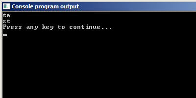

# Тип данных char

Как вы уже знаете, тип данных `char` используется для хранения отдельных символов. Оказывается, кроме символов, в переменную данного типа можно записать целое число. При этом размер этого типа данных всего 256 значений. В переменной данного типа можно хранить значения от 0 до 255 включительно, либо от -128 до 127. Это зависит от вашего компилятора.

Вот посмотрите:

Листинг 1.

```
#include <stdio.h>
int main(void){
  char ch = 97;

  printf("%d = %c\n",ch,ch);

  return(0);
}
```

Сейчас поясню, зачем это нужно. В памяти компьютера всё хранится в виде 0 или 1, это нам известно. Чтобы хранить числа, компьютер переводит их в двоичную систему счисления. Но как быть с буквами, знаками препинания? Для этого люди придумали специальные таблицы, которые называются `кодировками`.

В такой таблице каждому символу сопоставляется определённое число. И уже это число преобразуется в двоичную систему и хранится в памяти компьютера. С кодировками часто бывают проблемы. Они возникают из-за того, что одному числу в разных таблицах могут соответствовать разные символы.

Язык Си использует одну из таких таблиц -- таблицу `ASCII` (аббр. American Standard Code for Information Interchange).

В ней первые числа от 0 до 32 зарезервированы для служебных команд, например, 10 используется для перевода строки.А вот символ с кодом 0 обозначает конец символьной строки. Он нам скоро понадобится.
Вот посмотрите на следующий пример.

Листинг 2.

```
#include <stdio.h>
int main(void){
  char ch = 10;

  printf("te%cst\n",ch);
  return(0);
}
```

А вот результат её работы.



Как видите, символ с кодом 10, действительно, переводит строку (соответствует escape-последовательности `\n`).