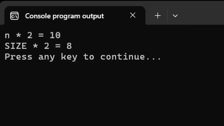

# Именованные константы. Директива define
Вернёмся к программе подсчёта чисел, сгенерированных функцией `rand`:

Листинг 1.
```c
#include <stdio.h>
#include <stdlib.h>
#include <time.h>

int main(void)
{
        srand(time(NULL));
        int digits_count[6] = {0};
        int rand_number;

        for (int i = 0; i < 10000; i++) {
                rand_number = rand() % 6; 
                digits_count[rand_number] += 1; 
        }

        for (int i = 0; i < 6; i++) {
                printf("%d - %d\n", i, digits_count[i]);
        }

        return 0;
}
```

Допустим, мы хотим расширить диапазон чисел, которые генерирует программа. Вместо чисел от `0` до `5` мы хотим генерировать числа от `0` до `9`.

Чтобы внести в программу подобное изменение, нам необходимо заменить `6` на `10` в трёх местах: в объявлении массива `digits_count`, при генерации числа `rand_number` и в цикле, который выводит массив `digits_count` на экран. Не очень-то удобно, особенно если таких мест будет очень много. Легко запутаться и что-нибудь пропустить.

Три голые шестёрки в коде -- это =магические числа=: значения без имени, смысл которых понятен обычно только тому, кто написал код с магическим числом. Причём понятен, обычно, тоже только в момент написания код. Через неделю-другую уже и автор с трудом вспомнит, что это за числа.

Чтобы избавиться от этой проблемы, можно использовать директиву препроцессора `#define`. С её помощью можно создавать так называемые =именованные константы= (=макросы=, =макроопределения=).

## Директива define

Директива `define` имеет следующий синтаксис:

Листинг 2.
```c
#define имя значение
```

"Значение" здесь -- не обязательно одно число. Это может быть и выражение из нескольких частей, например `2 + 3`.

% **Важно:** 
В конце **не нужно** ставить `;`. 
Между именем и значением **не нужно** ставить знак `=`.

## Как работает директива #define

Как мы помним ещё с первого урока, программа компилируется в машинный код с помощью компилятора. На самом деле этот процесс не такой простой и проходит в несколько этапов. Один из них -- работа =препроцессора=. Это отдельная программа (часто её запускает сам компилятор), которая обрабатывает текст программы и подготавливает его к компиляции. С работой препроцессора мы уже немного знакомы: именно он подключает заголовочные файлы, указанные в директивах `#include`.

С директивой `define` препроцессор работает так. Он ищет в тексте целые слова, совпадающие с именем макроса, и подставляет вместо них указанное значение.

% **Важно!** Подстановка не производится, если имя встретилось внутри имени переменной, в строке (строковом литерале) или внутри комментария.

Давайте добавим в наш пример две именованные константы: для количества экспериментов и для размера диапазона значений.

Листинг 3.

```c
#include <stdio.h>
#include <stdlib.h>
#include <time.h>

#define EXPERIMENTS 10000
#define RANGE 6

int main(void)
{
        srand(time(NULL));
        int digits_count[RANGE] = {0};
        int rand_number;

        for (int i = 0; i < EXPERIMENTS; i++) {
                rand_number = rand() % RANGE; 
                digits_count[rand_number] += 1; 
        }

        for (int i = 0; i < RANGE; i++) {
                printf("%d - %d\n", i, digits_count[i]);
        }

        return 0;
}
```

В программах на Си имена макросов принято писать заглавными буквами, чтобы в коде они сразу бросались в глаза и их было легко отличить от любых других элементов языка.

После того как мы запустим процесс компиляции, над программой начнёт работать препроцессор. Он подключит три заголовочных файла. После этого вместо имён `EXPERIMENTS` и `RANGE` произойдёт подстановка значений `10000` и `6`, соответственно.

После окончания работы препроцессора соответствующий кусочек программы (уже без `#include` и без `main`) будет выглядеть вот так:

Листинг 4.
```c
int digits_count[6] = {0};
int rand_number;

for (int i = 0; i < 10000; i++) {
        rand_number = rand() % 6; 
        digits_count[rand_number] += 1; 
}

for (int i = 0; i < 6; i++) {
        printf("%d - %d\n", i, digits_count[i]);
}
```

В примере выше мы использовали именованные константы как настройки (параметры) программы. Это позволяет проще и быстрее менять эти значения сразу во всех местах. Теперь, чтобы генерировать числа от `0` до `9`, достаточно одной правки:

```c
#define RANGE 10
```
Остальной код трогать не нужно.

Это стандартный приём в программировании на Си, который позволяет писать более понятный и модифицируемый код.

## Сравнение define и const

В заключение пара слов о названии "именованная константа". Оно не совсем точное. Макрос `#define` -- это всего лишь правило автозамены для препроцессора, т.е. он не создаёт в памяти никакого объекта.

Вспомним квалификатор `const` из урока про функции. Когда мы писали `const int DICE_SIZE = 6`, мы создавали самую обычную переменную -- коробку в памяти с типом `int`. Компилятор лишь запрещал класть в неё новое значение -- защищал её от изменения. Имя `DICE_SIZE` никуда не девалось: у объекта есть тип, есть адрес, компилятор его видит и охраняет.

Запись `#define RANGE 6` не создаёт коробку в памяти. Препроцессор ищет в тексте программы слово `RANGE` и заменяет его на `6` ещё до того, как компилятор увидит код программы. Никакого объекта в памяти не создаётся, у `RANGE` нет никакого типа данных. Да и вообще, когда текст программы доходит непосредственно до компилятора, в нём уже просто нет имени `RANGE`, т.е. компилятор о нём не знает.

В обоих случаях мы не можем что-либо сохранить или изменить значение, но причины разные. `DICE_SIZE = 10` -- ошибка, потому что компилятор защищает переменную с квалификатором `const`. А `RANGE = 10` после препроцессора превращается в `6 = 10`: ошибка уже потому, что числу нельзя ничего присвоить. Т.е. никакого особого запрета на присваивание у макроса нет -- просто после подстановки получается бессмысленная запись.

Что из этого следует на практике? Макрос ведёт себя как кусок текста, а не как значение. Рассмотрим иллюстрирующий пример:

Листинг 5.
```c
#include <stdio.h>

#define SIZE 2 + 3

int main(void)
{
        const int n = 5;

        printf("n * 2 = %d\n", n * 2);
        printf("SIZE * 2 = %d\n", SIZE * 2);

        return 0;
}
```



Разберём, что здесь происходит. `n` -- обычная переменная с квалификатором `const`, в ней хранится значение `5`. Выражение `n * 2` компилятор воспримет как "взять значение из коробки `n` и умножить на `2`", получается `10`.

С `SIZE` иначе. Препроцессор не вычисляет `2 + 3` и не кладёт `5` в какую-то коробку. Он буквально вставляет текст `2 + 3` на место имени `SIZE`. Строка

```c
printf("SIZE * 2 = %d\n", SIZE * 2);
```

после препроцессора превращается в

```c
printf("SIZE * 2 = %d\n", 2 + 3 * 2);
```

Дальше срабатывают обычные правила приоритета операторов: сначала `3 * 2`, потом `2 + 6`. На экране увидим `8`, а не `10`. Если бы `SIZE` была настоящей константой со значением `5`, о ба `printf` напечатали бы `10`.

Отсюда простое практическое правило. Если в макросе не одно число, а выражение, его принято брать в скобки:

```c
#define SIZE (2 + 3)
```

Тогда после подстановки полим `(2 + 3) * 2`, что даст в результате `10`. 

Вы, возможно, задаётесь вопросом: зачем нужен `#define`, если есть `const`? Во-первых, директива `#define` в языке Си появилась гораздо раньше квалификатора `const`, и приём с именованными константами через макросы это стандартная практика для кода на Си. Во-вторых -- массивы.

% **Важно!**
При объявлении массива в квадратных скобках дожно быть указано конкретное число.

Таковы были все объявления массивов в предыдущей заметке, например: `int digits[10]`, `int grades[5]`.

Переменные, даже с `const`, не являются конкретным числом на этапе компиляции. `const int n = 6` защищает переменную от записи, но не превращает `n` в число `6` для компилятора. Так как размер массива является частью типа данных, то его нельзя взять "из переменной". 

А вот если мы используем именованную константу, то к моменту компиляции вместо её имени уже будет стоять конкретное число. После обработки директивы `#define RANGE 6` препроцессором, строка

```c
int digits_count[RANGE];
```

превратится в

```c
int digits_count[6];
```

То есть компилятор получит конкретное число в объявлении массива.