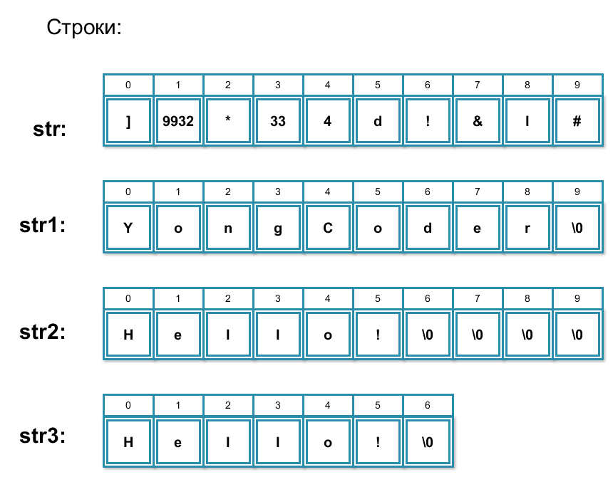
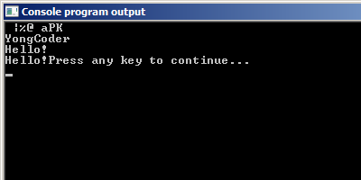
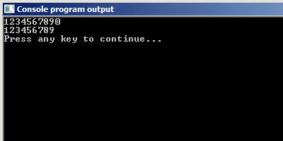
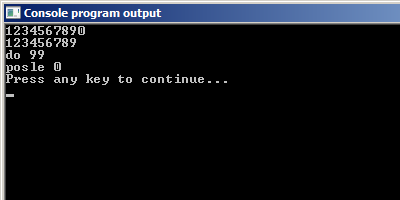
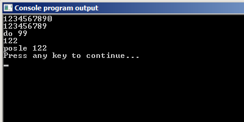

# Ввод и вывод символьных строк в Си

Итак, строки в языке Си. Для них не предусмотрено отдельного типа данных, как это сделано во многих других языках программирования. В языке Си строка -- это массив символов. Чтобы обозначить конец строки, используется символ `\0`, о котором мы говорили в прошлой части этого урока. На экране он никак не отображается, поэтому посмотреть на него не получится.

## Создание и инициализация строки
Так как строка -- это массив символов, то объявление и инициализация строки аналогичны подобным операциям с одномерными массивами.

Следующий код иллюстрирует различные способы инициализации строк.

Листинг 1.

```
  char str[10];
  char str1[10] = {'Y','o','n','g','C','o','d','e','r','\0'};
  char str2[10] = "Hello!";
  char str3[] = "Hello!";
```




В первой строке мы просто объявляем массив из десяти символов. Это даже не совсем строка, т.к. в ней отсутствует нуль-символ `\0`, пока это просто набор символов - тот самый мусор.

Вторая строка. Простейший способ инициализации в лоб. Объявляем каждый символ по отдельности. Тут главное не забыть добавить нуль-символ `\0`.

Третья строка -- аналог второй строки. Обратите внимание на картинку. Т.к. символов в строке справа меньше, чем элементов в массиве, остальные элементы заполнятся `\0`.

Четвёртая строка. Как видите, тут не задан размер. Программа его вычислит автоматически и создаст массив символов нужный длины. При этом последним будет вставлен нуль-символ `\0`.

## Как вывести строку

Дополним код выше до полноценной программы, которая будет выводить созданные строки на экран.

Листинг 2.

```
#include <stdio.h>

int main(void) {

  char str[10];
  char str1[10] = {'Y','o','n','g','C','o','d','e','r','\0'};
  char str2[10] = "Hello!";
  char str3[] = "Hello!";

  for(int i = 0; i < 10; i = i + 1)
    printf("%c\t",str[i]);
  printf("\n");

  fputs(str1,stdout);
  printf("\n%s\n",str2);
  puts(str3);

  return 0;
}
```



Как видите, есть несколько основных способов вывести строку на экран.

- использовать функцию `printf` со спецификатором `%s`
- использовать функцию `puts`
- использовать функцию `fputs`, указав в качестве второго параметра стандартный поток для вывода `stdout`.

Единственный нюанс у функций `puts` и `fputs`. Обратите внимание, что функция `puts` переносит вывод на следующую строку, а функция `fputs` не переносит.

Как видите, с выводом всё достаточно просто.

## Ввод строк

С вводом строк всё немного сложнее, чем с выводом. Простейшим способом будет являться следующее:

Листинг 3.

```
#include <stdio.h>
int main(void) {
  char str[20];
  gets(str);
  puts(str);
  return 0;
}
```

Функция `gets` приостанавливает работу программы, читает строку символов, введенных с клавиатуры, и помещает в символьный массив, имя которого передаётся функции в качестве параметра.
Завершением работы функции `gets` будет являться символ, соответствующий клавише ввод и записываемый в строку как нулевой символ.

Заметили опасность? Если нет, то о ней вас любезно предупредит компилятор. Дело в том, что функция `gets` завершает работу только тогда, когда пользователь нажимает клавишу ввод. Это чревато тем, что мы можем выйти за рамки массива, в нашем случае -- если введено более 20 символов.

К слову, ранее ошибки переполнения буфера считались самым распространенным типом уязвимости. Они встречаются и сейчас, но использовать их для взлома программ стало гораздо сложнее.

 **Важно!** Функция `gets` является небезопасной и не рекомендуется к использованию в коде.
 
Итак, что мы имеем. У нас есть задача: записать строку в массив ограниченного размера. То есть, мы должны как-то контролировать количество символов, вводимых пользователем. И тут нам на помощь приходит функция `fgets`:

Листинг 4.

```
#include <stdio.h>
int main(void) {
  char str[10];
  fgets(str, 10, stdin);
  puts(str);
  return 0;
}
```

Функция `fgets` принимает на вход три аргумента: переменную для записи строки, размер записываемой строки и имя потока, откуда взять данные для записи в строку, в данном случае -- `stdin`. Как вы уже знаете из 3 урока, `stdin` -- это стандартный поток ввода данных, обычно связанный с клавиатурой. Совсем необязательно данные должны поступать именно из потока `stdin`, в дальнейшем эту функцию мы также будем использовать для чтения данных из файлов.

Если в ходе выполнения этой программы мы введем строку длиннее, чем 10 символов, в массив все равно будут записаны только 9 символов с начала и символ переноса строки, `fgets` «обрежет» строку под необходимую длину.

Обратите внимание, функция `fgets` считывает не 10 символов, а 9! Как мы помним, в строках последний символ зарезервирован для нуль-символа.

Давайте это проверим. Запустим программу из последнего листинга. И введём строку 1234567890. На экран выведется строка 123456789.



Возникает вопрос. А куда делся десятый символ? А я отвечу. Он никуда не делся, он остался в потоке ввода. Выполните следующую программу.

Листинг 5.

```
#include <stdio.h>
int main(void) {
  char str[10];
  fgets(str, 10, stdin);
  puts(str);

  int h = 99;

  printf("do %d\n", h);
  scanf("%d",&h);
  printf("posle %d\n", h);

  return 0;
}
```

Вот результат её работы.




Поясню произошедшее. Мы вызвали функцию `fgets`. Она открыла поток ввода и дождалась пока мы введём данные. Мы ввели с клавиатуры 1234567890\n (\n я обозначаю нажатие клавиша Enter). Это отправилось в поток ввода `stdin`. Функция `fgets`, как и полагается, взяла из потока ввода первые 9 символов 123456789, добавила к ним нуль-символ `\0` и записала это в строку `str`. В потоке ввода осталось ещё `0\n`.

Далее мы объявляем переменную `h`. Выводим её значение на экран. После чего вызываем функцию `scanf`. Тут-то ожидается, что мы можем что-то ввести, но т.к. в потоке ввода висит `0\n`, то функция `scanf` воспринимает это как наш ввод, и записывается 0 в переменную `h`. Далее мы выводим её на экран.

Это, конечно, не совсем такое поведение, которое мы ожидаем. Чтобы справиться с этой проблемой, необходимо очистить буфер ввода после того, как мы считали из него строку, введённую пользователем. Для этого используется специальная функция `fflush`. У неё всего один параметр -- поток, который нужно очистить.

Исправим последний пример так, чтобы его работа была предсказуемой.

Листинг 6.

```
#include <stdio.h>
int main(void) {
  char str[10];
  fgets(str, 10, stdin);
  fflush(stdin); // очищаем поток ввода
  puts(str);

  int h = 99;
  printf("do %d\n", h);
  scanf("%d",&h);
  printf("posle %d\n", h);

  return 0;
}
```

Теперь программа будет работать так, как надо.



Подводя итог, можно отметить два факта. Первый. На данный момент использование функции `gets` является небезопасным, поэтому рекомендуется везде использовать функцию `fgets`.

Второй. Не забывайте очищать буфер ввода, если используете функцию `fgets`.

На этом разговор о вводе строк закончен. Идём дальше.
