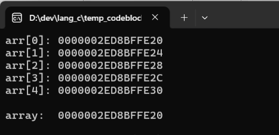
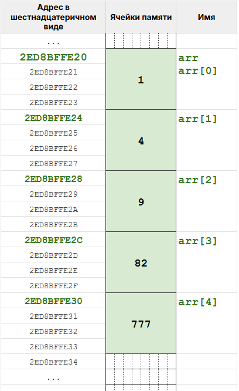
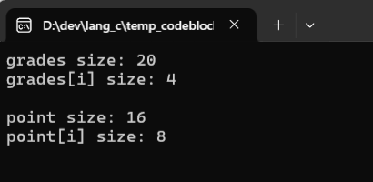
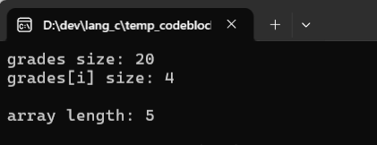
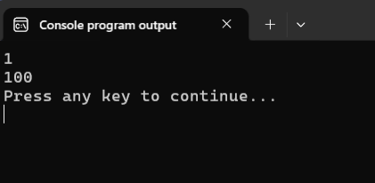
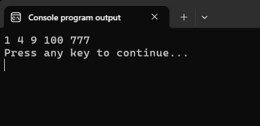
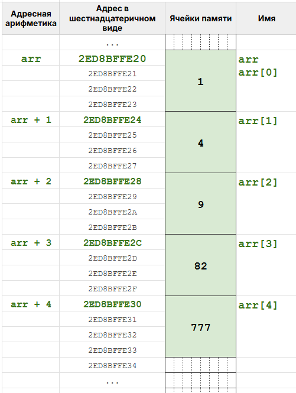
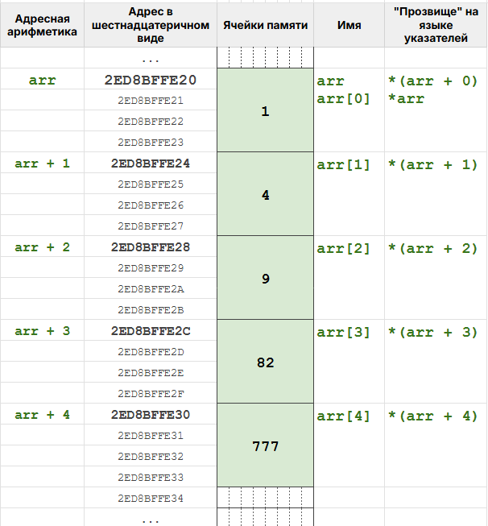
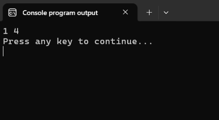
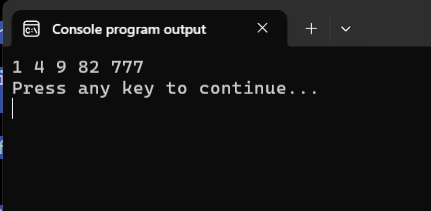

# Массивы и указатели

Потренировавшись на "коробочном представлении" о массивах, давайте, как настоящие сишники, разберёмся в том, как устроены массивы на более глубоком уровне. 

## Массивы в оперативной памяти

Раз уж мы с вами уже познакомились с указателями, то почему бы нам не посмотреть на адреса отдельных элементов массива. Напишем для этого простенькую программку.

Листинг 1.
```c
#include <stdio.h>
#define ARR_SIZE 5

int main(void)
{
        int arr[ARR_SIZE] = { 1, 4, 9, 82, 777 };

        for (int i = 0; i < ARR_SIZE; i++) {
                printf("arr[%d]: %p\n", i, &arr[i]);
        }

        printf("\narray:  %p\n", arr);

        return 0;
}
```

Результат работы этой программы представлен на следующем рисунке.



% **Обратите внимание:** в большинстве выражений имя массива преобразуется в указатель на начало массива (адрес нулевого элемента). 

Чтобы сделать картину ещё нагляднее, давайте посмотрим на схему оперативной памяти. 



Конечно, если вы запустите программу у себя, адреса будут другими, но в том, что они будут идти последовательно друг за другом я уверен на 146%, т.к. в языке Си элементы массива всегда располагаются в памяти друг за другом без каких-либо промежутков. Поэтому массив в Си -- это фактически непрерывный блок оперативной памяти, поделённый на ячейки. 

Размер памяти, занимаемой одним элементом массива, зависит от типа данных, которые хранятся в массиве. Т.к. у нас массив элементов типа `int`, то каждый элемент занимает размер переменной типа `int` (у меня это `4` байта). Следовательно, общий размер памяти, выделенной под массив из `5` элементов типа `int`, составит `5 * 4 = 20` байт. 

Именно это значение мы получим, если применим оператор `sizeof` к такому массиву. Массив из пяти элементов типа `int` сам имеет тип `int[5]`, поэтому `sizeof` знает и размер одного элемента, и их количество. Давайте в этом убедимся.

Листинг 2.
```c
#include <stdio.h>

int main(void)
{
        int grades[] = { 1, 4, 9, 82, 777 };
        double point[] = { 3.2, -1.4 };

        printf("grades size: %d\n", sizeof(grades));
        printf("grades[i] size: %d\n\n", sizeof(grades[0]));

        printf("point size: %d\n", sizeof(point));
        printf("point[i] size: %d\n\n", sizeof(point[0]));

        return 0;
}
```




Обратите внимание, что каждая ячейка массива `point` занимает `8` байт, т.к. это массив значений типа `double`. Кстати, значения, возвращаемые оператором `sizeof`, можно использовать, чтобы вычислить количество элементов в массиве:

Листинг 3.
```c
#include <stdio.h>

int main(void)
{
        int grades[] = { 1, 4, 9, 82, 777 };

        printf("grades size: %d\n", sizeof(grades));
        printf("grades[i] size: %d\n\n", sizeof(grades[0]));

        int length = sizeof(grades) / sizeof(grades[0]);

        printf("array length: %d\n", length);

        return 0;
}
```



Этот трюк работает только там, где `grades` всё ещё массив. Как только имя массива превратится в указатель -- например, внутри функции, -- `sizeof` посчитает размер указателя, а не блока с элементами. Запомните этот момент, мы ещё вернёмся к нему.

## Как массивы связаны с указателями? Адресная арифметика

Как уже было отмечено выше, в выражениях имя массива превращается в указатель на нулевой элемент. Значит, к нему можно применять оператор обращения по адресу (оператор разыменования) `*`.

Листинг 4.
```c
#include <stdio.h>

#define ARR_SIZE 5

int main(void)
{
        int grades[ARR_SIZE] = { 1, 4, 9, 82, 777 };
        
        printf("%d\n", *(grades)); 

        *(grades) = 100;

        printf("%d\n", *(grades));

        return 0;
}
```



В Листинге 4 я для наглядности вместо `*grades` использовал запись `*(grades)` как бы обозначая, что оператор `*` применяется к тому, что в скобках. Конечно, можно было бы написать без скобок, и результат был бы тем же самым.

Т.к. в этом выражении `grades` -- это адрес нулевого элемента `grades[0]`, то `*grades` -- это, как мы говорили в уроке про указатели, просто прозвище для `grades[0]`. А значит, используя обращение по адресу, мы можем изменить нулевой элемент массива без оператора индексации `[]`. Именно это и делает программа из листинга 4. Сначала мы выводим значение нулевого элемента на экран, потом сохраняем в него значение `100`, а затем снова выводим его на экран, чтобы убедиться, что оно изменилось.

А возможно ли аналогичным образом -- через указатель -- обратиться к другим элементам массива? Вы вряд ли удивитесь, но ответ: "Да, это возможно!" 
И сейчас я покажу, как это делается, а потом расскажу, почему и как это работает. Изменим немного Листинг 4.

Листинг 5.
```c
#include <stdio.h>

#define ARR_SIZE 5

int main(void)
{
        int grades[ARR_SIZE] = { 1, 4, 9, 82, 777 };
        
        *(grades + 3) = 100;

        for (int i = 0; i < ARR_SIZE; i++) {
                printf("%d ", *(grades + i));
        }

        printf("\n");

        return 0;
}
```



В этой программе мы с помощью указателя обратились к элементу с индексом `3` и сохранили в него значение `100`. А затем, тоже с помощью указателей, вывели все элементы массива на экран. 

Дело в том, что для указателей определены операции сложения и вычитания, т.е. язык Си даёт нам возможность добавить к адресу или отнять от адреса какое-нибудь целое число и получить в результате новый адрес. Это называется =адресная арифметика=.

Единственная загвоздка здесь в том, что адрес, который мы получим в результате прибавления/вычитания целого числа, будет зависеть от типа данных, на который указывал исходный адрес. Например, если исходный адрес указывает на `int`, то прибавление `1` увеличивает этот адрес на размер типа `int`, т.е. в моей системе на `4` байта. Если бы исходный адрес указывал на `double`, то прибавление единицы изменяло бы адрес на `sizeof(double)` (`8` в моей системе).

Давайте разберём на нашем примере. В выражении `grades + 1` имя массива превращается в указатель на нулевой элемент, то есть в адрес `2ED8BFFE20`. 

Допустим, мы хотим вычислить выражение `grades + 1`, т.е. прибавить к адресу `2ED8BFFE20` единицу. Т.к. этот указатель указывает на `int`, то компилятор прибавит не просто `1`, а `1 * sizeof(int)` (у меня в системе `1 * 4`). Итого получим `2ED8BFFE20 + 1 * 4 = 2ED8BFFE24`, а это как раз адрес элемента `grades[1]`. Соответственно, когда мы напишем `grades + 2`, то получим `2ED8BFFE20 + 2 * 4 = 2ED8BFFE28` -- адрес элемента `grades[2]`. 

Общая формула адресной арифметики на рисунке ниже:


Таким образом, зная адрес начала массива и используя адресную арифметику, мы можем получить адрес любого элемента массива. Для наглядности изобразим эти адреса на схеме с памятью.



Ну а если мы знаем адрес любого элемента массива, то мы можем получить доступ к этому элементу через оператор обращения по адресу. Т.е на уровне компилятора оператор индексации -- это просто адресная арифметика и оператор разыменования: `arr[i]` эквивалентно `*(arr + i)`.

Отсюда:
- `*(arr + 0)` и `*(arr)` эквивалентно `arr[0]`; 
- `*(arr + 1)` эквивалентно `arr[1]`; 
- `*(arr + 2)` эквивалентно `arr[2]`; 
- `*(arr + 3)` эквивалентно `arr[3]`; 
- `*(arr + 4)` эквивалентно `arr[4]`.



Людям, конечно, гораздо удобнее и проще работать с оператором индексации, но теперь мы знаем, что происходит у него "под капотом".

## Передача массивов в функцию

Массив, как и обычную переменную, можно передать в функцию. Но, конечно, и тут есть свои нюансы. 

% **Важно!** В функцию попадёт не сам массив, а указатель на его нулевой элемент. 

Для примера давайте напишем функцию `print_array`, которая будет выводить на экран переданный ей целочисленный массив.

Мы, как истинные программисты, хотели бы сделать эту функцию максимально простой в использовании. В качестве аргумента она должна принимать массив, а её вызов должен выглядеть как-то так: `print_array(grades);`

Функция будет просто печатать элементы массива и не будет ничего возвращать, поэтому тип возвращаемого значения будет `void`. Теперь надо понять тип параметра. Передавать мы собираемся имя массива, а оно в этом месте превратится в указатель на нулевой элемент. Т.к. мы пишем функцию для вывода целочисленных массивов, то нулевой элемент имеет тип `int`, а указатель на него -- тип `int *`. Значит у нас есть вся информация, чтобы записать прототип функции `print_array`: `void print_array(int *array);`.

В теле функции сначала вычислим размер массива (с помощью трюка с `sizeof` из начала заметки), а уж потом будем выводить массив на экран. Итак, давайте напишем реализацию функции `print_array` и проверим её в деле:

Листинг 6.
```c
#include <stdio.h>

#define ARR_SIZE 5

void print_array(int *arr)
{
        int size = sizeof(arr) / sizeof(arr[0]);

        for (int i = 0; i < size; i++) {
                printf("%d ", arr[i]);
        }
        printf("\n");
}

int main(void)
{
        int grades[ARR_SIZE] = { 1, 4, 9, 82, 777 };
        
        print_array(grades);
        
        return 0;
}
```

 

Хьюстон! У нас проблема! Почему-то наша функция вывела только первые два элемента массива. Давайте разбираться.

В функции `main` массив `grades` имеет тип `int[5]` (массив из 5 `int`), поэтому `sizeof(grades)` равен `20`. Когда мы передаём имя массива в функцию, то оно, как уже отмечалось выше, превращается в указатель на нулевой элемент массива. То есть при вызове `print_array(grades)` имя массива `grades` уже указатель на нулевой элемент массива, а значит имеет тип `int *`, а не `int[5]`. 

А дальше всё как обычно. Значение копируется в локальную переменную `arr`, созданную при вызове функции. Переменная `arr` имеет тип `int *`, и `sizeof(arr)` возвращает нам размер указателя, а не размер массива. Т.к. у меня указатель занимает `8` байт, а элемент `int` -- `4` байта, то `8 / 4 == 2`. Цикл делает две итерации и печатает `1 4`. Если бы у меня была 32-битная система, то указатель занимал бы `4` байта, и тогда функция `print_array` вообще напечатала бы один элемент. Суть одна: трюк с `sizeof` внутри функции не сработает, т.к. внутрь функции передаётся не массив, а только указатель на его первый элемент, т.е. внутри функции нет массива, есть только указатель.

% **Важно!** Функция ничего не знает о размере переданного ей массива.

Более того, она понятия не имеет, что ей передают адрес начала массива: для неё этот адрес ничем не лучше и ничем не хуже любого другого адреса в памяти. Поэтому, если мы хотим работать с массивом внутри функции, мы должны:
1. помнить, что получили указатель на элемент массива;
2. дополнительно передать в функцию размер массива.

Давайте перепишем функцию `print_array`.

Листинг 7.
```c
#include <stdio.h>

#define ARR_SIZE 5

// передаём в функцию указатель на начало массива и размер массива
void print_array(int *arr, int size_array)
{
        for (int i = 0; i < size_array; i++) {
                printf("%d ", arr[i]);
        }
        printf("\n");
}

int main(void)
{
        int grades[ARR_SIZE] = { 1, 4, 9, 82, 777 };
        
        print_array(grades, ARR_SIZE); 
        
        return 0;
}
```

Эта версия уже будет работать корректно, но мы и её можем чуть-чуть улучшить. Вместо `int *arr` в заголовке функции мы можем написать `int arr[]`. В списке параметров функции для компилятора это одно и то же: оба варианта означают `int *`. А для нас запись вида `int arr[]` в параметрах функции будет явным напоминанием, что в функцию будет передаваться адрес начала массива.

Раз наша функция только читает элементы, то параметр `arr` можно защитить квалификатором `const`, как мы делали в уроке про функции: тогда компилятор не даст нам случайно изменить исходный массив. 

Перепишем программу с учётом всех описанных выше изменений:
Листинг 8.
```c
#include <stdio.h>

#define ARR_SIZE 5

void print_array(const int arr[], int size_array)
{
        for (int i = 0; i < size_array; i++) {
                printf("%d ", arr[i]);
        }
        printf("\n");
}

int main(void)
{
        int grades[ARR_SIZE] = { 1, 4, 9, 82, 777 };
        
        print_array(grades, ARR_SIZE);
        
        return 0;
}
```



И ещё пара важных обстоятельств, связанных с тем, как мы передаём массив в функцию.

Во-первых, обратите внимание, что внутрь функции мы передаём только адрес нулевого элемента массива, а не сами значения массива. Поэтому не важно, содержит ли массив `10` элементов или десять тысяч элементов: он будет передаваться в функцию одинаково быстро, т.к. мы копируем только указатель, а не сам массив.

Во-вторых, и это связано с первым пунктом, раз мы не создаём копию массива, а передаём лишь адрес его первого элемента, то любые изменения элементов внутри функции отразятся на исходном массиве, т.к. мы будем менять сам оригинал. Об этом тоже надо помнить. Если функция не должна ничего менять, то используйте квалификатор `const`, как в Листинге 8.

Если же мы как раз пишем функцию, которая должна изменять передаваемый ей массив, то, конечно, `const` будет лишним. Например, давайте напишем функцию, которая обнуляет переданный ей массив.

Листинг 9:
```c
void zero_array(int arr[], int n)
{
        for (int i = 0; i < n; i++) {
                arr[i] = 0;
        }
}
```

После вызова `zero_array(grades, ARR_SIZE)` в `main` в массиве `grades` будут нули. Отдельной копии нет: функция изменяет исходный массив, используя указатель на начало массива.