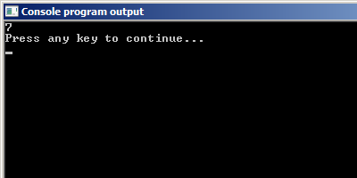
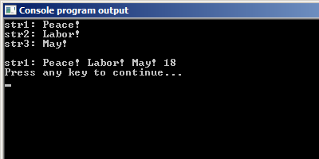

# Функции для работы со строками

В языке Си предусмотрено множество разных функций, предназначенных для работы со строками. Для их использования необходимо подключить заголовочный файл `string.h`

Разберём самые простые из них:

- `strlen(str)` -- длина строки `str`;
- `strcmp(str1, str2)` -- сравнение строк `str1` и `str2`;
- `strcat(str1, str2)` -- конкатенация (склеивание) двух строк. К строке `str1` в конце приклеивается строка `str2`.
- `strcpy(str1, str2)` -- копирование строки `str2` в строку `str1`;

## Функция strlen

Данная функция возвращает целое число -- длину строки, которая ей передана в качестве аргумента.

**Важно:** `Длина строки` -- это не количество элементов символьного массива, а количество элементов в массиве до первого нуль-символа.

Например, следующий код выведет на экран не 19, а 7.

Листинг 1.

```
#include <stdio.h>
#include <string.h>

int main(void) {
// объявляем три строки
  char str1[19] = "Peace! ";

  int l1 = strlen(str1); // вычисляем длину первой строки

// выводим на экран строку str1 и её длину
  printf("%d\n", l1);

  return 0;
}
```



## Функция склеивания строк strcat

Данная функция склеивает строки, которые передаются ей в качестве параметров. Функция `strcat` присоединяет к концу строки `str1` строку `str2`.

**Важно:** Программисту самому необходимо следить за тем, чтобы размер массива `str1` позволял вместить и `str1`, и `str2` и завершающий нулевой символ. В противном случае, может возникнуть ошибка во время выполнения программы.

Небольшой пример.

Листинг 2.

```
#include <stdio.h>
#include <string.h>

int main(void) {
// объявляем три строки
  char str1[19] = "Peace! ";
  char str2[] = "Labor! ";
  char str3[] = "May!";

// выводим строки на экран
  printf("str1: %s\n",str1);
  printf("str2: %s\n",str2);
  printf("str3: %s\n\n",str3);

// присоединяем к первой строке вторую
  strcat(str1, str2);
// теперь str1 = "Peace! Labor!"

// присоединяем к первой строке третью
  strcat(str1, str3);
// теперь str1 = "Peace! Labor! May!"

// выводим на экран строку str1 и её длину
  printf("str1: %s %d\n",str1, strlen(str1));

  return 0;
}
```

Результат работы этой программы ниже:




## Функция сравнения строк strcmp

Данная функция сравнивает посимвольно строки, переданные ей в качестве аргументов. Функция `strcmp` вернёт нуль, если строки равны между собой, иначе какое-либо другое целое число (положительное или отрицательное). Общее правило таково: Если в функции `strcmp` первая строка больше, чем вторая строка, то функция возвращает положительное число. Если меньше -- отрицательное. Сравнение осуществляется по кодам символов в таблице `ASCII`

Посмотрите на пример.

Листинг 3.

```
#include <stdio.h>
#include <string.h>

int main(void) {
  char  str1[] = "hello world",
        str2[] = "hello world",
        str3[] = "hello World";
// сравниваем строки между собой
  int n12 = strcmp(str1, str2);
  int n13 = strcmp(str1, str3);
  int n31 = strcmp(str3, str1);

// выводим строки и результат работы strcmp
  printf(" %s i %s =  %d\n", str1, str2, n12);
  printf(" %s i %s = %d\n", str1, str3, n13);
  printf(" %s i %s = %d\n", str3, str1, n31);

// выводим седьмой символ в строке и его ASCII-код
  printf("%c / %d\n",str1[6],str1[6]);
  printf("%c / %d\n",str3[6],str3[6]);

  return(0);
}
```


Первая и вторая строки одинаковы, поэтому результат их сравнения нуль. А вот первая и третья строки различаются седьмым символом. В первой строке это строчная `w`, а в третьей -- прописная `W`. Т.к. код строчной буквы `w` больше, чем код прописной буквы `W` `(119 > 87)`, то в `n13` помещается положительное число, т.к. первая строка, больше второй. Теперь если мы поменяем строки местами, то получим отрицательное число.

## Функция копирования строк strcpy

Данная функция принимает на вход две строки, а потом копирует вторую строку в первую. Простой примерчик.

Листинг 4.

```
#include <stdio.h>
#include <string.h>

int main(void) {
  char  str1[] = "Hello World!",
        str2[] = "Hi man!";
  printf("str1: %s \nstr2 %s\n\n", str1, str2);

  strcpy(str1, str2);

  printf("str1: %s \nstr2 %s\n", str1, str2);

  return(0);
}
```


Как и в случае с `strcat` программисту нужно самому следить за тем, чтобы в первой строке хватило места для копирования в неё второй строки.

Есть и более сложные функции работы со строками, но о них в базовой части курса мы говорить не будем.
