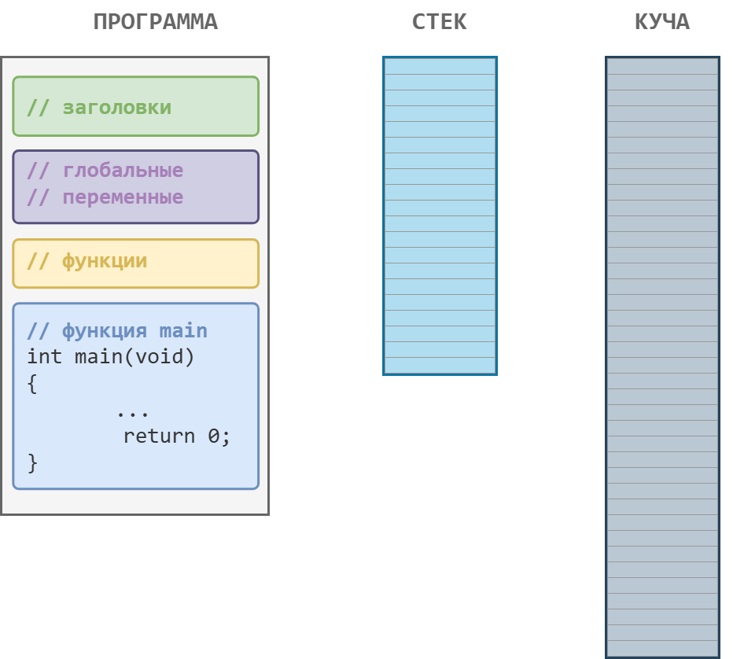
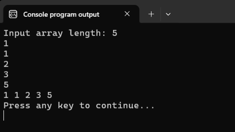
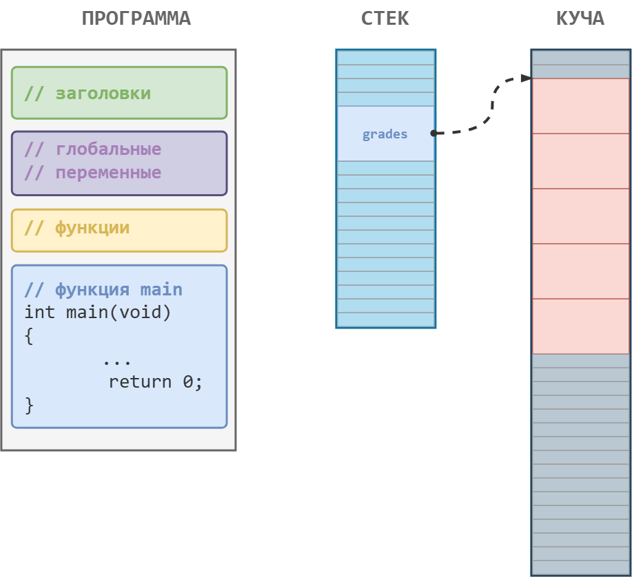
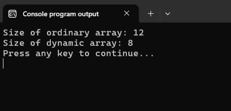
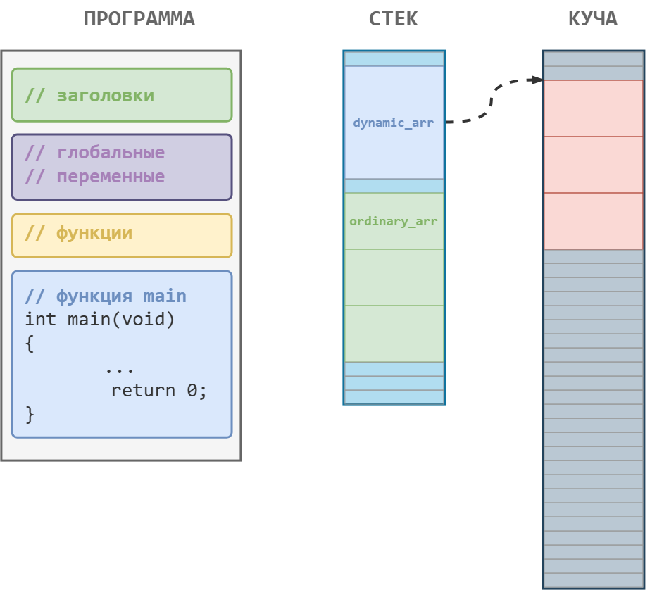
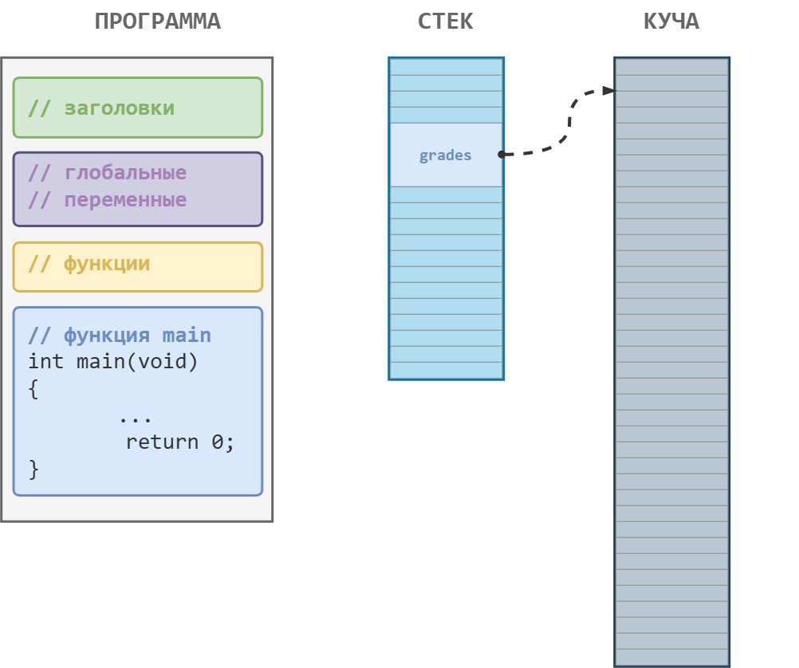
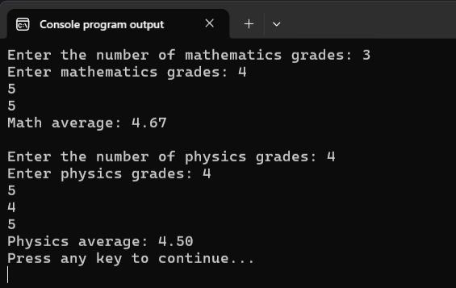
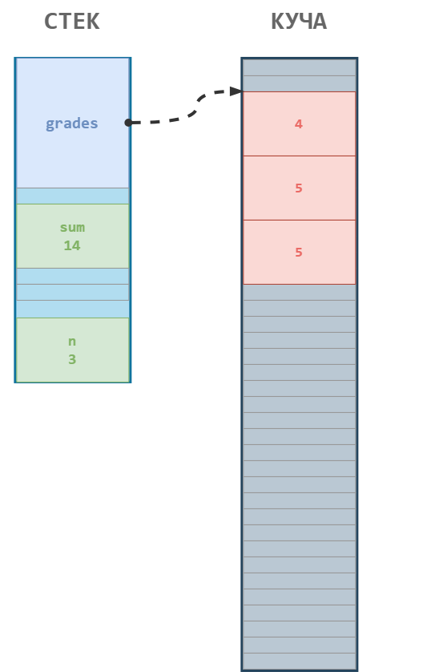
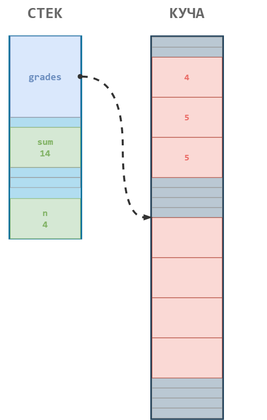
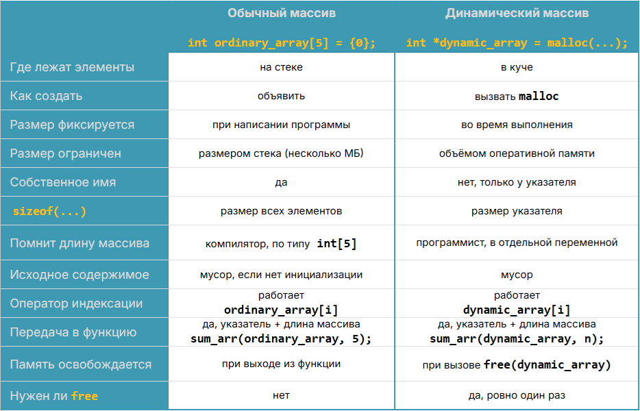

# Динамическая память и динамические массивы

Если вы решали исследовательские задачи для хакеров из заметки про одномерные массивы, то вы уже знаете, что размер массива, который мы можем создать изученным ранее способом, ограничен размером стека. =Стек= -- это небольшая область оперативной памяти, которая выделяется нашей программе при запуске. Именно в этой области размещаются локальные переменные и массивы, объявленные в функции `main` и в других функциях нашей программы.

Так как размер стека невелик, то если нам потребуется очень большой массив, например, несколько миллионов вещественных чисел, на стеке такой массив просто не поместится. 

Например, следующая программа аварийно завершится, не напечатав ни одного числа:

Листинг 1.
```c
#include <stdio.h>
#define SIZE 2000000

int main(void)
{
        double values[SIZE] = {0.0};

        for (int i = 0; i < SIZE; i++) {
                printf("%.2f ", values[i]);
        }
        printf("\n");

        return 0;
}
```

Другая проблема заключается в том, что в момент написания программы мы не всегда точно знаем, сколько данных понадобится сохранить в массив. Конечно, мы можем создавать массивы "с запасом" (скорее всего именно так вы поступали, когда решали задачи на массивы на Stepik), но в любом случае весь наш "запас" будет ограничен размером стека.

Чтобы избежать этих проблем, мы можем использовать =динамическую память=, её ещё называют =кучей (от англ. heap)=. =Динамическая память= -- это отдельная область оперативной памяти, из которой программа может запрашивать память прямо во время выполнения. Размер кучи, в отличие от стека, не фиксирован и может изменяться во время выполнения программы.

Резюмируем сказанное ранее. Операционная система при запуске программы выделяет ей небольшую область в оперативной памяти (стек) для хранения локальных переменных. Кроме того, есть ещё другая область памяти (куча), где программа прямо в процессе выполнения может получить дополнительную память под свои нужды. 



Переменные и массивы, создаваемые в динамической памяти, называют =динамическими переменными= и =динамическими массивами= соответственно.

Из всего вышесказанного следует простой практический вывод:

% если размер массива заранее неизвестен, либо массив очевидно будет очень большим, то нам следует использовать динамическую память (кучу), а не стек. 

## Как создать массив в динамической памяти

Для работы с динамической памятью мы будем использовать две основные функции из заголовочного файла `<stdlib.h>`:
- `malloc` -- для =выделения памяти= (сокращение от memory allocation, поэтому ещё говорят =аллокация памяти=);
- `free` -- для =освобождения памяти=.

При вызове функции `malloc` мы передаём ей число -- количество байт, которое нам требуется для хранения данных. Если памяти достаточно, то `malloc` ищет в куче непрерывный блок памяти и возвращает указатель на его начало. Если же выделить в куче подходящий блок памяти не удалось, то `malloc` возвращает `NULL` (нулевой указатель).

Напишем программу, которая будет создавать динамический массив, размер которого вводится пользователем во время выполнения программы.

Листинг 2.
```c
#include <stdio.h>
#include <stdlib.h> // подключаем для доступа к функциям malloc и free

void print_array(const int arr[], int size_array);

int main(void)
{
        int n = 0;
        printf("Input array length: ");
        scanf("%d", &n);

        if (n <= 0) {
                printf("ERROR! Bad size\n");
                return 1;
        }

        int *grades = malloc(n * sizeof(int)); // выделяем память в куче
        
        if (grades == NULL) { // обязательно проверяем, что память выделилась
                printf("ERROR! Not enough memory\n");
                return 1;
        }

        for (int i = 0; i < n; i++) {
                scanf("%d", &grades[i]);
        }

        print_array(grades, n);

        free(grades);  // освобождаем память в куче
        grades = NULL; // обнуляем указатель

        return 0;
}

void print_array(const int arr[], int size_array)
{
        for (int i = 0; i < size_array; i++) {
                printf("%d ", arr[i]);
        }
        printf("\n");
}
```

Результат работы этой программы показан на следующем рисунке. 
 

Теперь разберём ключевые моменты этой программы.

Сперва мы подключили заголовочный файл `stdlib.h`. В нём записаны прототипы функций `malloc` и `free`.

В переменной `n` у нас хранится размер массива (мы получили его от пользователя). Чтобы воспользоваться функцией `malloc`, нам требуется посчитать объём памяти (в байтах), который потребуется для хранения массива. Для этого мы умножаем размер массива `n` на объём памяти, который будет занимать один элемент. Т.к. мы создаём целочисленный массив, то размер одного элемента равен размеру одной переменной типа `int`, т.е. `sizeof(int)`.

% **Важно!** Не забывайте умножать размер массива на размер типа данных.

Иногда начинающие программисты забывают это сделать и пишут просто `malloc(n)`. Например, в нашем случае вместо `5 * 4 = 20` байт выделилось бы всего `5` байт. Этого хватило бы всего на один элемент (нулевой), и уже при записи `grades[1]` мы бы вышли за границы выделенного блока памяти, а это, как нам уже известно, неопределённое поведение.

Итак, вызов `malloc(n * sizeof(int))` находит в куче свободный блок памяти размером `n * sizeof(int)`, который достаточен для хранения `n` значений типа `int`. Результат этого вызова -- адрес начала блока, выделенного в куче. Этот адрес мы сохраняем в переменную-указатель `grades`. 

Важный момент. Функция `malloc` ничего не знает о том, для каких целей мы собираемся использовать выделяемую память, поэтому она всегда возвращает нетипизированный адрес `void *`. 

% **Важно!** Функция `malloc` возвращает `void *`. Тип элементов выбираем мы, когда записываем адрес в указатель нужного типа.

В нашем примере преобразование к типу `int *` происходит неявно при присваивании, но, конечно, мы могли бы привести тип явным образом: `int *grades = (int *) malloc(n * sizeof(int));`.

Как уже отмечалось выше, необходимо обязательно проверить, что память реально выделилась. Для этого мы сравниваем адрес, который вернула функция `malloc` (мы записали его в `grades`), со значением `NULL`.

% **Важно!** Всегда проверяйте, что память действительно выделилась, используя сравнение с `NULL`. 

Хорошо, допустим, память в куче выделена. Что мы имеем? У нас есть указатель `grades`. В нём хранится адрес начала непрерывного блока памяти размером `n * sizeof(int)`. Для наглядности изобразим текущее состояние стека и кучи на нашей схеме.



Мы получили в оперативной памяти некую "структуру" из двух компонентов:
- непрерывный блок памяти в куче;
- переменная-указатель, которая указывает на начало блока памяти в куче.

Вот такую вот замысловатую структуру и называют =динамическим массивом=. 

Далее мы убедимся, что это название очень подходящее, т.к. эта структура очень похожа на обычный массив, хотя и с некоторыми своими особенностями. 

Во-первых, непрерывный блок памяти выделен по нашей просьбе в куче (динамической памяти), а не на стеке.

Во-вторых, у этого блока памяти в куче нет собственного имени, какое бывает у обычных переменных или массивов. А для работы с ним используется указатель, хранящий адрес начала блока. В нашем случае это указатель `grades`.


Чтобы обратиться к отдельному элементу динамического массива, мы можем использовать уже привычные нам методы:
- оператор доступа по адресу `*(grades + i)`;
- а также оператор индексации `grades[i]`.

С точки зрения работы с отдельными элементами массива вообще нет никакой разницы, работаем ли мы с обычным массивом или с динамическим. 
Другими словами, если мы, например, видим следующий кусок кода:

```c
for (int i = 0; i < n; i++) {
        scanf("%d", &grades[i]);
}
```
то из него невозможно понять, работаем мы с обычным массивом или с динамическим.

Аналогичная ситуация и с передачей динамических массивов в функцию. Она выполняется точно так же и по тем же самым правилам, что и передача обычного массива.

Кстати, в элементах динамического массива после его создания тоже хранится мусор. Функция `malloc` память не обнуляет. Проверьте это самостоятельно. Если нам нужно обнулить элементы массива, то проходимся по ним циклом и обнуляем каждый элемент по отдельности.


## Оператор `sizeof` и динамические массивы

Для динамического массива не сработает трюк с `sizeof`, который мы использовали для определения размера обычного массива. 

Убедимся в этом на следующем примере.

Листинг 3.
```c
#include <stdio.h>
#include <stdlib.h>

#define ARR_SIZE 3

int main(void)
{
        int ordinary_arr[ARR_SIZE];
        printf("Size of ordinary array: %zu\n", sizeof(ordinary_arr));
        
        int *dynamic_arr = malloc(ARR_SIZE * sizeof(int));
        printf("Size of dynamic array: %zu\n", sizeof(dynamic_arr));

        return 0;
}
```



Как видите, в случае с обычным массивом мы получили размер 12 байт (3 * sizeof(int)), а для динамического массива -- размер указателя. У меня на `64`-битной системе это `8` байт. Если у вас система `32`-битная, второе число будет `4`. Причина этого кроется как раз в необычном внутреннем устройстве динамического массива.

Для большей наглядности проиллюстрируем программу из Листинга 3 следующим рисунком и будем разбираться.



На рисунке изображены стек и куча для программы из Листинга 3. В стеке размещены:
- массив `ordinary_arr` (`12` байт, три `int` по `4` байта);
- переменная-указатель `dynamic_arr` (у меня `8` байт).

В куче размещён блок памяти в `12` байт, который не имеет собственного имени, но адрес начала этого блока сохранён в указателе `dynamic_arr`. 

С `ordinary_arr` всё понятно. Это обычный массив `int[3]` (массив из трёх `int`). Применение к нему оператора `sizeof` мы подробно разобрали в прошлой заметке.

А вот с динамическим массивом всё интереснее. Как мы выяснили, он как бы состоит из двух компонентов: блока памяти в куче и указателя `dynamic_arr`. И вот сейчас самое главное. Мы применяем `sizeof` как раз к самому указателю, а не к блоку памяти в куче, на который он указывает. Именно поэтому `sizeof(dynamic_arr)` возвращает значение `8` (или `4` на `32`-битных системах).

Оператор `sizeof` понятия не имеет, какой именно адрес мы храним в указателе `dynamic_arr`. Программист мог положить туда адрес начала блока памяти в куче, а мог адрес какой-то другой переменной или вообще `NULL` -- оператору `sizeof` это безразлично и он это никак не проверяет. Он получил указатель и возвращает объём памяти, который занимает этот указатель. А уж что там в этом указателе хранится, об этом пусть заботится программист. 

Подведём промежуточные итоги.

С точки зрения компилятора и памяти обычные массивы и динамические массивы -- это разные конструкции. Но при этом в тексте программы работа с ними (обращение к элементам, передача в функцию) выглядит одинаково.


## Как освободить динамическую память

За освобождение ранее выделенной динамической памяти отвечает функция `free`. В качестве аргумента ей передаётся указатель на начало блока памяти, выделенного ранее функцией `malloc` (или другими функциями для работы с динамической памятью).

Основное правило работы с функцией `free` довольно простое:

% **Важно!** Любой блок памяти, выделенный функцией `malloc`, должен быть **единожды** освобождён функцией `free`.

Естественно, после вызова `free(grades)` мы уже не можем и не должны использовать `grades[i]`, т.к. этот блок памяти уже возвращён обратно в кучу и недоступен нашей программе, а значит мы не можем обращаться по адресам из этого блока. Если же мы попробуем это сделать, то получим неопределённое поведение.

Такую ошибку называют =use-after-free (использование после освобождения)=. Указатель при этом называется =висячим указателем (dangling pointer)=: адрес в нём ещё записан, а блока уже нет.

На следующем рисунке изображено состояние стека и кучи после вызова `free(grades)`.



При этом, как ни странно, само значение, которое хранилось в указателе `grades`, никуда не исчезнет. Именно поэтому на рисунке 6 не убрана стрелка, указывающая на динамическую память. Т.е. после `free(grades)` в указателе `grades` всё ещё будет записан адрес этого блока памяти. Чтобы случайно по нему не обратиться, мы дополнительно его обнуляем сразу после вызова `free`.


Ещё одна причина, по которой после освобождения памяти обычно обнуляют указатель, заключается в том, чтобы избежать проблем при случайном повторном вызове `free(grades)`. 

Понятно, что если память уже была освобождена ранее, то повторно её освободить нельзя. Если мы попытаемся так сделать, то получим неопределённое поведение. Такие ошибки называют =двойное освобождение (double free)=. 

Но если мы сразу после освобождения памяти обнулим и указатель на неё `grades = NULL`, то тогда при случайном повторном вызове `free` мы фактически вызовем `free(NULL)`. А это вполне безопасная конструкция, которая по факту ничего не делает.

На всякий случай отмечу, что нельзя использовать функцию `free` с обычными переменными и массивами. 

### Утечки памяти

Если забыть освободить память, выделенную функцией `malloc`, то в оперативной памяти образуется "мусор" -- выделенный участок динамической памяти, который программа уже не сможет освободить, например, из-за того, что потерян адрес этого блока. Такую ситуацию называют =утечкой памяти=. 

Этот блок программа больше не использует. Вызвать для него `free` она уже не может, поэтому и занять его повторно следующим `malloc` не получится: блок простаивает до конца работы программы.

Долго ли он будет простаивать? До тех пор, пока работает наша программа. После завершения программы вся память (и куча, и стек), которая ей была выделена, освобождается.


% **Важно!** Внимательно следите за использованием динамической памяти в своих программах.

Давайте посмотрим на несколько программ с утечками памяти, а заодно разберём несколько типовых сценариев появления утечек.

Самый очевидный вариант: **забыли вызвать `free` в функции**.

Допустим, внутри какой-нибудь вспомогательной функции мы выделили блок памяти, поработали с ним, а вызвать `free` забыли. Функция завершает свою работу, все локальные переменные этой функции, включая наш указатель на выделенную память, удаляются. И всё, адрес выделенного блока памяти потерян. Освободить его уже не выйдет. 

Следующая игрушечная программа как раз демонстрирует этот вариант утечки памяти.

Листинг 4. Программа для вычисления средней оценки за год по результатам оценок за четверти.
```c
#include <stdio.h>
#include <stdlib.h>

#define TOTAL_STUDENTS 3

double calc_average(int n)
{
        int *grades = malloc(n * sizeof(int)); // создали динамический массив
        if (grades == NULL) { // проверили, что память выделена
                return 0.0;
        }

        int sum = 0;
        for (int i = 0; i < n; i++) {
                scanf("%d", &grades[i]);
                sum += grades[i];
        }

        return (double)sum / n; // завершаем функцию, но не освободили динамическую память
}

int main(void)
{
        int n = 4;

        for (int student = 1; student <= TOTAL_STUDENTS; student++) {
                double average_grade = calc_average(n);
                printf("Student %d average: %.2f\n", student, average_grade);
        }

        return 0;
}
```

В этом примере при каждом вызове функции `calc_average` мы создаём динамический массив (указатель `grades` и блок в куче на `4` значения типа `int`, т.е. `16` байт). Но перед тем как выйти из функции, мы не освобождаем память в куче, а значит происходит утечка. Указатель `grades` удаляется после завершения работы функции, а место в куче так и остаётся занятым. Таким образом, утекает по `16` байт оперативной памяти при каждом обращении к функции `calc_average`. 

Другой сценарий возникновения утечек: **потеря указателя**. 

Например, выделили блок памяти, поработали с ним, а потом обнулили указатель на эту память или повторно выделили память и сохранили новый адрес в тот же указатель. И всё, блок памяти, выделенный изначально, превратился в мусор, т.к. его адрес потерян. А без адреса мы уже не сможем освободить соответствующий блок памяти.

Рассмотрим следующий демонстрационный пример.

Листинг 5. 
```c
#include <stdio.h>
#include <stdlib.h>

int main(void)
{
        int n = 0;
        int sum = 0;

        printf("Enter the number of mathematics grades: ");
        scanf("%d", &n);

        int *grades = malloc(n * sizeof(int)); 
        if (grades == NULL) {
                return 1;
        }

        printf("Enter mathematics grades: ");
        for (int i = 0; i < n; i++) {
                scanf("%d", &grades[i]);
                sum += grades[i];
        }
        printf("Math average: %.2f\n\n", (double) sum/n);
        
        
        printf("Enter the number of physics grades: ");
        scanf("%d", &n);
        
        grades = malloc(n * sizeof(int)); // УТЕЧКА! 
                                          // Перезаписали адрес блока
                                          // c оценками по математике

        if (grades == NULL) {
                return 1;
        }

        sum = 0;
        printf("Enter physics grades: ");
        for (int i = 0; i < n; i++) {
                scanf("%d", &grades[i]);
                sum += grades[i];
        }
        printf("Physics average: %.2f\n", (double) sum/n);

        free(grades);  // освобождаем память
        grades = NULL; // обнуляем указатель

        return 0;
}
```



Здесь мы решили переиспользовать переменные `n`, `sum` и `grades`. Это нормально, но мы кое-что забыли.

После того, как мы посчитали среднюю оценку по математике, стек и куча выглядят примерно так, как на следующем рисунке. 



В тестовом прогоне мы ввели `n = 3`. В куче выделено `12` байт, в которых записаны три оценки по математике. На этот блок указывает указатель `grades`. 

Затем мы записываем в переменную `n` количество оценок по физике и сохраняем в `grades` адрес нового блока памяти. В этот момент адрес блока с оценками по математике перезаписывается, и происходит утечка памяти, изображённая на следующем рисунке.



Сейчас `grades` указывает на новый блок памяти, который вернула функция `malloc`, а адрес блока памяти с оценками по математике безвозвратно утерян. Освободить его уже никак не получится, т.к. мы не знаем его адрес. Теперь этот кусочек памяти превратился в мусор.

Чтобы не заканчивать урок на "сломанных" примерах, давайте перепишем последние две программы без утечек.

В Листинге 4 указатель `grades` уничтожается при выходе из `calc_average`. Значит, `free` нужно успеть вызвать внутри функции, пока адрес блока ещё известен. Получим следующую программу:

Листинг 4*. Программа из Листинга 4 без утечки памяти.
```c
#include <stdio.h>
#include <stdlib.h>

#define TOTAL_STUDENTS 3

double calc_average(int n)
{
        int *grades = malloc(n * sizeof(int));
        if (grades == NULL) {
                return 0.0;
        }

        int sum = 0;
        for (int i = 0; i < n; i++) {
                scanf("%d", &grades[i]);
                sum += grades[i];
        }

        free(grades);

        return (double)sum / n;
}

int main(void)
{
        int n = 4;

        for (int student = 1; student <= TOTAL_STUDENTS; student++) {
                double average_grade = calc_average(n);
                printf("Student %d average: %.2f\n", student, average_grade);
        }

        return 0;
}
```

В Листинге 5 достаточно освободить блок с оценками по математике до второго вызова `malloc`. 

Листинг 5*. Программа из Листинга 5 без утечки памяти.
```c
#include <stdio.h>
#include <stdlib.h>

int main(void)
{
        int n = 0;
        int sum = 0;

        printf("Enter the number of mathematics grades: ");
        scanf("%d", &n);

        int *grades = malloc(n * sizeof(int));
        if (grades == NULL) {
                return 1;
        }

        printf("Enter mathematics grades: ");
        for (int i = 0; i < n; i++) {
                scanf("%d", &grades[i]);
                sum += grades[i];
        }
        printf("Math average: %.2f\n\n", (double) sum/n);

        free(grades); // освободили память, выделенную под первый блок

        printf("Enter the number of physics grades: ");
        scanf("%d", &n);

        grades = malloc(n * sizeof(int));
        if (grades == NULL) {
                return 1;
        }

        sum = 0;
        printf("Enter physics grades: ");
        for (int i = 0; i < n; i++) {
                scanf("%d", &grades[i]);
                sum += grades[i];
        }
        printf("Physics average: %.2f\n", (double) sum/n);

        free(grades);
        grades = NULL;

        return 0;
}
```


Утечки памяти и расточительное использование памяти программистами -- это одна из причин того, что программы тормозят. В коротких программах из этого урока утечки незаметны, они очень маленькие. Утечки памяти начинают мешать, когда программа работает долго и теряет память в цикле: раз за разом, по кусочку.

Сводная табличка со сравнением обычных и динамических массивов.

