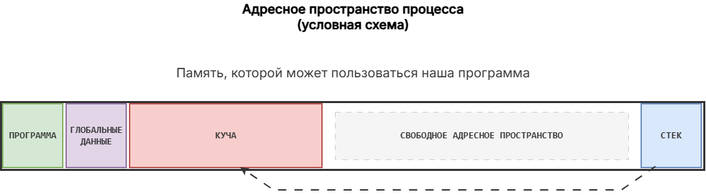

## Дополнительные материалы

**0.** Слово "динамический"  в названии "динамический массив" означает только то, что блок создан в динамической памяти во время работы программы. Это не значит, что массив может изменять свой размер во время выполнения программы. Размер массива фиксируется в момент вызова `malloc` и дальше не увеличивается. Если выделили память под `n` элементов, то `grades[n]` -- такой же выход за границу, как у обычного массива. 

**1.** На рисунках этого урока стек и куча нарисованы отдельными столбиками. Так проще следить за стрелкой указателя из стека в кучу. Но надо понимать, что это не какие-то разные "виды памяти", а разные участки =адресного пространства=, которое ОС выделила нашей программе.

В этом пространстве располагается сразу всё: машинный код программы, глобальные переменные и массивы, стек с локальными переменными и массивами, куча, откуда мы берём блоки через `malloc` и пр.
Если объявить массив `int a[5];` на уровне файла (вне всех функций), то его элементы окажутся среди глобальных данных, а не на стеке и не в куче.



При этом стоит понимать, что программа не получает "всю оперативную память компьютера". ОС выдаёт каждому процессу своё адресное пространство -- набор адресов, которыми программа имеет право пользоваться. Например, на 32-битной системе размер этого пространства сам по себе не больше 4 ГБ, а на практике часто ещё меньше, даже если в компьютере стоит 16 ГБ оперативной памяти.

Кроме того, есть разные причины, почему ОС может не дать процессу столько памяти, сколько он просит. Например, в куче может не найтись одного непрерывного куска нужного размера. Поэтому `malloc` может вернуть `NULL`, даже если в диспетчере задач память "ещё есть", и проверку на `NULL` нельзя пропускать.

**2.** В некоторых языках программирования есть =сборщик мусора (garbage collector)=: он сам находит блоки, на которые уже никто не указывает, и освобождает их. Это называется =автоматическим управлением памятью (Automatic Memory Management)=. За это программы обычно платят размером и скоростью работы.

В Си такой механизм отсутствует, и это не баг, а фича языка, вытекающая из его назначения. Язык Си предполагает =ручное управление памятью=, когда сам программист следит за тем, чтобы освобождать используемую память.

**3.** Динамическую память можно использовать не только для массивов, но и для одной переменной. У такой переменной нет привычного нам имени, а обращаться к ней можно только по указателю.

В следующей программе мы создали динамическую переменную для хранения значений типа `double`.
```c
#include <stdio.h>
#include <stdlib.h>

int main(void)
{
        double *p_pi = malloc(sizeof(double));
        if (p_pi == NULL) {
                printf("Error! Not enough memory\n");
                return 1;
        }

        *p_pi = 3.1415926;
        printf("%.2f\n", *p_pi);

        free(p_pi);
        p_pi = NULL;

        return 0;
}
```
